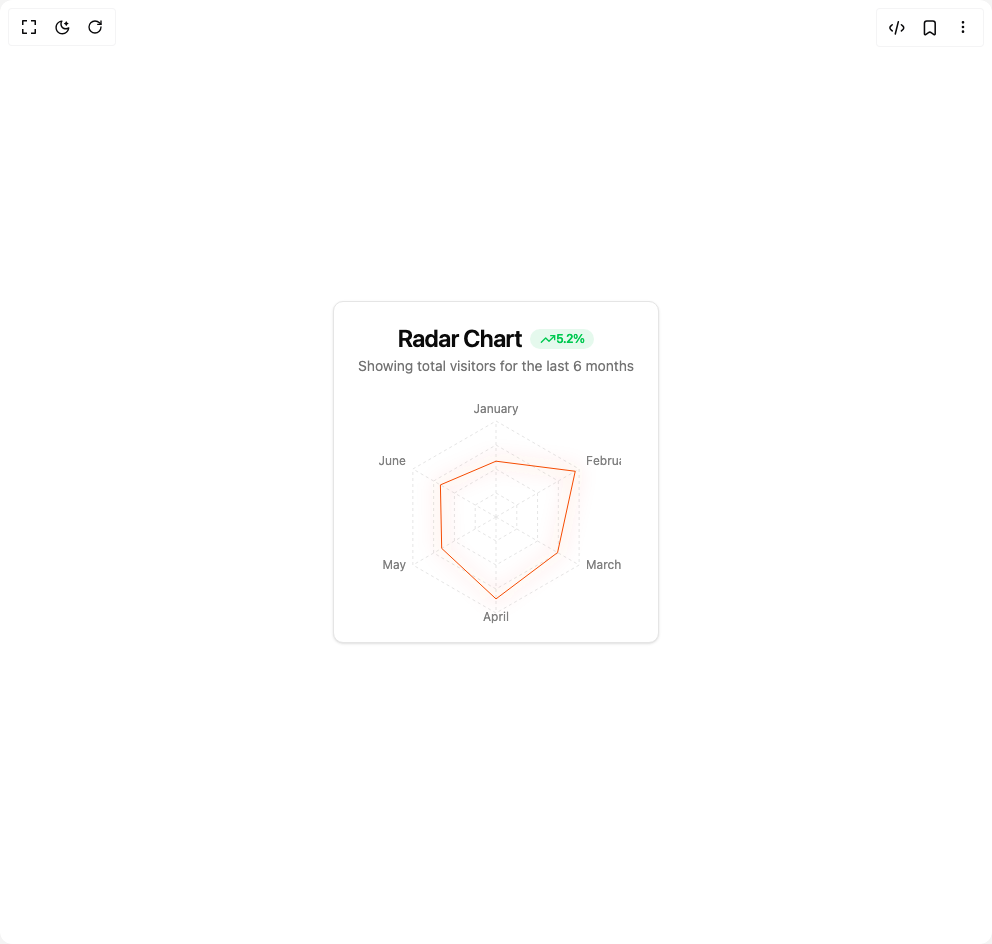

# Build Radar Chart in BuilderStudio

> Build this component in our Agentic IDE: [BuilderStudio](https://builderstudio.dev).
>
> Join the BuilderStudio community on [Discord](https://discord.gg/QdWeSGCqfe) and [Reddit](https://reddit.com/r/builderstudio).



## Component

- Author group: `svg-ui`
- Component: `radar-chart`
- Variant: `glow-stroke-radar-chart`
- Rendered HTML snapshot: [`rendered.html`](rendered.html)

## BuilderStudio prompt

You are implementing a React component based on a component reference.

## Component identity

- Author: svg-ui
- Component slug: radar-chart
- Demo slug: glow-stroke-radar-chart
- Title: radar-chart
- Description: 

## Goal

Recreate this component in a React + TypeScript + Tailwind CSS project. Preserve the visual layout, spacing, colors, border radius, shadows, interaction behavior, animation behavior, responsive behavior, and dark mode behavior shown in the rendered demo.

## Implementation requirements

- Use React and TypeScript.
- Use Tailwind CSS classes whenever possible.
- Keep the component self-contained unless the source files require helper components.
- If the source uses CSS variables, custom CSS, animations, or keyframes, include them.
- If the source uses external packages, list and use the required packages.
- Preserve accessibility attributes, button semantics, links, keyboard behavior, and ARIA attributes when visible in the source.
- Do not replace the component with a simplified placeholder.
- Return complete production-ready code.

## Dependencies

No reference metadata available.

## Rendered DOM snapshot

This is the rendered demo HTML extracted from the live preview. Use it to verify structure, class names, visible content, and layout.

```html
<div id="root"><div class="w-screen min-h-screen flex justify-center items-center"><div class="w-screen min-h-screen flex justify-center items-center"><div class="rounded-lg border bg-card text-card-foreground shadow-sm"><div class="flex flex-col space-y-1.5 p-6 items-center pb-4"><h3 class="text-2xl font-semibold leading-none tracking-tight">Radar Chart<div class="inline-flex items-center rounded-full border px-2.5 py-0.5 text-xs font-semibold transition-colors focus:outline-none focus:ring-2 focus:ring-ring focus:ring-offset-2 text-green-500 bg-green-500/10 border-none ml-2"><svg xmlns="http://www.w3.org/2000/svg" width="24" height="24" viewBox="0 0 24 24" fill="none" stroke="currentColor" stroke-width="2" stroke-linecap="round" stroke-linejoin="round" class="lucide lucide-trending-up h-4 w-4" aria-hidden="true"><polyline points="22 7 13.5 15.5 8.5 10.5 2 17"></polyline><polyline points="16 7 22 7 22 13"></polyline></svg><span>5.2%</span></div></h3><p class="text-sm text-muted-foreground">Showing total visitors for the last 6 months</p></div><div class="p-6 pt-0 pb-0"><div data-slot="chart" data-chart="chart-«r0»" class="[&amp;_.recharts-cartesian-axis-tick_text]:fill-muted-foreground [&amp;_.recharts-cartesian-grid_line[stroke='#ccc']]:stroke-border/50 [&amp;_.recharts-curve.recharts-tooltip-cursor]:stroke-border [&amp;_.recharts-polar-grid_[stroke='#ccc']]:stroke-border [&amp;_.recharts-radial-bar-background-sector]:fill-muted [&amp;_.recharts-rectangle.recharts-tooltip-cursor]:fill-muted [&amp;_.recharts-reference-line_[stroke='#ccc']]:stroke-border flex justify-center text-xs [&amp;_.recharts-dot[stroke='#fff']]:stroke-transparent [&amp;_.recharts-layer]:outline-hidden [&amp;_.recharts-sector]:outline-hidden [&amp;_.recharts-sector[stroke='#fff']]:stroke-transparent [&amp;_.recharts-surface]:outline-hidden mx-auto aspect-square max-h-[250px]"><style>
 [data-chart=chart-«r0»] {
  --color-desktop: var(--chart-1);
}


.dark [data-chart=chart-«r0»] {
  --color-desktop: var(--chart-1);
}
</style><div class="recharts-responsive-container" style="width: 100%; height: 100%; min-width: 0px;"><div style="width: 0px; height: 0px; overflow: visible;"><div class="recharts-wrapper" style="position: relative; cursor: default; width: 250px; height: 250px;"><div xmlns="http://www.w3.org/1999/xhtml" tabindex="-1" class="recharts-tooltip-wrapper" style="visibility: hidden; pointer-events: none; position: absolute; top: 0px; left: 0px;"></div><svg cx="50%" cy="50%" role="application" tabindex="0" class="recharts-surface" width="250" height="250" viewBox="0 0 250 250" style="width: 100%; height: 100%;"><title></title><desc></desc><defs><clipPath id="recharts1-clip"><rect x="5" y="5" height="240" width="240"></rect></clipPath></defs><g class="recharts-layer recharts-polar-angle-axis angleAxis"><path cx="125" cy="125" orientation="outer" radius="96" fill="none" class="recharts-polygon recharts-polar-angle-axis-line" d="M125,29L208.1384387633061,77L208.1384387633061,173L125,221L41.86156123669389,173L41.86156123669389,76.99999999999999L125,29Z"></path><g class="recharts-layer recharts-polar-angle-axis-ticks"><g class="recharts-layer recharts-polar-angle-axis-tick"><line class="recharts-polar-angle-axis-tick-line" cx="125" cy="125" orientation="outer" radius="96" fill="none" x1="125" y1="29" x2="125" y2="21"></line><text cx="125" cy="125" orientation="outer" radius="96" stroke="none" x="125" y="21" class="recharts-text recharts-polar-angle-axis-tick-value" text-anchor="middle" fill="#808080"><tspan x="125" dy="0em">January</tspan></text></g><g class="recharts-layer recharts-polar-angle-axis-tick"><line class="recharts-polar-angle-axis-tick-line" cx="125" cy="125" orientation="outer" radius="96" fill="none" x1="208.1384387633061" y1="77" x2="215.06664199358164" y2="73"></line><text cx="125" cy="125" orientation="outer" radius="96" stroke="none" x="215.06664199358164" y="73" class="recharts-text recharts-polar-angle-axis-tick-value" text-anchor="start" fill="#808080"><tspan x="215.06664199358164" dy="0em">February</tspan></text></g><g class="recharts-layer recharts-polar-angle-axis-tick"><line class="recharts-polar-angle-axis-tick-line" cx="125" cy="125" orientation="outer" radius="96" fill="none" x1="208.1384387633061" y1="173" x2="215.06664199358164" y2="177"></line><text cx="125" cy="125" orientation="outer" radius="96" stroke="none" x="215.06664199358164" y="177" class="recharts-text recharts-polar-angle-axis-tick-value" text-anchor="start" fill="#808080"><tspan x="215.06664199358164" dy="0em">March</tspan></text></g><g class="recharts-layer recharts-polar-angle-axis-tick"><line class="recharts-polar-angle-axis-tick-line" cx="125" cy="125" orientation="outer" radius="96" fill="none" x1="125" y1="221" x2="125" y2="229"></line><text cx="125" cy="125" orientation="outer" radius="96" stroke="none" x="125" y="229" class="recharts-text recharts-polar-angle-axis-tick-value" text-anchor="middle" fill="#808080"><tspan x="125" dy="0em">April</tspan></text></g><g class="recharts-layer recharts-polar-angle-axis-tick"><line class="recharts-polar-angle-axis-tick-line" cx="125" cy="125" orientation="outer" radius="96" fill="none" x1="41.86156123669389" y1="173" x2="34.93335800641837" y2="177"></line><text cx="125" cy="125" orientation="outer" radius="96" stroke="none" x="34.93335800641837" y="177" class="recharts-text recharts-polar-angle-axis-tick-value" text-anchor="end" fill="#808080"><tspan x="34.93335800641837" dy="0em">May</tspan></text></g><g class="recharts-layer recharts-polar-angle-axis-tick"><line class="recharts-polar-angle-axis-tick-line" cx="125" cy="125" orientation="outer" radius="96" fill="none" x1="41.86156123669389" y1="76.99999999999999" x2="34.93335800641839" y2="72.99999999999999"></line><text cx="125" cy="125" orientation="outer" radius="96" stroke="none" x="34.93335800641839" y="72.99999999999999" class="recharts-text recharts-polar-angle-axis-tick-value" text-anchor="end" fill="#808080"><tspan x="34.93335800641839" dy="0em">June</tspan></text></g></g></g><g class="recharts-polar-grid"><g class="recharts-polar-grid-angle"><line stroke="#ccc" cx="125" cy="125" stroke-dasharray="3 3" x1="125" y1="125" x2="125" y2="29"></line><line stroke="#ccc" cx="125" cy="125" stroke-dasharray="3 3" x1="125" y1="125" x2="208.1384387633061" y2="77"></line><line stroke="#ccc" cx="125" cy="125" stroke-dasharray="3 3" x1="125" y1="125" x2="208.1384387633061" y2="173"></line><line stroke="#ccc" cx="125" cy="125" stroke-dasharray="3 3" x1="125" y1="125" x2="125" y2="221"></line><line stroke="#ccc" cx="125" cy="125" stroke-dasharray="3 3" x1="125" y1="125" x2="41.86156123669389" y2="173"></line><line stroke="#ccc" cx="125" cy="125" stroke-dasharray="3 3" x1="125" y1="125" x2="41.86156123669389" y2="76.99999999999999"></line></g><g class="recharts-polar-grid-concentric"><path stroke="#ccc" cx="125" cy="125" stroke-dasharray="3 3" radius="0" fill="none" class="recharts-polar-grid-concentric-polygon" d="M 125,125L 125,125L 125,125L 125,125L 125,125L 125,125Z"></path><path stroke="#ccc" cx="125" cy="125" stroke-dasharray="3 3" radius="24" fill="none" class="recharts-polar-grid-concentric-polygon" d="M 125,101L 145.78460969082653,113L 145.78460969082653,137L 125,149L 104.21539030917347,137L 104.21539030917347,113Z"></path><path stroke="#ccc" cx="125" cy="125" stroke-dasharray="3 3" radius="48" fill="none" class="recharts-polar-grid-concentric-polygon" d="M 125,77L 166.56921938165306,101L 166.56921938165306,149L 125,173L 83.43078061834694,149L 83.43078061834694,101Z"></path><path stroke="#ccc" cx="125" cy="125" stroke-dasharray="3 3" radius="72" fill="none" class="recharts-polar-grid-concentric-polygon" d="M 125,53L 187.35382907247958,89L 187.35382907247958,161L 125,197L 62.646170927520416,161L 62.64617092752042,89Z"></path><path stroke="#ccc" cx="125" cy="125" stroke-dasharray="3 3" radius="96" fill="none" class="recharts-polar-grid-concentric-polygon" d="M 125,29L 208.1384387633061,77L 208.1384387633061,173L 125,221L 41.86156123669389,173L 41.86156123669389,76.99999999999999Z"></path></g></g><g class="recharts-layer recharts-radar"><g class="recharts-layer recharts-radar-polygon"><path stroke="var(--color-desktop)" fill="none" filter="url(#stroke-line-glow)" class="recharts-polygon" d="M125,69.19999999999999L204.24132444627614,79.25L186.57440620907357,160.54999999999998L125,206.9L70.7002071827157,156.35L69.40116907703904,92.9L125,69.19999999999999Z"></path></g></g><defs><filter id="stroke-line-glow" x="-20%" y="-20%" width="140%" height="140%"><feGaussianBlur stdDeviation="10" result="blur"></feGaussianBlur><feComposite in="SourceGraphic" in2="blur" operator="over"></feComposite></filter></defs></svg></div></div></div></div></div></div></div></div></div>
```

## Reference source files

No reference source files were available.
