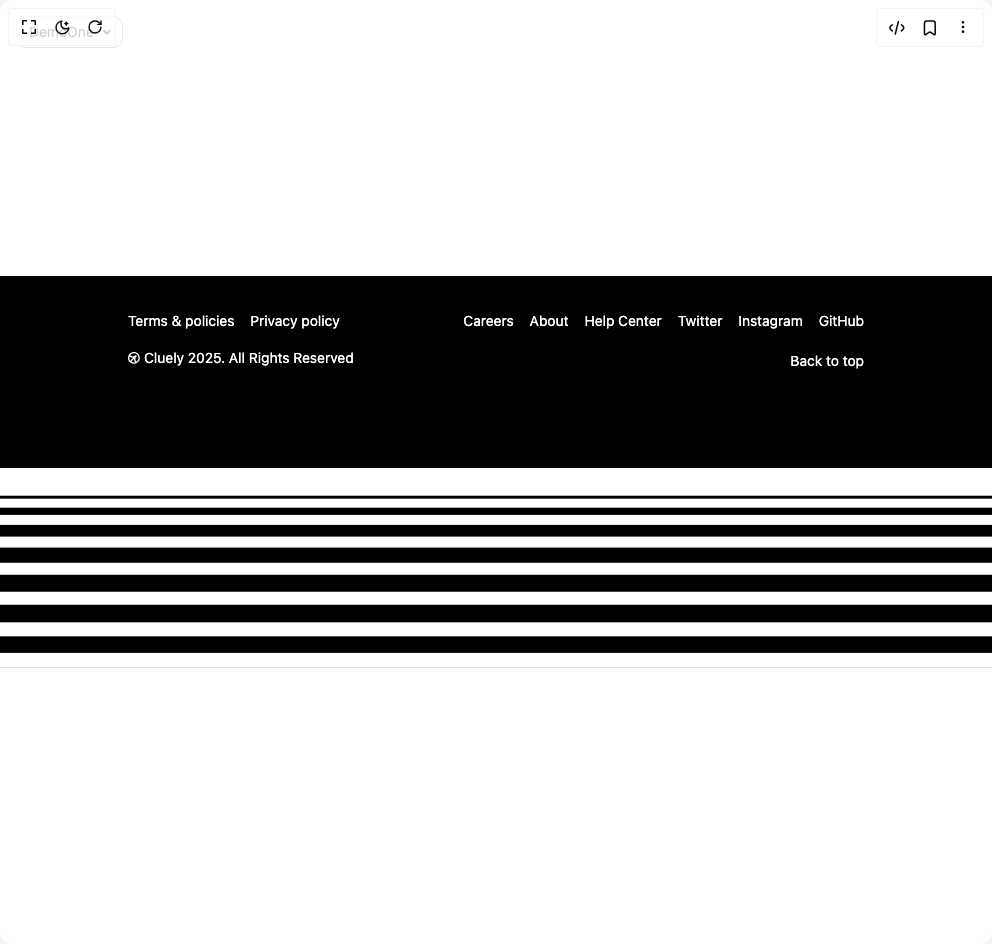

# Build Animated Footer in BuilderStudio

> Build this component in our Agentic IDE: [BuilderStudio](https://builderstudio.dev).
>
> Join the BuilderStudio community on [Discord](https://discord.gg/QdWeSGCqfe) and [Reddit](https://reddit.com/r/builderstudio).



## Component

- Author group: `tahermaxse`
- Component: `animated-footer`
- Variant: `default`
- Rendered HTML snapshot: [`rendered.html`](rendered.html)

## BuilderStudio prompt

You are implementing a React component based on a component reference.

## Component identity

- Author: tahermaxse
- Component slug: animated-footer
- Demo slug: default
- Title: animated-footer
- Description: 

## Goal

Recreate this component in a React + TypeScript + Tailwind CSS project. Preserve the visual layout, spacing, colors, border radius, shadows, interaction behavior, animation behavior, responsive behavior, and dark mode behavior shown in the rendered demo.

## Implementation requirements

- Use React and TypeScript.
- Use Tailwind CSS classes whenever possible.
- Keep the component self-contained unless the source files require helper components.
- If the source uses CSS variables, custom CSS, animations, or keyframes, include them.
- If the source uses external packages, list and use the required packages.
- Preserve accessibility attributes, button semantics, links, keyboard behavior, and ARIA attributes when visible in the source.
- Do not replace the component with a simplified placeholder.
- Return complete production-ready code.

## Dependencies

No reference metadata available.

## Rendered DOM snapshot

This is the rendered demo HTML extracted from the live preview. Use it to verify structure, class names, visible content, and layout.

```html
<div id="root"><div class="fixed top-4 left-4 z-10"><select class="appearance-none h-8 max-w-[200px] text-sm leading-tight rounded-lg pl-3 pr-7 py-0 border bg-background focus:outline-none focus:ring-0"><option value="named_DemoOne_DemoOne">DemoOne</option></select><div class="absolute top-1/2 transform -translate-y-1/2 right-2 pointer-events-none"><svg class="w-4 h-4 fill-current" viewBox="0 0 20 20"><path d="M5.516 7.548c.436-.446 1.043-.48 1.576 0L10 10.405l2.908-2.857c.533-.48 1.14-.446 1.576 0 .436.445.408 1.197 0 1.615l-3.734 3.705c-.533.534-1.39.534-1.923 0l-3.734-3.705c-.408-.418-.436-1.17 0-1.615z"></path></svg></div></div><div class="w-screen min-h-screen flex justify-center items-center"><footer class="bg-black text-white relative flex flex-col w-full h-full justify-between lg:h-screen select-none"><div class="container mx-auto flex flex-col md:flex-row justify-between w-full gap-4 pb-24 pt-8 px-4"><div class="space-y-2"><ul class="flex flex-wrap gap-4"><li><a href="/terms" class="text-sm hover:text-sky-400">Terms &amp; policies</a></li><li><a href="/privacy-policy" class="text-sm hover:text-sky-400">Privacy policy</a></li></ul><p class="text-sm mt-4 flex items-center gap-x-1"><svg class="size-3" viewBox="0 0 80 80"><path fill-rule="evenodd" clip-rule="evenodd" fill="currentColor" d="M67.4307 11.5693C52.005 -3.85643 26.995 -3.85643 11.5693 11.5693C-3.85643 26.995 -3.85643 52.005 11.5693 67.4307C26.995 82.8564 52.005 82.8564 67.4307 67.4307C82.8564 52.005 82.8564 26.995 67.4307 11.5693ZM17.9332 17.9332C29.8442 6.02225 49.1558 6.02225 61.0668 17.9332C72.9777 29.8442 72.9777 49.1558 61.0668 61.0668C59.7316 62.4019 58.3035 63.5874 56.8032 64.6232L56.8241 64.6023C46.8657 54.6439 46.8657 38.4982 56.8241 28.5398L58.2383 27.1256L51.8744 20.7617L50.4602 22.1759C40.5018 32.1343 24.3561 32.1343 14.3977 22.1759L14.3768 22.1968C15.4126 20.6965 16.5981 19.2684 17.9332 17.9332ZM34.0282 38.6078C25.6372 38.9948 17.1318 36.3344 10.3131 30.6265C7.56889 39.6809 9.12599 49.76 14.9844 57.6517L34.0282 38.6078ZM21.3483 64.0156C29.24 69.874 39.3191 71.4311 48.3735 68.6869C42.6656 61.8682 40.0052 53.3628 40.3922 44.9718L21.3483 64.0156Z"></path></svg>Cluely 2025. All Rights Reserved</p></div><div class="space-y-4"><ul class="flex flex-wrap gap-4"><li><a href="/careers" class="text-sm hover:text-sky-400">Careers</a></li><li><a href="/about" class="text-sm hover:text-sky-400">About</a></li><li><a href="/help-center" class="text-sm hover:text-sky-400">Help Center</a></li><li><a href="https://x.com/taher_max_" class="text-sm hover:text-sky-400">Twitter</a></li><li><a href="https://www.instagram.com/taher_max_" class="text-sm hover:text-sky-400">Instagram</a></li><li><a href="https://github.com/tahermaxse" class="text-sm hover:text-sky-400">GitHub</a></li></ul><div class="text-right mt-4"><button class="text-sm hover:underline inline-flex items-center">Back to top</button></div></div></div><div id="waveContainer" aria-hidden="true" style="overflow: hidden; height: 200px;"><div style="margin-top: 0px;"><div class="wave-segment" style="height: 1px; background-color: rgb(255, 255, 255); transition: transform 0.1s; will-change: transform; margin-top: -2px; transform: translateY(0px);"></div><div class="wave-segment" style="height: 2px; background-color: rgb(255, 255, 255); transition: transform 0.1s; will-change: transform; margin-top: -2px; transform: translateY(1px);"></div><div class="wave-segment" style="height: 3px; background-color: rgb(255, 255, 255); transition: transform 0.1s; will-change: transform; margin-top: -2px; transform: translateY(2px);"></div><div class="wave-segment" style="height: 4px; background-color: rgb(255, 255, 255); transition: transform 0.1s; will-change: transform; margin-top: -2px; transform: translateY(3px);"></div><div class="wave-segment" style="height: 5px; background-color: rgb(255, 255, 255); transition: transform 0.1s; will-change: transform; margin-top: -2px; transform: translateY(4px);"></div><div class="wave-segment" style="height: 6px; background-color: rgb(255, 255, 255); transition: transform 0.1s; will-change: transform; margin-top: -2px; transform: translateY(5px);"></div><div class="wave-segment" style="height: 7px; background-color: rgb(255, 255, 255); transition: transform 0.1s; will-change: transform; margin-top: -2px; transform: translateY(6px);"></div><div class="wave-segment" style="height: 8px; background-color: rgb(255, 255, 255); transition: transform 0.1s; will-change: transform; margin-top: -2px; transform: translateY(8.00845px);"></div><div class="wave-segment" style="height: 9px; background-color: rgb(255, 255, 255); transition: transform 0.1s; will-change: transform; margin-top: -2px; transform: translateY(15.8748px);"></div><div class="wave-segment" style="height: 10px; background-color: rgb(255, 255, 255); transition: transform 0.1s; will-change: transform; margin-top: -2px; transform: translateY(28.9855px);"></div><div class="wave-segment" style="height: 11px; background-color: rgb(255, 255, 255); transition: transform 0.1s; will-change: transform; margin-top: -2px; transform: translateY(46.259px);"></div><div class="wave-segment" style="height: 12px; background-color: rgb(255, 255, 255); transition: transform 0.1s; will-change: transform; margin-top: -2px; transform: translateY(66.2415px);"></div><div class="wave-segment" style="height: 13px; background-color: rgb(255, 255, 255); transition: transform 0.1s; will-change: transform; margin-top: -2px; transform: translateY(87.2374px);"></div><div class="wave-segment" style="height: 14px; background-color: rgb(255, 255, 255); transition: transform 0.1s; will-change: transform; margin-top: -2px; transform: translateY(107.46px);"></div><div class="wave-segment" style="height: 15px; background-color: rgb(255, 255, 255); transition: transform 0.1s; will-change: transform; margin-top: -2px; transform: translateY(125.194px);"></div><div class="wave-segment" style="height: 16px; background-color: rgb(255, 255, 255); transition: transform 0.1s; will-change: transform; margin-top: -2px; transform: translateY(138.942px);"></div><div class="wave-segment" style="height: 17px; background-color: rgb(255, 255, 255); transition: transform 0.1s; will-change: transform; margin-top: -2px; transform: translateY(147.567px);"></div><div class="wave-segment" style="height: 18px; background-color: rgb(255, 255, 255); transition: transform 0.1s; will-change: transform; margin-top: -2px; transform: translateY(150.387px);"></div><div class="wave-segment" style="height: 19px; background-color: rgb(255, 255, 255); transition: transform 0.1s; will-change: transform; margin-top: -2px; transform: translateY(151.387px);"></div><div class="wave-segment" style="height: 20px; background-color: rgb(255, 255, 255); transition: transform 0.1s; will-change: transform; margin-top: -2px; transform: translateY(152.387px);"></div><div class="wave-segment" style="height: 21px; background-color: rgb(255, 255, 255); transition: transform 0.1s; will-change: transform; margin-top: -2px; transform: translateY(153.387px);"></div><div class="wave-segment" style="height: 22px; background-color: rgb(255, 255, 255); transition: transform 0.1s; will-change: transform; margin-top: -2px; transform: translateY(154.387px);"></div><div class="wave-segment" style="height: 23px; background-color: rgb(255, 255, 255); transition: transform 0.1s; will-change: transform; margin-top: -2px; transform: translateY(155.387px);"></div></div></div></footer></div></div>
```

## Reference source files

No reference source files were available.
