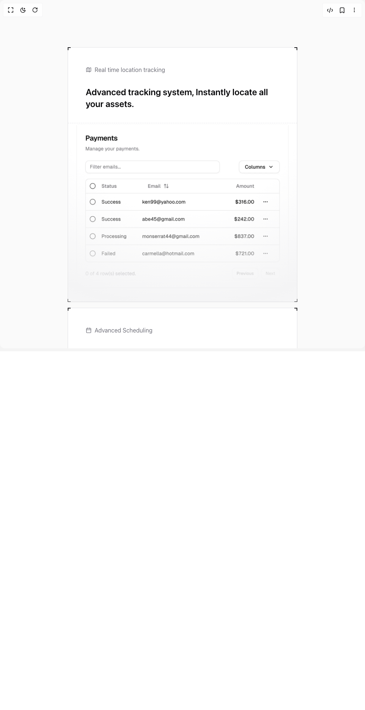

# Build Features 10 in BuilderStudio

> Build this component in our Agentic IDE: [BuilderStudio](https://builderstudio.dev).
>
> Join the BuilderStudio community on [Discord](https://discord.gg/QdWeSGCqfe) and [Reddit](https://reddit.com/r/builderstudio).



## Component

- Author group: `tailark`
- Component: `features-10`
- Variant: `default`
- Rendered HTML snapshot: [`rendered.html`](rendered.html)

## BuilderStudio prompt

You are implementing a React component based on a component reference.

## Component identity

- Author: tailark
- Component slug: features-10
- Demo slug: default
- Title: features-10
- Description: 

## Goal

Recreate this component in a React + TypeScript + Tailwind CSS project. Preserve the visual layout, spacing, colors, border radius, shadows, interaction behavior, animation behavior, responsive behavior, and dark mode behavior shown in the rendered demo.

## Implementation requirements

- Use React and TypeScript.
- Use Tailwind CSS classes whenever possible.
- Keep the component self-contained unless the source files require helper components.
- If the source uses CSS variables, custom CSS, animations, or keyframes, include them.
- If the source uses external packages, list and use the required packages.
- Preserve accessibility attributes, button semantics, links, keyboard behavior, and ARIA attributes when visible in the source.
- Do not replace the component with a simplified placeholder.
- Return complete production-ready code.

## Dependencies

No reference metadata available.

## Rendered DOM snapshot

This is the rendered demo HTML extracted from the live preview. Use it to verify structure, class names, visible content, and layout.

```html
<div id="root"><div class="bg-background text-foreground"><div class="w-full"><section class="bg-zinc-50 py-16 md:py-32 dark:bg-transparent"><div class="mx-auto max-w-2xl px-6 lg:max-w-5xl"><div class="mx-auto grid gap-4 lg:grid-cols-2"><div class="border bg-card text-card-foreground shadow-sm group relative rounded-none shadow-zinc-950/5"><span class="border-primary absolute -left-px -top-px block size-2 border-l-2 border-t-2"></span><span class="border-primary absolute -right-px -top-px block size-2 border-r-2 border-t-2"></span><span class="border-primary absolute -bottom-px -left-px block size-2 border-b-2 border-l-2"></span><span class="border-primary absolute -bottom-px -right-px block size-2 border-b-2 border-r-2"></span><div class="flex flex-col space-y-1.5 p-6 pb-3"><div class="p-6"><span class="text-muted-foreground flex items-center gap-2"><svg xmlns="http://www.w3.org/2000/svg" width="24" height="24" viewBox="0 0 24 24" fill="none" stroke="currentColor" stroke-width="2" stroke-linecap="round" stroke-linejoin="round" class="lucide lucide-map size-4" aria-hidden="true"><path d="M14.106 5.553a2 2 0 0 0 1.788 0l3.659-1.83A1 1 0 0 1 21 4.619v12.764a1 1 0 0 1-.553.894l-4.553 2.277a2 2 0 0 1-1.788 0l-4.212-2.106a2 2 0 0 0-1.788 0l-3.659 1.83A1 1 0 0 1 3 19.381V6.618a1 1 0 0 1 .553-.894l4.553-2.277a2 2 0 0 1 1.788 0z"></path><path d="M15 5.764v15"></path><path d="M9 3.236v15"></path></svg>Real time location tracking</span><p class="mt-8 text-2xl font-semibold">Advanced tracking system, Instantly locate all your assets.</p></div></div><div class="relative mb-6 border-t border-dashed sm:mb-0"><div class="absolute inset-0 [background:radial-gradient(125%_125%_at_50%_0%,transparent_40%,hsl(var(--muted)),white_125%)]"></div><div class="aspect-[76/59] p-1 px-6"></div></div></div><div class="border bg-card text-card-foreground shadow-sm group relative rounded-none shadow-zinc-950/5"><span class="border-primary absolute -left-px -top-px block size-2 border-l-2 border-t-2"></span><span class="border-primary absolute -right-px -top-px block size-2 border-r-2 border-t-2"></span><span class="border-primary absolute -bottom-px -left-px block size-2 border-b-2 border-l-2"></span><span class="border-primary absolute -bottom-px -right-px block size-2 border-b-2 border-r-2"></span><div class="flex flex-col space-y-1.5 p-6 pb-3"><div class="p-6"><span class="text-muted-foreground flex items-center gap-2"><svg xmlns="http://www.w3.org/2000/svg" width="24" height="24" viewBox="0 0 24 24" fill="none" stroke="currentColor" stroke-width="2" stroke-linecap="round" stroke-linejoin="round" class="lucide lucide-calendar size-4" aria-hidden="true"><path d="M8 2v4"></path><path d="M16 2v4"></path><rect width="18" height="18" x="3" y="4" rx="2"></rect><path d="M3 10h18"></path></svg>Advanced Scheduling</span><p class="mt-8 text-2xl font-semibold">Scheduling system, Instantly locate all your assets.</p></div></div><div class="p-6 pt-0"><div class="relative mb-6 sm:mb-0"><div class="absolute -inset-6 [background:radial-gradient(50%_50%_at_75%_50%,transparent,hsl(var(--background))_100%)]"></div><div class="aspect-[76/59] border"></div></div></div></div><div class="border bg-card text-card-foreground shadow-sm group relative rounded-none shadow-zinc-950/5 p-6 lg:col-span-2"><span class="border-primary absolute -left-px -top-px block size-2 border-l-2 border-t-2"></span><span class="border-primary absolute -right-px -top-px block size-2 border-r-2 border-t-2"></span><span class="border-primary absolute -bottom-px -left-px block size-2 border-b-2 border-l-2"></span><span class="border-primary absolute -bottom-px -right-px block size-2 border-b-2 border-r-2"></span><p class="mx-auto my-6 max-w-md text-balance text-center text-2xl font-semibold">Smart scheduling with automated reminders for maintenance.</p><div class="flex justify-center gap-6 overflow-hidden"><div><div class="bg-gradient-to-b from-border size-fit rounded-2xl to-transparent p-px"><div class="bg-gradient-to-b from-background to-muted/25 relative flex aspect-square w-fit items-center -space-x-4 rounded-[15px] p-4"><div class="size-7 rounded-full border sm:size-8 border-primary bg-[repeating-linear-gradient(-45deg,hsl(var(--border)),hsl(var(--border))_1px,transparent_1px,transparent_4px)]"></div><div class="size-7 rounded-full border sm:size-8 border-primary bg-[repeating-linear-gradient(-45deg,hsl(var(--border)),hsl(var(--border))_1px,transparent_1px,transparent_4px)]"></div></div></div><span class="text-muted-foreground mt-1.5 block text-center text-sm">Inclusion</span></div><div><div class="bg-gradient-to-b from-border size-fit rounded-2xl to-transparent p-px"><div class="bg-gradient-to-b from-background to-muted/25 relative flex aspect-square w-fit items-center -space-x-4 rounded-[15px] p-4"><div class="size-7 rounded-full border sm:size-8 border-primary"></div><div class="size-7 rounded-full border sm:size-8 border-primary bg-background bg-[repeating-linear-gradient(-45deg,hsl(var(--primary)),hsl(var(--primary))_1px,transparent_1px,transparent_4px)]"></div></div></div><span class="text-muted-foreground mt-1.5 block text-center text-sm">Inclusion</span></div><div><div class="bg-gradient-to-b from-border size-fit rounded-2xl to-transparent p-px"><div class="bg-gradient-to-b from-background to-muted/25 relative flex aspect-square w-fit items-center -space-x-4 rounded-[15px] p-4"><div class="size-7 rounded-full border sm:size-8 bg-background z-1 border-blue-500 bg-[repeating-linear-gradient(-45deg,theme(colors.blue.500),theme(colors.blue.500)_1px,transparent_1px,transparent_4px)]"></div><div class="size-7 rounded-full border sm:size-8 border-primary"></div></div></div><span class="text-muted-foreground mt-1.5 block text-center text-sm">Join</span></div><div class="hidden sm:block"><div class="bg-gradient-to-b from-border size-fit rounded-2xl to-transparent p-px"><div class="bg-gradient-to-b from-background to-muted/25 relative flex aspect-square w-fit items-center -space-x-4 rounded-[15px] p-4"><div class="size-7 rounded-full border sm:size-8 border-primary bg-background bg-[repeating-linear-gradient(-45deg,hsl(var(--primary)),hsl(var(--primary))_1px,transparent_1px,transparent_4px)]"></div><div class="size-7 rounded-full border sm:size-8 border-primary"></div></div></div><span class="text-muted-foreground mt-1.5 block text-center text-sm">Exclusion</span></div></div></div></div></div></section></div></div></div>
```

## Reference source files

No reference source files were available.
