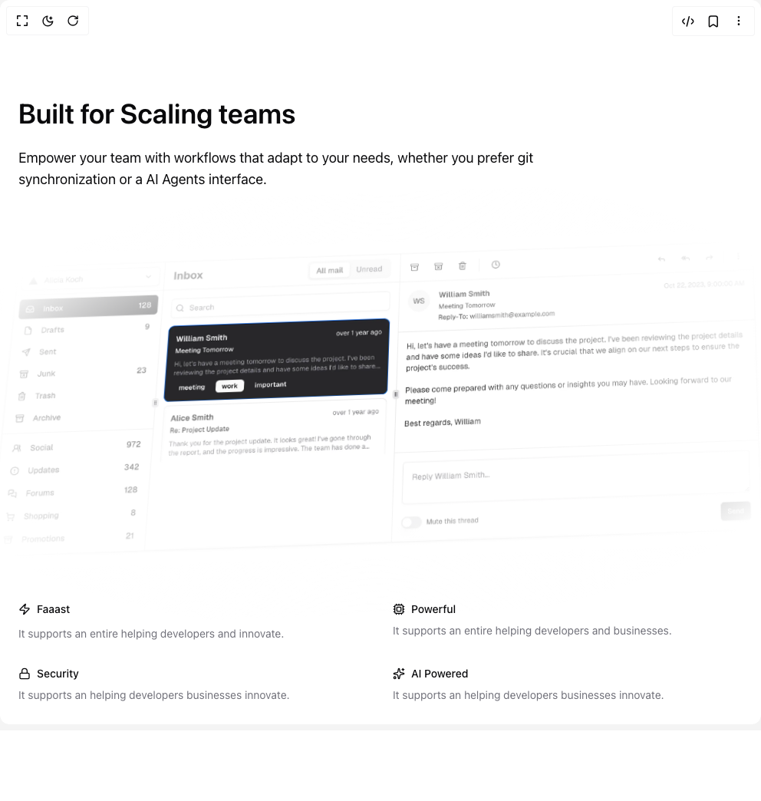

# Build Features 7 in BuilderStudio

> Build this component in our Agentic IDE: [BuilderStudio](https://builderstudio.dev).
>
> Join the BuilderStudio community on [Discord](https://discord.gg/QdWeSGCqfe) and [Reddit](https://reddit.com/r/builderstudio).



## Component

- Author group: `tailark`
- Component: `features-7`
- Variant: `default`
- Rendered HTML snapshot: [`rendered.html`](rendered.html)

## BuilderStudio prompt

You are implementing a React component based on a component reference.

## Component identity

- Author: tailark
- Component slug: features-7
- Demo slug: default
- Title: features-7
- Description: 

## Goal

Recreate this component in a React + TypeScript + Tailwind CSS project. Preserve the visual layout, spacing, colors, border radius, shadows, interaction behavior, animation behavior, responsive behavior, and dark mode behavior shown in the rendered demo.

## Implementation requirements

- Use React and TypeScript.
- Use Tailwind CSS classes whenever possible.
- Keep the component self-contained unless the source files require helper components.
- If the source uses CSS variables, custom CSS, animations, or keyframes, include them.
- If the source uses external packages, list and use the required packages.
- Preserve accessibility attributes, button semantics, links, keyboard behavior, and ARIA attributes when visible in the source.
- Do not replace the component with a simplified placeholder.
- Return complete production-ready code.

## Dependencies

No reference metadata available.

## Rendered DOM snapshot

This is the rendered demo HTML extracted from the live preview. Use it to verify structure, class names, visible content, and layout.

```html
<div id="root"><div class="bg-background text-foreground"><div class="w-full"><section class="overflow-hidden py-16 md:py-32"><div class="mx-auto max-w-5xl space-y-8 px-6 md:space-y-12"><div class="relative z-10 max-w-2xl"><h2 class="text-4xl font-semibold lg:text-5xl">Built for Scaling teams</h2><p class="mt-6 text-lg">Empower your team with workflows that adapt to your needs, whether you prefer git synchronization or a AI Agents interface.</p></div><div class="relative -mx-4 rounded-3xl p-3 md:-mx-12 lg:col-span-3"><div class="[perspective:800px]"><div class="[transform:skewY(-2deg)skewX(-2deg)rotateX(6deg)]"><div class="aspect-[88/36] relative"><div class="[background-image:radial-gradient(var(--tw-gradient-stops,at_75%_25%))] to-background z-1 -inset-[4.25rem] absolute from-transparent to-75%"></div></div></div></div></div><div class="relative mx-auto grid grid-cols-2 gap-x-3 gap-y-6 sm:gap-8 lg:grid-cols-4"><div class="space-y-3"><div class="flex items-center gap-2"><svg xmlns="http://www.w3.org/2000/svg" width="24" height="24" viewBox="0 0 24 24" fill="none" stroke="currentColor" stroke-width="2" stroke-linecap="round" stroke-linejoin="round" class="lucide lucide-zap size-4" aria-hidden="true"><path d="M4 14a1 1 0 0 1-.78-1.63l9.9-10.2a.5.5 0 0 1 .86.46l-1.92 6.02A1 1 0 0 0 13 10h7a1 1 0 0 1 .78 1.63l-9.9 10.2a.5.5 0 0 1-.86-.46l1.92-6.02A1 1 0 0 0 11 14z"></path></svg><h3 class="text-sm font-medium">Faaast</h3></div><p class="text-muted-foreground text-sm">It supports an entire helping developers and innovate.</p></div><div class="space-y-2"><div class="flex items-center gap-2"><svg xmlns="http://www.w3.org/2000/svg" width="24" height="24" viewBox="0 0 24 24" fill="none" stroke="currentColor" stroke-width="2" stroke-linecap="round" stroke-linejoin="round" class="lucide lucide-cpu size-4" aria-hidden="true"><path d="M12 20v2"></path><path d="M12 2v2"></path><path d="M17 20v2"></path><path d="M17 2v2"></path><path d="M2 12h2"></path><path d="M2 17h2"></path><path d="M2 7h2"></path><path d="M20 12h2"></path><path d="M20 17h2"></path><path d="M20 7h2"></path><path d="M7 20v2"></path><path d="M7 2v2"></path><rect x="4" y="4" width="16" height="16" rx="2"></rect><rect x="8" y="8" width="8" height="8" rx="1"></rect></svg><h3 class="text-sm font-medium">Powerful</h3></div><p class="text-muted-foreground text-sm">It supports an entire helping developers and businesses.</p></div><div class="space-y-2"><div class="flex items-center gap-2"><svg xmlns="http://www.w3.org/2000/svg" width="24" height="24" viewBox="0 0 24 24" fill="none" stroke="currentColor" stroke-width="2" stroke-linecap="round" stroke-linejoin="round" class="lucide lucide-lock size-4" aria-hidden="true"><rect width="18" height="11" x="3" y="11" rx="2" ry="2"></rect><path d="M7 11V7a5 5 0 0 1 10 0v4"></path></svg><h3 class="text-sm font-medium">Security</h3></div><p class="text-muted-foreground text-sm">It supports an helping developers businesses innovate.</p></div><div class="space-y-2"><div class="flex items-center gap-2"><svg xmlns="http://www.w3.org/2000/svg" width="24" height="24" viewBox="0 0 24 24" fill="none" stroke="currentColor" stroke-width="2" stroke-linecap="round" stroke-linejoin="round" class="lucide lucide-sparkles size-4" aria-hidden="true"><path d="M11.017 2.814a1 1 0 0 1 1.966 0l1.051 5.558a2 2 0 0 0 1.594 1.594l5.558 1.051a1 1 0 0 1 0 1.966l-5.558 1.051a2 2 0 0 0-1.594 1.594l-1.051 5.558a1 1 0 0 1-1.966 0l-1.051-5.558a2 2 0 0 0-1.594-1.594l-5.558-1.051a1 1 0 0 1 0-1.966l5.558-1.051a2 2 0 0 0 1.594-1.594z"></path><path d="M20 2v4"></path><path d="M22 4h-4"></path><circle cx="4" cy="20" r="2"></circle></svg><h3 class="text-sm font-medium">AI Powered</h3></div><p class="text-muted-foreground text-sm">It supports an helping developers businesses innovate.</p></div></div></div></section></div></div></div>
```

## Reference source files

No reference source files were available.
