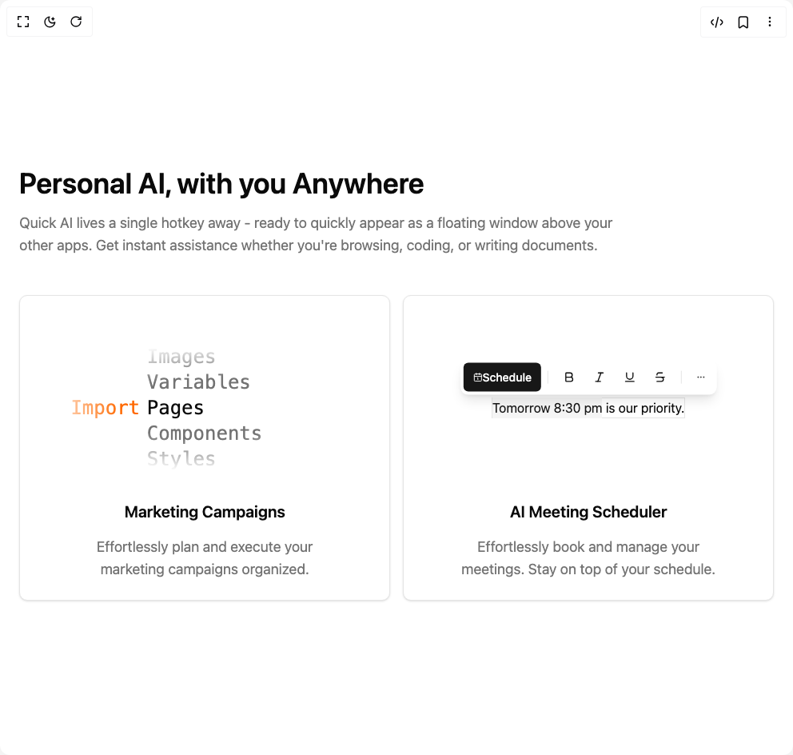

# Build Features in BuilderStudio

> Build this component in our Agentic IDE: [BuilderStudio](https://builderstudio.dev).
>
> Join the BuilderStudio community on [Discord](https://discord.gg/QdWeSGCqfe) and [Reddit](https://reddit.com/r/builderstudio).



## Component

- Author group: `tailark`
- Component: `features`
- Variant: `features-with-toggle`
- Rendered HTML snapshot: [`rendered.html`](rendered.html)

## BuilderStudio prompt

You are implementing a React component based on a component reference.

## Component identity

- Author: tailark
- Component slug: features
- Demo slug: features-with-toggle
- Title: features
- Description: 

## Goal

Recreate this component in a React + TypeScript + Tailwind CSS project. Preserve the visual layout, spacing, colors, border radius, shadows, interaction behavior, animation behavior, responsive behavior, and dark mode behavior shown in the rendered demo.

## Implementation requirements

- Use React and TypeScript.
- Use Tailwind CSS classes whenever possible.
- Keep the component self-contained unless the source files require helper components.
- If the source uses CSS variables, custom CSS, animations, or keyframes, include them.
- If the source uses external packages, list and use the required packages.
- Preserve accessibility attributes, button semantics, links, keyboard behavior, and ARIA attributes when visible in the source.
- Do not replace the component with a simplified placeholder.
- Return complete production-ready code.

## Dependencies

No reference metadata available.

## Rendered DOM snapshot

This is the rendered demo HTML extracted from the live preview. Use it to verify structure, class names, visible content, and layout.

```html
<div id="root"><div class="w-screen min-h-screen flex justify-center items-center"><div class="w-screen min-h-screen flex justify-center items-center"><section><div class="py-24"><div class="mx-auto w-full max-w-5xl px-6"><div><h2 class="text-foreground mt-4 text-4xl font-semibold">Personal AI, with you Anywhere</h2><p class="text-muted-foreground mb-12 mt-4 text-balance text-lg">Quick AI lives a single hotkey away - ready to quickly appear as a floating window above your other apps. Get instant assistance whether you're browsing, coding, or writing documents.</p></div><div class="grid gap-4 sm:grid-cols-2"><div class="rounded-lg border bg-card text-card-foreground shadow-sm p-6" variant="soft"><div class="flex aspect-video items-center justify-center"><div class="[mask-image:radial-gradient(ellipse_50%_50%_at_50%_50%,#000_50%,transparent_100%)] w-full"><ul class="text-muted-foreground mx-auto w-fit font-mono text-2xl font-medium"><li class="">Images</li><li class="">Variables</li><li class="text-foreground before:absolute before:-translate-x-[110%] before:text-orange-500 before:content-['Import']">Pages</li><li class="">Components</li><li class="">Styles</li></ul></div></div><div class="text-center"><h3 class="text-foreground text-xl font-semibold">Marketing Campaigns</h3><p class="text-muted-foreground mt-4 text-balance text-lg">Effortlessly plan and execute your marketing campaigns organized.</p></div></div><div class="rounded-lg border bg-card text-card-foreground shadow-sm p-6" variant="soft"><div class="flex aspect-video items-center justify-center"><div class="relative border"><div class="bg-background -translate-x-1/8 absolute flex -translate-y-[110%] items-center gap-2 rounded-lg p-1 shadow-black-950/10 shadow-lg"><button class="inline-flex items-center justify-center whitespace-nowrap text-sm font-medium ring-offset-background transition-colors focus-visible:outline-none focus-visible:ring-2 focus-visible:ring-ring focus-visible:ring-offset-2 disabled:pointer-events-none disabled:opacity-50 bg-primary text-primary-foreground hover:bg-primary/90 h-9 px-3 rounded-sm"><svg xmlns="http://www.w3.org/2000/svg" width="24" height="24" viewBox="0 0 24 24" fill="none" stroke="currentColor" stroke-width="2" stroke-linecap="round" stroke-linejoin="round" class="lucide lucide-calendar1 lucide-calendar-1 size-3" aria-hidden="true"><path d="M11 14h1v4"></path><path d="M16 2v4"></path><path d="M3 10h18"></path><path d="M8 2v4"></path><rect x="3" y="4" width="18" height="18" rx="2"></rect></svg><span class="text-sm font-medium">Schedule</span></button><span class="bg-border block h-4 w-px"></span><div role="group" dir="ltr" class="flex items-center justify-center gap-0.5 *:rounded-md" tabindex="0" style="outline: none;"><button type="button" aria-pressed="false" data-state="off" class="inline-flex items-center justify-center rounded-md text-sm font-medium ring-offset-background transition-colors hover:bg-muted hover:text-muted-foreground focus-visible:outline-none focus-visible:ring-2 focus-visible:ring-ring focus-visible:ring-offset-2 disabled:pointer-events-none disabled:opacity-50 data-[state=on]:bg-accent data-[state=on]:text-accent-foreground bg-transparent h-9 px-2.5" aria-label="Toggle bold" tabindex="-1" data-radix-collection-item=""><svg xmlns="http://www.w3.org/2000/svg" width="24" height="24" viewBox="0 0 24 24" fill="none" stroke="currentColor" stroke-width="2" stroke-linecap="round" stroke-linejoin="round" class="lucide lucide-bold size-4" aria-hidden="true"><path d="M6 12h9a4 4 0 0 1 0 8H7a1 1 0 0 1-1-1V5a1 1 0 0 1 1-1h7a4 4 0 0 1 0 8"></path></svg></button><button type="button" aria-pressed="false" data-state="off" class="inline-flex items-center justify-center rounded-md text-sm font-medium ring-offset-background transition-colors hover:bg-muted hover:text-muted-foreground focus-visible:outline-none focus-visible:ring-2 focus-visible:ring-ring focus-visible:ring-offset-2 disabled:pointer-events-none disabled:opacity-50 data-[state=on]:bg-accent data-[state=on]:text-accent-foreground bg-transparent h-9 px-2.5" aria-label="Toggle italic" tabindex="-1" data-radix-collection-item=""><svg xmlns="http://www.w3.org/2000/svg" width="24" height="24" viewBox="0 0 24 24" fill="none" stroke="currentColor" stroke-width="2" stroke-linecap="round" stroke-linejoin="round" class="lucide lucide-italic size-4" aria-hidden="true"><line x1="19" x2="10" y1="4" y2="4"></line><line x1="14" x2="5" y1="20" y2="20"></line><line x1="15" x2="9" y1="4" y2="20"></line></svg></button><button type="button" aria-pressed="false" data-state="off" class="inline-flex items-center justify-center rounded-md text-sm font-medium ring-offset-background transition-colors hover:bg-muted hover:text-muted-foreground focus-visible:outline-none focus-visible:ring-2 focus-visible:ring-ring focus-visible:ring-offset-2 disabled:pointer-events-none disabled:opacity-50 data-[state=on]:bg-accent data-[state=on]:text-accent-foreground bg-transparent h-9 px-2.5" aria-label="Toggle underline" tabindex="-1" data-radix-collection-item=""><svg xmlns="http://www.w3.org/2000/svg" width="24" height="24" viewBox="0 0 24 24" fill="none" stroke="currentColor" stroke-width="2" stroke-linecap="round" stroke-linejoin="round" class="lucide lucide-underline size-4" aria-hidden="true"><path d="M6 4v6a6 6 0 0 0 12 0V4"></path><line x1="4" x2="20" y1="20" y2="20"></line></svg></button><button type="button" aria-pressed="false" data-state="off" class="inline-flex items-center justify-center rounded-md text-sm font-medium ring-offset-background transition-colors hover:bg-muted hover:text-muted-foreground focus-visible:outline-none focus-visible:ring-2 focus-visible:ring-ring focus-visible:ring-offset-2 disabled:pointer-events-none disabled:opacity-50 data-[state=on]:bg-accent data-[state=on]:text-accent-foreground bg-transparent h-9 px-2.5" aria-label="Toggle strikethrough" tabindex="-1" data-radix-collection-item=""><svg xmlns="http://www.w3.org/2000/svg" width="24" height="24" viewBox="0 0 24 24" fill="none" stroke="currentColor" stroke-width="2" stroke-linecap="round" stroke-linejoin="round" class="lucide lucide-strikethrough size-4" aria-hidden="true"><path d="M16 4H9a3 3 0 0 0-2.83 4"></path><path d="M14 12a4 4 0 0 1 0 8H6"></path><line x1="4" x2="20" y1="12" y2="12"></line></svg></button></div><span class="bg-border block h-4 w-px"></span><button class="inline-flex items-center justify-center whitespace-nowrap rounded-md text-sm font-medium ring-offset-background transition-colors focus-visible:outline-none focus-visible:ring-2 focus-visible:ring-ring focus-visible:ring-offset-2 disabled:pointer-events-none disabled:opacity-50 hover:bg-accent hover:text-accent-foreground size-8"><svg xmlns="http://www.w3.org/2000/svg" width="24" height="24" viewBox="0 0 24 24" fill="none" stroke="currentColor" stroke-width="2" stroke-linecap="round" stroke-linejoin="round" class="lucide lucide-ellipsis size-3" aria-hidden="true"><circle cx="12" cy="12" r="1"></circle><circle cx="19" cy="12" r="1"></circle><circle cx="5" cy="12" r="1"></circle></svg></button></div><span><span class="bg-secondary text-secondary-foreground py-1">Tomorrow 8:30 pm</span> is our priority.</span></div></div><div class="text-center"><h3 class="text-foreground text-xl font-semibold">AI Meeting Scheduler</h3><p class="text-muted-foreground mt-4 text-balance text-lg">Effortlessly book and manage your meetings. Stay on top of your schedule.</p></div></div></div></div></div></section></div></div></div>
```

## Reference source files

No reference source files were available.
