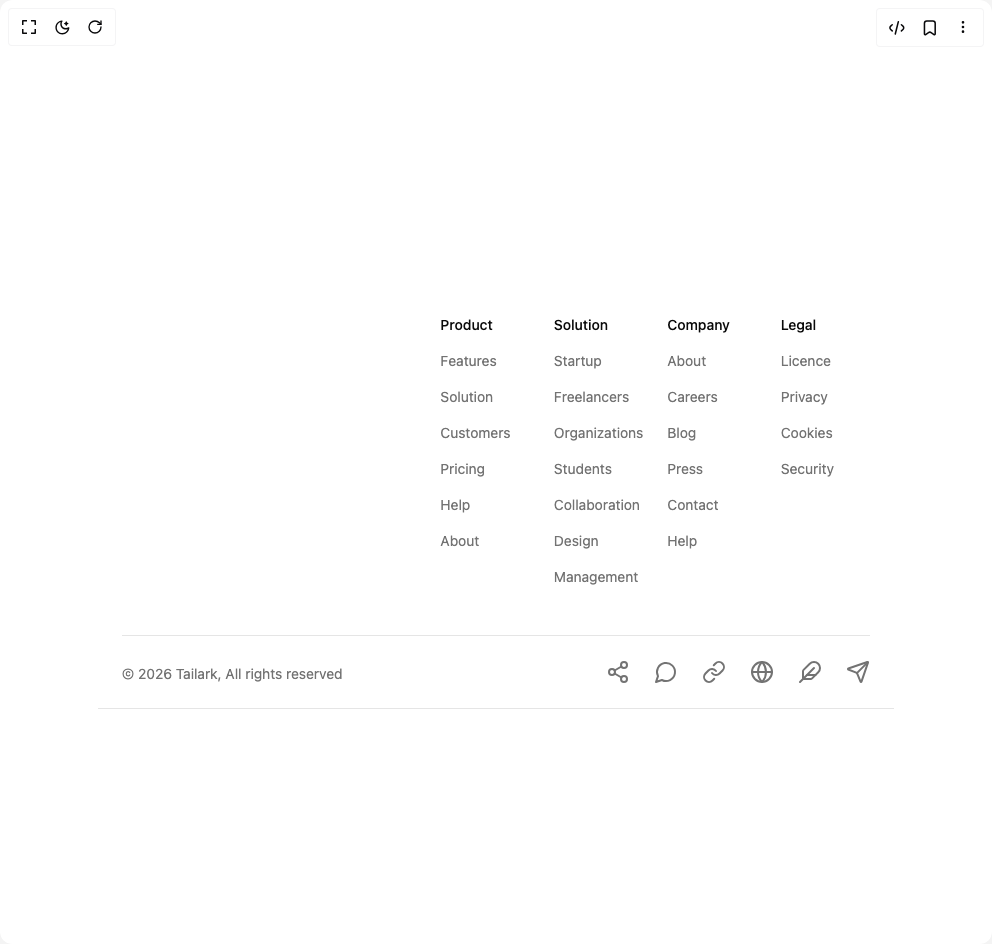

# Build Footer in BuilderStudio

> Build this component in our Agentic IDE: [BuilderStudio](https://builderstudio.dev).
>
> Join the BuilderStudio community on [Discord](https://discord.gg/QdWeSGCqfe) and [Reddit](https://reddit.com/r/builderstudio).



## Component

- Author group: `tailark`
- Component: `footer`
- Variant: `footer-advanced`
- Rendered HTML snapshot: [`rendered.html`](rendered.html)

## BuilderStudio prompt

You are implementing a React component based on a component reference.

## Component identity

- Author: tailark
- Component slug: footer
- Demo slug: footer-advanced
- Title: footer
- Description: 

## Goal

Recreate this component in a React + TypeScript + Tailwind CSS project. Preserve the visual layout, spacing, colors, border radius, shadows, interaction behavior, animation behavior, responsive behavior, and dark mode behavior shown in the rendered demo.

## Implementation requirements

- Use React and TypeScript.
- Use Tailwind CSS classes whenever possible.
- Keep the component self-contained unless the source files require helper components.
- If the source uses CSS variables, custom CSS, animations, or keyframes, include them.
- If the source uses external packages, list and use the required packages.
- Preserve accessibility attributes, button semantics, links, keyboard behavior, and ARIA attributes when visible in the source.
- Do not replace the component with a simplified placeholder.
- Return complete production-ready code.

## Dependencies

No reference metadata available.

## Rendered DOM snapshot

This is the rendered demo HTML extracted from the live preview. Use it to verify structure, class names, visible content, and layout.

```html
<div id="root"><div class="w-screen min-h-screen flex justify-center items-center"><div class="w-screen min-h-screen flex justify-center items-center"><footer class="border-b bg-white pt-20 dark:bg-transparent"><div class="mx-auto max-w-5xl px-6"><div class="grid gap-12 md:grid-cols-5"><div class="md:col-span-2"><a href="/" aria-label="go home" class="block size-fit"></a></div><div class="grid grid-cols-2 gap-6 sm:grid-cols-4 md:col-span-3"><div class="space-y-4 text-sm"><span class="block font-medium">Product</span><a href="#" class="text-muted-foreground hover:text-primary block duration-150"><span>Features</span></a><a href="#" class="text-muted-foreground hover:text-primary block duration-150"><span>Solution</span></a><a href="#" class="text-muted-foreground hover:text-primary block duration-150"><span>Customers</span></a><a href="#" class="text-muted-foreground hover:text-primary block duration-150"><span>Pricing</span></a><a href="#" class="text-muted-foreground hover:text-primary block duration-150"><span>Help</span></a><a href="#" class="text-muted-foreground hover:text-primary block duration-150"><span>About</span></a></div><div class="space-y-4 text-sm"><span class="block font-medium">Solution</span><a href="#" class="text-muted-foreground hover:text-primary block duration-150"><span>Startup</span></a><a href="#" class="text-muted-foreground hover:text-primary block duration-150"><span>Freelancers</span></a><a href="#" class="text-muted-foreground hover:text-primary block duration-150"><span>Organizations</span></a><a href="#" class="text-muted-foreground hover:text-primary block duration-150"><span>Students</span></a><a href="#" class="text-muted-foreground hover:text-primary block duration-150"><span>Collaboration</span></a><a href="#" class="text-muted-foreground hover:text-primary block duration-150"><span>Design</span></a><a href="#" class="text-muted-foreground hover:text-primary block duration-150"><span>Management</span></a></div><div class="space-y-4 text-sm"><span class="block font-medium">Company</span><a href="#" class="text-muted-foreground hover:text-primary block duration-150"><span>About</span></a><a href="#" class="text-muted-foreground hover:text-primary block duration-150"><span>Careers</span></a><a href="#" class="text-muted-foreground hover:text-primary block duration-150"><span>Blog</span></a><a href="#" class="text-muted-foreground hover:text-primary block duration-150"><span>Press</span></a><a href="#" class="text-muted-foreground hover:text-primary block duration-150"><span>Contact</span></a><a href="#" class="text-muted-foreground hover:text-primary block duration-150"><span>Help</span></a></div><div class="space-y-4 text-sm"><span class="block font-medium">Legal</span><a href="#" class="text-muted-foreground hover:text-primary block duration-150"><span>Licence</span></a><a href="#" class="text-muted-foreground hover:text-primary block duration-150"><span>Privacy</span></a><a href="#" class="text-muted-foreground hover:text-primary block duration-150"><span>Cookies</span></a><a href="#" class="text-muted-foreground hover:text-primary block duration-150"><span>Security</span></a></div></div></div><div class="mt-12 flex flex-wrap items-end justify-between gap-6 border-t py-6"><span class="text-muted-foreground order-last block text-center text-sm md:order-first">© 2026 Tailark, All rights reserved</span><div class="order-first flex flex-wrap justify-center gap-6 text-sm md:order-last"><a href="#" target="_blank" rel="noopener noreferrer" aria-label="Social Link 1" class="text-muted-foreground hover:text-primary block"><svg xmlns="http://www.w3.org/2000/svg" width="24" height="24" viewBox="0 0 24 24" fill="none" stroke="currentColor" stroke-width="2" stroke-linecap="round" stroke-linejoin="round" class="lucide lucide-share2 lucide-share-2 size-6" aria-hidden="true"><circle cx="18" cy="5" r="3"></circle><circle cx="6" cy="12" r="3"></circle><circle cx="18" cy="19" r="3"></circle><line x1="8.59" x2="15.42" y1="13.51" y2="17.49"></line><line x1="15.41" x2="8.59" y1="6.51" y2="10.49"></line></svg></a><a href="#" target="_blank" rel="noopener noreferrer" aria-label="Social Link 2" class="text-muted-foreground hover:text-primary block"><svg xmlns="http://www.w3.org/2000/svg" width="24" height="24" viewBox="0 0 24 24" fill="none" stroke="currentColor" stroke-width="2" stroke-linecap="round" stroke-linejoin="round" class="lucide lucide-message-circle size-6" aria-hidden="true"><path d="M7.9 20A9 9 0 1 0 4 16.1L2 22Z"></path></svg></a><a href="#" target="_blank" rel="noopener noreferrer" aria-label="Social Link 3" class="text-muted-foreground hover:text-primary block"><svg xmlns="http://www.w3.org/2000/svg" width="24" height="24" viewBox="0 0 24 24" fill="none" stroke="currentColor" stroke-width="2" stroke-linecap="round" stroke-linejoin="round" class="lucide lucide-link size-6" aria-hidden="true"><path d="M10 13a5 5 0 0 0 7.54.54l3-3a5 5 0 0 0-7.07-7.07l-1.72 1.71"></path><path d="M14 11a5 5 0 0 0-7.54-.54l-3 3a5 5 0 0 0 7.07 7.07l1.71-1.71"></path></svg></a><a href="#" target="_blank" rel="noopener noreferrer" aria-label="Social Link 4" class="text-muted-foreground hover:text-primary block"><svg xmlns="http://www.w3.org/2000/svg" width="24" height="24" viewBox="0 0 24 24" fill="none" stroke="currentColor" stroke-width="2" stroke-linecap="round" stroke-linejoin="round" class="lucide lucide-globe size-6" aria-hidden="true"><circle cx="12" cy="12" r="10"></circle><path d="M12 2a14.5 14.5 0 0 0 0 20 14.5 14.5 0 0 0 0-20"></path><path d="M2 12h20"></path></svg></a><a href="#" target="_blank" rel="noopener noreferrer" aria-label="Social Link 5" class="text-muted-foreground hover:text-primary block"><svg xmlns="http://www.w3.org/2000/svg" width="24" height="24" viewBox="0 0 24 24" fill="none" stroke="currentColor" stroke-width="2" stroke-linecap="round" stroke-linejoin="round" class="lucide lucide-feather size-6" aria-hidden="true"><path d="M12.67 19a2 2 0 0 0 1.416-.588l6.154-6.172a6 6 0 0 0-8.49-8.49L5.586 9.914A2 2 0 0 0 5 11.328V18a1 1 0 0 0 1 1z"></path><path d="M16 8 2 22"></path><path d="M17.5 15H9"></path></svg></a><a href="#" target="_blank" rel="noopener noreferrer" aria-label="Social Link 6" class="text-muted-foreground hover:text-primary block"><svg xmlns="http://www.w3.org/2000/svg" width="24" height="24" viewBox="0 0 24 24" fill="none" stroke="currentColor" stroke-width="2" stroke-linecap="round" stroke-linejoin="round" class="lucide lucide-send size-6" aria-hidden="true"><path d="M14.536 21.686a.5.5 0 0 0 .937-.024l6.5-19a.496.496 0 0 0-.635-.635l-19 6.5a.5.5 0 0 0-.024.937l7.93 3.18a2 2 0 0 1 1.112 1.11z"></path><path d="m21.854 2.147-10.94 10.939"></path></svg></a></div></div></div></footer></div></div></div>
```

## Reference source files

No reference source files were available.
