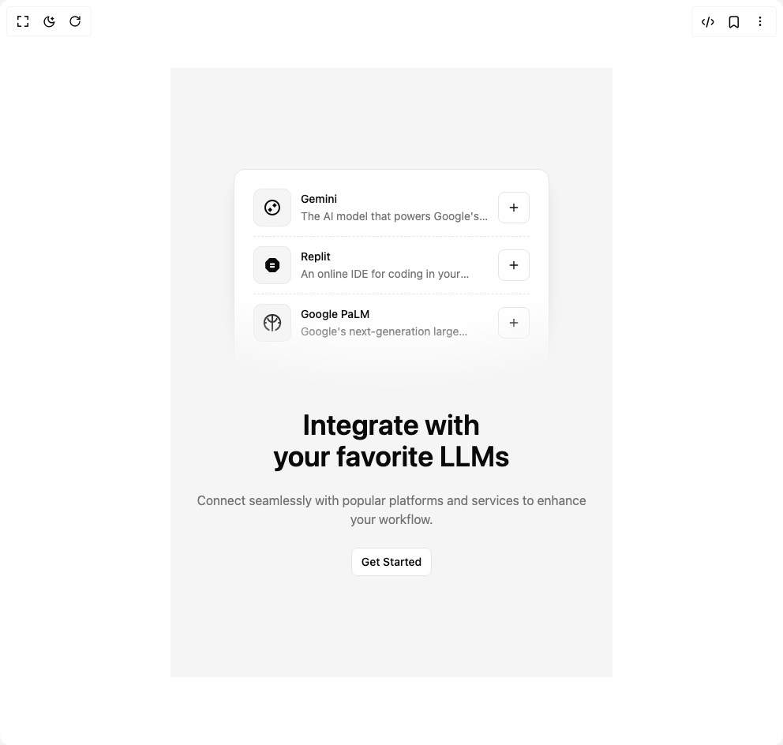

# Build Integrations Component in BuilderStudio

> Build this component in our Agentic IDE: [BuilderStudio](https://builderstudio.dev).
>
> Join the BuilderStudio community on [Discord](https://discord.gg/QdWeSGCqfe) and [Reddit](https://reddit.com/r/builderstudio).



## Component

- Author group: `tailark`
- Component: `integrations-component`
- Variant: `integrations-6`
- Rendered HTML snapshot: [`rendered.html`](rendered.html)

## BuilderStudio prompt

You are implementing a React component based on a component reference.

## Component identity

- Author: tailark
- Component slug: integrations-component
- Demo slug: integrations-6
- Title: integrations-component
- Description: 

## Goal

Recreate this component in a React + TypeScript + Tailwind CSS project. Preserve the visual layout, spacing, colors, border radius, shadows, interaction behavior, animation behavior, responsive behavior, and dark mode behavior shown in the rendered demo.

## Implementation requirements

- Use React and TypeScript.
- Use Tailwind CSS classes whenever possible.
- Keep the component self-contained unless the source files require helper components.
- If the source uses CSS variables, custom CSS, animations, or keyframes, include them.
- If the source uses external packages, list and use the required packages.
- Preserve accessibility attributes, button semantics, links, keyboard behavior, and ARIA attributes when visible in the source.
- Do not replace the component with a simplified placeholder.
- Return complete production-ready code.

## Dependencies

No reference metadata available.

## Rendered DOM snapshot

This is the rendered demo HTML extracted from the live preview. Use it to verify structure, class names, visible content, and layout.

```html
<div id="root"><div class="w-screen min-h-screen flex justify-center items-center"><div class="w-screen min-h-screen flex justify-center items-center"><section><div class="bg-muted dark:bg-background py-24 md:py-32"><div class="mx-auto max-w-5xl px-6"><div class="mx-auto max-w-md px-6 [mask-image:radial-gradient(ellipse_100%_100%_at_50%_0%,#000_70%,transparent_100%)]"><div class="bg-background dark:bg-muted/50 rounded-xl border px-6 pb-12 pt-3 shadow-xl"><div class="grid grid-cols-[auto_1fr_auto] items-center gap-3 border-b border-dashed py-3 last:border-b-0"><div class="bg-muted border-foreground/5 flex size-12 items-center justify-center rounded-lg border"><svg viewBox="0 0 24 24" fill="currentColor" xmlns="http://www.w3.org/2000/svg" class="size-6"><path d="M12.0001 9.1716L14.8285 6.34313L17.6569 9.1716L14.8285 12.0001L12.0001 9.1716Z"></path><path d="M9.17157 12.0001L6.34311 14.8285L9.17157 17.6569L12.0001 14.8285L9.17157 12.0001Z"></path><path fill-rule="evenodd" clip-rule="evenodd" d="M12 22C17.5228 22 22 17.5228 22 12C22 6.47715 17.5228 2 12 2C6.47715 2 2 6.47715 2 12C2 17.5228 6.47715 22 12 22ZM12 20C16.4183 20 20 16.4183 20 12C20 7.58172 16.4183 4 12 4C7.58172 4 4 7.58172 4 12C4 16.4183 7.58172 20 12 20Z"></path></svg></div><div class="space-y-0.5"><h3 class="text-sm font-medium">Gemini</h3><p class="text-muted-foreground line-clamp-1 text-sm">The AI model that powers Google's search engine.</p></div><button class="inline-flex items-center justify-center whitespace-nowrap rounded-md text-sm font-medium ring-offset-background transition-colors focus-visible:outline-none focus-visible:ring-2 focus-visible:ring-ring focus-visible:ring-offset-2 disabled:pointer-events-none disabled:opacity-50 border border-input bg-background hover:bg-accent hover:text-accent-foreground h-10 w-10" aria-label="Add integration"><svg xmlns="http://www.w3.org/2000/svg" width="24" height="24" viewBox="0 0 24 24" fill="none" stroke="currentColor" stroke-width="2" stroke-linecap="round" stroke-linejoin="round" class="size-4"><line x1="12" y1="5" x2="12" y2="19"></line><line x1="5" y1="12" x2="19" y2="12"></line></svg></button></div><div class="grid grid-cols-[auto_1fr_auto] items-center gap-3 border-b border-dashed py-3 last:border-b-0"><div class="bg-muted border-foreground/5 flex size-12 items-center justify-center rounded-lg border"><svg viewBox="0 0 24 24" fill="currentColor" xmlns="http://www.w3.org/2000/svg" class="size-6"><path d="M8.28,3.027,3.16,8.147v7.706l5.12,5.12h7.706l5.12-5.12V8.147L15.987,3.027ZM9.033,9.44h5.933v2.373H9.033Zm0,3.56h5.933v2.373H9.033Z"></path></svg></div><div class="space-y-0.5"><h3 class="text-sm font-medium">Replit</h3><p class="text-muted-foreground line-clamp-1 text-sm">An online IDE for coding in your browser.</p></div><button class="inline-flex items-center justify-center whitespace-nowrap rounded-md text-sm font-medium ring-offset-background transition-colors focus-visible:outline-none focus-visible:ring-2 focus-visible:ring-ring focus-visible:ring-offset-2 disabled:pointer-events-none disabled:opacity-50 border border-input bg-background hover:bg-accent hover:text-accent-foreground h-10 w-10" aria-label="Add integration"><svg xmlns="http://www.w3.org/2000/svg" width="24" height="24" viewBox="0 0 24 24" fill="none" stroke="currentColor" stroke-width="2" stroke-linecap="round" stroke-linejoin="round" class="size-4"><line x1="12" y1="5" x2="12" y2="19"></line><line x1="5" y1="12" x2="19" y2="12"></line></svg></button></div><div class="grid grid-cols-[auto_1fr_auto] items-center gap-3 border-b border-dashed py-3 last:border-b-0"><div class="bg-muted border-foreground/5 flex size-12 items-center justify-center rounded-lg border"><svg viewBox="0 0 24 24" fill="none" stroke="currentColor" stroke-width="2" stroke-linecap="round" stroke-linejoin="round" xmlns="http://www.w3.org/2000/svg" class="size-6"><path d="M12 2a10 10 0 0 0-4.32 19.14"></path><path d="M12 2a10 10 0 0 1 4.32 19.14"></path><path d="M12 2v8"></path><path d="M17.68 6.86a6 6 0 0 1-11.36 0"></path><path d="M4 12H2"></path><path d="M22 12h-2"></path><path d="M12 12v10"></path></svg></div><div class="space-y-0.5"><h3 class="text-sm font-medium">Google PaLM</h3><p class="text-muted-foreground line-clamp-1 text-sm">Google's next-generation large language model.</p></div><button class="inline-flex items-center justify-center whitespace-nowrap rounded-md text-sm font-medium ring-offset-background transition-colors focus-visible:outline-none focus-visible:ring-2 focus-visible:ring-ring focus-visible:ring-offset-2 disabled:pointer-events-none disabled:opacity-50 border border-input bg-background hover:bg-accent hover:text-accent-foreground h-10 w-10" aria-label="Add integration"><svg xmlns="http://www.w3.org/2000/svg" width="24" height="24" viewBox="0 0 24 24" fill="none" stroke="currentColor" stroke-width="2" stroke-linecap="round" stroke-linejoin="round" class="size-4"><line x1="12" y1="5" x2="12" y2="19"></line><line x1="5" y1="12" x2="19" y2="12"></line></svg></button></div></div></div><div class="mx-auto mt-6 max-w-lg space-y-6 text-center"><h2 class="text-balance text-3xl font-semibold md:text-4xl lg:text-5xl">Integrate with your favorite LLMs</h2><p class="text-muted-foreground">Connect seamlessly with popular platforms and services to enhance your workflow.</p><a href="#" class="inline-flex items-center justify-center whitespace-nowrap text-sm font-medium ring-offset-background transition-colors focus-visible:outline-none focus-visible:ring-2 focus-visible:ring-ring focus-visible:ring-offset-2 disabled:pointer-events-none disabled:opacity-50 border border-input bg-background hover:bg-accent hover:text-accent-foreground h-9 rounded-md px-3">Get Started</a></div></div></div></section></div></div></div>
```

## Reference source files

No reference source files were available.
