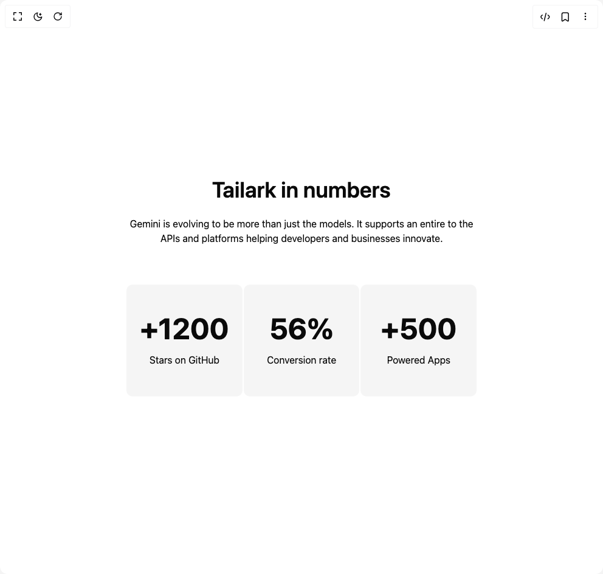

# Build Stats Defautlt in BuilderStudio

> Build this component in our Agentic IDE: [BuilderStudio](https://builderstudio.dev).
>
> Join the BuilderStudio community on [Discord](https://discord.gg/QdWeSGCqfe) and [Reddit](https://reddit.com/r/builderstudio).



## Component

- Author group: `tailark`
- Component: `stats-defautlt`
- Variant: `stats-two`
- Rendered HTML snapshot: [`rendered.html`](rendered.html)

## BuilderStudio prompt

You are implementing a React component based on a component reference.

## Component identity

- Author: tailark
- Component slug: stats-defautlt
- Demo slug: stats-two
- Title: stats-defautlt
- Description: 

## Goal

Recreate this component in a React + TypeScript + Tailwind CSS project. Preserve the visual layout, spacing, colors, border radius, shadows, interaction behavior, animation behavior, responsive behavior, and dark mode behavior shown in the rendered demo.

## Implementation requirements

- Use React and TypeScript.
- Use Tailwind CSS classes whenever possible.
- Keep the component self-contained unless the source files require helper components.
- If the source uses CSS variables, custom CSS, animations, or keyframes, include them.
- If the source uses external packages, list and use the required packages.
- Preserve accessibility attributes, button semantics, links, keyboard behavior, and ARIA attributes when visible in the source.
- Do not replace the component with a simplified placeholder.
- Return complete production-ready code.

## Dependencies

No reference metadata available.

## Rendered DOM snapshot

This is the rendered demo HTML extracted from the live preview. Use it to verify structure, class names, visible content, and layout.

```html
<div id="root"><div class="w-screen min-h-screen flex justify-center items-center"><div class="w-screen min-h-screen flex justify-center items-center"><section class="py-12 md:py-20"><div class="mx-auto max-w-5xl space-y-8 px-6 md:space-y-16"><div class="relative z-10 mx-auto max-w-xl space-y-6 text-center"><h2 class="text-4xl font-semibold lg:text-5xl">Tailark in numbers</h2><p>Gemini is evolving to be more than just the models. It supports an entire to the APIs and platforms helping developers and businesses innovate.</p></div><div class="grid gap-0.5 *:text-center md:grid-cols-3 dark:[--color-muted:var(--color-zinc-900)]"><div class="bg-muted rounded-(--radius) space-y-4 py-12"><div class="text-5xl font-bold">+1200</div><p>Stars on GitHub</p></div><div class="bg-muted rounded-(--radius) space-y-4 py-12"><div class="text-5xl font-bold">56%</div><p>Conversion rate</p></div><div class="bg-muted rounded-(--radius) space-y-4 py-12"><div class="text-5xl font-bold">+500</div><p>Powered Apps</p></div></div></div></section></div></div></div>
```

## Reference source files

No reference source files were available.
