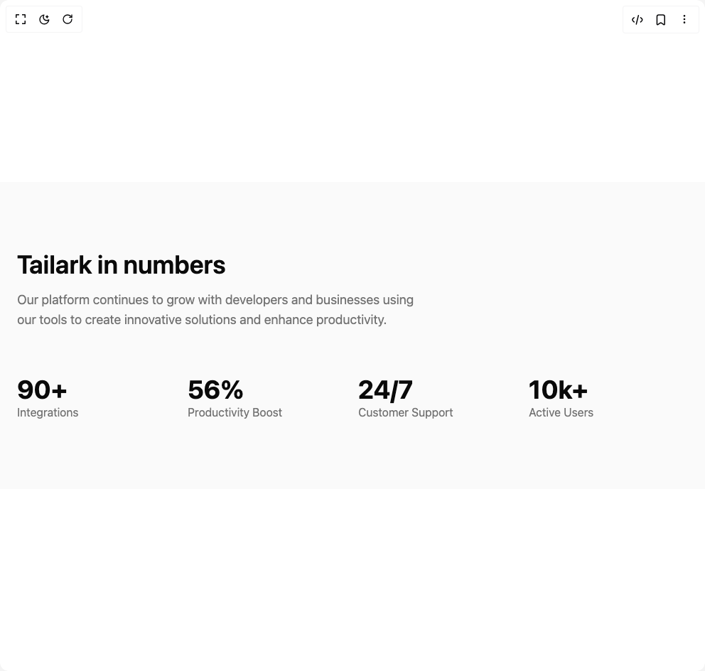

# Build Stats in BuilderStudio

> Build this component in our Agentic IDE: [BuilderStudio](https://builderstudio.dev).
>
> Join the BuilderStudio community on [Discord](https://discord.gg/QdWeSGCqfe) and [Reddit](https://reddit.com/r/builderstudio).



## Component

- Author group: `tailark`
- Component: `stats`
- Variant: `stats-info`
- Rendered HTML snapshot: [`rendered.html`](rendered.html)

## BuilderStudio prompt

You are implementing a React component based on a component reference.

## Component identity

- Author: tailark
- Component slug: stats
- Demo slug: stats-info
- Title: stats
- Description: 

## Goal

Recreate this component in a React + TypeScript + Tailwind CSS project. Preserve the visual layout, spacing, colors, border radius, shadows, interaction behavior, animation behavior, responsive behavior, and dark mode behavior shown in the rendered demo.

## Implementation requirements

- Use React and TypeScript.
- Use Tailwind CSS classes whenever possible.
- Keep the component self-contained unless the source files require helper components.
- If the source uses CSS variables, custom CSS, animations, or keyframes, include them.
- If the source uses external packages, list and use the required packages.
- Preserve accessibility attributes, button semantics, links, keyboard behavior, and ARIA attributes when visible in the source.
- Do not replace the component with a simplified placeholder.
- Return complete production-ready code.

## Dependencies

No reference metadata available.

## Rendered DOM snapshot

This is the rendered demo HTML extracted from the live preview. Use it to verify structure, class names, visible content, and layout.

```html
<div id="root"><div class="w-screen min-h-screen flex justify-center items-center"><div class="w-screen min-h-screen flex justify-center items-center"><section><div class="bg-muted/50 py-24"><div class="mx-auto max-w-5xl px-6"><div><h2 class="text-4xl font-semibold lg:text-5xl">Tailark in numbers</h2><p class="text-muted-foreground mt-4 text-balance text-lg">Our platform continues to grow with developers and businesses using our tools to create innovative solutions and enhance productivity.</p></div><div class="mt-8 grid grid-cols-2 gap-4 md:mt-16 md:grid-cols-4"><div><div class="text-foreground text-4xl font-bold">90+</div><p class="text-muted-foreground">Integrations</p></div><div><div class="text-foreground text-4xl font-bold">56%</div><p class="text-muted-foreground">Productivity Boost</p></div><div><div class="text-foreground text-4xl font-bold">24/7</div><p class="text-muted-foreground">Customer Support</p></div><div><div class="text-foreground text-4xl font-bold">10k+</div><p class="text-muted-foreground">Active Users</p></div></div></div></div></section></div></div></div>
```

## Reference source files

No reference source files were available.
