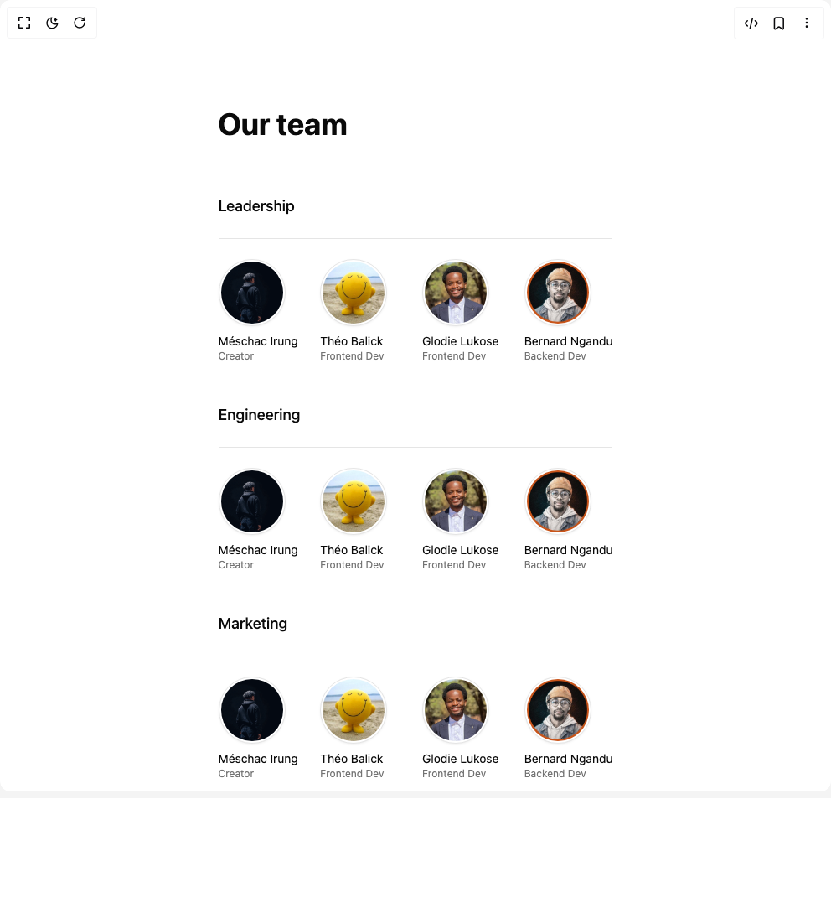

# Build Team in BuilderStudio

> Build this component in our Agentic IDE: [BuilderStudio](https://builderstudio.dev).
>
> Join the BuilderStudio community on [Discord](https://discord.gg/QdWeSGCqfe) and [Reddit](https://reddit.com/r/builderstudio).



## Component

- Author group: `tailark`
- Component: `team`
- Variant: `default`
- Rendered HTML snapshot: [`rendered.html`](rendered.html)

## BuilderStudio prompt

You are implementing a React component based on a component reference.

## Component identity

- Author: tailark
- Component slug: team
- Demo slug: default
- Title: team
- Description: 

## Goal

Recreate this component in a React + TypeScript + Tailwind CSS project. Preserve the visual layout, spacing, colors, border radius, shadows, interaction behavior, animation behavior, responsive behavior, and dark mode behavior shown in the rendered demo.

## Implementation requirements

- Use React and TypeScript.
- Use Tailwind CSS classes whenever possible.
- Keep the component self-contained unless the source files require helper components.
- If the source uses CSS variables, custom CSS, animations, or keyframes, include them.
- If the source uses external packages, list and use the required packages.
- Preserve accessibility attributes, button semantics, links, keyboard behavior, and ARIA attributes when visible in the source.
- Do not replace the component with a simplified placeholder.
- Return complete production-ready code.

## Dependencies

No reference metadata available.

## Rendered DOM snapshot

This is the rendered demo HTML extracted from the live preview. Use it to verify structure, class names, visible content, and layout.

```html
<div id="root"><div class="w-screen min-h-screen flex justify-center items-center"><div class="w-screen min-h-screen flex justify-center items-center"><section class="py-12 md:py-32"><div class="mx-auto max-w-3xl px-8 lg:px-0"><h2 class="mb-8 text-4xl font-bold md:mb-16 lg:text-5xl">Our team</h2><div><h3 class="mb-6 text-lg font-medium">Leadership</h3><div class="grid grid-cols-2 gap-4 border-t py-6 md:grid-cols-4"><div><div class="bg-background size-20 rounded-full border p-0.5 shadow shadow-zinc-950/5"></div><span class="mt-2 block text-sm">Méschac Irung</span><span class="text-muted-foreground block text-xs">Creator</span></div><div><div class="bg-background size-20 rounded-full border p-0.5 shadow shadow-zinc-950/5"></div><span class="mt-2 block text-sm">Théo Balick</span><span class="text-muted-foreground block text-xs">Frontend Dev</span></div><div><div class="bg-background size-20 rounded-full border p-0.5 shadow shadow-zinc-950/5"></div><span class="mt-2 block text-sm">Glodie Lukose</span><span class="text-muted-foreground block text-xs">Frontend Dev</span></div><div><div class="bg-background size-20 rounded-full border p-0.5 shadow shadow-zinc-950/5"></div><span class="mt-2 block text-sm">Bernard Ngandu</span><span class="text-muted-foreground block text-xs">Backend Dev</span></div></div></div><div class="mt-6"><h3 class="mb-6 text-lg font-medium">Engineering</h3><div data-rounded="full" class="grid grid-cols-2 gap-4 border-t py-6 md:grid-cols-4"><div><div class="bg-background size-20 rounded-full border p-0.5 shadow shadow-zinc-950/5"></div><span class="mt-2 block text-sm">Méschac Irung</span><span class="text-muted-foreground block text-xs">Creator</span></div><div><div class="bg-background size-20 rounded-full border p-0.5 shadow shadow-zinc-950/5"></div><span class="mt-2 block text-sm">Théo Balick</span><span class="text-muted-foreground block text-xs">Frontend Dev</span></div><div><div class="bg-background size-20 rounded-full border p-0.5 shadow shadow-zinc-950/5"></div><span class="mt-2 block text-sm">Glodie Lukose</span><span class="text-muted-foreground block text-xs">Frontend Dev</span></div><div><div class="bg-background size-20 rounded-full border p-0.5 shadow shadow-zinc-950/5"></div><span class="mt-2 block text-sm">Bernard Ngandu</span><span class="text-muted-foreground block text-xs">Backend Dev</span></div></div></div><div class="mt-6"><h3 class="mb-6 text-lg font-medium">Marketing</h3><div data-rounded="full" class="grid grid-cols-2 gap-4 border-t py-6 md:grid-cols-4"><div><div class="bg-background size-20 rounded-full border p-0.5 shadow shadow-zinc-950/5"></div><span class="mt-2 block text-sm">Méschac Irung</span><span class="text-muted-foreground block text-xs">Creator</span></div><div><div class="bg-background size-20 rounded-full border p-0.5 shadow shadow-zinc-950/5"></div><span class="mt-2 block text-sm">Théo Balick</span><span class="text-muted-foreground block text-xs">Frontend Dev</span></div><div><div class="bg-background size-20 rounded-full border p-0.5 shadow shadow-zinc-950/5"></div><span class="mt-2 block text-sm">Glodie Lukose</span><span class="text-muted-foreground block text-xs">Frontend Dev</span></div><div><div class="bg-background size-20 rounded-full border p-0.5 shadow shadow-zinc-950/5"></div><span class="mt-2 block text-sm">Bernard Ngandu</span><span class="text-muted-foreground block text-xs">Backend Dev</span></div></div></div></div></section></div></div></div>
```

## Reference source files

No reference source files were available.
