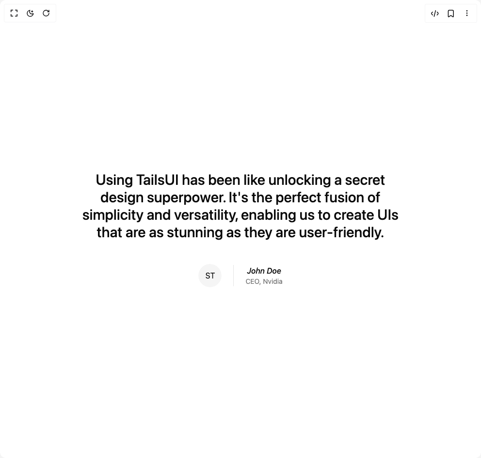

# Build Testimonials in BuilderStudio

> Build this component in our Agentic IDE: [BuilderStudio](https://builderstudio.dev).
>
> Join the BuilderStudio community on [Discord](https://discord.gg/QdWeSGCqfe) and [Reddit](https://reddit.com/r/builderstudio).



## Component

- Author group: `tailark`
- Component: `testimonials`
- Variant: `testimonials-three`
- Rendered HTML snapshot: [`rendered.html`](rendered.html)

## BuilderStudio prompt

You are implementing a React component based on a component reference.

## Component identity

- Author: tailark
- Component slug: testimonials
- Demo slug: testimonials-three
- Title: testimonials
- Description: 

## Goal

Recreate this component in a React + TypeScript + Tailwind CSS project. Preserve the visual layout, spacing, colors, border radius, shadows, interaction behavior, animation behavior, responsive behavior, and dark mode behavior shown in the rendered demo.

## Implementation requirements

- Use React and TypeScript.
- Use Tailwind CSS classes whenever possible.
- Keep the component self-contained unless the source files require helper components.
- If the source uses CSS variables, custom CSS, animations, or keyframes, include them.
- If the source uses external packages, list and use the required packages.
- Preserve accessibility attributes, button semantics, links, keyboard behavior, and ARIA attributes when visible in the source.
- Do not replace the component with a simplified placeholder.
- Return complete production-ready code.

## Dependencies

No reference metadata available.

## Rendered DOM snapshot

This is the rendered demo HTML extracted from the live preview. Use it to verify structure, class names, visible content, and layout.

```html
<div id="root"><div class="w-screen min-h-screen flex justify-center items-center"><div class="w-screen min-h-screen flex justify-center items-center"><section class="py-16 md:py-32"><div class="mx-auto max-w-5xl px-6"><div class="mx-auto max-w-2xl text-center"><blockquote><p class="text-lg font-medium sm:text-xl md:text-3xl">Using TailsUI has been like unlocking a secret design superpower. It's the perfect fusion of simplicity and versatility, enabling us to create UIs that are as stunning as they are user-friendly.</p><div class="mt-12 flex items-center justify-center gap-6"><span class="relative flex shrink-0 overflow-hidden rounded-full size-12"><span class="flex h-full w-full items-center justify-center rounded-full bg-muted">ST</span></span><div class="space-y-1 border-l pl-6"><cite class="font-medium">John Doe</cite><span class="text-muted-foreground block text-sm">CEO, Nvidia</span></div></div></blockquote></div></div></section></div></div></div>
```

## Reference source files

No reference source files were available.
