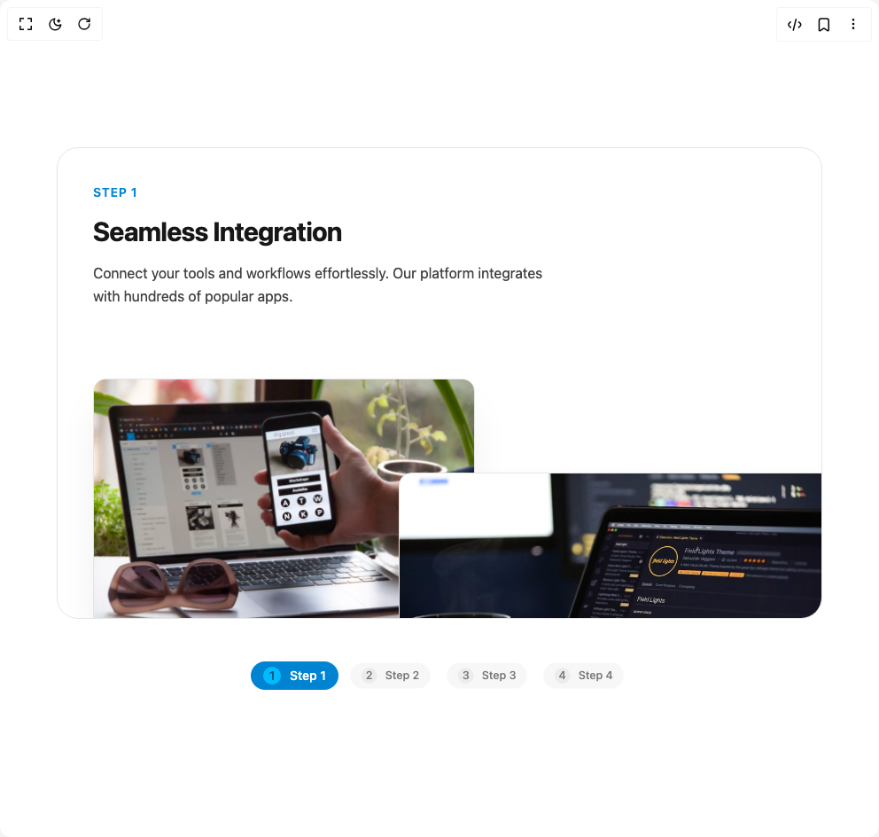

# Build Animated Feature Carousel in BuilderStudio

> Build this component in our Agentic IDE: [BuilderStudio](https://builderstudio.dev).
>
> Join the BuilderStudio community on [Discord](https://discord.gg/QdWeSGCqfe) and [Reddit](https://reddit.com/r/builderstudio).



## Component

- Author group: `thanh`
- Component: `animated-feature-carousel`
- Variant: `default`
- Rendered HTML snapshot: [`rendered.html`](rendered.html)

## BuilderStudio prompt

You are implementing a React component based on a component reference.

## Component identity

- Author: thanh
- Component slug: animated-feature-carousel
- Demo slug: default
- Title: animated-feature-carousel
- Description: 

## Goal

Recreate this component in a React + TypeScript + Tailwind CSS project. Preserve the visual layout, spacing, colors, border radius, shadows, interaction behavior, animation behavior, responsive behavior, and dark mode behavior shown in the rendered demo.

## Implementation requirements

- Use React and TypeScript.
- Use Tailwind CSS classes whenever possible.
- Keep the component self-contained unless the source files require helper components.
- If the source uses CSS variables, custom CSS, animations, or keyframes, include them.
- If the source uses external packages, list and use the required packages.
- Preserve accessibility attributes, button semantics, links, keyboard behavior, and ARIA attributes when visible in the source.
- Do not replace the component with a simplified placeholder.
- Return complete production-ready code.

## Dependencies

No reference metadata available.

## Rendered DOM snapshot

This is the rendered demo HTML extracted from the live preview. Use it to verify structure, class names, visible content, and layout.

```html
<div id="root"><div class="w-screen min-h-screen flex justify-center items-center"><div class="w-screen min-h-screen flex justify-center items-center"><div class="w-full font-sans"><div class="flex flex-col gap-12 w-full max-w-4xl mx-auto p-4"><div class="animated-cards group relative w-full rounded-2xl" style="--x: 0px; --y: 0px;"><div class="relative w-full overflow-hidden rounded-3xl border border-neutral-200 bg-white transition-colors duration-300 dark:border-neutral-800 dark:bg-neutral-900"><div class="m-10 min-h-[450px] w-full"><div class="flex w-full flex-col gap-4 md:w-3/5" style="opacity: 1; transform: none;"><div class="text-sm font-semibold uppercase tracking-wider text-sky-600 dark:text-sky-500" style="opacity: 1; transform: none;">Step 1</div><h2 class="text-2xl font-bold tracking-tight text-neutral-900 dark:text-neutral-100 md:text-3xl" style="opacity: 1; transform: none;">Seamless Integration</h2><div style="opacity: 1; transform: none;"><p class="text-base leading-relaxed text-neutral-700 dark:text-neutral-400">Connect your tools and workflows effortlessly. Our platform integrates with hundreds of popular apps.</p></div></div><div class="w-full h-full absolute" style="opacity: 1; transform: none;"><div class="relative w-full h-full"></div></div></div></div></div><div style="opacity: 1; transform: none;"><nav aria-label="Progress" class="flex justify-center px-4"><ol class="flex w-full flex-wrap items-center justify-center gap-2" role="list"><li class="relative" style="opacity: 1; transform: none;"><button type="button" class="group flex items-center gap-2.5 rounded-full px-3.5 py-1.5 text-sm font-medium transition-colors duration-300 focus:outline-none focus-visible:ring-2 focus-visible:ring-offset-2 focus-visible:ring-sky-500 dark:focus-visible:ring-offset-black bg-sky-600 text-white dark:bg-sky-500"><span class="flex h-5 w-5 shrink-0 items-center justify-center rounded-full transition-all duration-300 bg-sky-400 text-sky-900 dark:bg-sky-400 dark:text-sky-900"><span>1</span></span><span class="hidden sm:inline-block">Step 1</span></button></li><li class="relative" style="opacity: 0.7; transform: scale(0.9);"><button type="button" class="group flex items-center gap-2.5 rounded-full px-3.5 py-1.5 text-sm font-medium transition-colors duration-300 focus:outline-none focus-visible:ring-2 focus-visible:ring-offset-2 focus-visible:ring-sky-500 dark:focus-visible:ring-offset-black bg-neutral-100 text-neutral-700 hover:bg-neutral-200 dark:bg-neutral-800 dark:text-neutral-300 dark:hover:bg-neutral-700"><span class="flex h-5 w-5 shrink-0 items-center justify-center rounded-full transition-all duration-300 bg-neutral-200 text-neutral-700 group-hover:bg-neutral-300 dark:bg-neutral-700 dark:text-neutral-200 dark:group-hover:bg-neutral-600"><span>2</span></span><span class="hidden sm:inline-block">Step 2</span></button></li><li class="relative" style="opacity: 0.7; transform: scale(0.9);"><button type="button" class="group flex items-center gap-2.5 rounded-full px-3.5 py-1.5 text-sm font-medium transition-colors duration-300 focus:outline-none focus-visible:ring-2 focus-visible:ring-offset-2 focus-visible:ring-sky-500 dark:focus-visible:ring-offset-black bg-neutral-100 text-neutral-700 hover:bg-neutral-200 dark:bg-neutral-800 dark:text-neutral-300 dark:hover:bg-neutral-700"><span class="flex h-5 w-5 shrink-0 items-center justify-center rounded-full transition-all duration-300 bg-neutral-200 text-neutral-700 group-hover:bg-neutral-300 dark:bg-neutral-700 dark:text-neutral-200 dark:group-hover:bg-neutral-600"><span>3</span></span><span class="hidden sm:inline-block">Step 3</span></button></li><li class="relative" style="opacity: 0.7; transform: scale(0.9);"><button type="button" class="group flex items-center gap-2.5 rounded-full px-3.5 py-1.5 text-sm font-medium transition-colors duration-300 focus:outline-none focus-visible:ring-2 focus-visible:ring-offset-2 focus-visible:ring-sky-500 dark:focus-visible:ring-offset-black bg-neutral-100 text-neutral-700 hover:bg-neutral-200 dark:bg-neutral-800 dark:text-neutral-300 dark:hover:bg-neutral-700"><span class="flex h-5 w-5 shrink-0 items-center justify-center rounded-full transition-all duration-300 bg-neutral-200 text-neutral-700 group-hover:bg-neutral-300 dark:bg-neutral-700 dark:text-neutral-200 dark:group-hover:bg-neutral-600"><span>4</span></span><span class="hidden sm:inline-block">Step 4</span></button></li></ol></nav></div></div></div></div></div></div>
```

## Reference source files

No reference source files were available.
