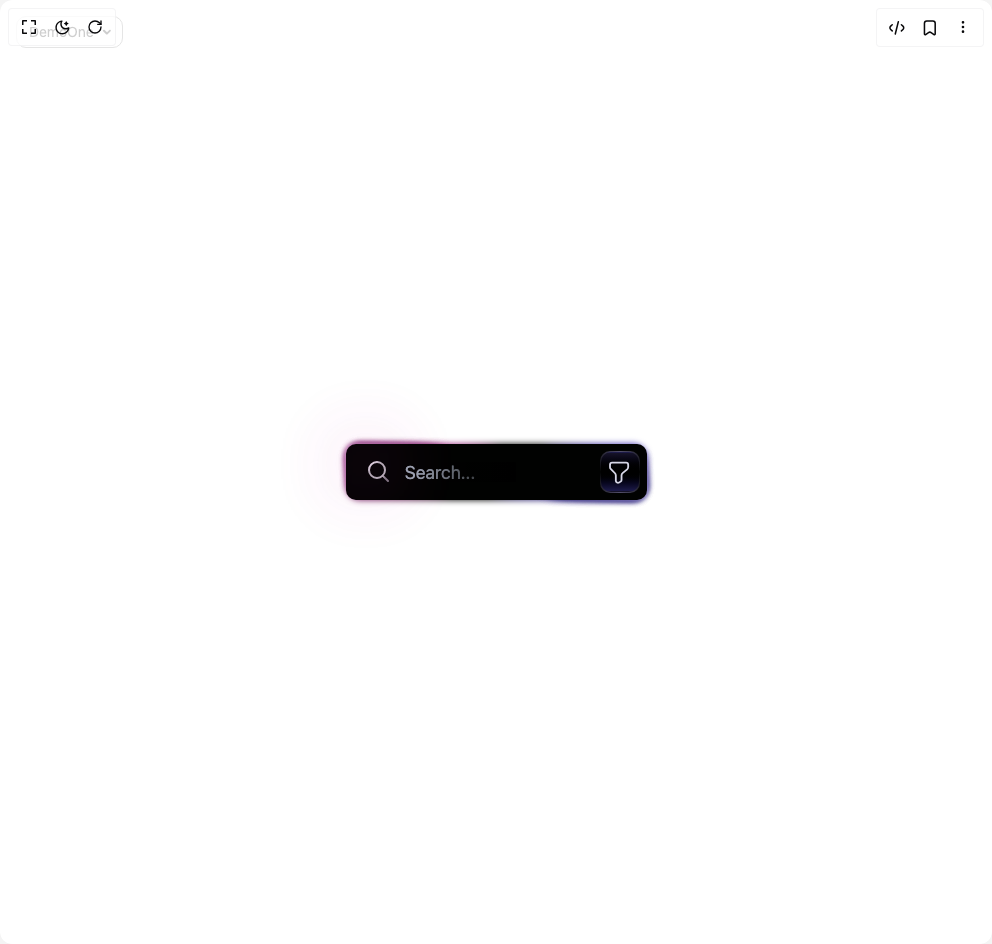

# Build Animated Glowing Search Bar in BuilderStudio

> Build this component in our Agentic IDE: [BuilderStudio](https://builderstudio.dev).
>
> Join the BuilderStudio community on [Discord](https://discord.gg/QdWeSGCqfe) and [Reddit](https://reddit.com/r/builderstudio).



## Component

- Author group: `thanh`
- Component: `animated-glowing-search-bar`
- Variant: `default`
- Rendered HTML snapshot: [`rendered.html`](rendered.html)

## BuilderStudio prompt

You are implementing a React component based on a component reference.

## Component identity

- Author: thanh
- Component slug: animated-glowing-search-bar
- Demo slug: default
- Title: animated-glowing-search-bar
- Description: 

## Goal

Recreate this component in a React + TypeScript + Tailwind CSS project. Preserve the visual layout, spacing, colors, border radius, shadows, interaction behavior, animation behavior, responsive behavior, and dark mode behavior shown in the rendered demo.

## Implementation requirements

- Use React and TypeScript.
- Use Tailwind CSS classes whenever possible.
- Keep the component self-contained unless the source files require helper components.
- If the source uses CSS variables, custom CSS, animations, or keyframes, include them.
- If the source uses external packages, list and use the required packages.
- Preserve accessibility attributes, button semantics, links, keyboard behavior, and ARIA attributes when visible in the source.
- Do not replace the component with a simplified placeholder.
- Return complete production-ready code.

## Dependencies

No reference metadata available.

## Rendered DOM snapshot

This is the rendered demo HTML extracted from the live preview. Use it to verify structure, class names, visible content, and layout.

```html
<div id="root"><div class="fixed top-4 left-4 z-10"><select class="appearance-none h-8 max-w-[200px] text-sm leading-tight rounded-lg pl-3 pr-7 py-0 border bg-background focus:outline-none focus:ring-0"><option value="named_DemoOne_DemoOne">DemoOne</option></select><div class="absolute top-1/2 transform -translate-y-1/2 right-2 pointer-events-none"><svg class="w-4 h-4 fill-current" viewBox="0 0 20 20"><path d="M5.516 7.548c.436-.446 1.043-.48 1.576 0L10 10.405l2.908-2.857c.533-.48 1.14-.446 1.576 0 .436.445.408 1.197 0 1.615l-3.734 3.705c-.533.534-1.39.534-1.923 0l-3.734-3.705c-.408-.418-.436-1.17 0-1.615z"></path></svg></div></div><div class="w-screen min-h-screen flex justify-center items-center"><div class="relative flex items-center justify-center"><div class="absolute z-[-1] w-full h-min-screen"></div><div id="poda" class="relative flex items-center justify-center group"><div class="absolute z-[-1] overflow-hidden h-full w-full max-h-[70px] max-w-[314px] rounded-xl blur-[3px] 
                        before:absolute before:content-[''] before:z-[-2] before:w-[999px] before:h-[999px] before:bg-no-repeat before:top-1/2 before:left-1/2 before:-translate-x-1/2 before:-translate-y-1/2 before:rotate-60
                        before:bg-[conic-gradient(#000,#402fb5_5%,#000_38%,#000_50%,#cf30aa_60%,#000_87%)] before:transition-all before:duration-2000
                        group-hover:before:rotate-[-120deg] group-focus-within:before:rotate-[420deg] group-focus-within:before:duration-[4000ms]"></div><div class="absolute z-[-1] overflow-hidden h-full w-full max-h-[65px] max-w-[312px] rounded-xl blur-[3px] 
                        before:absolute before:content-[''] before:z-[-2] before:w-[600px] before:h-[600px] before:bg-no-repeat before:top-1/2 before:left-1/2 before:-translate-x-1/2 before:-translate-y-1/2 before:rotate-[82deg]
                        before:bg-[conic-gradient(rgba(0,0,0,0),#18116a,rgba(0,0,0,0)_10%,rgba(0,0,0,0)_50%,#6e1b60,rgba(0,0,0,0)_60%)] before:transition-all before:duration-2000
                        group-hover:before:rotate-[-98deg] group-focus-within:before:rotate-[442deg] group-focus-within:before:duration-[4000ms]"></div><div class="absolute z-[-1] overflow-hidden h-full w-full max-h-[65px] max-w-[312px] rounded-xl blur-[3px] 
                        before:absolute before:content-[''] before:z-[-2] before:w-[600px] before:h-[600px] before:bg-no-repeat before:top-1/2 before:left-1/2 before:-translate-x-1/2 before:-translate-y-1/2 before:rotate-[82deg]
                        before:bg-[conic-gradient(rgba(0,0,0,0),#18116a,rgba(0,0,0,0)_10%,rgba(0,0,0,0)_50%,#6e1b60,rgba(0,0,0,0)_60%)] before:transition-all before:duration-2000
                        group-hover:before:rotate-[-98deg] group-focus-within:before:rotate-[442deg] group-focus-within:before:duration-[4000ms]"></div><div class="absolute z-[-1] overflow-hidden h-full w-full max-h-[65px] max-w-[312px] rounded-xl blur-[3px] 
                        before:absolute before:content-[''] before:z-[-2] before:w-[600px] before:h-[600px] before:bg-no-repeat before:top-1/2 before:left-1/2 before:-translate-x-1/2 before:-translate-y-1/2 before:rotate-[82deg]
                        before:bg-[conic-gradient(rgba(0,0,0,0),#18116a,rgba(0,0,0,0)_10%,rgba(0,0,0,0)_50%,#6e1b60,rgba(0,0,0,0)_60%)] before:transition-all before:duration-2000
                        group-hover:before:rotate-[-98deg] group-focus-within:before:rotate-[442deg] group-focus-within:before:duration-[4000ms]"></div><div class="absolute z-[-1] overflow-hidden h-full w-full max-h-[63px] max-w-[307px] rounded-lg blur-[2px] 
                        before:absolute before:content-[''] before:z-[-2] before:w-[600px] before:h-[600px] before:bg-no-repeat before:top-1/2 before:left-1/2 before:-translate-x-1/2 before:-translate-y-1/2 before:rotate-[83deg]
                        before:bg-[conic-gradient(rgba(0,0,0,0)_0%,#a099d8,rgba(0,0,0,0)_8%,rgba(0,0,0,0)_50%,#dfa2da,rgba(0,0,0,0)_58%)] before:brightness-140
                        before:transition-all before:duration-2000 group-hover:before:rotate-[-97deg] group-focus-within:before:rotate-[443deg] group-focus-within:before:duration-[4000ms]"></div><div class="absolute z-[-1] overflow-hidden h-full w-full max-h-[59px] max-w-[303px] rounded-xl blur-[0.5px] 
                        before:absolute before:content-[''] before:z-[-2] before:w-[600px] before:h-[600px] before:bg-no-repeat before:top-1/2 before:left-1/2 before:-translate-x-1/2 before:-translate-y-1/2 before:rotate-70
                        before:bg-[conic-gradient(#1c191c,#402fb5_5%,#1c191c_14%,#1c191c_50%,#cf30aa_60%,#1c191c_64%)] before:brightness-130
                        before:transition-all before:duration-2000 group-hover:before:rotate-[-110deg] group-focus-within:before:rotate-[430deg] group-focus-within:before:duration-[4000ms]"></div><div id="main" class="relative group"><input placeholder="Search..." class="bg-[#010201] border-none w-[301px] h-[56px] rounded-lg text-white px-[59px] text-lg focus:outline-none placeholder-gray-400" type="text" name="text"><div id="input-mask" class="pointer-events-none w-[100px] h-[20px] absolute bg-gradient-to-r from-transparent to-black top-[18px] left-[70px] group-focus-within:hidden"></div><div id="pink-mask" class="pointer-events-none w-[30px] h-[20px] absolute bg-[#cf30aa] top-[10px] left-[5px] blur-2xl opacity-80 transition-all duration-2000 group-hover:opacity-0"></div><div class="absolute h-[42px] w-[40px] overflow-hidden top-[7px] right-[7px] rounded-lg
                          before:absolute before:content-[''] before:w-[600px] before:h-[600px] before:bg-no-repeat before:top-1/2 before:left-1/2 before:-translate-x-1/2 before:-translate-y-1/2 before:rotate-90
                          before:bg-[conic-gradient(rgba(0,0,0,0),#3d3a4f,rgba(0,0,0,0)_50%,rgba(0,0,0,0)_50%,#3d3a4f,rgba(0,0,0,0)_100%)]
                          before:brightness-135 before:animate-spin-slow"></div><div id="filter-icon" class="absolute top-2 right-2 flex items-center justify-center z-[2] max-h-10 max-w-[38px] h-full w-full [isolation:isolate] overflow-hidden rounded-lg bg-gradient-to-b from-[#161329] via-black to-[#1d1b4b] border border-transparent"><svg preserveAspectRatio="none" height="27" width="27" viewBox="4.8 4.56 14.832 15.408" fill="none"><path d="M8.16 6.65002H15.83C16.47 6.65002 16.99 7.17002 16.99 7.81002V9.09002C16.99 9.56002 16.7 10.14 16.41 10.43L13.91 12.64C13.56 12.93 13.33 13.51 13.33 13.98V16.48C13.33 16.83 13.1 17.29 12.81 17.47L12 17.98C11.24 18.45 10.2 17.92 10.2 16.99V13.91C10.2 13.5 9.97 12.98 9.73 12.69L7.52 10.36C7.23 10.08 7 9.55002 7 9.20002V7.87002C7 7.17002 7.52 6.65002 8.16 6.65002Z" stroke="#d6d6e6" stroke-width="1" stroke-miterlimit="10" stroke-linecap="round" stroke-linejoin="round"></path></svg></div><div id="search-icon" class="absolute left-5 top-[15px]"><svg xmlns="http://www.w3.org/2000/svg" width="24" viewBox="0 0 24 24" stroke-width="2" stroke-linejoin="round" stroke-linecap="round" height="24" fill="none" class="feather feather-search"><circle stroke="url(#search)" r="8" cy="11" cx="11"></circle><line stroke="url(#searchl)" y2="16.65" y1="22" x2="16.65" x1="22"></line><defs><linearGradient gradientTransform="rotate(50)" id="search"><stop stop-color="#f8e7f8" offset="0%"></stop><stop stop-color="#b6a9b7" offset="50%"></stop></linearGradient><linearGradient id="searchl"><stop stop-color="#b6a9b7" offset="0%"></stop><stop stop-color="#837484" offset="50%"></stop></linearGradient></defs></svg></div></div></div></div></div></div>
```

## Reference source files

No reference source files were available.
