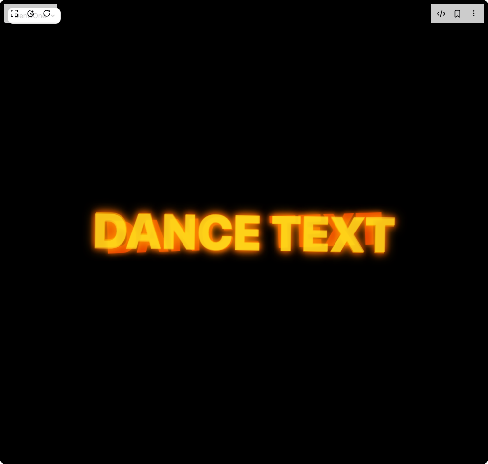

# Build Dance Text Animation in BuilderStudio

> Build this component in our Agentic IDE: [BuilderStudio](https://builderstudio.dev).
>
> Join the BuilderStudio community on [Discord](https://discord.gg/QdWeSGCqfe) and [Reddit](https://reddit.com/r/builderstudio).



## Component

- Author group: `thanh`
- Component: `dance-text-animation`
- Variant: `default`
- Rendered HTML snapshot: [`rendered.html`](rendered.html)

## BuilderStudio prompt

You are implementing a React component based on a component reference.

## Component identity

- Author: thanh
- Component slug: dance-text-animation
- Demo slug: default
- Title: dance-text-animation
- Description: 

## Goal

Recreate this component in a React + TypeScript + Tailwind CSS project. Preserve the visual layout, spacing, colors, border radius, shadows, interaction behavior, animation behavior, responsive behavior, and dark mode behavior shown in the rendered demo.

## Implementation requirements

- Use React and TypeScript.
- Use Tailwind CSS classes whenever possible.
- Keep the component self-contained unless the source files require helper components.
- If the source uses CSS variables, custom CSS, animations, or keyframes, include them.
- If the source uses external packages, list and use the required packages.
- Preserve accessibility attributes, button semantics, links, keyboard behavior, and ARIA attributes when visible in the source.
- Do not replace the component with a simplified placeholder.
- Return complete production-ready code.

## Dependencies

No reference metadata available.

## Rendered DOM snapshot

This is the rendered demo HTML extracted from the live preview. Use it to verify structure, class names, visible content, and layout.

```html
<div id="root"><div class="fixed top-4 left-4 z-10"><select class="appearance-none h-8 max-w-[200px] text-sm leading-tight rounded-lg pl-3 pr-7 py-0 border bg-background focus:outline-none focus:ring-0"><option value="named_DemoOne_DemoOne">DemoOne</option></select><div class="absolute top-1/2 transform -translate-y-1/2 right-2 pointer-events-none"><svg class="w-4 h-4 fill-current" viewBox="0 0 20 20"><path d="M5.516 7.548c.436-.446 1.043-.48 1.576 0L10 10.405l2.908-2.857c.533-.48 1.14-.446 1.576 0 .436.445.408 1.197 0 1.615l-3.734 3.705c-.533.534-1.39.534-1.923 0l-3.734-3.705c-.408-.418-.436-1.17 0-1.615z"></path></svg></div></div><div class="w-screen min-h-screen flex justify-center items-center"><div class="items-center w-full h-screen"><style>
          @keyframes dance {
            0%, 100% { 
              opacity: 1; 
              transform: translate(-50%, -50%) scale(1) rotate(0deg);
              text-shadow: 0 0 10px rgba(255, 69, 0, 0.8), 0 0 20px rgba(255, 140, 0, 0.6); 
            }
            25% { 
              opacity: 0.7; 
              transform: translate(-50%, -50%) scale(1.05) rotate(2deg);
              text-shadow: 0 0 15px rgba(255, 69, 0, 0.9), 0 0 25px rgba(255, 140, 0, 0.7); 
            }
            50% { 
              opacity: 0.9; 
              transform: translate(-50%, -50%) scale(0.95) rotate(-2deg);
              text-shadow: 0 0 8px rgba(255, 69, 0, 0.7), 0 0 15px rgba(255, 140, 0, 0.5); 
            }
            75% { 
              opacity: 0.8; 
              transform: translate(-50%, -50%) scale(1.05) rotate(1deg);
              text-shadow: 0 0 12px rgba(255, 69, 0, 0.8), 0 0 22px rgba(255, 140, 0, 0.6); 
            }
          }

          .dance-animation {
            position: absolute;
            top: 0;
            left: 0;
            width: 100vw;
            height: 100vh;
            display: flex;
            align-items: center;
            justify-content: center;
            overflow: hidden;
            pointer-events: none;
          }

          .dance-layer {
            position: absolute;
            top: 50%;
            left: 50%;
            transform: translate(-50%, -50%);
            font-size: 6rem;
            font-weight: 900;
            mix-blend-mode: screen;
            animation: dance 2s infinite;
            white-space: nowrap;
            will-change: transform, opacity;
          }

          .dance-layer-1 {
            color: #ff4500;
            animation-delay: 0s;
            z-index: 1;
          }

          .dance-layer-2 {
            color: #ff8c00;
            animation-delay: 0.3s;
            animation-duration: 2.2s;
            z-index: 2;
          }

          .dance-layer-3 {
            color: #ffac1c;
            animation-delay: 0.6s;
            animation-duration: 2.4s;
            z-index: 3;
          }
        </style><div class="min-h-screen bg-black relative"><div class="dance-animation"><div class="dance-layer dance-layer-1">DANCE TEXT</div><div class="dance-layer dance-layer-2">DANCE TEXT</div><div class="dance-layer dance-layer-3">DANCE TEXT</div></div></div></div></div></div>
```

## Reference source files

No reference source files were available.
