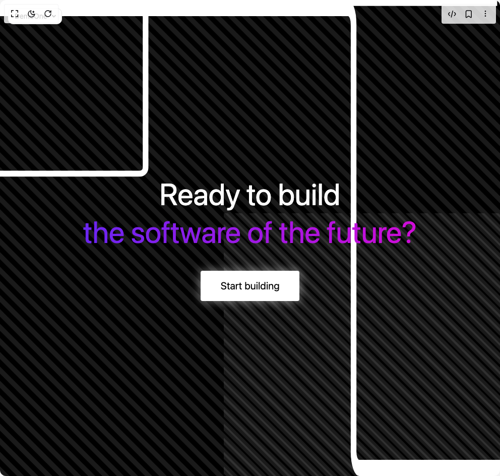

# Build Dynamic Animated Hero Section With Gradient in BuilderStudio

> Build this component in our Agentic IDE: [BuilderStudio](https://builderstudio.dev).
>
> Join the BuilderStudio community on [Discord](https://discord.gg/QdWeSGCqfe) and [Reddit](https://reddit.com/r/builderstudio).



## Component

- Author group: `thanh`
- Component: `dynamic-animated-hero-section-with-gradient`
- Variant: `default`
- Rendered HTML snapshot: [`rendered.html`](rendered.html)

## BuilderStudio prompt

You are implementing a React component based on a component reference.

## Component identity

- Author: thanh
- Component slug: dynamic-animated-hero-section-with-gradient
- Demo slug: default
- Title: dynamic-animated-hero-section-with-gradient
- Description: 

## Goal

Recreate this component in a React + TypeScript + Tailwind CSS project. Preserve the visual layout, spacing, colors, border radius, shadows, interaction behavior, animation behavior, responsive behavior, and dark mode behavior shown in the rendered demo.

## Implementation requirements

- Use React and TypeScript.
- Use Tailwind CSS classes whenever possible.
- Keep the component self-contained unless the source files require helper components.
- If the source uses CSS variables, custom CSS, animations, or keyframes, include them.
- If the source uses external packages, list and use the required packages.
- Preserve accessibility attributes, button semantics, links, keyboard behavior, and ARIA attributes when visible in the source.
- Do not replace the component with a simplified placeholder.
- Return complete production-ready code.

## Dependencies

No reference metadata available.

## Rendered DOM snapshot

This is the rendered demo HTML extracted from the live preview. Use it to verify structure, class names, visible content, and layout.

```html
<div id="root"><div class="fixed top-4 left-4 z-10"><select class="appearance-none h-8 max-w-[200px] text-sm leading-tight rounded-lg pl-3 pr-7 py-0 border bg-background focus:outline-none focus:ring-0"><option value="named_DemoOne_DemoOne">DemoOne</option></select><div class="absolute top-1/2 transform -translate-y-1/2 right-2 pointer-events-none"><svg class="w-4 h-4 fill-current" viewBox="0 0 20 20"><path d="M5.516 7.548c.436-.446 1.043-.48 1.576 0L10 10.405l2.908-2.857c.533-.48 1.14-.446 1.576 0 .436.445.408 1.197 0 1.615l-3.734 3.705c-.533.534-1.39.534-1.923 0l-3.734-3.705c-.408-.418-.436-1.17 0-1.615z"></path></svg></div></div><div class="w-screen min-h-screen flex justify-center items-center"><div class="w-full h-screen"><style>
          @keyframes gradient {
            0% { background-position: 0% 50%; }
            50% { background-position: 100% 50%; }
            100% { background-position: 0% 50%; }
          }
          
          @keyframes fadeIn {
            from { opacity: 0; transform: translateY(20px); }
            to { opacity: 1; transform: translateY(0); }
          }
          
          @keyframes patternScroll {
            0% { transform: translate(-5%, -5%); }
            100% { transform: translate(5%, 5%); }
          }
          
          .animate-fadeIn {
            animation: fadeIn 1s ease-out forwards;
          }
          
          .animate-patternScroll {
            animation: patternScroll 20s linear infinite;
          }
          
          .gradient-text {
            background: linear-gradient(270deg, #ff00cc, #3333ff, #00ffcc, #ff00cc);
            background-size: 600% 600%;
            -webkit-background-clip: text;
            -webkit-text-fill-color: transparent;
            animation: gradient 15s ease infinite;
          }
          
          .animation-line {
            fill: none;
            stroke: white;
            stroke-width: 2;
          }
          
          /* Pulse animation for the button */
          @keyframes pulse {
            0% { box-shadow: 0 0 5px rgba(255, 255, 255, 0.3); }
            50% { box-shadow: 0 0 20px rgba(255, 255, 255, 0.5); }
            100% { box-shadow: 0 0 5px rgba(255, 255, 255, 0.3); }
          }
          
          .pulse-animation {
            animation: pulse 2s infinite;
          }
        </style><div class="min-h-screen flex items-center justify-center bg-black text-white font-sans overflow-hidden relative"><div class="container text-center z-10 relative p-10 animate-fadeIn"><h1 class="text-6xl leading-tight m-0 relative z-20">Ready to build<br><span class="gradient-text inline-block relative z-10">the software of the future?</span></h1><button class="mt-10 px-10 py-4 bg-white text-black border-none rounded cursor-pointer text-xl transition-all duration-300 ease-in-out hover:shadow-[0_0_20px_rgba(255,255,255,0.5)] hover:translate-y-[-2px] shadow-[0_0_10px_rgba(255,255,255,0.2)] hover:scale-105 pulse-animation">Start building</button></div><div class="line-group absolute top-0 left-0 w-full h-full overflow-hidden z-0"><svg class="line-wrapper absolute w-full h-full" viewBox="0 0 177 159" preserveAspectRatio="none"><path id="main-line" class="animation-line" d="M176 1L53.5359 1C52.4313 1 51.5359 1.89543 51.5359 3L51.5359 56C51.5359 57.1046 50.6405 58 49.5359 58L0 58" style="stroke-dasharray: 231.284px; stroke-dashoffset: 0px; transition: stroke-dashoffset 2s ease-in-out;"></path></svg><svg class="line-wrapper absolute w-full h-full" viewBox="0 0 176 59" preserveAspectRatio="none"><path class="animation-line" d="M0 1L122.464 1C123.569 1 124.464 1.89543 124.464 3L124.464 56C124.464 57.1046 125.36 58 126.464 58L176 58" style="stroke-dasharray: 231.284px; stroke-dashoffset: 0px; transition: stroke-dashoffset 2s ease-in-out;"></path></svg></div><div class="pattern absolute w-[200%] h-[200%] bg-[repeating-linear-gradient(45deg,transparent,transparent_10px,rgba(255,255,255,0.1)_10px,rgba(255,255,255,0.1)_20px)] animate-patternScroll" style="top: -50%; left: -50%;"></div><div class="pattern absolute w-[200%] h-[200%] bg-[repeating-linear-gradient(45deg,transparent,transparent_10px,rgba(255,255,255,0.1)_10px,rgba(255,255,255,0.1)_20px)] animate-patternScroll" style="top: 50%; left: 50%;"></div></div></div></div></div>
```

## Reference source files

No reference source files were available.
