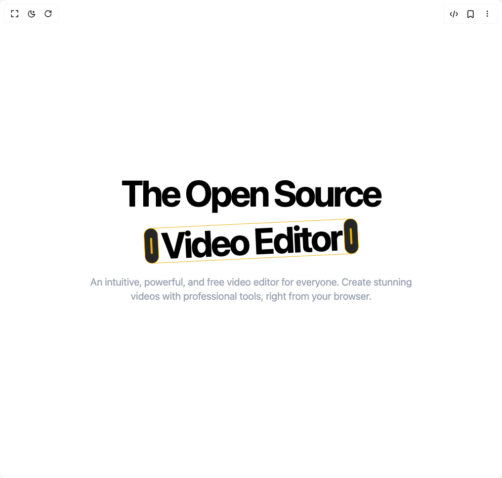

# Build Dynamic Text Slider in BuilderStudio

> Build this component in our Agentic IDE: [BuilderStudio](https://builderstudio.dev).
>
> Join the BuilderStudio community on [Discord](https://discord.gg/QdWeSGCqfe) and [Reddit](https://reddit.com/r/builderstudio).



## Component

- Author group: `thanh`
- Component: `dynamic-text-slider`
- Variant: `default`
- Rendered HTML snapshot: [`rendered.html`](rendered.html)

## BuilderStudio prompt

You are implementing a React component based on a component reference.

## Component identity

- Author: thanh
- Component slug: dynamic-text-slider
- Demo slug: default
- Title: dynamic-text-slider
- Description: 

## Goal

Recreate this component in a React + TypeScript + Tailwind CSS project. Preserve the visual layout, spacing, colors, border radius, shadows, interaction behavior, animation behavior, responsive behavior, and dark mode behavior shown in the rendered demo.

## Implementation requirements

- Use React and TypeScript.
- Use Tailwind CSS classes whenever possible.
- Keep the component self-contained unless the source files require helper components.
- If the source uses CSS variables, custom CSS, animations, or keyframes, include them.
- If the source uses external packages, list and use the required packages.
- Preserve accessibility attributes, button semantics, links, keyboard behavior, and ARIA attributes when visible in the source.
- Do not replace the component with a simplified placeholder.
- Return complete production-ready code.

## Dependencies

No reference metadata available.

## Rendered DOM snapshot

This is the rendered demo HTML extracted from the live preview. Use it to verify structure, class names, visible content, and layout.

```html
<div id="root"><div class="w-screen min-h-screen flex justify-center items-center"><div class="w-screen min-h-screen flex justify-center items-center"><div class="w-full min-h-screen bg-white dark:bg-black text-white flex flex-col items-center justify-center text-center p-4 font-sans"><div class="max-w-5xl"><h1 class="font-bold tracking-tighter text-5xl text-black dark:text-white md:text-7xl">The Open Source</h1><span class="absolute -left-[9999px] px-4 whitespace-nowrap font-bold tracking-tighter text-5xl text-black dark:text-white md:text-7xl">Video Editor</span><div class="flex justify-center gap-4 mt-4 md:mt-6"><div class="relative select-none transition-transform duration-300 ease-out" style="width: 423px; height: 70px; transform: rotate(-2.76deg);"><div class="absolute inset-0 rounded-2xl border border-yellow-500 pointer-events-none"></div><button type="button" aria-label="Adjust start" class="z-20 absolute top-0 h-full w-7 rounded-full bg-[#262626] border border-yellow-500 flex items-center justify-center cursor-ew-resize focus:outline-none focus:ring-2 focus:ring-yellow-400 transition-transform duration-150 ease-in-out opacity-100 hover:scale-110" style="left: 0px; touch-action: none;"><span class="w-1 h-8 rounded-full bg-yellow-500"></span></button><button type="button" aria-label="Adjust end" class="z-20 absolute top-0 h-full w-7 rounded-full bg-[#262626] border border-yellow-500 flex items-center justify-center cursor-ew-resize focus:outline-none focus:ring-2 focus:ring-yellow-400 transition-transform duration-150 ease-in-out opacity-100 hover:scale-110" style="left: 395px; touch-action: none;"><span class="w-1 h-8 rounded-full bg-yellow-500"></span></button><div class="flex z-10 items-center justify-center w-full h-full px-4 overflow-hidden pointer-events-none font-bold tracking-tighter text-5xl text-black dark:text-white md:text-7xl" style="clip-path: inset(0px round 1rem);">Video Editor</div></div></div><p class="mt-8 text-lg md:text-xl max-w-2xl mx-auto text-gray-400">An intuitive, powerful, and free video editor for everyone. Create stunning videos with professional tools, right from your browser.</p></div></div></div></div></div>
```

## Reference source files

No reference source files were available.
