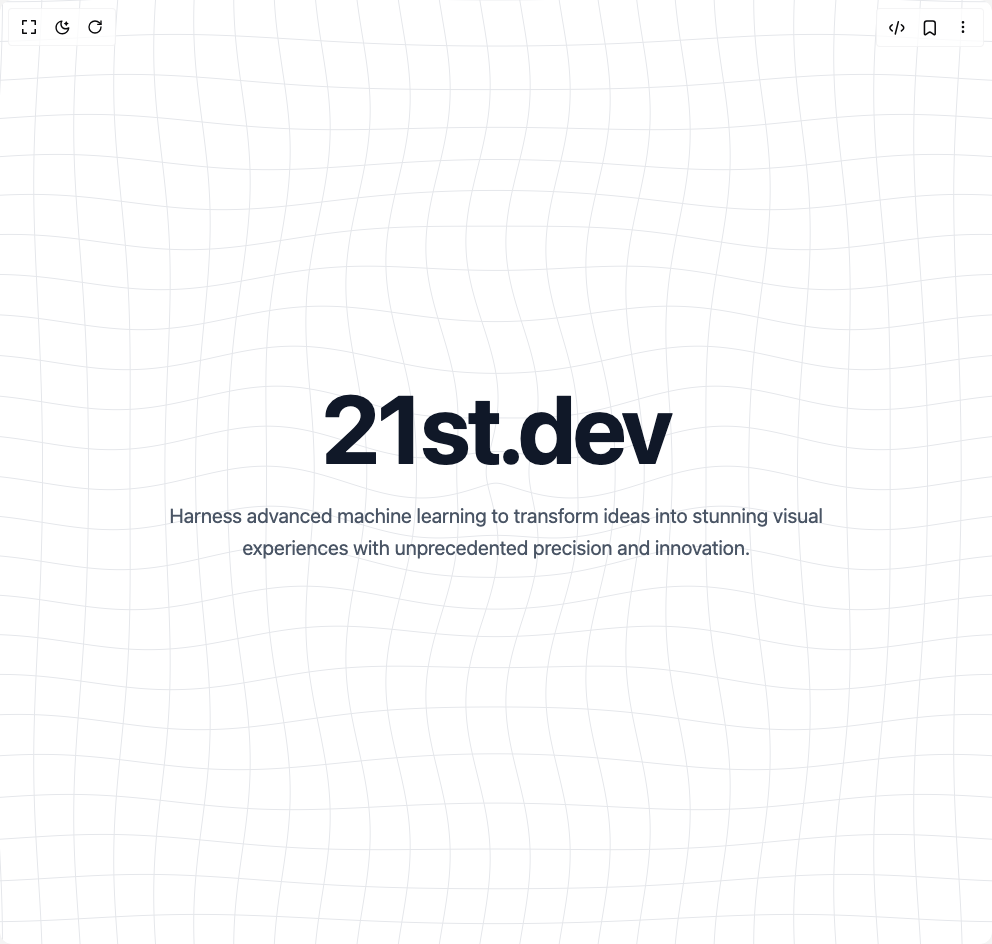

# Build Grid Hero Animated in BuilderStudio

> Build this component in our Agentic IDE: [BuilderStudio](https://builderstudio.dev).
>
> Join the BuilderStudio community on [Discord](https://discord.gg/QdWeSGCqfe) and [Reddit](https://reddit.com/r/builderstudio).



## Component

- Author group: `thanh`
- Component: `grid-hero-animated`
- Variant: `default`
- Rendered HTML snapshot: [`rendered.html`](rendered.html)

## BuilderStudio prompt

You are implementing a React component based on a component reference.

## Component identity

- Author: thanh
- Component slug: grid-hero-animated
- Demo slug: default
- Title: grid-hero-animated
- Description: 

## Goal

Recreate this component in a React + TypeScript + Tailwind CSS project. Preserve the visual layout, spacing, colors, border radius, shadows, interaction behavior, animation behavior, responsive behavior, and dark mode behavior shown in the rendered demo.

## Implementation requirements

- Use React and TypeScript.
- Use Tailwind CSS classes whenever possible.
- Keep the component self-contained unless the source files require helper components.
- If the source uses CSS variables, custom CSS, animations, or keyframes, include them.
- If the source uses external packages, list and use the required packages.
- Preserve accessibility attributes, button semantics, links, keyboard behavior, and ARIA attributes when visible in the source.
- Do not replace the component with a simplified placeholder.
- Return complete production-ready code.

## Dependencies

No reference metadata available.

## Rendered DOM snapshot

This is the rendered demo HTML extracted from the live preview. Use it to verify structure, class names, visible content, and layout.

```html
<div id="root"><div class="w-screen min-h-screen flex justify-center items-center"><div class="w-screen min-h-screen flex justify-center items-center"><div class="relative w-full h-screen bg-white dark:bg-black flex items-center justify-center overflow-hidden"><canvas class="absolute inset-0 w-full h-full" width="992" height="944" style="width: 100%; height: 100%;"></canvas><div class="relative z-10 text-center max-w-4xl px-6"><h1 class="text-6xl md:text-8xl lg:text-9xl font-bold text-gray-900 dark:text-white tracking-tight mb-6">BuilderStudio</h1><p class="text-lg md:text-xl text-gray-600 dark:text-gray-300 leading-relaxed max-w-2xl mx-auto">Harness advanced machine learning to transform ideas into stunning visual experiences with unprecedented precision and innovation.</p></div></div></div></div></div>
```

## Reference source files

No reference source files were available.
