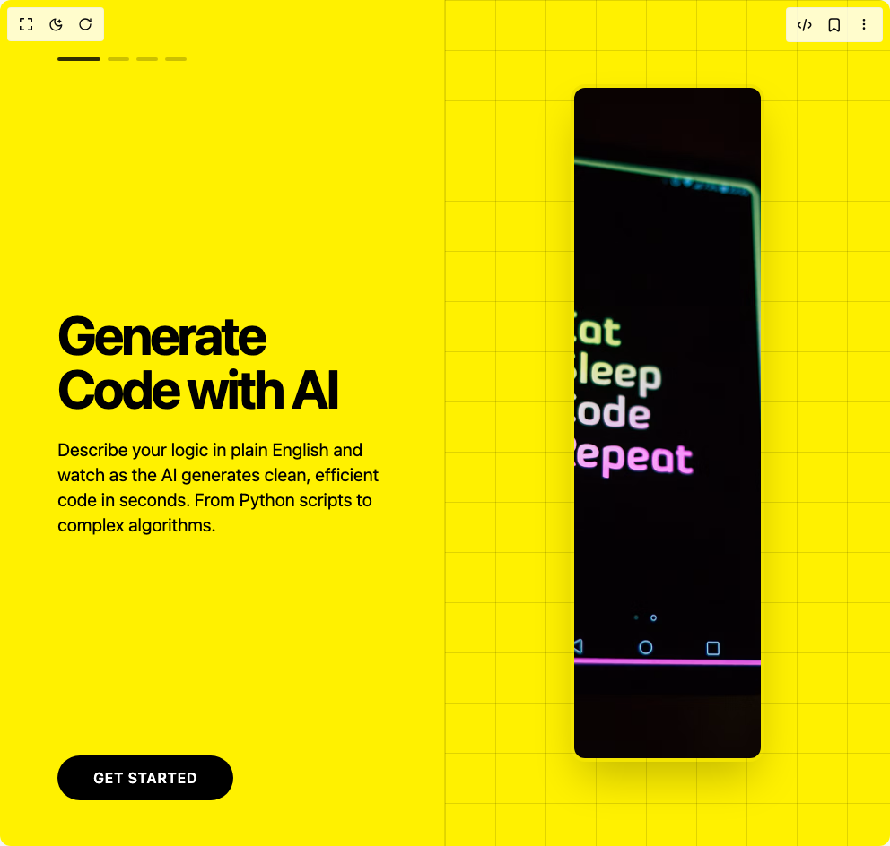

# Build Interactive Scrolling Story Component in BuilderStudio

> Build this component in our Agentic IDE: [BuilderStudio](https://builderstudio.dev).
>
> Join the BuilderStudio community on [Discord](https://discord.gg/QdWeSGCqfe) and [Reddit](https://reddit.com/r/builderstudio).



## Component

- Author group: `thanh`
- Component: `interactive-scrolling-story-component`
- Variant: `default`
- Rendered HTML snapshot: [`rendered.html`](rendered.html)

## BuilderStudio prompt

You are implementing a React component based on a component reference.

## Component identity

- Author: thanh
- Component slug: interactive-scrolling-story-component
- Demo slug: default
- Title: interactive-scrolling-story-component
- Description: 

## Goal

Recreate this component in a React + TypeScript + Tailwind CSS project. Preserve the visual layout, spacing, colors, border radius, shadows, interaction behavior, animation behavior, responsive behavior, and dark mode behavior shown in the rendered demo.

## Implementation requirements

- Use React and TypeScript.
- Use Tailwind CSS classes whenever possible.
- Keep the component self-contained unless the source files require helper components.
- If the source uses CSS variables, custom CSS, animations, or keyframes, include them.
- If the source uses external packages, list and use the required packages.
- Preserve accessibility attributes, button semantics, links, keyboard behavior, and ARIA attributes when visible in the source.
- Do not replace the component with a simplified placeholder.
- Return complete production-ready code.

## Dependencies

No reference metadata available.

## Rendered DOM snapshot

This is the rendered demo HTML extracted from the live preview. Use it to verify structure, class names, visible content, and layout.

```html
<div id="root"><div class="w-screen min-h-screen flex justify-center items-center"><div class="w-screen min-h-screen flex justify-center items-center"><div class="h-screen w-full overflow-y-auto" style="scrollbar-width: none;"><div style="height: 400vh;"><div class="sticky top-0 h-screen w-full flex flex-col items-center justify-center" style="background-color: rgb(255, 241, 0); color: rgb(0, 0, 0); transition: background-color 0.7s, color 0.7s;"><div class="grid grid-cols-1 md:grid-cols-2 h-full w-full max-w-7xl mx-auto"><div class="relative flex flex-col justify-center p-8 md:p-16 border-r border-black/10"><div class="absolute top-16 left-16 flex space-x-2"><button class="h-1 rounded-full transition-all duration-500 ease-in-out w-12 bg-black/80" aria-label="Go to slide 1"></button><button class="h-1 rounded-full transition-all duration-500 ease-in-out w-6 bg-black/20" aria-label="Go to slide 2"></button><button class="h-1 rounded-full transition-all duration-500 ease-in-out w-6 bg-black/20" aria-label="Go to slide 3"></button><button class="h-1 rounded-full transition-all duration-500 ease-in-out w-6 bg-black/20" aria-label="Go to slide 4"></button></div><div class="relative h-64 w-full"><div class="absolute inset-0 transition-all duration-700 ease-in-out opacity-100 translate-y-0"><h2 class="text-5xl md:text-6xl font-bold tracking-tighter">Generate Code with AI</h2><p class="mt-6 text-lg md:text-xl max-w-md">Describe your logic in plain English and watch as the AI generates clean, efficient code in seconds. From Python scripts to complex algorithms.</p></div><div class="absolute inset-0 transition-all duration-700 ease-in-out opacity-0 translate-y-10"><h2 class="text-5xl md:text-6xl font-bold tracking-tighter">Debug and Refactor Smarter</h2><p class="mt-6 text-lg md:text-xl max-w-md">Paste your buggy code and let the AI identify errors, suggest improvements, and refactor for better readability and performance.</p></div><div class="absolute inset-0 transition-all duration-700 ease-in-out opacity-0 translate-y-10"><h2 class="text-5xl md:text-6xl font-bold tracking-tighter">Learn New Languages, Instantly</h2><p class="mt-6 text-lg md:text-xl max-w-md">Translate code snippets between languages. Understand syntax and paradigms of a new language by seeing familiar code transformed.</p></div><div class="absolute inset-0 transition-all duration-700 ease-in-out opacity-0 translate-y-10"><h2 class="text-5xl md:text-6xl font-bold tracking-tighter">Automate Your Workflow</h2><p class="mt-6 text-lg md:text-xl max-w-md">From writing documentation to generating unit tests, let AI handle the repetitive tasks so you can focus on building great things.</p></div></div><div class="absolute bottom-16 left-16"><a href="#get-started" class="px-10 py-4 bg-black text-white font-semibold rounded-full uppercase tracking-wider hover:bg-gray-800 transition-colors">Get Started</a></div></div><div class="hidden md:flex items-center justify-center p-8" style="--grid-color: rgba(0, 0, 0, 0.12); background-image: linear-gradient(to right, var(--grid-color) 1px, transparent 1px),
      linear-gradient(to bottom, var(--grid-color) 1px, transparent 1px); background-size: 3.5rem 3.5rem;"><div class="relative w-[50%] h-[80vh] rounded-2xl overflow-hidden shadow-2xl border-4 border-black/5"><div class="absolute top-0 left-0 w-full h-full transition-transform duration-700 ease-in-out" style="transform: translateY(0%);"><div class="w-full h-full"></div><div class="w-full h-full"></div><div class="w-full h-full"></div><div class="w-full h-full"></div></div></div></div></div></div></div></div></div></div></div>
```

## Reference source files

No reference source files were available.
