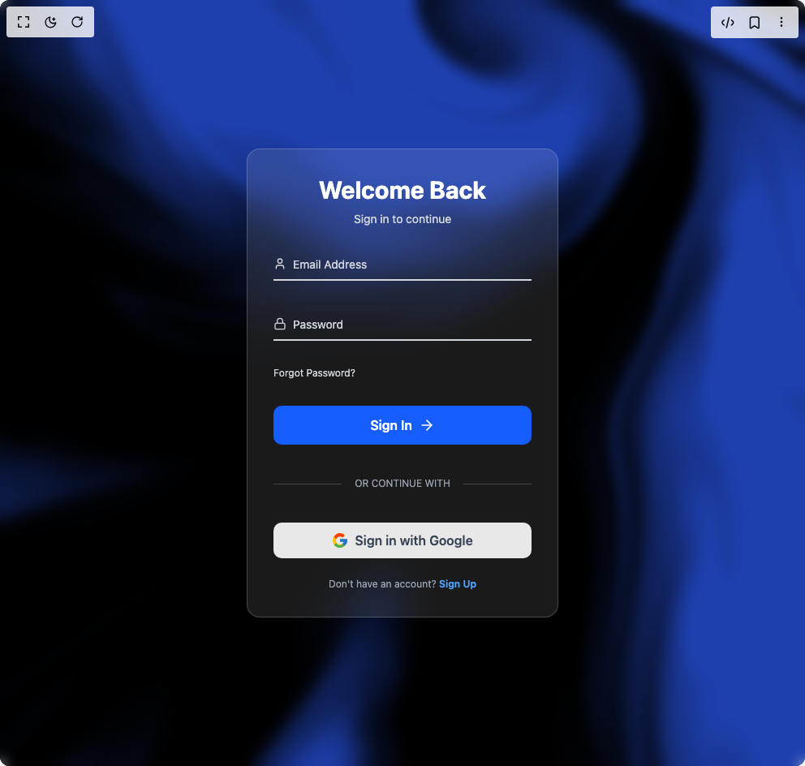

# Build Login Form in BuilderStudio

> Build this component in our Agentic IDE: [BuilderStudio](https://builderstudio.dev).
>
> Join the BuilderStudio community on [Discord](https://discord.gg/QdWeSGCqfe) and [Reddit](https://reddit.com/r/builderstudio).



## Component

- Author group: `thanh`
- Component: `login-form`
- Variant: `default`
- Rendered HTML snapshot: [`rendered.html`](rendered.html)

## BuilderStudio prompt

You are implementing a React component based on a component reference.

## Component identity

- Author: thanh
- Component slug: login-form
- Demo slug: default
- Title: login-form
- Description: 

## Goal

Recreate this component in a React + TypeScript + Tailwind CSS project. Preserve the visual layout, spacing, colors, border radius, shadows, interaction behavior, animation behavior, responsive behavior, and dark mode behavior shown in the rendered demo.

## Implementation requirements

- Use React and TypeScript.
- Use Tailwind CSS classes whenever possible.
- Keep the component self-contained unless the source files require helper components.
- If the source uses CSS variables, custom CSS, animations, or keyframes, include them.
- If the source uses external packages, list and use the required packages.
- Preserve accessibility attributes, button semantics, links, keyboard behavior, and ARIA attributes when visible in the source.
- Do not replace the component with a simplified placeholder.
- Return complete production-ready code.

## Dependencies

No reference metadata available.

## Rendered DOM snapshot

This is the rendered demo HTML extracted from the live preview. Use it to verify structure, class names, visible content, and layout.

```html
<div id="root"><div class="w-screen min-h-screen flex justify-center items-center"><div class="w-screen min-h-screen flex justify-center items-center"><main class="relative w-screen h-screen bg-gray-900"><div class="absolute inset-0 w-full h-full overflow-hidden absolute inset-0"><canvas class="w-full h-full" width="992" height="944"></canvas><div class="absolute inset-0 backdrop-blur-sm"></div></div><div class="relative z-10 flex items-center justify-center w-full h-full p-4"><div class="w-full max-w-sm p-8 space-y-6 bg-white/10 backdrop-blur-lg rounded-2xl border border-white/20 shadow-2xl"><div class="text-center"><h2 class="text-3xl font-bold text-white">Welcome Back</h2><p class="mt-2 text-sm text-gray-300">Sign in to continue</p></div><form class="space-y-8"><div class="relative z-0"><input id="floating_email" class="block py-2.5 px-0 w-full text-sm text-white bg-transparent border-0 border-b-2 border-gray-300 appearance-none focus:outline-none focus:ring-0 focus:border-blue-500 peer" placeholder=" " required="" type="email"><label for="floating_email" class="absolute text-sm text-gray-300 duration-300 transform -translate-y-6 scale-75 top-3 -z-10 origin-[0] peer-focus:left-0 peer-focus:text-blue-400 peer-placeholder-shown:scale-100 peer-placeholder-shown:translate-y-0 peer-focus:scale-75 peer-focus:-translate-y-6"><svg xmlns="http://www.w3.org/2000/svg" width="16" height="16" viewBox="0 0 24 24" fill="none" stroke="currentColor" stroke-width="2" stroke-linecap="round" stroke-linejoin="round" class="lucide lucide-user inline-block mr-2 -mt-1" aria-hidden="true"><path d="M19 21v-2a4 4 0 0 0-4-4H9a4 4 0 0 0-4 4v2"></path><circle cx="12" cy="7" r="4"></circle></svg>Email Address</label></div><div class="relative z-0"><input id="floating_password" class="block py-2.5 px-0 w-full text-sm text-white bg-transparent border-0 border-b-2 border-gray-300 appearance-none focus:outline-none focus:ring-0 focus:border-blue-500 peer" placeholder=" " required="" type="password"><label for="floating_password" class="absolute text-sm text-gray-300 duration-300 transform -translate-y-6 scale-75 top-3 -z-10 origin-[0] peer-focus:left-0 peer-focus:text-blue-400 peer-placeholder-shown:scale-100 peer-placeholder-shown:translate-y-0 peer-focus:scale-75 peer-focus:-translate-y-6"><svg xmlns="http://www.w3.org/2000/svg" width="16" height="16" viewBox="0 0 24 24" fill="none" stroke="currentColor" stroke-width="2" stroke-linecap="round" stroke-linejoin="round" class="lucide lucide-lock inline-block mr-2 -mt-1" aria-hidden="true"><rect width="18" height="11" x="3" y="11" rx="2" ry="2"></rect><path d="M7 11V7a5 5 0 0 1 10 0v4"></path></svg>Password</label></div><div class="flex items-center justify-between"><a href="#" class="text-xs text-gray-300 hover:text-white transition">Forgot Password?</a></div><button type="submit" class="group w-full flex items-center justify-center py-3 px-4 bg-blue-600 hover:bg-blue-700 rounded-lg text-white font-semibold focus:outline-none focus:ring-2 focus:ring-offset-2 focus:ring-offset-gray-900 focus:ring-blue-500 transition-all duration-300">Sign In<svg xmlns="http://www.w3.org/2000/svg" width="24" height="24" viewBox="0 0 24 24" fill="none" stroke="currentColor" stroke-width="2" stroke-linecap="round" stroke-linejoin="round" class="lucide lucide-arrow-right ml-2 h-5 w-5 transform group-hover:translate-x-1 transition-transform" aria-hidden="true"><path d="M5 12h14"></path><path d="m12 5 7 7-7 7"></path></svg></button><div class="relative flex py-2 items-center"><div class="flex-grow border-t border-gray-400/30"></div><span class="flex-shrink mx-4 text-gray-400 text-xs">OR CONTINUE WITH</span><div class="flex-grow border-t border-gray-400/30"></div></div><button type="button" class="w-full flex items-center justify-center py-2.5 px-4 bg-white/90 hover:bg-white rounded-lg text-gray-700 font-semibold focus:outline-none focus:ring-2 focus:ring-offset-2 focus:ring-offset-gray-900 focus:ring-blue-500 transition-all duration-300"><svg class="w-5 h-5 mr-2" viewBox="0 0 48 48"><path fill="#FFC107" d="M43.611 20.083H42V20H24v8h11.303c-1.649 4.657-6.08 8-11.303 8c-6.627 0-12-5.373-12-12s5.373-12 12-12c3.059 0 5.842 1.154 7.961 3.039L38.802 8.841C34.553 4.806 29.613 2.5 24 2.5C11.983 2.5 2.5 11.983 2.5 24s9.483 21.5 21.5 21.5S45.5 36.017 45.5 24c0-1.538-.135-3.022-.389-4.417z"></path><path fill="#FF3D00" d="M6.306 14.691l6.571 4.819C14.655 15.108 18.961 12.5 24 12.5c3.059 0 5.842 1.154 7.961 3.039l5.839-5.841C34.553 4.806 29.613 2.5 24 2.5C16.318 2.5 9.642 6.723 6.306 14.691z"></path><path fill="#4CAF50" d="M24 45.5c5.613 0 10.553-2.306 14.802-6.341l-5.839-5.841C30.842 35.846 27.059 38 24 38c-5.039 0-9.345-2.608-11.124-6.481l-6.571 4.819C9.642 41.277 16.318 45.5 24 45.5z"></path><path fill="#1976D2" d="M43.611 20.083H42V20H24v8h11.303c-.792 2.237-2.231 4.166-4.087 5.571l5.839 5.841C44.196 35.123 45.5 29.837 45.5 24c0-1.538-.135-3.022-.389-4.417z"></path></svg>Sign in with Google</button></form><p class="text-center text-xs text-gray-400">Don't have an account? <a href="#" class="font-semibold text-blue-400 hover:text-blue-300 transition">Sign Up</a></p></div></div></main></div></div></div>
```

## Reference source files

No reference source files were available.
