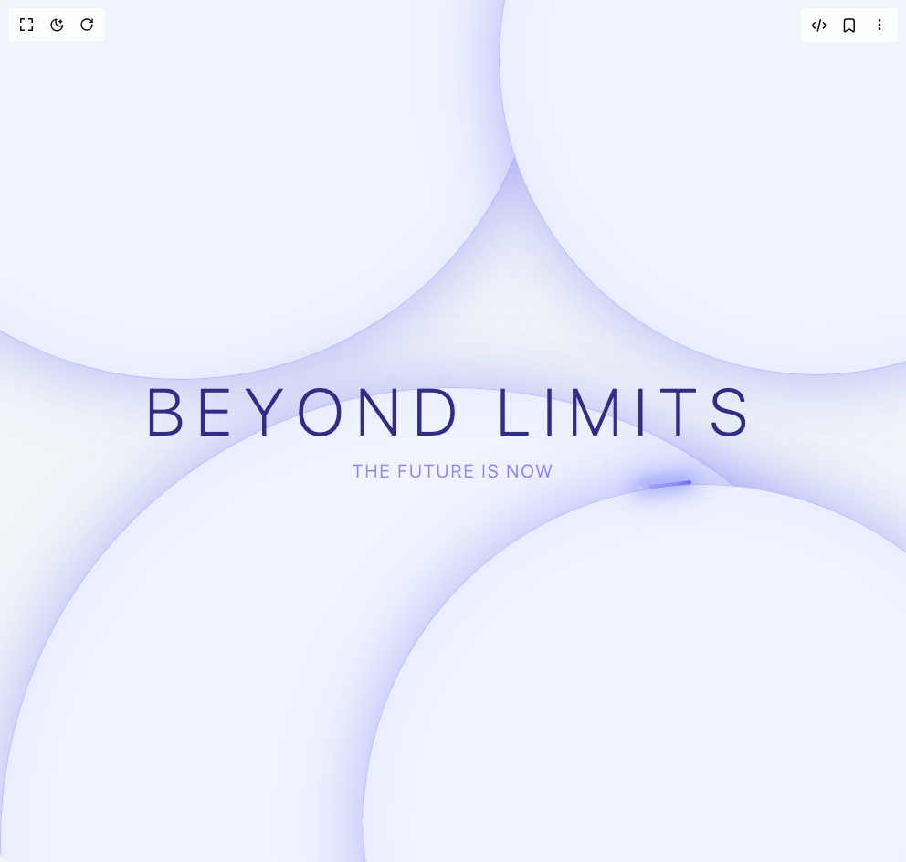

# Build Neon Orbs in BuilderStudio

> Build this component in our Agentic IDE: [BuilderStudio](https://builderstudio.dev).
>
> Join the BuilderStudio community on [Discord](https://discord.gg/QdWeSGCqfe) and [Reddit](https://reddit.com/r/builderstudio).



## Component

- Author group: `thanh`
- Component: `neon-orbs`
- Variant: `default`
- Rendered HTML snapshot: [`rendered.html`](rendered.html)

## BuilderStudio prompt

You are implementing a React component based on a component reference.

## Component identity

- Author: thanh
- Component slug: neon-orbs
- Demo slug: default
- Title: neon-orbs
- Description: 

## Goal

Recreate this component in a React + TypeScript + Tailwind CSS project. Preserve the visual layout, spacing, colors, border radius, shadows, interaction behavior, animation behavior, responsive behavior, and dark mode behavior shown in the rendered demo.

## Implementation requirements

- Use React and TypeScript.
- Use Tailwind CSS classes whenever possible.
- Keep the component self-contained unless the source files require helper components.
- If the source uses CSS variables, custom CSS, animations, or keyframes, include them.
- If the source uses external packages, list and use the required packages.
- Preserve accessibility attributes, button semantics, links, keyboard behavior, and ARIA attributes when visible in the source.
- Do not replace the component with a simplified placeholder.
- Return complete production-ready code.

## Dependencies

No reference metadata available.

## Rendered DOM snapshot

This is the rendered demo HTML extracted from the live preview. Use it to verify structure, class names, visible content, and layout.

```html
<div id="root"><div class="w-screen min-h-screen flex justify-center items-center"><div class="w-screen min-h-screen flex justify-center items-center"><div class="relative w-full h-screen overflow-hidden flex items-center justify-center bg-slate-100 dark:bg-[#050a18] transition-colors duration-500"><div class="absolute transition-all duration-1000 ease-out opacity-100 translate-y-0" style="top: -40%; left: -20%; width: 80vw; height: 80vw; max-width: 800px; max-height: 800px;"><div class="w-full h-full rounded-full relative orb-light transition-all duration-500"><div class="beam-container beam-spin-8"><div class="beam-light"></div></div></div></div><div class="absolute transition-all duration-1000 ease-out delay-300 opacity-100 translate-y-0" style="bottom: -50%; left: 50%; transform: translateX(-50%); width: 100vw; height: 100vw; max-width: 1000px; max-height: 1000px;"><div class="w-full h-full rounded-full relative orb-light transition-all duration-500"><div class="beam-container beam-spin-10-reverse"><div class="beam-light"></div></div></div></div><div class="absolute transition-all duration-1000 ease-out delay-500 opacity-100 translate-x-0" style="top: -30%; right: -25%; width: 70vw; height: 70vw; max-width: 700px; max-height: 700px;"><div class="w-full h-full rounded-full relative orb-light transition-all duration-500"><div class="beam-container beam-spin-6"><div class="beam-light"></div></div></div></div><div class="absolute transition-all duration-1000 ease-out delay-700 opacity-100 translate-y-0" style="bottom: -35%; right: -15%; width: 75vw; height: 75vw; max-width: 750px; max-height: 750px;"><div class="w-full h-full rounded-full relative orb-light transition-all duration-500"><div class="beam-container beam-spin-7-reverse"><div class="beam-light"></div></div></div></div><div class="relative z-10 text-center text-indigo-900 dark:text-white transition-colors duration-500"><h1 class="text-4xl md:text-7xl font-extralight tracking-[0.2em] mb-4 transition-all duration-1000 ease-out opacity-100 translate-y-0 blur-0" style="transition-delay: 500ms;"><span class="inline-block transition-all duration-500 opacity-100 translate-y-0" style="transition-delay: 800ms;">B</span><span class="inline-block transition-all duration-500 opacity-100 translate-y-0" style="transition-delay: 850ms;">E</span><span class="inline-block transition-all duration-500 opacity-100 translate-y-0" style="transition-delay: 900ms;">Y</span><span class="inline-block transition-all duration-500 opacity-100 translate-y-0" style="transition-delay: 950ms;">O</span><span class="inline-block transition-all duration-500 opacity-100 translate-y-0" style="transition-delay: 1000ms;">N</span><span class="inline-block transition-all duration-500 opacity-100 translate-y-0" style="transition-delay: 1050ms;">D</span><span class="inline-block transition-all duration-500 opacity-100 translate-y-0" style="transition-delay: 1100ms;">&nbsp;</span><span class="inline-block transition-all duration-500 opacity-100 translate-y-0" style="transition-delay: 1150ms;">L</span><span class="inline-block transition-all duration-500 opacity-100 translate-y-0" style="transition-delay: 1200ms;">I</span><span class="inline-block transition-all duration-500 opacity-100 translate-y-0" style="transition-delay: 1250ms;">M</span><span class="inline-block transition-all duration-500 opacity-100 translate-y-0" style="transition-delay: 1300ms;">I</span><span class="inline-block transition-all duration-500 opacity-100 translate-y-0" style="transition-delay: 1350ms;">T</span><span class="inline-block transition-all duration-500 opacity-100 translate-y-0" style="transition-delay: 1400ms;">S</span></h1><p class="text-lg md:text-xl font-light tracking-widest text-indigo-600/60 dark:text-white/60 transition-all duration-1000 ease-out opacity-100 translate-y-0 blur-0" style="transition-delay: 1500ms;">THE FUTURE IS NOW</p></div><style>
        .beam-container {
          position: absolute;
          inset: -2px;
          border-radius: 50%;
          will-change: transform;
        }
        
        .beam-light {
          position: absolute;
          top: 0;
          left: 50%;
          width: 60px;
          height: 4px;
          margin-left: -30px;
          border-radius: 2px;
          transform: translateY(-50%);
          transition: all 0.5s;
          background: linear-gradient(90deg, transparent 0%, rgba(99, 102, 241, 0.5) 30%, rgba(129, 140, 248, 0.9) 70%, rgba(99, 102, 241, 1) 100%);
          box-shadow: 0 0 20px 4px rgba(99, 102, 241, 0.6), 0 0 40px 8px rgba(129, 140, 248, 0.3);
        }
        
        .dark .beam-light {
          background: linear-gradient(90deg, transparent 0%, rgba(59, 130, 246, 0.5) 30%, rgba(150, 200, 255, 0.9) 70%, white 100%);
          box-shadow: 0 0 20px 4px rgba(100, 180, 255, 0.8), 0 0 40px 8px rgba(59, 130, 246, 0.4);
        }
        
        .orb-light {
          background: radial-gradient(circle at 50% 50%, #f0f4ff 0%, #f0f4ff 90%, transparent 100%);
          box-shadow: 
            0 0 60px 2px rgba(99, 102, 241, 0.3),
            0 0 100px 5px rgba(99, 102, 241, 0.15),
            inset 0 0 60px 2px rgba(99, 102, 241, 0.08);
          border: 1px solid rgba(99, 102, 241, 0.4);
        }
        
        .dark .orb-light {
          background: radial-gradient(circle at 50% 50%, #050a18 0%, #050a18 90%, transparent 100%);
          box-shadow: 
            0 0 60px 2px rgba(59, 130, 246, 0.4),
            0 0 100px 5px rgba(59, 130, 246, 0.2),
            inset 0 0 60px 2px rgba(59, 130, 246, 0.1);
          border: 1px solid rgba(100, 180, 255, 0.3);
        }
        
        .beam-spin-6 {
          animation: spin 6s linear infinite;
        }
        
        .beam-spin-7-reverse {
          animation: spin-reverse 7s linear infinite;
        }
        
        .beam-spin-8 {
          animation: spin 8s linear infinite;
        }
        
        .beam-spin-10-reverse {
          animation: spin-reverse 10s linear infinite;
        }
        
        @keyframes spin {
          from { transform: rotate(0deg); }
          to { transform: rotate(360deg); }
        }
        
        @keyframes spin-reverse {
          from { transform: rotate(360deg); }
          to { transform: rotate(0deg); }
        }
      </style></div></div></div></div>
```

## Reference source files

No reference source files were available.
