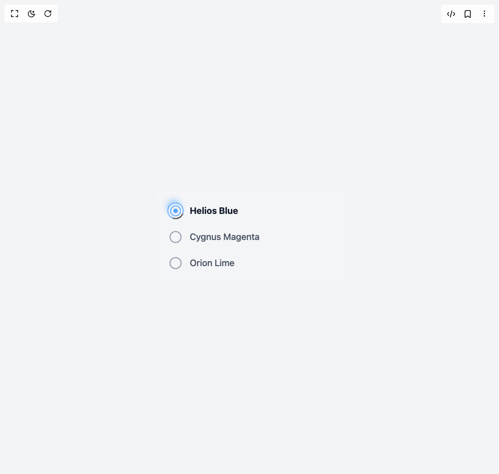

# Build Radio Button in BuilderStudio

> Build this component in our Agentic IDE: [BuilderStudio](https://builderstudio.dev).
>
> Join the BuilderStudio community on [Discord](https://discord.gg/QdWeSGCqfe) and [Reddit](https://reddit.com/r/builderstudio).



## Component

- Author group: `thanh`
- Component: `radio-button`
- Variant: `default`
- Rendered HTML snapshot: [`rendered.html`](rendered.html)

## BuilderStudio prompt

You are implementing a React component based on a component reference.

## Component identity

- Author: thanh
- Component slug: radio-button
- Demo slug: default
- Title: radio-button
- Description: 

## Goal

Recreate this component in a React + TypeScript + Tailwind CSS project. Preserve the visual layout, spacing, colors, border radius, shadows, interaction behavior, animation behavior, responsive behavior, and dark mode behavior shown in the rendered demo.

## Implementation requirements

- Use React and TypeScript.
- Use Tailwind CSS classes whenever possible.
- Keep the component self-contained unless the source files require helper components.
- If the source uses CSS variables, custom CSS, animations, or keyframes, include them.
- If the source uses external packages, list and use the required packages.
- Preserve accessibility attributes, button semantics, links, keyboard behavior, and ARIA attributes when visible in the source.
- Do not replace the component with a simplified placeholder.
- Return complete production-ready code.

## Dependencies

No reference metadata available.

## Rendered DOM snapshot

This is the rendered demo HTML extracted from the live preview. Use it to verify structure, class names, visible content, and layout.

```html
<div id="root"><div class="w-screen min-h-screen flex justify-center items-center"><div class="w-screen min-h-screen flex justify-center items-center"><main class="min-h-screen bg-gradient-to-br from-slate-900 via-slate-800 to-slate-900 w-full"><div class="flex items-center justify-center min-h-screen w-full p-5 font-sans bg-gray-100 dark:bg-black"><div class="backdrop-blur-xl border border-gray-200/20 dark:border-white/5 rounded-3xl p-6 sm:p-8 w-full max-w-sm transition-all duration-300 bg-white/10 dark:bg-zinc-900"><div class="space-y-6" role="radiogroup" aria-label="Color theme selection"><label class="flex items-center cursor-pointer group select-none" for="helios-blue"><div class="relative flex items-center justify-center"><input id="helios-blue" class="sr-only" aria-describedby="helios-blue-description" type="radio" value="helios-blue" checked="" name="radio-group"><div class="w-6 h-6 rounded-full border-2 transition-all duration-500 ease-out flex items-center justify-center mr-4 flex-shrink-0 border-blue-400 scale-90"><div class="w-2.5 h-2.5 rounded-full transition-all duration-300 bg-blue-400 scale-100"></div><div class="absolute w-9 h-9 rounded-full border-2 animate-spin border-blue-400 shadow-lg shadow-blue-400/50" style="border-top-color: currentcolor; animation-duration: 2s;"></div></div></div><span id="helios-blue-description" class="text-lg transition-colors duration-300 text-gray-900 dark:text-white font-bold">Helios Blue</span></label><label class="flex items-center cursor-pointer group select-none" for="cygnus-magenta"><div class="relative flex items-center justify-center"><input id="cygnus-magenta" class="sr-only" aria-describedby="cygnus-magenta-description" type="radio" value="cygnus-magenta" name="radio-group"><div class="w-6 h-6 rounded-full border-2 transition-all duration-500 ease-out flex items-center justify-center mr-4 flex-shrink-0 border-gray-400 dark:border-slate-500 group-hover:border-gray-600 dark:group-hover:border-slate-400 group-hover:scale-110"><div class="w-2.5 h-2.5 rounded-full transition-all duration-300 scale-0 bg-gray-600 dark:bg-slate-400"></div></div></div><span id="cygnus-magenta-description" class="text-lg font-medium transition-colors duration-300 text-gray-600 dark:text-slate-300 group-hover:text-gray-800 dark:group-hover:text-slate-100">Cygnus Magenta</span></label><label class="flex items-center cursor-pointer group select-none" for="orion-lime"><div class="relative flex items-center justify-center"><input id="orion-lime" class="sr-only" aria-describedby="orion-lime-description" type="radio" value="orion-lime" name="radio-group"><div class="w-6 h-6 rounded-full border-2 transition-all duration-500 ease-out flex items-center justify-center mr-4 flex-shrink-0 border-gray-400 dark:border-slate-500 group-hover:border-gray-600 dark:group-hover:border-slate-400 group-hover:scale-110"><div class="w-2.5 h-2.5 rounded-full transition-all duration-300 scale-0 bg-gray-600 dark:bg-slate-400"></div></div></div><span id="orion-lime-description" class="text-lg font-medium transition-colors duration-300 text-gray-600 dark:text-slate-300 group-hover:text-gray-800 dark:group-hover:text-slate-100">Orion Lime</span></label></div></div></div></main></div></div></div>
```

## Reference source files

No reference source files were available.
