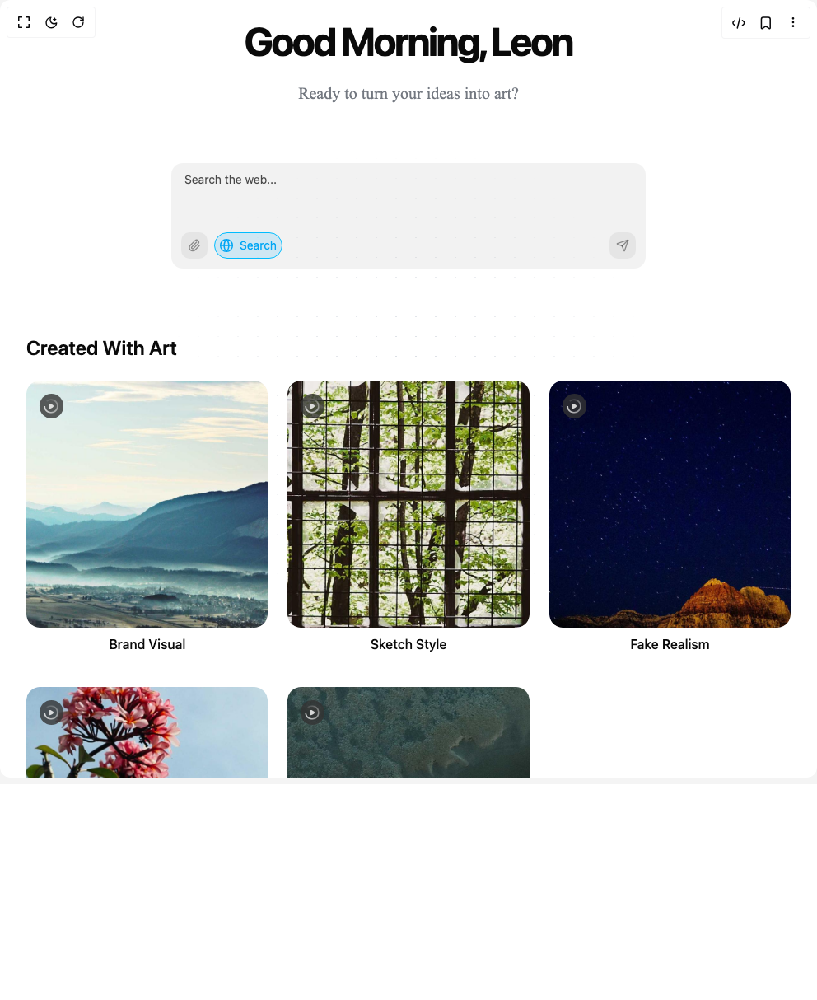

# Build Simple Ui in BuilderStudio

> Build this component in our Agentic IDE: [BuilderStudio](https://builderstudio.dev).
>
> Join the BuilderStudio community on [Discord](https://discord.gg/QdWeSGCqfe) and [Reddit](https://reddit.com/r/builderstudio).



## Component

- Author group: `thanh`
- Component: `simple-ui`
- Variant: `default`
- Rendered HTML snapshot: [`rendered.html`](rendered.html)

## BuilderStudio prompt

You are implementing a React component based on a component reference.

## Component identity

- Author: thanh
- Component slug: simple-ui
- Demo slug: default
- Title: simple-ui
- Description: 

## Goal

Recreate this component in a React + TypeScript + Tailwind CSS project. Preserve the visual layout, spacing, colors, border radius, shadows, interaction behavior, animation behavior, responsive behavior, and dark mode behavior shown in the rendered demo.

## Implementation requirements

- Use React and TypeScript.
- Use Tailwind CSS classes whenever possible.
- Keep the component self-contained unless the source files require helper components.
- If the source uses CSS variables, custom CSS, animations, or keyframes, include them.
- If the source uses external packages, list and use the required packages.
- Preserve accessibility attributes, button semantics, links, keyboard behavior, and ARIA attributes when visible in the source.
- Do not replace the component with a simplified placeholder.
- Return complete production-ready code.

## Dependencies

No reference metadata available.

## Rendered DOM snapshot

This is the rendered demo HTML extracted from the live preview. Use it to verify structure, class names, visible content, and layout.

```html
<div id="root"><div class="min-h-screen bg-white dark:bg-background p-8"><svg aria-hidden="true" class="pointer-events-none absolute inset-0 h-full w-full fill-slate-500/50 md:fill-slate-500/70 [mask-image:radial-gradient(300px_circle_at_center,white,transparent)]"><defs><pattern id="«r0»" width="24" height="24" patternUnits="userSpaceOnUse" patternContentUnits="userSpaceOnUse" x="0" y="0"><circle id="pattern-circle" cx="1" cy="0.5" r="0.5"></circle></pattern></defs><rect width="100%" height="100%" stroke-width="0" fill="url(#«r0»)"></rect></svg><header class="text-center mb-12"><div style="opacity: 1; filter: blur(0px); transform: translateY(-6px);"><h2 class="text-4xl font-bold tracking-tighter sm:text-5xl xl:text-6xl/none">Good Morning, Leon</h2></div><div class="opacity-0">hidden</div><div style="opacity: 1; filter: blur(0px); transform: translateY(-6px);"><span class="animate-fade-in font-[Outfit] text-[16px] font-normal text-[#737880] sm:text-[20px]">Ready to turn your ideas into art?</span></div></header><div class="max-w-2xl mx-auto mb-16"><div class="w-full py-4"><div class="relative max-w-xl w-full mx-auto"><div class="relative flex flex-col"><div class="overflow-y-auto" style="max-height: 164px;"><textarea class="flex min-h-[80px] border border-input text-sm ring-offset-background focus-visible:outline-none focus-visible:ring-ring focus-visible:ring-offset-2 disabled:cursor-not-allowed disabled:opacity-50 w-full rounded-xl rounded-b-none px-4 py-3 bg-black/5 dark:bg-white/5 border-none dark:text-white placeholder:text-black/70 dark:placeholder:text-white/70 resize-none focus-visible:ring-0 leading-[1.2]" id="ai-input-with-search" placeholder="Search the web..." style="height: 48px;"></textarea></div><div class="h-12 bg-black/5 dark:bg-white/5 rounded-b-xl"><div class="absolute left-3 bottom-3 flex items-center gap-2"><label class="cursor-pointer rounded-lg p-2 bg-black/5 dark:bg-white/5"><input class="hidden" type="file"><svg xmlns="http://www.w3.org/2000/svg" width="24" height="24" viewBox="0 0 24 24" fill="none" stroke="currentColor" stroke-width="2" stroke-linecap="round" stroke-linejoin="round" class="lucide lucide-paperclip w-4 h-4 text-black/40 dark:text-white/40 hover:text-black dark:hover:text-white transition-colors" aria-hidden="true"><path d="M13.234 20.252 21 12.3"></path><path d="m16 6-8.414 8.586a2 2 0 0 0 0 2.828 2 2 0 0 0 2.828 0l8.414-8.586a4 4 0 0 0 0-5.656 4 4 0 0 0-5.656 0l-8.415 8.585a6 6 0 1 0 8.486 8.486"></path></svg></label><button type="button" class="rounded-full transition-all flex items-center gap-2 px-1.5 py-1 border h-8 bg-sky-500/15 border-sky-400 text-sky-500"><div class="w-4 h-4 flex items-center justify-center flex-shrink-0"><div style="transform: scale(1.1) rotate(180deg);"><svg xmlns="http://www.w3.org/2000/svg" width="24" height="24" viewBox="0 0 24 24" fill="none" stroke="currentColor" stroke-width="2" stroke-linecap="round" stroke-linejoin="round" class="lucide lucide-globe w-4 h-4 text-sky-500" aria-hidden="true"><circle cx="12" cy="12" r="10"></circle><path d="M12 2a14.5 14.5 0 0 0 0 20 14.5 14.5 0 0 0 0-20"></path><path d="M2 12h20"></path></svg></div></div><span class="text-sm overflow-hidden whitespace-nowrap text-sky-500 flex-shrink-0" style="width: auto; opacity: 1;">Search</span></button></div><div class="absolute right-3 bottom-3"><button type="button" class="rounded-lg p-2 transition-colors bg-black/5 dark:bg-white/5 text-black/40 dark:text-white/40 hover:text-black dark:hover:text-white"><svg xmlns="http://www.w3.org/2000/svg" width="24" height="24" viewBox="0 0 24 24" fill="none" stroke="currentColor" stroke-width="2" stroke-linecap="round" stroke-linejoin="round" class="lucide lucide-send w-4 h-4" aria-hidden="true"><path d="M14.536 21.686a.5.5 0 0 0 .937-.024l6.5-19a.496.496 0 0 0-.635-.635l-19 6.5a.5.5 0 0 0-.024.937l7.93 3.18a2 2 0 0 1 1.112 1.11z"></path><path d="m21.854 2.147-10.94 10.939"></path></svg></button></div></div></div></div></div></div><section class="max-w-6xl mx-auto"><h2 class="text-2xl font-semibold mb-6">Created With Art</h2><div class="grid grid-cols-1 sm:grid-cols-2 md:grid-cols-3 lg:grid-cols-5 gap-6"><div class="relative group rounded-xl overflow-hidden cursor-pointer"><div class="w-full h-[300px] object-cover rounded-2xl overflow-hidden"></div><div class="absolute left-0 right-0 top-0 m-4 flex h-[30px] w-[29px] items-center justify-start gap-1 overflow-hidden rounded-full bg-[rgba(51,51,51,0.8)] transition-all duration-300 group-hover:w-[72px]"><span class="text-[rgba(255,255,255,0.8)] sm:text-[14px] sm:font-[700]">View</span></div><p class="text-center mt-2 font-medium  pb-4">Brand Visual</p></div><div class="relative group rounded-xl overflow-hidden cursor-pointer"><div class="w-full h-[300px] object-cover rounded-2xl overflow-hidden"></div><div class="absolute left-0 right-0 top-0 m-4 flex h-[30px] w-[29px] items-center justify-start gap-1 overflow-hidden rounded-full bg-[rgba(51,51,51,0.8)] transition-all duration-300 group-hover:w-[72px]"><span class="text-[rgba(255,255,255,0.8)] sm:text-[14px] sm:font-[700]">View</span></div><p class="text-center mt-2 font-medium  pb-4">Sketch Style</p></div><div class="relative group rounded-xl overflow-hidden cursor-pointer"><div class="w-full h-[300px] object-cover rounded-2xl overflow-hidden"></div><div class="absolute left-0 right-0 top-0 m-4 flex h-[30px] w-[29px] items-center justify-start gap-1 overflow-hidden rounded-full bg-[rgba(51,51,51,0.8)] transition-all duration-300 group-hover:w-[72px]"><span class="text-[rgba(255,255,255,0.8)] sm:text-[14px] sm:font-[700]">View</span></div><p class="text-center mt-2 font-medium  pb-4">Fake Realism</p></div><div class="relative group rounded-xl overflow-hidden cursor-pointer"><div class="w-full h-[300px] object-cover rounded-2xl overflow-hidden"></div><div class="absolute left-0 right-0 top-0 m-4 flex h-[30px] w-[29px] items-center justify-start gap-1 overflow-hidden rounded-full bg-[rgba(51,51,51,0.8)] transition-all duration-300 group-hover:w-[72px]"><span class="text-[rgba(255,255,255,0.8)] sm:text-[14px] sm:font-[700]">View</span></div><p class="text-center mt-2 font-medium  pb-4">Fashion Poster</p></div><div class="relative group rounded-xl overflow-hidden cursor-pointer"><div class="w-full h-[300px] object-cover rounded-2xl overflow-hidden"></div><div class="absolute left-0 right-0 top-0 m-4 flex h-[30px] w-[29px] items-center justify-start gap-1 overflow-hidden rounded-full bg-[rgba(51,51,51,0.8)] transition-all duration-300 group-hover:w-[72px]"><span class="text-[rgba(255,255,255,0.8)] sm:text-[14px] sm:font-[700]">View</span></div><p class="text-center mt-2 font-medium  pb-4">Food Promotion Poster</p></div></div></section></div></div>
```

## Reference source files

No reference source files were available.
