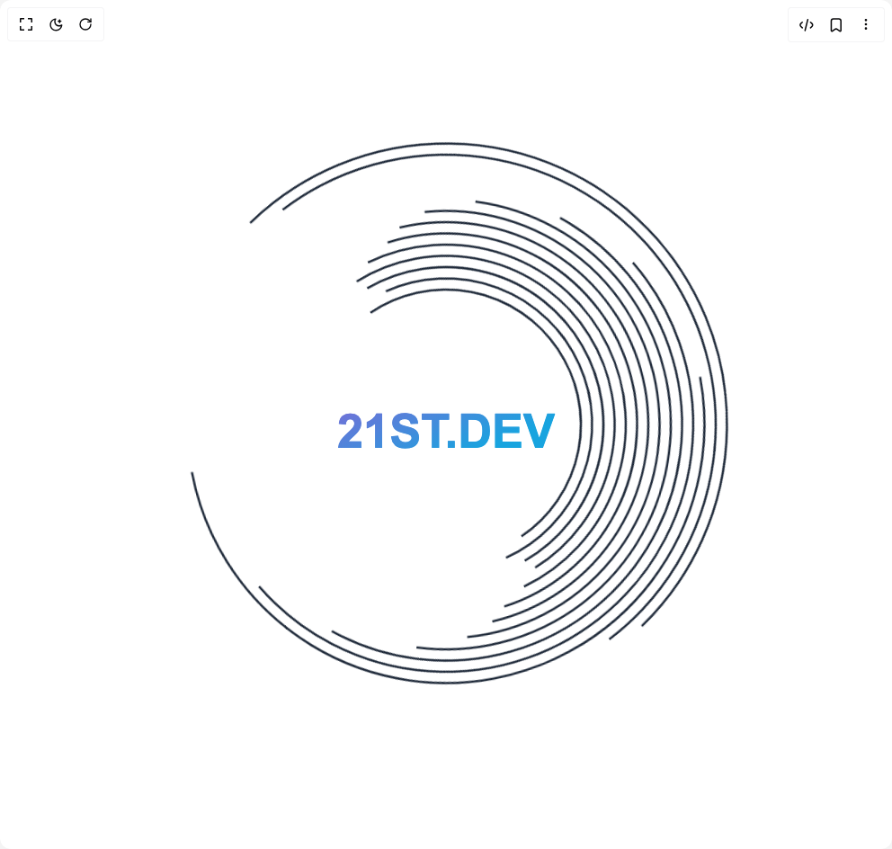

# Build Spinning Arc Logo With Gradient Text 1 in BuilderStudio

> Build this component in our Agentic IDE: [BuilderStudio](https://builderstudio.dev).
>
> Join the BuilderStudio community on [Discord](https://discord.gg/QdWeSGCqfe) and [Reddit](https://reddit.com/r/builderstudio).



## Component

- Author group: `thanh`
- Component: `spinning-arc-logo-with-gradient-text-1`
- Variant: `default`
- Rendered HTML snapshot: [`rendered.html`](rendered.html)

## BuilderStudio prompt

You are implementing a React component based on a component reference.

## Component identity

- Author: thanh
- Component slug: spinning-arc-logo-with-gradient-text-1
- Demo slug: default
- Title: spinning-arc-logo-with-gradient-text-1
- Description: 

## Goal

Recreate this component in a React + TypeScript + Tailwind CSS project. Preserve the visual layout, spacing, colors, border radius, shadows, interaction behavior, animation behavior, responsive behavior, and dark mode behavior shown in the rendered demo.

## Implementation requirements

- Use React and TypeScript.
- Use Tailwind CSS classes whenever possible.
- Keep the component self-contained unless the source files require helper components.
- If the source uses CSS variables, custom CSS, animations, or keyframes, include them.
- If the source uses external packages, list and use the required packages.
- Preserve accessibility attributes, button semantics, links, keyboard behavior, and ARIA attributes when visible in the source.
- Do not replace the component with a simplified placeholder.
- Return complete production-ready code.

## Dependencies

No reference metadata available.

## Rendered DOM snapshot

This is the rendered demo HTML extracted from the live preview. Use it to verify structure, class names, visible content, and layout.

```html
<div id="root"><div class="min-h-screen bg-white dark:bg-black flex items-center justify-center overflow-visible"><div class="flex items-center justify-center"><div class="relative "><svg width="500" height="500" viewBox="0 0 200 200" class="text-gray-800 dark:text-white transition-colors duration-500 hover:text-gray-600 dark:hover:text-gray-300" style="overflow: visible;"><style>
            @keyframes spin {
              from { transform: rotate(0deg); }
              to { transform: rotate(360deg); }
            }
            @keyframes pulse {
              0% { transform: scale(1); }
              50% { transform: scale(1.05); }
              100% { transform: scale(1); }
            }
          </style><path d="M 40 100 a 60 60 0 0 1 120 0" stroke="currentColor" stroke-width="1" fill="none" style="transform-origin: 100px 100px; transform: rotate(0deg); animation: 30s linear 0s infinite normal none running spin;"></path><path d="M 35 100 a 65 65 0 0 1 130 0" stroke="currentColor" stroke-width="1" fill="none" style="transform-origin: 100px 100px; transform: rotate(15deg); animation: 25s linear 0.1s infinite normal none running spin;"></path><path d="M 30 100 a 70 70 0 0 1 140 0" stroke="currentColor" stroke-width="1" fill="none" style="transform-origin: 100px 100px; transform: rotate(0deg); animation: 28s linear 0s infinite normal none running spin;"></path><path d="M 25 100 a 75 75 0 0 1 150 0" stroke="currentColor" stroke-width="1" fill="none" style="transform-origin: 100px 100px; transform: rotate(45deg); animation: 28s linear 0.15s infinite normal none running spin;"></path><path d="M 20 100 a 80 80 0 0 1 160 0" stroke="currentColor" stroke-width="1" fill="none" style="transform-origin: 100px 100px; transform: rotate(30deg); animation: 25s linear 0.2s infinite normal none running spin;"></path><path d="M 15 100 a 85 85 0 0 1 170 0" stroke="currentColor" stroke-width="1" fill="none" style="transform-origin: 100px 100px; transform: rotate(75deg); animation: 22s linear 0.25s infinite normal none running spin;"></path><path d="M 10 100 a 90 90 0 0 1 180 0" stroke="currentColor" stroke-width="1" fill="none" style="transform-origin: 100px 100px; transform: rotate(60deg); animation: 20s linear 0.4s infinite normal none running spin;"></path><path d="M 5 100 a 95 95 0 0 1 190 0" stroke="currentColor" stroke-width="1" fill="none" style="transform-origin: 100px 100px; transform: rotate(105deg); animation: 18s linear 0.45s infinite normal none running spin;"></path><path d="M 0 100 a 100 100 0 0 1 200 0" stroke="currentColor" stroke-width="1" fill="none" style="transform-origin: 100px 100px; transform: rotate(90deg); animation: 15s linear 0.6s infinite normal none running spin;"></path><path d="M -5 100 a 105 105 0 0 1 210 0" stroke="currentColor" stroke-width="1" fill="none" style="transform-origin: 100px 100px; transform: rotate(135deg); animation: 12s linear 0.7s infinite normal none running spin;"></path><path d="M -10 100 a 110 110 0 0 1 220 0" stroke="currentColor" stroke-width="1" fill="none" style="transform-origin: 100px 100px; transform: rotate(120deg); animation: 10s linear 0.8s infinite normal none running spin;"></path><path d="M -15 100 a 115 115 0 0 1 230 0" stroke="currentColor" stroke-width="1" fill="none" style="transform-origin: 100px 100px; transform: rotate(150deg); animation: 8s linear 0.9s infinite normal none running spin;"></path><path d="M -20 100 a 120 120 0 0 1 240 0" stroke="currentColor" stroke-width="1" fill="none" style="transform-origin: 100px 100px; transform: rotate(180deg); animation: 25s linear 1s infinite normal none running spin;"></path><path d="M -25 100 a 125 125 0 0 1 250 0" stroke="currentColor" stroke-width="1" fill="none" style="transform-origin: 100px 100px; transform: rotate(210deg); animation: 28s linear 1.1s infinite normal none running spin;"></path><g><defs><linearGradient id="textGradient" x1="0%" y1="0%" x2="100%" y2="0%" gradientTransform="rotate(30)"><stop offset="0%" stop-color="#4f46e5" class="animate-gradient-stop-1"><animate attributeName="stop-color" values="#4f46e5; #06b6d4; #3b82f6; #ec4899; #4f46e5" dur="8s" repeatCount="indefinite"></animate></stop><stop offset="100%" stop-color="#ec4899" class="animate-gradient-stop-2"><animate attributeName="stop-color" values="#ec4899; #4f46e5; #06b6d4; #3b82f6; #ec4899" dur="8s" repeatCount="indefinite"></animate></stop></linearGradient></defs><text x="100" y="105" text-anchor="middle" dominant-baseline="middle" fill="url(#textGradient)" class="font-bold" style="font-family: Arial, sans-serif; font-size: 21px; font-weight: bold;">21ST.DEV</text></g></svg></div></div></div></div>
```

## Reference source files

No reference source files were available.
