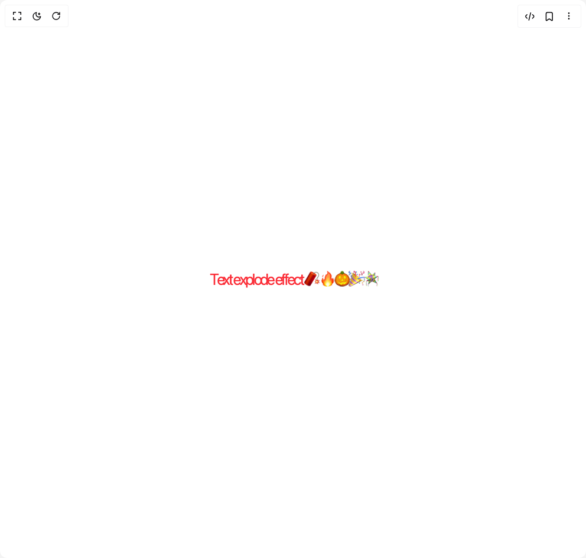

# Build Text Explode in BuilderStudio

> Build this component in our Agentic IDE: [BuilderStudio](https://builderstudio.dev).
>
> Join the BuilderStudio community on [Discord](https://discord.gg/QdWeSGCqfe) and [Reddit](https://reddit.com/r/builderstudio).



## Component

- Author group: `thanh`
- Component: `text-explode`
- Variant: `default`
- Rendered HTML snapshot: [`rendered.html`](rendered.html)

## BuilderStudio prompt

You are implementing a React component based on a component reference.

## Component identity

- Author: thanh
- Component slug: text-explode
- Demo slug: default
- Title: text-explode
- Description: 

## Goal

Recreate this component in a React + TypeScript + Tailwind CSS project. Preserve the visual layout, spacing, colors, border radius, shadows, interaction behavior, animation behavior, responsive behavior, and dark mode behavior shown in the rendered demo.

## Implementation requirements

- Use React and TypeScript.
- Use Tailwind CSS classes whenever possible.
- Keep the component self-contained unless the source files require helper components.
- If the source uses CSS variables, custom CSS, animations, or keyframes, include them.
- If the source uses external packages, list and use the required packages.
- Preserve accessibility attributes, button semantics, links, keyboard behavior, and ARIA attributes when visible in the source.
- Do not replace the component with a simplified placeholder.
- Return complete production-ready code.

## Dependencies

No reference metadata available.

## Rendered DOM snapshot

This is the rendered demo HTML extracted from the live preview. Use it to verify structure, class names, visible content, and layout.

```html
<div id="root"><div class="w-screen min-h-screen flex justify-center items-center"><div class="w-screen min-h-screen flex justify-center items-center"><div class="w-full"><div class="flex items-center justify-center text-3xl tracking-normal text-red-500" style="letter-spacing: -9.29084%; transform: translateX(1.73968px) translateY(1.15979px) scale(0.814183); opacity: 1;"><span class="inline-block" style="transform: translateX(-0.209312px) translateY(-0.291252px) scale(1.09291); opacity: 1;">T</span><span class="inline-block" style="transform: translateX(-0.132911px) translateY(0.402384px) scale(1.09291); opacity: 1;">e</span><span class="inline-block" style="transform: translateX(-0.0666516px) translateY(-0.232987px) scale(1.09291); opacity: 1;">x</span><span class="inline-block" style="transform: translateX(-0.00934992px) translateY(0.148113px) scale(1.09291); opacity: 1;">t</span><span class="inline-block" style="transform: translateX(-0.558572px) translateY(0.300599px) scale(1.09291); opacity: 1;">&nbsp;</span><span class="inline-block" style="transform: translateX(-0.727516px) translateY(0.458118px) scale(1.09291); opacity: 1;">e</span><span class="inline-block" style="transform: translateX(0.351688px) translateY(-0.221662px) scale(1.09291); opacity: 1;">x</span><span class="inline-block" style="transform: translateX(-0.466965px) translateY(-0.200746px) scale(1.09291); opacity: 1;">p</span><span class="inline-block" style="transform: translateX(-0.635578px) translateY(0.377372px) scale(1.09291); opacity: 1;">l</span><span class="inline-block" style="transform: translateX(-0.100805px) translateY(0.413919px) scale(1.09291); opacity: 1;">o</span><span class="inline-block" style="transform: translateX(-0.701716px) translateY(-0.0202078px) scale(1.09291); opacity: 1;">d</span><span class="inline-block" style="transform: translateX(0.482951px) translateY(0.175661px) scale(1.09291); opacity: 1;">e</span><span class="inline-block" style="transform: translateX(0.686607px) translateY(-0.319454px) scale(1.09291); opacity: 1;">&nbsp;</span><span class="inline-block" style="transform: translateX(0.719822px) translateY(0.421106px) scale(1.09291); opacity: 1;">e</span><span class="inline-block" style="transform: translateX(-0.244426px) translateY(-0.187084px) scale(1.09291); opacity: 1;">f</span><span class="inline-block" style="transform: translateX(0.724015px) translateY(0.199437px) scale(1.09291); opacity: 1;">f</span><span class="inline-block" style="transform: translateX(-0.326147px) translateY(-0.428372px) scale(1.09291); opacity: 1;">e</span><span class="inline-block" style="transform: translateX(-0.205853px) translateY(0.0848873px) scale(1.09291); opacity: 1;">c</span><span class="inline-block" style="transform: translateX(0.49218px) translateY(-0.334957px) scale(1.09291); opacity: 1;">t</span><span class="inline-block" style="transform: translateX(-0.358316px) translateY(0.322149px) scale(1.09291); opacity: 1;">&nbsp;</span><span class="inline-block" style="transform: translateX(-0.714609px) translateY(0.14163px) scale(1.09291); opacity: 1;">🧨</span><span class="inline-block" style="transform: translateX(0.421945px) translateY(0.0429692px) scale(1.09291); opacity: 1;">&nbsp;</span><span class="inline-block" style="transform: translateX(0.540044px) translateY(0.308466px) scale(1.09291); opacity: 1;">🔥</span><span class="inline-block" style="transform: translateX(0.49312px) translateY(0.192384px) scale(1.09291); opacity: 1;">&nbsp;</span><span class="inline-block" style="transform: translateX(-0.0253959px) translateY(-0.208665px) scale(1.09291); opacity: 1;">🎃</span><span class="inline-block" style="transform: translateX(0.0994414px) translateY(0.169444px) scale(1.09291); opacity: 1;">&nbsp;</span><span class="inline-block" style="transform: translateX(0.660619px) translateY(0.45551px) scale(1.09291); opacity: 1;">🎉</span><span class="inline-block" style="transform: translateX(0.317443px) translateY(0.0741355px) scale(1.09291); opacity: 1;">&nbsp;</span><span class="inline-block" style="transform: translateX(0.517882px) translateY(0.286396px) scale(1.09291); opacity: 1;">🪅</span><span class="sr-only">Text explode effect 🧨 🔥 🎃 🎉 🪅</span></div></div></div></div></div>
```

## Reference source files

No reference source files were available.
