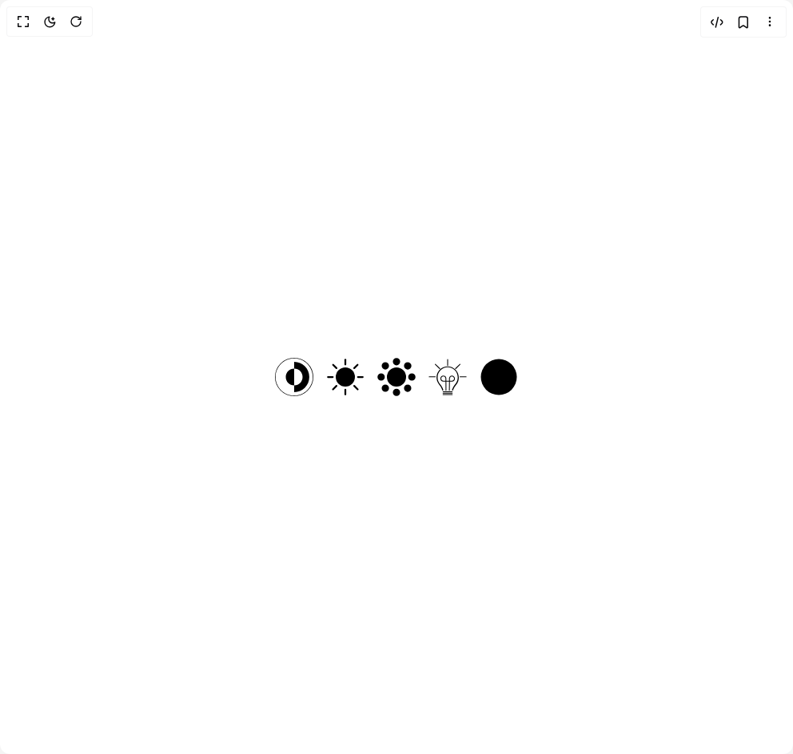

# Build Theme Toggle Buttons in BuilderStudio

> Build this component in our Agentic IDE: [BuilderStudio](https://builderstudio.dev).
>
> Join the BuilderStudio community on [Discord](https://discord.gg/QdWeSGCqfe) and [Reddit](https://reddit.com/r/builderstudio).



## Component

- Author group: `thanh`
- Component: `theme-toggle-buttons`
- Variant: `default`
- Rendered HTML snapshot: [`rendered.html`](rendered.html)

## BuilderStudio prompt

You are implementing a React component based on a component reference.

## Component identity

- Author: thanh
- Component slug: theme-toggle-buttons
- Demo slug: default
- Title: theme-toggle-buttons
- Description: 

## Goal

Recreate this component in a React + TypeScript + Tailwind CSS project. Preserve the visual layout, spacing, colors, border radius, shadows, interaction behavior, animation behavior, responsive behavior, and dark mode behavior shown in the rendered demo.

## Implementation requirements

- Use React and TypeScript.
- Use Tailwind CSS classes whenever possible.
- Keep the component self-contained unless the source files require helper components.
- If the source uses CSS variables, custom CSS, animations, or keyframes, include them.
- If the source uses external packages, list and use the required packages.
- Preserve accessibility attributes, button semantics, links, keyboard behavior, and ARIA attributes when visible in the source.
- Do not replace the component with a simplified placeholder.
- Return complete production-ready code.

## Dependencies

No reference metadata available.

## Rendered DOM snapshot

This is the rendered demo HTML extracted from the live preview. Use it to verify structure, class names, visible content, and layout.

```html
<div id="root"><div class="w-screen min-h-screen flex justify-center items-center"><div class="w-screen min-h-screen flex justify-center items-center"><div class="flex items-center justify-center gap-4 p-8"><button type="button" class="rounded-full bg-black text-white transition-all duration-300 active:scale-95 h-12 w-12"><svg viewBox="0 0 240 240" fill="none" xmlns="http://www.w3.org/2000/svg"><g style="transform: none; transform-origin: 50% 50%; transform-box: fill-box;"><path d="M120 67.5C149.25 67.5 172.5 90.75 172.5 120C172.5 149.25 149.25 172.5 120 172.5" fill="white"></path><path d="M120 67.5C90.75 67.5 67.5 90.75 67.5 120C67.5 149.25 90.75 172.5 120 172.5" fill="black"></path></g><path d="M120 3.75C55.5 3.75 3.75 55.5 3.75 120C3.75 184.5 55.5 236.25 120 236.25C184.5 236.25 236.25 184.5 236.25 120C236.25 55.5 184.5 3.75 120 3.75ZM120 214.5V172.5C90.75 172.5 67.5 149.25 67.5 120C67.5 90.75 90.75 67.5 120 67.5V25.5C172.5 25.5 214.5 67.5 214.5 120C214.5 172.5 172.5 214.5 120 214.5Z" fill="white" style="transform: none; transform-origin: 50% 50%; transform-box: fill-box;"></path></svg></button><button type="button" class="rounded-full transition-all duration-300 active:scale-95 bg-white text-black h-12 w-12"><svg xmlns="http://www.w3.org/2000/svg" aria-hidden="true" fill="currentColor" stroke-linecap="round" viewBox="0 0 32 32"><clipPath id="skiper-btn-2"><path d="M0-5h30a1 1 0 0 0 9 13v24H0Z" style="transform: none; transform-origin: 50% 50%; transform-box: fill-box;"></path></clipPath><g clip-path="url(#skiper-btn-2)"><circle cx="16" cy="16" r="8"></circle><g stroke="currentColor" stroke-width="1.5" opacity="1" style="transform: none; transform-origin: 50% 50%; transform-box: fill-box;"><path d="M16 5.5v-4"></path><path d="M16 30.5v-4"></path><path d="M1.5 16h4"></path><path d="M26.5 16h4"></path><path d="m23.4 8.6 2.8-2.8"></path><path d="m5.7 26.3 2.9-2.9"></path><path d="m5.8 5.8 2.8 2.8"></path><path d="m23.4 23.4 2.9 2.9"></path></g></g></svg></button><button type="button" class="rounded-full transition-all duration-300 active:scale-95 bg-white text-black h-12 w-12"><svg xmlns="http://www.w3.org/2000/svg" aria-hidden="true" fill="currentColor" stroke-linecap="round" viewBox="0 0 32 32"><clipPath id="skiper-btn-3"><path d="M0-11h25a1 1 0 0017 13v30H0Z" style="transform: none; transform-origin: 50% 50%; transform-box: fill-box;"></path></clipPath><g clip-path="url(#skiper-btn-3)"><circle cx="16" cy="16" r="8"></circle><g stroke="currentColor" stroke-width="1.5" opacity="1" style="transform: none; transform-origin: 50% 50%; transform-box: fill-box;"><path d="M18.3 3.2c0 1.3-1 2.3-2.3 2.3s-2.3-1-2.3-2.3S14.7.9 16 .9s2.3 1 2.3 2.3zm-4.6 25.6c0-1.3 1-2.3 2.3-2.3s2.3 1 2.3 2.3-1 2.3-2.3 2.3-2.3-1-2.3-2.3zm15.1-10.5c-1.3 0-2.3-1-2.3-2.3s1-2.3 2.3-2.3 2.3 1 2.3 2.3-1 2.3-2.3 2.3zM3.2 13.7c1.3 0 2.3 1 2.3 2.3s-1 2.3-2.3 2.3S.9 17.3.9 16s1-2.3 2.3-2.3zm5.8-7C9 7.9 7.9 9 6.7 9S4.4 8 4.4 6.7s1-2.3 2.3-2.3S9 5.4 9 6.7zm16.3 21c-1.3 0-2.3-1-2.3-2.3s1-2.3 2.3-2.3 2.3 1 2.3 2.3-1 2.3-2.3 2.3zm2.4-21c0 1.3-1 2.3-2.3 2.3S23 7.9 23 6.7s1-2.3 2.3-2.3 2.4 1 2.4 2.3zM6.7 23C8 23 9 24 9 25.3s-1 2.3-2.3 2.3-2.3-1-2.3-2.3 1-2.3 2.3-2.3z"></path></g></g></svg></button><button type="button" class="rounded-full transition-all duration-300 active:scale-95 bg-white text-black h-12 w-12"><svg xmlns="http://www.w3.org/2000/svg" aria-hidden="true" stroke-width="0.7" stroke="currentColor" fill="currentColor" stroke-linecap="round" viewBox="0 0 32 32"><path stroke-width="0" d="M9.4 9.9c1.8-1.8 4.1-2.7 6.6-2.7 5.1 0 9.3 4.2 9.3 9.3 0 2.3-.8 4.4-2.3 6.1-.7.8-2 2.8-2.5 4.4 0 .2-.2.4-.5.4-.2 0-.4-.2-.4-.5v-.1c.5-1.8 2-3.9 2.7-4.8 1.4-1.5 2.1-3.5 2.1-5.6 0-4.7-3.7-8.5-8.4-8.5-2.3 0-4.4.9-5.9 2.5-1.6 1.6-2.5 3.7-2.5 6 0 2.1.7 4 2.1 5.6.8.9 2.2 2.9 2.7 4.9 0 .2-.1.5-.4.5h-.1c-.2 0-.4-.1-.4-.4-.5-1.7-1.8-3.7-2.5-4.5-1.5-1.7-2.3-3.9-2.3-6.1 0-2.3 1-4.7 2.7-6.5z"></path><path d="M19.8 28.3h-7.6"></path><path d="M19.8 29.5h-7.6"></path><path d="M19.8 30.7h-7.6"></path><path pathLength="1" fill="none" d="M14.6 27.1c0-3.4 0-6.8-.1-10.2-.2-1-1.1-1.7-2-1.7-1.2-.1-2.3 1-2.2 2.3.1 1 .9 1.9 2.1 2h7.2c1.1-.1 2-1 2.1-2 .1-1.2-1-2.3-2.2-2.3-.9 0-1.7.7-2 1.7 0 3.4 0 6.8-.1 10.2" opacity="1" stroke-dashoffset="0px" stroke-dasharray="1px 1px"></path><g opacity="1" style="transform: none; transform-origin: 50% 50%; transform-box: fill-box;"><path pathLength="1" d="M16 6.4V1.3"></path><path pathLength="1" d="M26.3 15.8h5.1"></path><path pathLength="1" d="m22.6 9 3.7-3.6"></path><path pathLength="1" d="M9.4 9 5.7 5.4"></path><path pathLength="1" d="M5.7 15.8H.6"></path></g></svg></button><button type="button" class="rounded-full transition-all duration-300 active:scale-95 bg-white text-black h-12 w-12"><svg xmlns="http://www.w3.org/2000/svg" aria-hidden="true" fill="currentColor" viewBox="0 0 32 32"><clipPath id="skiper-btn-4"><path d="M0-5h55v37h-55zm32 12a1 1 0 0025 0 1 1 0 00-25 0" style="transform: none; transform-origin: 50% 50%; transform-box: fill-box;"></path></clipPath><g clip-path="url(#skiper-btn-4)"><circle cx="16" cy="16" r="15"></circle></g></svg></button></div></div></div></div>
```

## Reference source files

No reference source files were available.
