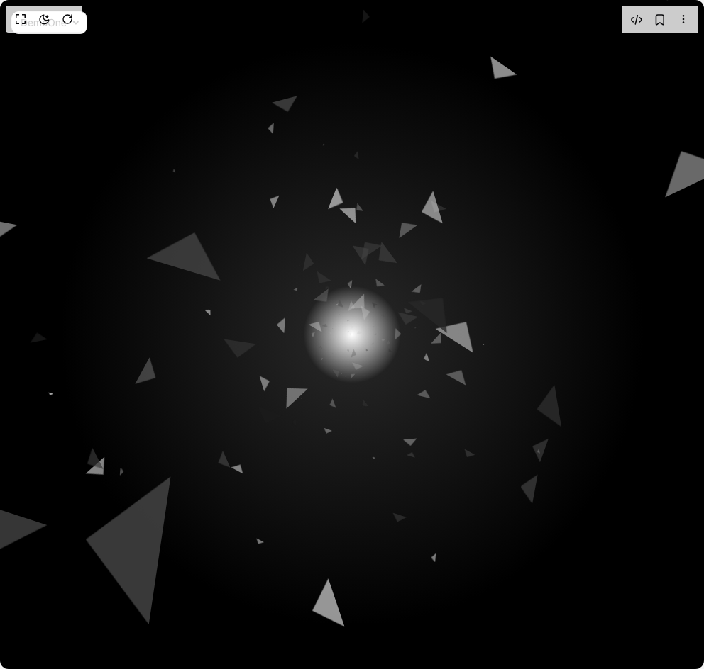

# Build Triangles Falling in BuilderStudio

> Build this component in our Agentic IDE: [BuilderStudio](https://builderstudio.dev).
>
> Join the BuilderStudio community on [Discord](https://discord.gg/QdWeSGCqfe) and [Reddit](https://reddit.com/r/builderstudio).



## Component

- Author group: `thanh`
- Component: `triangles-falling`
- Variant: `default`
- Rendered HTML snapshot: [`rendered.html`](rendered.html)

## BuilderStudio prompt

You are implementing a React component based on a component reference.

## Component identity

- Author: thanh
- Component slug: triangles-falling
- Demo slug: default
- Title: triangles-falling
- Description: 

## Goal

Recreate this component in a React + TypeScript + Tailwind CSS project. Preserve the visual layout, spacing, colors, border radius, shadows, interaction behavior, animation behavior, responsive behavior, and dark mode behavior shown in the rendered demo.

## Implementation requirements

- Use React and TypeScript.
- Use Tailwind CSS classes whenever possible.
- Keep the component self-contained unless the source files require helper components.
- If the source uses CSS variables, custom CSS, animations, or keyframes, include them.
- If the source uses external packages, list and use the required packages.
- Preserve accessibility attributes, button semantics, links, keyboard behavior, and ARIA attributes when visible in the source.
- Do not replace the component with a simplified placeholder.
- Return complete production-ready code.

## Dependencies

No reference metadata available.

## Rendered DOM snapshot

This is the rendered demo HTML extracted from the live preview. Use it to verify structure, class names, visible content, and layout.

```html
<div id="root"><div class="fixed top-4 left-4 z-10"><select class="appearance-none h-8 max-w-[200px] text-sm leading-tight rounded-lg pl-3 pr-7 py-0 border bg-background focus:outline-none focus:ring-0"><option value="named_DemoOne_DemoOne">DemoOne</option></select><div class="absolute top-1/2 transform -translate-y-1/2 right-2 pointer-events-none"><svg class="w-4 h-4 fill-current" viewBox="0 0 20 20"><path d="M5.516 7.548c.436-.446 1.043-.48 1.576 0L10 10.405l2.908-2.857c.533-.48 1.14-.446 1.576 0 .436.445.408 1.197 0 1.615l-3.734 3.705c-.533.534-1.39.534-1.923 0l-3.734-3.705c-.408-.418-.436-1.17 0-1.615z"></path></svg></div></div><div class="w-screen min-h-screen flex justify-center items-center"><div class="relative" style="perspective: 800px; transform-style: preserve-3d; height: 100vh; width: 100vw;"><div class="absolute top-1/2 left-1/2 filter grayscale" style="height: 0px; width: 0px; border-top: 23.1257px solid rgb(204, 255, 0); border-right: 23.1257px solid transparent; border-left: 23.1257px solid transparent; margin-left: -11.5629px; margin-top: -11.5629px; opacity: 0; transform: rotate(90.3486deg) translate3d(0px, 0px, -1500px) scale(0); animation: 10s linear 0s infinite normal none running anim0;"></div><div class="absolute top-1/2 left-1/2 filter grayscale" style="height: 0px; width: 0px; border-top: 40.7716px solid rgb(255, 0, 230); border-right: 40.7716px solid transparent; border-left: 40.7716px solid transparent; margin-left: -20.3858px; margin-top: -20.3858px; opacity: 0; transform: rotate(187.757deg) translate3d(0px, 0px, -1500px) scale(0); animation: 10s linear -0.05s infinite normal none running anim1;"></div><div class="absolute top-1/2 left-1/2 filter grayscale" style="height: 0px; width: 0px; border-top: 39.9576px solid rgb(0, 187, 255); border-right: 39.9576px solid transparent; border-left: 39.9576px solid transparent; margin-left: -19.9788px; margin-top: -19.9788px; opacity: 0; transform: rotate(166.282deg) translate3d(0px, 0px, -1500px) scale(0); animation: 10s linear -0.1s infinite normal none running anim2;"></div><div class="absolute top-1/2 left-1/2 filter grayscale" style="height: 0px; width: 0px; border-top: 3.09757px solid rgb(4, 255, 0); border-right: 3.09757px solid transparent; border-left: 3.09757px solid transparent; margin-left: -1.54878px; margin-top: -1.54878px; opacity: 0; transform: rotate(307.27deg) translate3d(0px, 0px, -1500px) scale(0); animation: 10s linear -0.15s infinite normal none running anim3;"></div><div class="absolute top-1/2 left-1/2 filter grayscale" style="height: 0px; width: 0px; border-top: 36.8156px solid rgb(17, 255, 0); border-right: 36.8156px solid transparent; border-left: 36.8156px solid transparent; margin-left: -18.4078px; margin-top: -18.4078px; opacity: 0; transform: rotate(250.087deg) translate3d(0px, 0px, -1500px) scale(0); animation: 10s linear -0.2s infinite normal none running anim4;"></div><div class="absolute top-1/2 left-1/2 filter grayscale" style="height: 0px; width: 0px; border-top: 1.79771px solid rgb(0, 72, 255); border-right: 1.79771px solid transparent; border-left: 1.79771px solid transparent; margin-left: -0.898855px; margin-top: -0.898855px; opacity: 0; transform: rotate(306.512deg) translate3d(0px, 0px, -1500px) scale(0); animation: 10s linear -0.25s infinite normal none running anim5;"></div><div class="absolute top-1/2 left-1/2 filter grayscale" style="height: 0px; width: 0px; border-top: 39.6961px solid rgb(255, 0, 200); border-right: 39.6961px solid transparent; border-left: 39.6961px solid transparent; margin-left: -19.8481px; margin-top: -19.8481px; opacity: 0; transform: rotate(299.088deg) translate3d(0px, 0px, -1500px) scale(0); animation: 10s linear -0.3s infinite normal none running anim6;"></div><div class="absolute top-1/2 left-1/2 filter grayscale" style="height: 0px; width: 0px; border-top: 48.606px solid rgb(255, 0, 234); border-right: 48.606px solid transparent; border-left: 48.606px solid transparent; margin-left: -24.303px; margin-top: -24.303px; opacity: 0; transform: rotate(117.534deg) translate3d(0px, 0px, -1500px) scale(0); animation: 10s linear -0.35s infinite normal none running anim7;"></div><div class="absolute top-1/2 left-1/2 filter grayscale" style="height: 0px; width: 0px; border-top: 17.0162px solid rgb(0, 255, 13); border-right: 17.0162px solid transparent; border-left: 17.0162px solid transparent; margin-left: -8.50808px; margin-top: -8.50808px; opacity: 0; transform: rotate(304.643deg) translate3d(0px, 0px, -1500px) scale(0); animation: 10s linear -0.4s infinite normal none running anim8;"></div><div class="absolute top-1/2 left-1/2 filter grayscale" style="height: 0px; width: 0px; border-top: 45.5252px solid rgb(0, 191, 255); border-right: 45.5252px solid transparent; border-left: 45.5252px solid transparent; margin-left: -22.7626px; margin-top: -22.7626px; opacity: 0; transform: rotate(116.587deg) translate3d(0px, 0px, -1500px) scale(0); animation: 10s linear -0.45s infinite normal none running anim9;"></div><div class="absolute top-1/2 left-1/2 filter grayscale" style="height: 0px; width: 0px; border-top: 1.25886px solid rgb(123, 0, 255); border-right: 1.25886px solid transparent; border-left: 1.25886px solid transparent; margin-left: -0.62943px; margin-top: -0.62943px; opacity: 0; transform: rotate(51.0436deg) translate3d(0px, 0px, -1500px) scale(0); animation: 10s linear -0.5s infinite normal none running anim10;"></div><div class="absolute top-1/2 left-1/2 filter grayscale" style="height: 0px; width: 0px; border-top: 40.9925px solid rgb(255, 85, 0); border-right: 40.9925px solid transparent; border-left: 40.9925px solid transparent; margin-left: -20.4962px; margin-top: -20.4962px; opacity: 0; transform: rotate(261.051deg) translate3d(0px, 0px, -1500px) scale(0); animation: 10s linear -0.55s infinite normal none running anim11;"></div><div class="absolute top-1/2 left-1/2 filter grayscale" style="height: 0px; width: 0px; border-top: 18.0687px solid rgb(59, 0, 255); border-right: 18.0687px solid transparent; border-left: 18.0687px solid transparent; margin-left: -9.03437px; margin-top: -9.03437px; opacity: 0; transform: rotate(72.6269deg) translate3d(0px, 0px, -1500px) scale(0); animation: 10s linear -0.6s infinite normal none running anim12;"></div><div class="absolute top-1/2 left-1/2 filter grayscale" style="height: 0px; width: 0px; border-top: 30.8878px solid rgb(0, 255, 51); border-right: 30.8878px solid transparent; border-left: 30.8878px solid transparent; margin-left: -15.4439px; margin-top: -15.4439px; opacity: 0; transform: rotate(288.448deg) translate3d(0px, 0px, -1500px) scale(0); animation: 10s linear -0.65s infinite normal none running anim13;"></div><div class="absolute top-1/2 left-1/2 filter grayscale" style="height: 0px; width: 0px; border-top: 36.3624px solid rgb(255, 247, 0); border-right: 36.3624px solid transparent; border-left: 36.3624px solid transparent; margin-left: -18.1812px; margin-top: -18.1812px; opacity: 0; transform: rotate(76.697deg) translate3d(0px, 0px, -1500px) scale(0); animation: 10s linear -0.7s infinite normal none running anim14;"></div><div class="absolute top-1/2 left-1/2 filter grayscale" style="height: 0px; width: 0px; border-top: 1.28965px solid rgb(255, 0, 106); border-right: 1.28965px solid transparent; border-left: 1.28965px solid transparent; margin-left: -0.644826px; margin-top: -0.644826px; opacity: 0; transform: rotate(2.40125deg) translate3d(0px, 0px, -1500px) scale(0); animation: 10s linear -0.75s infinite normal none running anim15;"></div><div class="absolute top-1/2 left-1/2 filter grayscale" style="height: 0px; width: 0px; border-top: 35.4037px solid rgb(55, 255, 0); border-right: 35.4037px solid transparent; border-left: 35.4037px solid transparent; margin-left: -17.7019px; margin-top: -17.7019px; opacity: 0; transform: rotate(210.994deg) translate3d(0px, 0px, -1500px) scale(0); animation: 10s linear -0.8s infinite normal none running anim16;"></div><div class="absolute top-1/2 left-1/2 filter grayscale" style="height: 0px; width: 0px; border-top: 27.8376px solid rgb(255, 132, 0); border-right: 27.8376px solid transparent; border-left: 27.8376px solid transparent; margin-left: -13.9188px; margin-top: -13.9188px; opacity: 0; transform: rotate(29.6785deg) translate3d(0px, 0px, -1500px) scale(0); animation: 10s linear -0.85s infinite normal none running anim17;"></div><div class="absolute top-1/2 left-1/2 filter grayscale" style="height: 0px; width: 0px; border-top: 21.8094px solid rgb(0, 94, 255); border-right: 21.8094px solid transparent; border-left: 21.8094px solid transparent; margin-left: -10.9047px; margin-top: -10.9047px; opacity: 0; transform: rotate(161.763deg) translate3d(0px, 0px, -1500px) scale(0); animation: 10s linear -0.9s infinite normal none running anim18;"></div><div class="absolute top-1/2 left-1/2 filter grayscale" style="height: 0px; width: 0px; border-top: 47.9665px solid rgb(255, 0, 200); border-right: 47.9665px solid transparent; border-left: 47.9665px solid transparent; margin-left: -23.9832px; margin-top: -23.9832px; opacity: 0; transform: rotate(231.323deg) translate3d(0px, 0px, -1500px) scale(0); animation: 10s linear -0.95s infinite normal none running anim19;"></div><div class="absolute top-1/2 left-1/2 filter grayscale" style="height: 0px; width: 0px; border-top: 24.405px solid rgb(0, 115, 255); border-right: 24.405px solid transparent; border-left: 24.405px solid transparent; margin-left: -12.2025px; margin-top: -12.2025px; opacity: 0; transform: rotate(196.13deg) translate3d(0px, 0px, -1500px) scale(0); animation: 10s linear -1s infinite normal none running anim20;"></div><div class="absolute top-1/2 left-1/2 filter grayscale" style="height: 0px; width: 0px; border-top: 9.54141px solid rgb(0, 255, 217); border-right: 9.54141px solid transparent; border-left: 9.54141px solid transparent; margin-left: -4.7707px; margin-top: -4.7707px; opacity: 0; transform: rotate(174.968deg) translate3d(0px, 0px, -1500px) scale(0); animation: 10s linear -1.05s infinite normal none running anim21;"></div><div class="absolute top-1/2 left-1/2 filter grayscale" style="height: 0px; width: 0px; border-top: 47.7983px solid rgb(255, 0, 162); border-right: 47.7983px solid transparent; border-left: 47.7983px solid transparent; margin-left: -23.8991px; margin-top: -23.8991px; opacity: 0; transform: rotate(27.5831deg) translate3d(0px, 0px, -1500px) scale(0); animation: 10s linear -1.1s infinite normal none running anim22;"></div><div class="absolute top-1/2 left-1/2 filter grayscale" style="height: 0px; width: 0px; border-top: 9.42245px solid rgb(170, 0, 255); border-right: 9.42245px solid transparent; border-left: 9.42245px solid transparent; margin-left: -4.71122px; margin-top: -4.71122px; opacity: 0; transform: rotate(37.3626deg) translate3d(0px, 0px, -1500px) scale(0); animation: 10s linear -1.15s infinite normal none running anim23;"></div><div class="absolute top-1/2 left-1/2 filter grayscale" style="height: 0px; width: 0px; border-top: 41.8126px solid rgb(0, 255, 111); border-right: 41.8126px solid transparent; border-left: 41.8126px solid transparent; margin-left: -20.9063px; margin-top: -20.9063px; opacity: 0; transform: rotate(259.323deg) translate3d(0px, 0px, -1500px) scale(0); animation: 10s linear -1.2s infinite normal none running anim24;"></div><div class="absolute top-1/2 left-1/2 filter grayscale" style="height: 0px; width: 0px; border-top: 6.00303px solid rgb(0, 132, 255); border-right: 6.00303px solid transparent; border-left: 6.00303px solid transparent; margin-left: -3.00151px; margin-top: -3.00151px; opacity: 0; transform: rotate(294.59deg) translate3d(0px, 0px, -1500px) scale(0); animation: 10s linear -1.25s infinite normal none running anim25;"></div><div class="absolute top-1/2 left-1/2 filter grayscale" style="height: 0px; width: 0px; border-top: 36.9031px solid rgb(0, 255, 72); border-right: 36.9031px solid transparent; border-left: 36.9031px solid transparent; margin-left: -18.4516px; margin-top: -18.4516px; opacity: 0; transform: rotate(270.086deg) translate3d(0px, 0px, -1500px) scale(0); animation: 10s linear -1.3s infinite normal none running anim26;"></div><div class="absolute top-1/2 left-1/2 filter grayscale" style="height: 0px; width: 0px; border-top: 46.0381px solid rgb(183, 255, 0); border-right: 46.0381px solid transparent; border-left: 46.0381px solid transparent; margin-left: -23.019px; margin-top: -23.019px; opacity: 0; transform: rotate(175.344deg) translate3d(0px, 0px, -1500px) scale(0); animation: 10s linear -1.35s infinite normal none running anim27;"></div><div class="absolute top-1/2 left-1/2 filter grayscale" style="height: 0px; width: 0px; border-top: 27.831px solid rgb(255, 0, 213); border-right: 27.831px solid transparent; border-left: 27.831px solid transparent; margin-left: -13.9155px; margin-top: -13.9155px; opacity: 0; transform: rotate(354.568deg) translate3d(0px, 0px, -1500px) scale(0); animation: 10s linear -1.4s infinite normal none running anim28;"></div><div class="absolute top-1/2 left-1/2 filter grayscale" style="height: 0px; width: 0px; border-top: 5.58904px solid rgb(251, 0, 255); border-right: 5.58904px solid transparent; border-left: 5.58904px solid transparent; margin-left: -2.79452px; margin-top: -2.79452px; opacity: 0; transform: rotate(66.7822deg) translate3d(0px, 0px, -1500px) scale(0); animation: 10s linear -1.45s infinite normal none running anim29;"></div><div class="absolute top-1/2 left-1/2 filter grayscale" style="height: 0px; width: 0px; border-top: 45.5475px solid rgb(0, 255, 204); border-right: 45.5475px solid transparent; border-left: 45.5475px solid transparent; margin-left: -22.7737px; margin-top: -22.7737px; opacity: 0; transform: rotate(163.234deg) translate3d(0px, 0px, -1500px) scale(0); animation: 10s linear -1.5s infinite normal none running anim30;"></div><div class="absolute top-1/2 left-1/2 filter grayscale" style="height: 0px; width: 0px; border-top: 29.2272px solid rgb(0, 255, 204); border-right: 29.2272px solid transparent; border-left: 29.2272px solid transparent; margin-left: -14.6136px; margin-top: -14.6136px; opacity: 0; transform: rotate(82.8957deg) translate3d(0px, 0px, -1500px) scale(0); animation: 10s linear -1.55s infinite normal none running anim31;"></div><div class="absolute top-1/2 left-1/2 filter grayscale" style="height: 0px; width: 0px; border-top: 7.76636px solid rgb(255, 170, 0); border-right: 7.76636px solid transparent; border-left: 7.76636px solid transparent; margin-left: -3.88318px; margin-top: -3.88318px; opacity: 0; transform: rotate(288.758deg) translate3d(0px, 0px, -1500px) scale(0); animation: 10s linear -1.6s infinite normal none running anim32;"></div><div class="absolute top-1/2 left-1/2 filter grayscale" style="height: 0px; width: 0px; border-top: 30.7746px solid rgb(255, 0, 153); border-right: 30.7746px solid transparent; border-left: 30.7746px solid transparent; margin-left: -15.3873px; margin-top: -15.3873px; opacity: 0; transform: rotate(44.1287deg) translate3d(0px, 0px, -1500px) scale(0); animation: 10s linear -1.65s infinite normal none running anim33;"></div><div class="absolute top-1/2 left-1/2 filter grayscale" style="height: 0px; width: 0px; border-top: 10.9099px solid rgb(0, 255, 162); border-right: 10.9099px solid transparent; border-left: 10.9099px solid transparent; margin-left: -5.45494px; margin-top: -5.45494px; opacity: 0; transform: rotate(111.511deg) translate3d(0px, 0px, -1500px) scale(0); animation: 10s linear -1.7s infinite normal none running anim34;"></div><div class="absolute top-1/2 left-1/2 filter grayscale" style="height: 0px; width: 0px; border-top: 17.0667px solid rgb(128, 255, 0); border-right: 17.0667px solid transparent; border-left: 17.0667px solid transparent; margin-left: -8.53337px; margin-top: -8.53337px; opacity: 0; transform: rotate(286.432deg) translate3d(0px, 0px, -1500px) scale(0); animation: 10s linear -1.75s infinite normal none running anim35;"></div><div class="absolute top-1/2 left-1/2 filter grayscale" style="height: 0px; width: 0px; border-top: 4.22782px solid rgb(255, 0, 42); border-right: 4.22782px solid transparent; border-left: 4.22782px solid transparent; margin-left: -2.11391px; margin-top: -2.11391px; opacity: 0; transform: rotate(198.338deg) translate3d(0px, 0px, -1500px) scale(0); animation: 10s linear -1.8s infinite normal none running anim36;"></div><div class="absolute top-1/2 left-1/2 filter grayscale" style="height: 0px; width: 0px; border-top: 44.8793px solid rgb(0, 255, 140); border-right: 44.8793px solid transparent; border-left: 44.8793px solid transparent; margin-left: -22.4397px; margin-top: -22.4397px; opacity: 0; transform: rotate(232.216deg) translate3d(0px, 0px, -1500px) scale(0); animation: 10s linear -1.85s infinite normal none running anim37;"></div><div class="absolute top-1/2 left-1/2 filter grayscale" style="height: 0px; width: 0px; border-top: 46.1203px solid rgb(255, 174, 0); border-right: 46.1203px solid transparent; border-left: 46.1203px solid transparent; margin-left: -23.0601px; margin-top: -23.0601px; opacity: 0; transform: rotate(323.494deg) translate3d(0px, 0px, -1500px) scale(0); animation: 10s linear -1.9s infinite normal none running anim38;"></div><div class="absolute top-1/2 left-1/2 filter grayscale" style="height: 0px; width: 0px; border-top: 18.5704px solid rgb(0, 34, 255); border-right: 18.5704px solid transparent; border-left: 18.5704px solid transparent; margin-left: -9.28521px; margin-top: -9.28521px; opacity: 0; transform: rotate(352.893deg) translate3d(0px, 0px, -1500px) scale(0); animation: 10s linear -1.95s infinite normal none running anim39;"></div><div class="absolute top-1/2 left-1/2 filter grayscale" style="height: 0px; width: 0px; border-top: 3.84715px solid rgb(0, 255, 234); border-right: 3.84715px solid transparent; border-left: 3.84715px solid transparent; margin-left: -1.92357px; margin-top: -1.92357px; opacity: 0; transform: rotate(239.45deg) translate3d(0px, 0px, -1500px) scale(0); animation: 10s linear -2s infinite normal none running anim40;"></div><div class="absolute top-1/2 left-1/2 filter grayscale" style="height: 0px; width: 0px; border-top: 41.007px solid rgb(77, 255, 0); border-right: 41.007px solid transparent; border-left: 41.007px solid transparent; margin-left: -20.5035px; margin-top: -20.5035px; opacity: 0; transform: rotate(59.8215deg) translate3d(0px, 0px, -1500px) scale(0); animation: 10s linear -2.05s infinite normal none running anim41;"></div><div class="absolute top-1/2 left-1/2 filter grayscale" style="height: 0px; width: 0px; border-top: 15.7719px solid rgb(255, 0, 230); border-right: 15.7719px solid transparent; border-left: 15.7719px solid transparent; margin-left: -7.88593px; margin-top: -7.88593px; opacity: 0; transform: rotate(0.625127deg) translate3d(0px, 0px, -1500px) scale(0); animation: 10s linear -2.1s infinite normal none running anim42;"></div><div class="absolute top-1/2 left-1/2 filter grayscale" style="height: 0px; width: 0px; border-top: 46.8566px solid rgb(255, 213, 0); border-right: 46.8566px solid transparent; border-left: 46.8566px solid transparent; margin-left: -23.4283px; margin-top: -23.4283px; opacity: 0; transform: rotate(246.712deg) translate3d(0px, 0px, -1500px) scale(0); animation: 10s linear -2.15s infinite normal none running anim43;"></div><div class="absolute top-1/2 left-1/2 filter grayscale" style="height: 0px; width: 0px; border-top: 22.4638px solid rgb(221, 0, 255); border-right: 22.4638px solid transparent; border-left: 22.4638px solid transparent; margin-left: -11.2319px; margin-top: -11.2319px; opacity: 0; transform: rotate(119.726deg) translate3d(0px, 0px, -1500px) scale(0); animation: 10s linear -2.2s infinite normal none running anim44;"></div><div class="absolute top-1/2 left-1/2 filter grayscale" style="height: 0px; width: 0px; border-top: 3.93594px solid rgb(0, 98, 255); border-right: 3.93594px solid transparent; border-left: 3.93594px solid transparent; margin-left: -1.96797px; margin-top: -1.96797px; opacity: 0; transform: rotate(239.55deg) translate3d(0px, 0px, -1500px) scale(0); animation: 10s linear -2.25s infinite normal none running anim45;"></div><div class="absolute top-1/2 left-1/2 filter grayscale" style="height: 0px; width: 0px; border-top: 11.7238px solid rgb(51, 255, 0); border-right: 11.7238px solid transparent; border-left: 11.7238px solid transparent; margin-left: -5.86189px; margin-top: -5.86189px; opacity: 0; transform: rotate(273.216deg) translate3d(0px, 0px, -1500px) scale(0); animation: 10s linear -2.3s infinite normal none running anim46;"></div><div class="absolute top-1/2 left-1/2 filter grayscale" style="height: 0px; width: 0px; border-top: 16.4074px solid rgb(162, 255, 0); border-right: 16.4074px solid transparent; border-left: 16.4074px solid transparent; margin-left: -8.20369px; margin-top: -8.20369px; opacity: 0; transform: rotate(291.688deg) translate3d(0px, 0px, -1500px) scale(0); animation: 10s linear -2.35s infinite normal none running anim47;"></div><div class="absolute top-1/2 left-1/2 filter grayscale" style="height: 0px; width: 0px; border-top: 45.6896px solid rgb(0, 132, 255); border-right: 45.6896px solid transparent; border-left: 45.6896px solid transparent; margin-left: -22.8448px; margin-top: -22.8448px; opacity: 0; transform: rotate(20.0813deg) translate3d(0px, 0px, -1500px) scale(0); animation: 10s linear -2.4s infinite normal none running anim48;"></div><div class="absolute top-1/2 left-1/2 filter grayscale" style="height: 0px; width: 0px; border-top: 43.6238px solid rgb(255, 0, 140); border-right: 43.6238px solid transparent; border-left: 43.6238px solid transparent; margin-left: -21.8119px; margin-top: -21.8119px; opacity: 0; transform: rotate(252.098deg) translate3d(0px, 0px, -1500px) scale(0); animation: 10s linear -2.45s infinite normal none running anim49;"></div><div class="absolute top-1/2 left-1/2 filter grayscale" style="height: 0px; width: 0px; border-top: 13.6711px solid rgb(255, 238, 0); border-right: 13.6711px solid transparent; border-left: 13.6711px solid transparent; margin-left: -6.83553px; margin-top: -6.83553px; opacity: 0; transform: rotate(108.832deg) translate3d(0px, 0px, -1500px) scale(0); animation: 10s linear -2.5s infinite normal none running anim50;"></div><div class="absolute top-1/2 left-1/2 filter grayscale" style="height: 0px; width: 0px; border-top: 32.8173px solid rgb(255, 234, 0); border-right: 32.8173px solid transparent; border-left: 32.8173px solid transparent; margin-left: -16.4087px; margin-top: -16.4087px; opacity: 0; transform: rotate(96.8457deg) translate3d(0px, 0px, -1500px) scale(0); animation: 10s linear -2.55s infinite normal none running anim51;"></div><div class="absolute top-1/2 left-1/2 filter grayscale" style="height: 0px; width: 0px; border-top: 1.88216px solid rgb(255, 145, 0); border-right: 1.88216px solid transparent; border-left: 1.88216px solid transparent; margin-left: -0.941078px; margin-top: -0.941078px; opacity: 0; transform: rotate(5.76138deg) translate3d(0px, 0px, -1500px) scale(0); animation: 10s linear -2.6s infinite normal none running anim52;"></div><div class="absolute top-1/2 left-1/2 filter grayscale" style="height: 0px; width: 0px; border-top: 11.8408px solid rgb(0, 111, 255); border-right: 11.8408px solid transparent; border-left: 11.8408px solid transparent; margin-left: -5.9204px; margin-top: -5.9204px; opacity: 0; transform: rotate(141.606deg) translate3d(0px, 0px, -1500px) scale(0); animation: 10s linear -2.65s infinite normal none running anim53;"></div><div class="absolute top-1/2 left-1/2 filter grayscale" style="height: 0px; width: 0px; border-top: 33.6225px solid rgb(111, 255, 0); border-right: 33.6225px solid transparent; border-left: 33.6225px solid transparent; margin-left: -16.8112px; margin-top: -16.8112px; opacity: 0; transform: rotate(117.447deg) translate3d(0px, 0px, -1500px) scale(0); animation: 10s linear -2.7s infinite normal none running anim54;"></div><div class="absolute top-1/2 left-1/2 filter grayscale" style="height: 0px; width: 0px; border-top: 16.7163px solid rgb(183, 0, 255); border-right: 16.7163px solid transparent; border-left: 16.7163px solid transparent; margin-left: -8.35814px; margin-top: -8.35814px; opacity: 0; transform: rotate(273.763deg) translate3d(0px, 0px, -1500px) scale(0); animation: 10s linear -2.75s infinite normal none running anim55;"></div><div class="absolute top-1/2 left-1/2 filter grayscale" style="height: 0px; width: 0px; border-top: 36.9394px solid rgb(0, 55, 255); border-right: 36.9394px solid transparent; border-left: 36.9394px solid transparent; margin-left: -18.4697px; margin-top: -18.4697px; opacity: 0; transform: rotate(170.932deg) translate3d(0px, 0px, -1500px) scale(0); animation: 10s linear -2.8s infinite normal none running anim56;"></div><div class="absolute top-1/2 left-1/2 filter grayscale" style="height: 0px; width: 0px; border-top: 29.7219px solid rgb(0, 255, 102); border-right: 29.7219px solid transparent; border-left: 29.7219px solid transparent; margin-left: -14.8609px; margin-top: -14.8609px; opacity: 0; transform: rotate(112.833deg) translate3d(0px, 0px, -1500px) scale(0); animation: 10s linear -2.85s infinite normal none running anim57;"></div><div class="absolute top-1/2 left-1/2 filter grayscale" style="height: 0px; width: 0px; border-top: 15.106px solid rgb(42, 0, 255); border-right: 15.106px solid transparent; border-left: 15.106px solid transparent; margin-left: -7.55299px; margin-top: -7.55299px; opacity: 0; transform: rotate(25.2492deg) translate3d(0px, 0px, -1500px) scale(0); animation: 10s linear -2.9s infinite normal none running anim58;"></div><div class="absolute top-1/2 left-1/2 filter grayscale" style="height: 0px; width: 0px; border-top: 8.40852px solid rgb(255, 30, 0); border-right: 8.40852px solid transparent; border-left: 8.40852px solid transparent; margin-left: -4.20426px; margin-top: -4.20426px; opacity: 0; transform: rotate(92.5337deg) translate3d(0px, 0px, -1500px) scale(0); animation: 10s linear -2.95s infinite normal none running anim59;"></div><div class="absolute top-1/2 left-1/2 filter grayscale" style="height: 0px; width: 0px; border-top: 43.839px solid rgb(17, 0, 255); border-right: 43.839px solid transparent; border-left: 43.839px solid transparent; margin-left: -21.9195px; margin-top: -21.9195px; opacity: 0; transform: rotate(223.199deg) translate3d(0px, 0px, -1500px) scale(0); animation: 10s linear -3s infinite normal none running anim60;"></div><div class="absolute top-1/2 left-1/2 filter grayscale" style="height: 0px; width: 0px; border-top: 5.41299px solid rgb(255, 30, 0); border-right: 5.41299px solid transparent; border-left: 5.41299px solid transparent; margin-left: -2.7065px; margin-top: -2.7065px; opacity: 0; transform: rotate(109.879deg) translate3d(0px, 0px, -1500px) scale(0); animation: 10s linear -3.05s infinite normal none running anim61;"></div><div class="absolute top-1/2 left-1/2 filter grayscale" style="height: 0px; width: 0px; border-top: 38.217px solid rgb(0, 149, 255); border-right: 38.217px solid transparent; border-left: 38.217px solid transparent; margin-left: -19.1085px; margin-top: -19.1085px; opacity: 0; transform: rotate(264.201deg) translate3d(0px, 0px, -1500px) scale(0); animation: 10s linear -3.1s infinite normal none running anim62;"></div><div class="absolute top-1/2 left-1/2 filter grayscale" style="height: 0px; width: 0px; border-top: 26.0671px solid rgb(0, 255, 255); border-right: 26.0671px solid transparent; border-left: 26.0671px solid transparent; margin-left: -13.0336px; margin-top: -13.0336px; opacity: 0; transform: rotate(248.21deg) translate3d(0px, 0px, -1500px) scale(0); animation: 10s linear -3.15s infinite normal none running anim63;"></div><div class="absolute top-1/2 left-1/2 filter grayscale" style="height: 0px; width: 0px; border-top: 47.8451px solid rgb(0, 255, 72); border-right: 47.8451px solid transparent; border-left: 47.8451px solid transparent; margin-left: -23.9225px; margin-top: -23.9225px; opacity: 0; transform: rotate(149.074deg) translate3d(0px, 0px, -1500px) scale(0); animation: 10s linear -3.2s infinite normal none running anim64;"></div><div class="absolute top-1/2 left-1/2 filter grayscale" style="height: 0px; width: 0px; border-top: 4.23785px solid rgb(0, 255, 34); border-right: 4.23785px solid transparent; border-left: 4.23785px solid transparent; margin-left: -2.11892px; margin-top: -2.11892px; opacity: 0; transform: rotate(303.653deg) translate3d(0px, 0px, -1500px) scale(0); animation: 10s linear -3.25s infinite normal none running anim65;"></div><div class="absolute top-1/2 left-1/2 filter grayscale" style="height: 0px; width: 0px; border-top: 21.513px solid rgb(255, 0, 225); border-right: 21.513px solid transparent; border-left: 21.513px solid transparent; margin-left: -10.7565px; margin-top: -10.7565px; opacity: 0; transform: rotate(159.852deg) translate3d(0px, 0px, -1500px) scale(0); animation: 10s linear -3.3s infinite normal none running anim66;"></div><div class="absolute top-1/2 left-1/2 filter grayscale" style="height: 0px; width: 0px; border-top: 6.7815px solid rgb(55, 0, 255); border-right: 6.7815px solid transparent; border-left: 6.7815px solid transparent; margin-left: -3.39075px; margin-top: -3.39075px; opacity: 0; transform: rotate(88.2345deg) translate3d(0px, 0px, -1500px) scale(0); animation: 10s linear -3.35s infinite normal none running anim67;"></div><div class="absolute top-1/2 left-1/2 filter grayscale" style="height: 0px; width: 0px; border-top: 33.3776px solid rgb(85, 255, 0); border-right: 33.3776px solid transparent; border-left: 33.3776px solid transparent; margin-left: -16.6888px; margin-top: -16.6888px; opacity: 0; transform: rotate(341.17deg) translate3d(0px, 0px, -1500px) scale(0); animation: 10s linear -3.4s infinite normal none running anim68;"></div><div class="absolute top-1/2 left-1/2 filter grayscale" style="height: 0px; width: 0px; border-top: 32.3267px solid rgb(247, 0, 255); border-right: 32.3267px solid transparent; border-left: 32.3267px solid transparent; margin-left: -16.1634px; margin-top: -16.1634px; opacity: 0; transform: rotate(185.205deg) translate3d(0px, 0px, -1500px) scale(0); animation: 10s linear -3.45s infinite normal none running anim69;"></div><div class="absolute top-1/2 left-1/2 filter grayscale" style="height: 0px; width: 0px; border-top: 1.11586px solid rgb(255, 0, 255); border-right: 1.11586px solid transparent; border-left: 1.11586px solid transparent; margin-left: -0.557929px; margin-top: -0.557929px; opacity: 0; transform: rotate(337.297deg) translate3d(0px, 0px, -1500px) scale(0); animation: 10s linear -3.5s infinite normal none running anim70;"></div><div class="absolute top-1/2 left-1/2 filter grayscale" style="height: 0px; width: 0px; border-top: 31.6546px solid rgb(17, 0, 255); border-right: 31.6546px solid transparent; border-left: 31.6546px solid transparent; margin-left: -15.8273px; margin-top: -15.8273px; opacity: 0; transform: rotate(66.3495deg) translate3d(0px, 0px, -1500px) scale(0); animation: 10s linear -3.55s infinite normal none running anim71;"></div><div class="absolute top-1/2 left-1/2 filter grayscale" style="height: 0px; width: 0px; border-top: 9.7812px solid rgb(255, 21, 0); border-right: 9.7812px solid transparent; border-left: 9.7812px solid transparent; margin-left: -4.8906px; margin-top: -4.8906px; opacity: 0; transform: rotate(20.9383deg) translate3d(0px, 0px, -1500px) scale(0); animation: 10s linear -3.6s infinite normal none running anim72;"></div><div class="absolute top-1/2 left-1/2 filter grayscale" style="height: 0px; width: 0px; border-top: 34.7625px solid rgb(255, 81, 0); border-right: 34.7625px solid transparent; border-left: 34.7625px solid transparent; margin-left: -17.3813px; margin-top: -17.3813px; opacity: 0; transform: rotate(174.948deg) translate3d(0px, 0px, -1500px) scale(0); animation: 10s linear -3.65s infinite normal none running anim73;"></div><div class="absolute top-1/2 left-1/2 filter grayscale" style="height: 0px; width: 0px; border-top: 9.88898px solid rgb(162, 255, 0); border-right: 9.88898px solid transparent; border-left: 9.88898px solid transparent; margin-left: -4.94449px; margin-top: -4.94449px; opacity: 0; transform: rotate(144.073deg) translate3d(0px, 0px, -1500px) scale(0); animation: 10s linear -3.7s infinite normal none running anim74;"></div><div class="absolute top-1/2 left-1/2 filter grayscale" style="height: 0px; width: 0px; border-top: 34.4227px solid rgb(30, 255, 0); border-right: 34.4227px solid transparent; border-left: 34.4227px solid transparent; margin-left: -17.2113px; margin-top: -17.2113px; opacity: 0; transform: rotate(43.0148deg) translate3d(0px, 0px, -1500px) scale(0); animation: 10s linear -3.75s infinite normal none running anim75;"></div><div class="absolute top-1/2 left-1/2 filter grayscale" style="height: 0px; width: 0px; border-top: 35.9121px solid rgb(255, 77, 0); border-right: 35.9121px solid transparent; border-left: 35.9121px solid transparent; margin-left: -17.956px; margin-top: -17.956px; opacity: 0; transform: rotate(284.28deg) translate3d(0px, 0px, -1500px) scale(0); animation: 10s linear -3.8s infinite normal none running anim76;"></div><div class="absolute top-1/2 left-1/2 filter grayscale" style="height: 0px; width: 0px; border-top: 30.7295px solid rgb(0, 255, 140); border-right: 30.7295px solid transparent; border-left: 30.7295px solid transparent; margin-left: -15.3648px; margin-top: -15.3648px; opacity: 0; transform: rotate(320.6deg) translate3d(0px, 0px, -1500px) scale(0); animation: 10s linear -3.85s infinite normal none running anim77;"></div><div class="absolute top-1/2 left-1/2 filter grayscale" style="height: 0px; width: 0px; border-top: 6.32367px solid rgb(255, 238, 0); border-right: 6.32367px solid transparent; border-left: 6.32367px solid transparent; margin-left: -3.16184px; margin-top: -3.16184px; opacity: 0; transform: rotate(159.779deg) translate3d(0px, 0px, -1500px) scale(0); animation: 10s linear -3.9s infinite normal none running anim78;"></div><div class="absolute top-1/2 left-1/2 filter grayscale" style="height: 0px; width: 0px; border-top: 2.78412px solid rgb(255, 0, 153); border-right: 2.78412px solid transparent; border-left: 2.78412px solid transparent; margin-left: -1.39206px; margin-top: -1.39206px; opacity: 0; transform: rotate(202.585deg) translate3d(0px, 0px, -1500px) scale(0); animation: 10s linear -3.95s infinite normal none running anim79;"></div><div class="absolute top-1/2 left-1/2 filter grayscale" style="height: 0px; width: 0px; border-top: 9.77998px solid rgb(255, 191, 0); border-right: 9.77998px solid transparent; border-left: 9.77998px solid transparent; margin-left: -4.88999px; margin-top: -4.88999px; opacity: 0; transform: rotate(59.2015deg) translate3d(0px, 0px, -1500px) scale(0); animation: 10s linear -4s infinite normal none running anim80;"></div><div class="absolute top-1/2 left-1/2 filter grayscale" style="height: 0px; width: 0px; border-top: 25.0642px solid rgb(30, 0, 255); border-right: 25.0642px solid transparent; border-left: 25.0642px solid transparent; margin-left: -12.5321px; margin-top: -12.5321px; opacity: 0; transform: rotate(281.136deg) translate3d(0px, 0px, -1500px) scale(0); animation: 10s linear -4.05s infinite normal none running anim81;"></div><div class="absolute top-1/2 left-1/2 filter grayscale" style="height: 0px; width: 0px; border-top: 47.9634px solid rgb(4, 0, 255); border-right: 47.9634px solid transparent; border-left: 47.9634px solid transparent; margin-left: -23.9817px; margin-top: -23.9817px; opacity: 0; transform: rotate(140.168deg) translate3d(0px, 0px, -1500px) scale(0); animation: 10s linear -4.1s infinite normal none running anim82;"></div><div class="absolute top-1/2 left-1/2 filter grayscale" style="height: 0px; width: 0px; border-top: 9.72649px solid rgb(0, 255, 51); border-right: 9.72649px solid transparent; border-left: 9.72649px solid transparent; margin-left: -4.86325px; margin-top: -4.86325px; opacity: 0; transform: rotate(145.089deg) translate3d(0px, 0px, -1500px) scale(0); animation: 10s linear -4.15s infinite normal none running anim83;"></div><div class="absolute top-1/2 left-1/2 filter grayscale" style="height: 0px; width: 0px; border-top: 2.54553px solid rgb(255, 0, 102); border-right: 2.54553px solid transparent; border-left: 2.54553px solid transparent; margin-left: -1.27277px; margin-top: -1.27277px; opacity: 0; transform: rotate(213.087deg) translate3d(0px, 0px, -1500px) scale(0); animation: 10s linear -4.2s infinite normal none running anim84;"></div><div class="absolute top-1/2 left-1/2 filter grayscale" style="height: 0px; width: 0px; border-top: 37.4867px solid rgb(0, 255, 204); border-right: 37.4867px solid transparent; border-left: 37.4867px solid transparent; margin-left: -18.7433px; margin-top: -18.7433px; opacity: 0; transform: rotate(171.241deg) translate3d(0px, 0px, -1500px) scale(0); animation: 10s linear -4.25s infinite normal none running anim85;"></div><div class="absolute top-1/2 left-1/2 filter grayscale" style="height: 0px; width: 0px; border-top: 34.986px solid rgb(255, 81, 0); border-right: 34.986px solid transparent; border-left: 34.986px solid transparent; margin-left: -17.493px; margin-top: -17.493px; opacity: 0; transform: rotate(329.231deg) translate3d(0px, 0px, -1500px) scale(0); animation: 10s linear -4.3s infinite normal none running anim86;"></div><div class="absolute top-1/2 left-1/2 filter grayscale" style="height: 0px; width: 0px; border-top: 29.6123px solid rgb(0, 17, 255); border-right: 29.6123px solid transparent; border-left: 29.6123px solid transparent; margin-left: -14.8062px; margin-top: -14.8062px; opacity: 0; transform: rotate(291.67deg) translate3d(0px, 0px, -1500px) scale(0); animation: 10s linear -4.35s infinite normal none running anim87;"></div><div class="absolute top-1/2 left-1/2 filter grayscale" style="height: 0px; width: 0px; border-top: 8.85294px solid rgb(0, 26, 255); border-right: 8.85294px solid transparent; border-left: 8.85294px solid transparent; margin-left: -4.42647px; margin-top: -4.42647px; opacity: 0; transform: rotate(89.5391deg) translate3d(0px, 0px, -1500px) scale(0); animation: 10s linear -4.4s infinite normal none running anim88;"></div><div class="absolute top-1/2 left-1/2 filter grayscale" style="height: 0px; width: 0px; border-top: 41.9432px solid rgb(200, 0, 255); border-right: 41.9432px solid transparent; border-left: 41.9432px solid transparent; margin-left: -20.9716px; margin-top: -20.9716px; opacity: 0; transform: rotate(141.013deg) translate3d(0px, 0px, -1500px) scale(0); animation: 10s linear -4.45s infinite normal none running anim89;"></div><div class="absolute top-1/2 left-1/2 filter grayscale" style="height: 0px; width: 0px; border-top: 15.3226px solid rgb(0, 255, 55); border-right: 15.3226px solid transparent; border-left: 15.3226px solid transparent; margin-left: -7.66132px; margin-top: -7.66132px; opacity: 0; transform: rotate(157.019deg) translate3d(0px, 0px, -1500px) scale(0); animation: 10s linear -4.5s infinite normal none running anim90;"></div><div class="absolute top-1/2 left-1/2 filter grayscale" style="height: 0px; width: 0px; border-top: 42.3251px solid rgb(0, 34, 255); border-right: 42.3251px solid transparent; border-left: 42.3251px solid transparent; margin-left: -21.1625px; margin-top: -21.1625px; opacity: 0; transform: rotate(252.964deg) translate3d(0px, 0px, -1500px) scale(0); animation: 10s linear -4.55s infinite normal none running anim91;"></div><div class="absolute top-1/2 left-1/2 filter grayscale" style="height: 0px; width: 0px; border-top: 24.1886px solid rgb(0, 230, 255); border-right: 24.1886px solid transparent; border-left: 24.1886px solid transparent; margin-left: -12.0943px; margin-top: -12.0943px; opacity: 0; transform: rotate(69.391deg) translate3d(0px, 0px, -1500px) scale(0); animation: 10s linear -4.6s infinite normal none running anim92;"></div><div class="absolute top-1/2 left-1/2 filter grayscale" style="height: 0px; width: 0px; border-top: 44.1655px solid rgb(191, 255, 0); border-right: 44.1655px solid transparent; border-left: 44.1655px solid transparent; margin-left: -22.0827px; margin-top: -22.0827px; opacity: 0; transform: rotate(161.836deg) translate3d(0px, 0px, -1500px) scale(0); animation: 10s linear -4.65s infinite normal none running anim93;"></div><div class="absolute top-1/2 left-1/2 filter grayscale" style="height: 0px; width: 0px; border-top: 48.5213px solid rgb(255, 251, 0); border-right: 48.5213px solid transparent; border-left: 48.5213px solid transparent; margin-left: -24.2607px; margin-top: -24.2607px; opacity: 0; transform: rotate(257.639deg) translate3d(0px, 0px, -1500px) scale(0); animation: 10s linear -4.7s infinite normal none running anim94;"></div><div class="absolute top-1/2 left-1/2 filter grayscale" style="height: 0px; width: 0px; border-top: 3.33256px solid rgb(0, 238, 255); border-right: 3.33256px solid transparent; border-left: 3.33256px solid transparent; margin-left: -1.66628px; margin-top: -1.66628px; opacity: 0; transform: rotate(275.512deg) translate3d(0px, 0px, -1500px) scale(0); animation: 10s linear -4.75s infinite normal none running anim95;"></div><div class="absolute top-1/2 left-1/2 filter grayscale" style="height: 0px; width: 0px; border-top: 49.6193px solid rgb(47, 0, 255); border-right: 49.6193px solid transparent; border-left: 49.6193px solid transparent; margin-left: -24.8097px; margin-top: -24.8097px; opacity: 0; transform: rotate(153.288deg) translate3d(0px, 0px, -1500px) scale(0); animation: 10s linear -4.8s infinite normal none running anim96;"></div><div class="absolute top-1/2 left-1/2 filter grayscale" style="height: 0px; width: 0px; border-top: 3.92013px solid rgb(0, 132, 255); border-right: 3.92013px solid transparent; border-left: 3.92013px solid transparent; margin-left: -1.96007px; margin-top: -1.96007px; opacity: 0; transform: rotate(13.6492deg) translate3d(0px, 0px, -1500px) scale(0); animation: 10s linear -4.85s infinite normal none running anim97;"></div><div class="absolute top-1/2 left-1/2 filter grayscale" style="height: 0px; width: 0px; border-top: 4.29098px solid rgb(0, 255, 162); border-right: 4.29098px solid transparent; border-left: 4.29098px solid transparent; margin-left: -2.14549px; margin-top: -2.14549px; opacity: 0; transform: rotate(292.83deg) translate3d(0px, 0px, -1500px) scale(0); animation: 10s linear -4.9s infinite normal none running anim98;"></div><div class="absolute top-1/2 left-1/2 filter grayscale" style="height: 0px; width: 0px; border-top: 8.98888px solid rgb(0, 55, 255); border-right: 8.98888px solid transparent; border-left: 8.98888px solid transparent; margin-left: -4.49444px; margin-top: -4.49444px; opacity: 0; transform: rotate(18.2595deg) translate3d(0px, 0px, -1500px) scale(0); animation: 10s linear -4.95s infinite normal none running anim99;"></div><div class="absolute top-1/2 left-1/2 filter grayscale" style="height: 0px; width: 0px; border-top: 43.9636px solid rgb(85, 0, 255); border-right: 43.9636px solid transparent; border-left: 43.9636px solid transparent; margin-left: -21.9818px; margin-top: -21.9818px; opacity: 0; transform: rotate(325.06deg) translate3d(0px, 0px, -1500px) scale(0); animation: 10s linear -5s infinite normal none running anim100;"></div><div class="absolute top-1/2 left-1/2 filter grayscale" style="height: 0px; width: 0px; border-top: 34.353px solid rgb(43, 255, 0); border-right: 34.353px solid transparent; border-left: 34.353px solid transparent; margin-left: -17.1765px; margin-top: -17.1765px; opacity: 0; transform: rotate(264.32deg) translate3d(0px, 0px, -1500px) scale(0); animation: 10s linear -5.05s infinite normal none running anim101;"></div><div class="absolute top-1/2 left-1/2 filter grayscale" style="height: 0px; width: 0px; border-top: 6.45011px solid rgb(166, 0, 255); border-right: 6.45011px solid transparent; border-left: 6.45011px solid transparent; margin-left: -3.22505px; margin-top: -3.22505px; opacity: 0; transform: rotate(123.426deg) translate3d(0px, 0px, -1500px) scale(0); animation: 10s linear -5.1s infinite normal none running anim102;"></div><div class="absolute top-1/2 left-1/2 filter grayscale" style="height: 0px; width: 0px; border-top: 49.3687px solid rgb(225, 0, 255); border-right: 49.3687px solid transparent; border-left: 49.3687px solid transparent; margin-left: -24.6844px; margin-top: -24.6844px; opacity: 0; transform: rotate(225.257deg) translate3d(0px, 0px, -1500px) scale(0); animation: 10s linear -5.15s infinite normal none running anim103;"></div><div class="absolute top-1/2 left-1/2 filter grayscale" style="height: 0px; width: 0px; border-top: 13.768px solid rgb(17, 255, 0); border-right: 13.768px solid transparent; border-left: 13.768px solid transparent; margin-left: -6.88398px; margin-top: -6.88398px; opacity: 0; transform: rotate(317.319deg) translate3d(0px, 0px, -1500px) scale(0); animation: 10s linear -5.2s infinite normal none running anim104;"></div><div class="absolute top-1/2 left-1/2 filter grayscale" style="height: 0px; width: 0px; border-top: 42.0467px solid rgb(89, 255, 0); border-right: 42.0467px solid transparent; border-left: 42.0467px solid transparent; margin-left: -21.0234px; margin-top: -21.0234px; opacity: 0; transform: rotate(34.0707deg) translate3d(0px, 0px, -1500px) scale(0); animation: 10s linear -5.25s infinite normal none running anim105;"></div><div class="absolute top-1/2 left-1/2 filter grayscale" style="height: 0px; width: 0px; border-top: 25.2085px solid rgb(0, 255, 200); border-right: 25.2085px solid transparent; border-left: 25.2085px solid transparent; margin-left: -12.6042px; margin-top: -12.6042px; opacity: 0; transform: rotate(315.559deg) translate3d(0px, 0px, -1500px) scale(0); animation: 10s linear -5.3s infinite normal none running anim106;"></div><div class="absolute top-1/2 left-1/2 filter grayscale" style="height: 0px; width: 0px; border-top: 42.8949px solid rgb(38, 255, 0); border-right: 42.8949px solid transparent; border-left: 42.8949px solid transparent; margin-left: -21.4475px; margin-top: -21.4475px; opacity: 0; transform: rotate(34.0691deg) translate3d(0px, 0px, -1500px) scale(0); animation: 10s linear -5.35s infinite normal none running anim107;"></div><div class="absolute top-1/2 left-1/2 filter grayscale" style="height: 0px; width: 0px; border-top: 36.3412px solid rgb(255, 0, 0); border-right: 36.3412px solid transparent; border-left: 36.3412px solid transparent; margin-left: -18.1706px; margin-top: -18.1706px; opacity: 0; transform: rotate(222.369deg) translate3d(0px, 0px, -1500px) scale(0); animation: 10s linear -5.4s infinite normal none running anim108;"></div><div class="absolute top-1/2 left-1/2 filter grayscale" style="height: 0px; width: 0px; border-top: 47.9161px solid rgb(162, 255, 0); border-right: 47.9161px solid transparent; border-left: 47.9161px solid transparent; margin-left: -23.958px; margin-top: -23.958px; opacity: 0; transform: rotate(342.506deg) translate3d(0px, 0px, -1500px) scale(0); animation: 10s linear -5.45s infinite normal none running anim109;"></div><div class="absolute top-1/2 left-1/2 filter grayscale" style="height: 0px; width: 0px; border-top: 32.1156px solid rgb(204, 0, 255); border-right: 32.1156px solid transparent; border-left: 32.1156px solid transparent; margin-left: -16.0578px; margin-top: -16.0578px; opacity: 0; transform: rotate(163.9deg) translate3d(0px, 0px, -1500px) scale(0); animation: 10s linear -5.5s infinite normal none running anim110;"></div><div class="absolute top-1/2 left-1/2 filter grayscale" style="height: 0px; width: 0px; border-top: 41.9608px solid rgb(255, 153, 0); border-right: 41.9608px solid transparent; border-left: 41.9608px solid transparent; margin-left: -20.9804px; margin-top: -20.9804px; opacity: 0; transform: rotate(147.036deg) translate3d(0px, 0px, -1500px) scale(0); animation: 10s linear -5.55s infinite normal none running anim111;"></div><div class="absolute top-1/2 left-1/2 filter grayscale" style="height: 0px; width: 0px; border-top: 2.04003px solid rgb(255, 68, 0); border-right: 2.04003px solid transparent; border-left: 2.04003px solid transparent; margin-left: -1.02001px; margin-top: -1.02001px; opacity: 0; transform: rotate(76.1156deg) translate3d(0px, 0px, -1500px) scale(0); animation: 10s linear -5.6s infinite normal none running anim112;"></div><div class="absolute top-1/2 left-1/2 filter grayscale" style="height: 0px; width: 0px; border-top: 49.7405px solid rgb(255, 0, 59); border-right: 49.7405px solid transparent; border-left: 49.7405px solid transparent; margin-left: -24.8702px; margin-top: -24.8702px; opacity: 0; transform: rotate(112.422deg) translate3d(0px, 0px, -1500px) scale(0); animation: 10s linear -5.65s infinite normal none running anim113;"></div><div class="absolute top-1/2 left-1/2 filter grayscale" style="height: 0px; width: 0px; border-top: 18.0842px solid rgb(196, 255, 0); border-right: 18.0842px solid transparent; border-left: 18.0842px solid transparent; margin-left: -9.04208px; margin-top: -9.04208px; opacity: 0; transform: rotate(100.906deg) translate3d(0px, 0px, -1500px) scale(0); animation: 10s linear -5.7s infinite normal none running anim114;"></div><div class="absolute top-1/2 left-1/2 filter grayscale" style="height: 0px; width: 0px; border-top: 40.656px solid rgb(149, 0, 255); border-right: 40.656px solid transparent; border-left: 40.656px solid transparent; margin-left: -20.328px; margin-top: -20.328px; opacity: 0; transform: rotate(46.7551deg) translate3d(0px, 0px, -1500px) scale(0); animation: 10s linear -5.75s infinite normal none running anim115;"></div><div class="absolute top-1/2 left-1/2 filter grayscale" style="height: 0px; width: 0px; border-top: 10.4267px solid rgb(145, 255, 0); border-right: 10.4267px solid transparent; border-left: 10.4267px solid transparent; margin-left: -5.21337px; margin-top: -5.21337px; opacity: 0; transform: rotate(47.8571deg) translate3d(0px, 0px, -1500px) scale(0); animation: 10s linear -5.8s infinite normal none running anim116;"></div><div class="absolute top-1/2 left-1/2 filter grayscale" style="height: 0px; width: 0px; border-top: 20.064px solid rgb(0, 255, 212); border-right: 20.064px solid transparent; border-left: 20.064px solid transparent; margin-left: -10.032px; margin-top: -10.032px; opacity: 0; transform: rotate(209.432deg) translate3d(0px, 0px, -1500px) scale(0); animation: 10s linear -5.85s infinite normal none running anim117;"></div><div class="absolute top-1/2 left-1/2 filter grayscale" style="height: 0px; width: 0px; border-top: 44.2316px solid rgb(255, 195, 0); border-right: 44.2316px solid transparent; border-left: 44.2316px solid transparent; margin-left: -22.1158px; margin-top: -22.1158px; opacity: 0; transform: rotate(76.9039deg) translate3d(0px, 0px, -1500px) scale(0); animation: 10s linear -5.9s infinite normal none running anim118;"></div><div class="absolute top-1/2 left-1/2 filter grayscale" style="height: 0px; width: 0px; border-top: 49.942px solid rgb(140, 0, 255); border-right: 49.942px solid transparent; border-left: 49.942px solid transparent; margin-left: -24.971px; margin-top: -24.971px; opacity: 0; transform: rotate(112.376deg) translate3d(0px, 0px, -1500px) scale(0); animation: 10s linear -5.95s infinite normal none running anim119;"></div><div class="absolute top-1/2 left-1/2 filter grayscale" style="height: 0px; width: 0px; border-top: 44.6223px solid rgb(255, 217, 0); border-right: 44.6223px solid transparent; border-left: 44.6223px solid transparent; margin-left: -22.3112px; margin-top: -22.3112px; opacity: 0; transform: rotate(33.5163deg) translate3d(0px, 0px, -1500px) scale(0); animation: 10s linear -6s infinite normal none running anim120;"></div><div class="absolute top-1/2 left-1/2 filter grayscale" style="height: 0px; width: 0px; border-top: 42.3171px solid rgb(255, 0, 255); border-right: 42.3171px solid transparent; border-left: 42.3171px solid transparent; margin-left: -21.1585px; margin-top: -21.1585px; opacity: 0; transform: rotate(304.951deg) translate3d(0px, 0px, -1500px) scale(0); animation: 10s linear -6.05s infinite normal none running anim121;"></div><div class="absolute top-1/2 left-1/2 filter grayscale" style="height: 0px; width: 0px; border-top: 27.9281px solid rgb(0, 204, 255); border-right: 27.9281px solid transparent; border-left: 27.9281px solid transparent; margin-left: -13.964px; margin-top: -13.964px; opacity: 0; transform: rotate(353.828deg) translate3d(0px, 0px, -1500px) scale(0); animation: 10s linear -6.1s infinite normal none running anim122;"></div><div class="absolute top-1/2 left-1/2 filter grayscale" style="height: 0px; width: 0px; border-top: 2.62638px solid rgb(0, 9, 255); border-right: 2.62638px solid transparent; border-left: 2.62638px solid transparent; margin-left: -1.31319px; margin-top: -1.31319px; opacity: 0; transform: rotate(309.464deg) translate3d(0px, 0px, -1500px) scale(0); animation: 10s linear -6.15s infinite normal none running anim123;"></div><div class="absolute top-1/2 left-1/2 filter grayscale" style="height: 0px; width: 0px; border-top: 19.7048px solid rgb(0, 72, 255); border-right: 19.7048px solid transparent; border-left: 19.7048px solid transparent; margin-left: -9.85242px; margin-top: -9.85242px; opacity: 0; transform: rotate(295.012deg) translate3d(0px, 0px, -1500px) scale(0); animation: 10s linear -6.2s infinite normal none running anim124;"></div><div class="absolute top-1/2 left-1/2 filter grayscale" style="height: 0px; width: 0px; border-top: 0.0562708px solid rgb(0, 255, 30); border-right: 0.0562708px solid transparent; border-left: 0.0562708px solid transparent; margin-left: -0.0281353px; margin-top: -0.0281353px; opacity: 0; transform: rotate(332.775deg) translate3d(0px, 0px, -1500px) scale(0); animation: 10s linear -6.25s infinite normal none running anim125;"></div><div class="absolute top-1/2 left-1/2 filter grayscale" style="height: 0px; width: 0px; border-top: 27.9999px solid rgb(255, 0, 38); border-right: 27.9999px solid transparent; border-left: 27.9999px solid transparent; margin-left: -14px; margin-top: -14px; opacity: 0; transform: rotate(342.369deg) translate3d(0px, 0px, -1500px) scale(0); animation: 10s linear -6.3s infinite normal none running anim126;"></div><div class="absolute top-1/2 left-1/2 filter grayscale" style="height: 0px; width: 0px; border-top: 0.83573px solid rgb(255, 247, 0); border-right: 0.83573px solid transparent; border-left: 0.83573px solid transparent; margin-left: -0.417865px; margin-top: -0.417865px; opacity: 0; transform: rotate(128.777deg) translate3d(0px, 0px, -1500px) scale(0); animation: 10s linear -6.35s infinite normal none running anim127;"></div><div class="absolute top-1/2 left-1/2 filter grayscale" style="height: 0px; width: 0px; border-top: 39.0545px solid rgb(0, 68, 255); border-right: 39.0545px solid transparent; border-left: 39.0545px solid transparent; margin-left: -19.5273px; margin-top: -19.5273px; opacity: 0; transform: rotate(342.102deg) translate3d(0px, 0px, -1500px) scale(0); animation: 10s linear -6.4s infinite normal none running anim128;"></div><div class="absolute top-1/2 left-1/2 filter grayscale" style="height: 0px; width: 0px; border-top: 47.8887px solid rgb(0, 255, 145); border-right: 47.8887px solid transparent; border-left: 47.8887px solid transparent; margin-left: -23.9444px; margin-top: -23.9444px; opacity: 0; transform: rotate(268.885deg) translate3d(0px, 0px, -1500px) scale(0); animation: 10s linear -6.45s infinite normal none running anim129;"></div><div class="absolute top-1/2 left-1/2 filter grayscale" style="height: 0px; width: 0px; border-top: 46.2169px solid rgb(255, 106, 0); border-right: 46.2169px solid transparent; border-left: 46.2169px solid transparent; margin-left: -23.1085px; margin-top: -23.1085px; opacity: 0; transform: rotate(317.237deg) translate3d(0px, 0px, -1500px) scale(0); animation: 10s linear -6.5s infinite normal none running anim130;"></div><div class="absolute top-1/2 left-1/2 filter grayscale" style="height: 0px; width: 0px; border-top: 4.48275px solid rgb(0, 255, 140); border-right: 4.48275px solid transparent; border-left: 4.48275px solid transparent; margin-left: -2.24138px; margin-top: -2.24138px; opacity: 0; transform: rotate(159.513deg) translate3d(0px, 0px, -1500px) scale(0); animation: 10s linear -6.55s infinite normal none running anim131;"></div><div class="absolute top-1/2 left-1/2 filter grayscale" style="height: 0px; width: 0px; border-top: 18.4431px solid rgb(0, 55, 255); border-right: 18.4431px solid transparent; border-left: 18.4431px solid transparent; margin-left: -9.22155px; margin-top: -9.22155px; opacity: 0; transform: rotate(55.144deg) translate3d(0px, 0px, -1500px) scale(0); animation: 10s linear -6.6s infinite normal none running anim132;"></div><div class="absolute top-1/2 left-1/2 filter grayscale" style="height: 0px; width: 0px; border-top: 29.7916px solid rgb(255, 0, 149); border-right: 29.7916px solid transparent; border-left: 29.7916px solid transparent; margin-left: -14.8958px; margin-top: -14.8958px; opacity: 0; transform: rotate(302.113deg) translate3d(0px, 0px, -1500px) scale(0); animation: 10s linear -6.65s infinite normal none running anim133;"></div><div class="absolute top-1/2 left-1/2 filter grayscale" style="height: 0px; width: 0px; border-top: 11.3485px solid rgb(0, 30, 255); border-right: 11.3485px solid transparent; border-left: 11.3485px solid transparent; margin-left: -5.67424px; margin-top: -5.67424px; opacity: 0; transform: rotate(204.241deg) translate3d(0px, 0px, -1500px) scale(0); animation: 10s linear -6.7s infinite normal none running anim134;"></div><div class="absolute top-1/2 left-1/2 filter grayscale" style="height: 0px; width: 0px; border-top: 40.5743px solid rgb(0, 255, 21); border-right: 40.5743px solid transparent; border-left: 40.5743px solid transparent; margin-left: -20.2871px; margin-top: -20.2871px; opacity: 0; transform: rotate(129.12deg) translate3d(0px, 0px, -1500px) scale(0); animation: 10s linear -6.75s infinite normal none running anim135;"></div><div class="absolute top-1/2 left-1/2 filter grayscale" style="height: 0px; width: 0px; border-top: 0.631366px solid rgb(170, 0, 255); border-right: 0.631366px solid transparent; border-left: 0.631366px solid transparent; margin-left: -0.315683px; margin-top: -0.315683px; opacity: 0; transform: rotate(137.571deg) translate3d(0px, 0px, -1500px) scale(0); animation: 10s linear -6.8s infinite normal none running anim136;"></div><div class="absolute top-1/2 left-1/2 filter grayscale" style="height: 0px; width: 0px; border-top: 25.1579px solid rgb(255, 204, 0); border-right: 25.1579px solid transparent; border-left: 25.1579px solid transparent; margin-left: -12.579px; margin-top: -12.579px; opacity: 0; transform: rotate(133.345deg) translate3d(0px, 0px, -1500px) scale(0); animation: 10s linear -6.85s infinite normal none running anim137;"></div><div class="absolute top-1/2 left-1/2 filter grayscale" style="height: 0px; width: 0px; border-top: 27.1989px solid rgb(255, 0, 149); border-right: 27.1989px solid transparent; border-left: 27.1989px solid transparent; margin-left: -13.5995px; margin-top: -13.5995px; opacity: 0; transform: rotate(12.7512deg) translate3d(0px, 0px, -1500px) scale(0); animation: 10s linear -6.9s infinite normal none running anim138;"></div><div class="absolute top-1/2 left-1/2 filter grayscale" style="height: 0px; width: 0px; border-top: 9.99606px solid rgb(255, 81, 0); border-right: 9.99606px solid transparent; border-left: 9.99606px solid transparent; margin-left: -4.99803px; margin-top: -4.99803px; opacity: 0; transform: rotate(240.481deg) translate3d(0px, 0px, -1500px) scale(0); animation: 10s linear -6.95s infinite normal none running anim139;"></div><div class="absolu

[TRUNCATED: original length 132947 characters]
```

## Reference source files

No reference source files were available.
