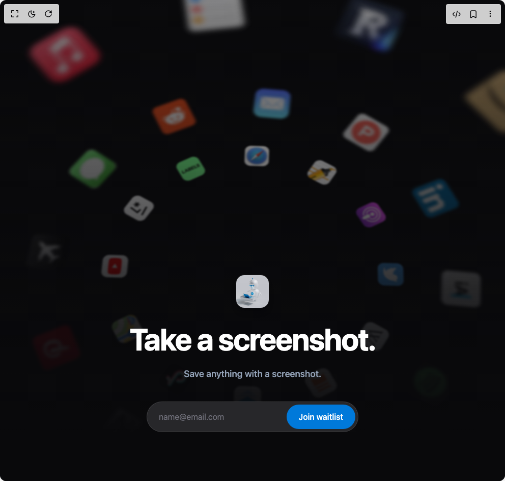

# Build Waitlist Hero in BuilderStudio

> Build this component in our Agentic IDE: [BuilderStudio](https://builderstudio.dev).
>
> Join the BuilderStudio community on [Discord](https://discord.gg/QdWeSGCqfe) and [Reddit](https://reddit.com/r/builderstudio).



## Component

- Author group: `thanh`
- Component: `waitlist-hero`
- Variant: `default`
- Rendered HTML snapshot: [`rendered.html`](rendered.html)

## BuilderStudio prompt

You are implementing a React component based on a component reference.

## Component identity

- Author: thanh
- Component slug: waitlist-hero
- Demo slug: default
- Title: waitlist-hero
- Description: 

## Goal

Recreate this component in a React + TypeScript + Tailwind CSS project. Preserve the visual layout, spacing, colors, border radius, shadows, interaction behavior, animation behavior, responsive behavior, and dark mode behavior shown in the rendered demo.

## Implementation requirements

- Use React and TypeScript.
- Use Tailwind CSS classes whenever possible.
- Keep the component self-contained unless the source files require helper components.
- If the source uses CSS variables, custom CSS, animations, or keyframes, include them.
- If the source uses external packages, list and use the required packages.
- Preserve accessibility attributes, button semantics, links, keyboard behavior, and ARIA attributes when visible in the source.
- Do not replace the component with a simplified placeholder.
- Return complete production-ready code.

## Dependencies

No reference metadata available.

## Rendered DOM snapshot

This is the rendered demo HTML extracted from the live preview. Use it to verify structure, class names, visible content, and layout.

```html
<div id="root"><div class="w-screen min-h-screen flex justify-center items-center"><div class="w-screen min-h-screen flex justify-center items-center"><div class="w-full min-h-screen bg-black flex items-center justify-center"><style>
        @keyframes spin-slow {
          from { transform: rotate(0deg); }
          to { transform: rotate(360deg); }
        }
        .animate-spin-slow {
          animation: spin-slow 60s linear infinite;
        }
        @keyframes spin-slow-reverse {
          from { transform: rotate(0deg); }
          to { transform: rotate(-360deg); }
        }
        .animate-spin-slow-reverse {
          animation: spin-slow-reverse 60s linear infinite;
        }
        @keyframes bounce-in {
          0% { transform: scale(0.8); opacity: 0; }
          50% { transform: scale(1.05); opacity: 1; }
          100% { transform: scale(1); opacity: 1; }
        }
        .animate-bounce-in {
          animation: bounce-in 0.5s cubic-bezier(0.175, 0.885, 0.32, 1.275) forwards;
        }
        @keyframes success-pulse {
          0% { transform: scale(0.5); opacity: 0; }
          50% { transform: scale(1.1); }
          70% { transform: scale(0.95); }
          100% { transform: scale(1); opacity: 1; }
        }
        @keyframes success-glow {
          0%, 100% { box-shadow: 0 0 20px rgba(16, 185, 129, 0.4); }
          50% { box-shadow: 0 0 60px rgba(16, 185, 129, 0.8), 0 0 100px rgba(16, 185, 129, 0.4); }
        }
        @keyframes checkmark-draw {
          0% { stroke-dashoffset: 24; }
          100% { stroke-dashoffset: 0; }
        }
        @keyframes celebration-ring {
          0% { transform: translate(-50%, -50%) scale(0.8); opacity: 1; }
          100% { transform: translate(-50%, -50%) scale(2); opacity: 0; }
        }
        .animate-success-pulse {
          animation: success-pulse 0.6s cubic-bezier(0.175, 0.885, 0.32, 1.275) forwards;
        }
        .animate-success-glow {
          animation: success-glow 2s ease-in-out infinite;
        }
        .animate-checkmark {
          stroke-dasharray: 24;
          stroke-dashoffset: 24;
          animation: checkmark-draw 0.4s ease-out 0.3s forwards;
        }
        .animate-ring {
          animation: celebration-ring 0.8s ease-out forwards;
        }
      </style><div class="relative w-full h-screen overflow-hidden shadow-2xl" style="background-color: rgb(9, 9, 11); font-family: system-ui, -apple-system, BlinkMacSystemFont, &quot;Segoe UI&quot;, Roboto, sans-serif;"><div class="absolute inset-0 w-full h-full pointer-events-none" style="perspective: 1200px; transform: perspective(1200px) rotateX(15deg); transform-origin: center bottom; opacity: 1;"><div class="absolute inset-0 animate-spin-slow"><div class="absolute top-1/2 left-1/2" style="width: 2000px; height: 2000px; transform: translate(-50%, -50%) rotate(279.05deg); z-index: 0;"></div></div><div class="absolute inset-0 animate-spin-slow-reverse"><div class="absolute top-1/2 left-1/2" style="width: 1000px; height: 1000px; transform: translate(-50%, -50%) rotate(304.42deg); z-index: 1;"></div></div><div class="absolute inset-0 animate-spin-slow"><div class="absolute top-1/2 left-1/2" style="width: 800px; height: 800px; transform: translate(-50%, -50%) rotate(48.33deg); z-index: 2;"></div></div></div><div class="absolute inset-0 z-10 pointer-events-none" style="background: linear-gradient(to top, rgb(9, 9, 11) 10%, rgba(9, 9, 11, 0.8) 40%, transparent 100%);"></div><div class="relative z-20 w-full h-full flex flex-col items-center justify-end pb-24 gap-6"><div class="w-16 h-16 rounded-2xl shadow-lg overflow-hidden mb-2 ring-1 ring-white/10"></div><h1 class="text-5xl md:text-6xl font-bold text-center tracking-tight" style="color: rgb(255, 255, 255);">Take a screenshot.</h1><p class="text-lg font-medium" style="color: rgb(148, 163, 184);">Save anything with a screenshot.</p><div class="w-full max-w-md px-4 mt-4 h-[60px] relative perspective-1000"><canvas class="absolute top-1/2 left-1/2 -translate-x-1/2 -translate-y-1/2 w-[600px] h-[600px] pointer-events-none z-50"></canvas><div class="absolute inset-0 flex items-center justify-center rounded-full transition-all duration-500 ease-[cubic-bezier(0.23,1,0.32,1)] opacity-0 scale-95 -rotate-x-90 pointer-events-none" style="background-color: rgb(16, 185, 129);"><div class="flex items-center gap-2 text-white font-semibold text-lg "><div class="bg-white/20 p-1 rounded-full"><svg class="w-5 h-5" fill="none" stroke="currentColor" viewBox="0 0 24 24"><path class="" stroke-linecap="round" stroke-linejoin="round" stroke-width="3" d="M5 13l4 4L19 7"></path></svg></div><span>You're on the list!</span></div></div><form class="relative w-full h-full group transition-all duration-500 ease-[cubic-bezier(0.23,1,0.32,1)] opacity-100 scale-100 rotate-x-0"><input required="" placeholder="name@email.com" class="w-full h-[60px] pl-6 pr-[150px] rounded-full outline-none transition-all duration-200 placeholder-zinc-500 disabled:opacity-70 disabled:cursor-not-allowed" type="email" value="" style="background-color: rgb(39, 39, 42); color: rgb(255, 255, 255); box-shadow: rgba(255, 255, 255, 0.1) 0px 0px 0px 1px inset;"><div class="absolute top-[6px] right-[6px] bottom-[6px]"><button type="submit" class="h-full px-6 rounded-full font-medium text-white transition-all active:scale-95 hover:brightness-110 disabled:hover:brightness-100 disabled:active:scale-100 disabled:cursor-wait flex items-center justify-center min-w-[130px]" style="background-color: rgb(0, 121, 218);">Join waitlist</button></div></form></div></div></div></div></div></div></div>
```

## Reference source files

No reference source files were available.
