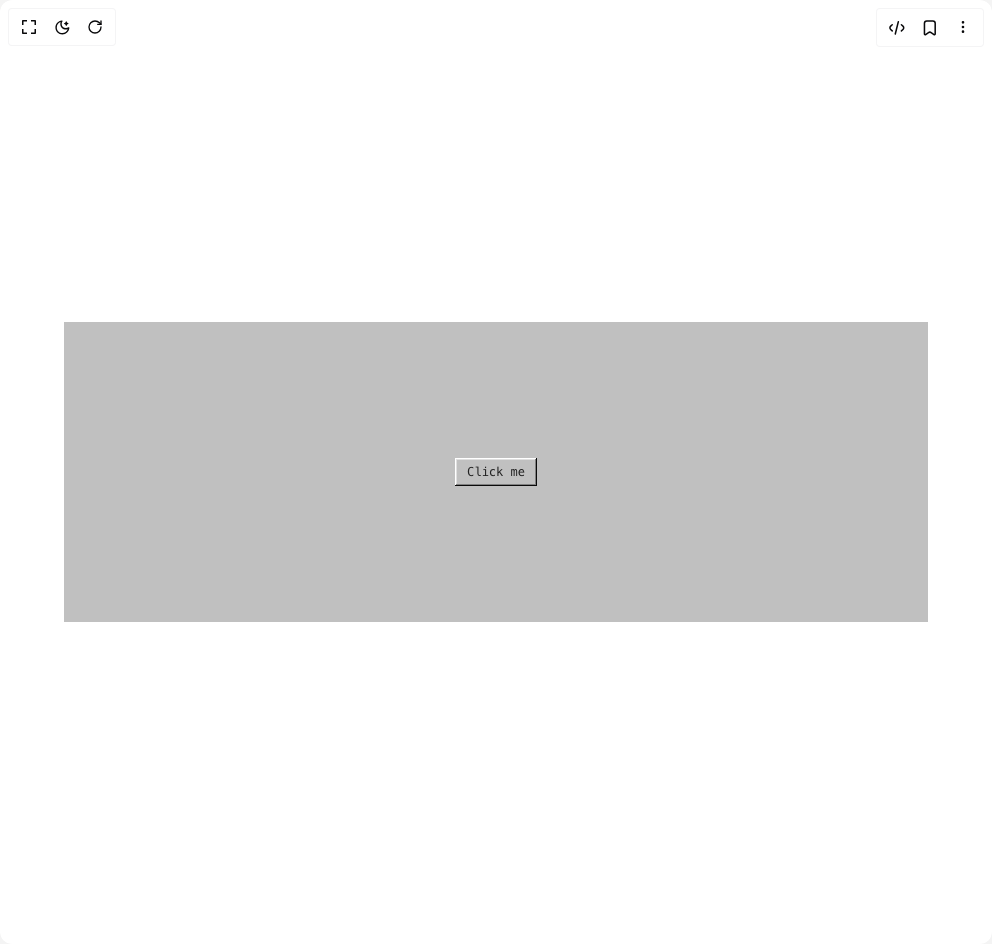

# Build Win 98 Button in BuilderStudio

> Build this component in our Agentic IDE: [BuilderStudio](https://builderstudio.dev).
>
> Join the BuilderStudio community on [Discord](https://discord.gg/QdWeSGCqfe) and [Reddit](https://reddit.com/r/builderstudio).



## Component

- Author group: `thefathdev`
- Component: `win-98-button`
- Variant: `default`
- Rendered HTML snapshot: [`rendered.html`](rendered.html)

## BuilderStudio prompt

You are implementing a React component based on a component reference.

## Component identity

- Author: thefathdev
- Component slug: win-98-button
- Demo slug: default
- Title: win-98-button
- Description: 

## Goal

Recreate this component in a React + TypeScript + Tailwind CSS project. Preserve the visual layout, spacing, colors, border radius, shadows, interaction behavior, animation behavior, responsive behavior, and dark mode behavior shown in the rendered demo.

## Implementation requirements

- Use React and TypeScript.
- Use Tailwind CSS classes whenever possible.
- Keep the component self-contained unless the source files require helper components.
- If the source uses CSS variables, custom CSS, animations, or keyframes, include them.
- If the source uses external packages, list and use the required packages.
- Preserve accessibility attributes, button semantics, links, keyboard behavior, and ARIA attributes when visible in the source.
- Do not replace the component with a simplified placeholder.
- Return complete production-ready code.

## Dependencies

No reference metadata available.

## Rendered DOM snapshot

This is the rendered demo HTML extracted from the live preview. Use it to verify structure, class names, visible content, and layout.

```html
<div id="root"><div class="relative flex items-center justify-center h-screen w-full m-auto p-16 bg-background text-foreground"><div class="absolute lab-bg inset-0 size-full"><div class="absolute inset-0 bg-[radial-gradient(#00000021_1px,transparent_1px)] dark:bg-[radial-gradient(#ffffff22_1px,transparent_1px)]"></div></div><div class="flex w-full justify-center relative"><div class="w-full h-screen max-h-[300px] bg-[silver] flex items-center justify-center"><button class="inline-flex items-center justify-center whitespace-nowrap font-mono text-xs -outline-offset-4 [&amp;_svg]:pointer-events-none [&amp;_svg]:shrink-0 focus:outline-dotted focus:outline-1 focus:outline-black focus-visible:outline-dotted focus-visible:outline-1 focus-visible:outline-black bg-[silver] text-transparent [text-shadow:0_0_#222] disabled:[text-shadow:1_1_0_#fff] disabled:text-[grey] shadow-[inset_-1px_-1px_#0a0a0a,inset_1px_1px_#fff,inset_-2px_-2px_grey,inset_2px_2px_#dfdfdf] active:shadow-[inset_-1px_-1px_#ffffff,inset_1px_1px_#0a0a0a,inset_-2px_-2px_#dfdfdf,inset_2px_2px_#808080] disabled:shadow-[inset_-1px_-1px_#0a0a0a,inset_1px_1px_#fff,inset_-2px_-2px_grey,inset_2px_2px_#dfdfdf] h-7 px-3 min-w-20">Click me</button></div></div></div></div>
```

## Reference source files

No reference source files were available.
