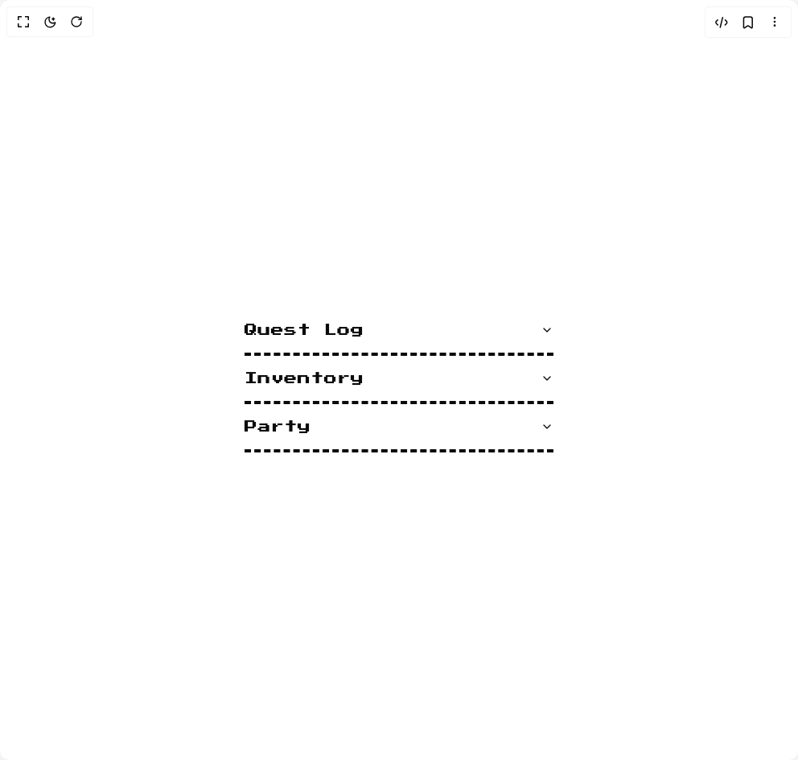

# Build 8bit Accordion in BuilderStudio

> Build this component in our Agentic IDE: [BuilderStudio](https://builderstudio.dev).
>
> Join the BuilderStudio community on [Discord](https://discord.gg/QdWeSGCqfe) and [Reddit](https://reddit.com/r/builderstudio).



## Component

- Author group: `theorcdev`
- Component: `8bit-accordion`
- Variant: `default`
- Rendered HTML snapshot: [`rendered.html`](rendered.html)

## BuilderStudio prompt

You are implementing a React component based on a component reference.

## Component identity

- Author: theorcdev
- Component slug: 8bit-accordion
- Demo slug: default
- Title: 8bit-accordion
- Description: 

## Goal

Recreate this component in a React + TypeScript + Tailwind CSS project. Preserve the visual layout, spacing, colors, border radius, shadows, interaction behavior, animation behavior, responsive behavior, and dark mode behavior shown in the rendered demo.

## Implementation requirements

- Use React and TypeScript.
- Use Tailwind CSS classes whenever possible.
- Keep the component self-contained unless the source files require helper components.
- If the source uses CSS variables, custom CSS, animations, or keyframes, include them.
- If the source uses external packages, list and use the required packages.
- Preserve accessibility attributes, button semantics, links, keyboard behavior, and ARIA attributes when visible in the source.
- Do not replace the component with a simplified placeholder.
- Return complete production-ready code.

## Dependencies

No reference metadata available.

## Rendered DOM snapshot

This is the rendered demo HTML extracted from the live preview. Use it to verify structure, class names, visible content, and layout.

```html
<div id="root"><div class="w-screen min-h-screen flex justify-center items-center"><div class="w-screen min-h-screen flex justify-center items-center"><div class="flex w-full min-h-screen items-center justify-center bg-background p-8 overflow-hidden"><div data-slot="accordion" class="w-full max-w-sm"><div data-slot="accordion-item" class="border-dashed border-b-4 border-foreground dark:border-ring relative"><div class="flex"><button type="button" data-state="closed" data-slot="accordion-trigger" aria-expanded="false" class="flex flex-1 items-center justify-between py-4 font-medium transition-all hover:underline [&amp;[data-state=open]&gt;svg]:rotate-180 retro font-pixel">Quest Log<svg viewBox="0 0 24 24" fill="none" stroke="currentColor" stroke-width="2" stroke-linecap="round" stroke-linejoin="round" class="h-4 w-4 shrink-0 transition-transform duration-200" aria-hidden="true"><polyline points="6 9 12 15 18 9"></polyline></svg></button></div><div data-state="closed" data-slot="accordion-content" class="overflow-hidden text-sm transition-all max-h-0"><div class="pb-4 pt-0 overflow-hidden text-sm retro font-pixel"><div class="pb-4 pt-0 relative z-10 p-1">Defeat the Dungeon Master to claim the legendary sword.</div></div></div></div><div data-slot="accordion-item" class="border-dashed border-b-4 border-foreground dark:border-ring relative"><div class="flex"><button type="button" data-state="closed" data-slot="accordion-trigger" aria-expanded="false" class="flex flex-1 items-center justify-between py-4 font-medium transition-all hover:underline [&amp;[data-state=open]&gt;svg]:rotate-180 retro font-pixel">Inventory<svg viewBox="0 0 24 24" fill="none" stroke="currentColor" stroke-width="2" stroke-linecap="round" stroke-linejoin="round" class="h-4 w-4 shrink-0 transition-transform duration-200" aria-hidden="true"><polyline points="6 9 12 15 18 9"></polyline></svg></button></div><div data-state="closed" data-slot="accordion-content" class="overflow-hidden text-sm transition-all max-h-0"><div class="pb-4 pt-0 overflow-hidden text-sm retro font-pixel"><div class="pb-4 pt-0 relative z-10 p-1">Potion ×3, Elixir ×1, Phoenix Down ×2</div></div></div></div><div data-slot="accordion-item" class="border-dashed border-b-4 border-foreground dark:border-ring relative"><div class="flex"><button type="button" data-state="closed" data-slot="accordion-trigger" aria-expanded="false" class="flex flex-1 items-center justify-between py-4 font-medium transition-all hover:underline [&amp;[data-state=open]&gt;svg]:rotate-180 retro font-pixel">Party<svg viewBox="0 0 24 24" fill="none" stroke="currentColor" stroke-width="2" stroke-linecap="round" stroke-linejoin="round" class="h-4 w-4 shrink-0 transition-transform duration-200" aria-hidden="true"><polyline points="6 9 12 15 18 9"></polyline></svg></button></div><div data-state="closed" data-slot="accordion-content" class="overflow-hidden text-sm transition-all max-h-0"><div class="pb-4 pt-0 overflow-hidden text-sm retro font-pixel"><div class="pb-4 pt-0 relative z-10 p-1">Warrior, Mage, Rogue</div></div></div></div></div></div></div></div></div>
```

## Reference source files

No reference source files were available.
