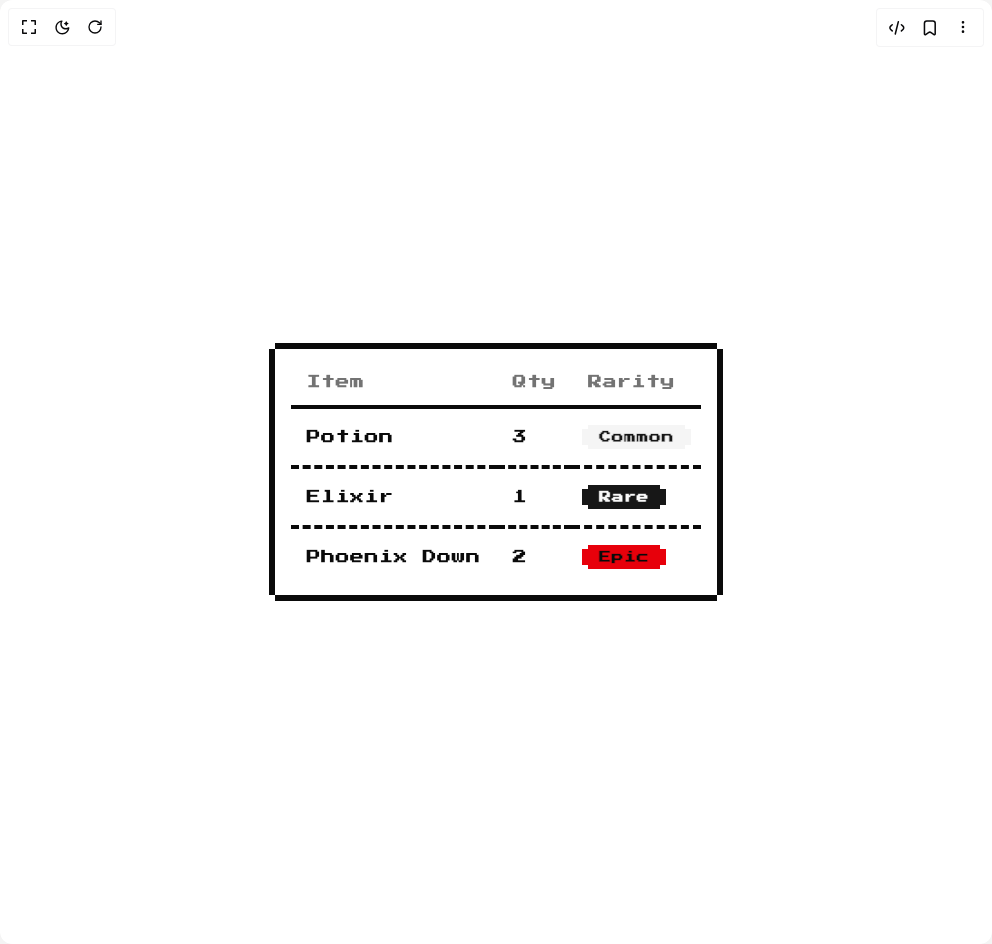

# Build 8bit Table in BuilderStudio

> Build this component in our Agentic IDE: [BuilderStudio](https://builderstudio.dev).
>
> Join the BuilderStudio community on [Discord](https://discord.gg/QdWeSGCqfe) and [Reddit](https://reddit.com/r/builderstudio).



## Component

- Author group: `theorcdev`
- Component: `8bit-table`
- Variant: `default`
- Rendered HTML snapshot: [`rendered.html`](rendered.html)

## BuilderStudio prompt

You are implementing a React component based on a component reference.

## Component identity

- Author: theorcdev
- Component slug: 8bit-table
- Demo slug: default
- Title: 8bit-table
- Description: 

## Goal

Recreate this component in a React + TypeScript + Tailwind CSS project. Preserve the visual layout, spacing, colors, border radius, shadows, interaction behavior, animation behavior, responsive behavior, and dark mode behavior shown in the rendered demo.

## Implementation requirements

- Use React and TypeScript.
- Use Tailwind CSS classes whenever possible.
- Keep the component self-contained unless the source files require helper components.
- If the source uses CSS variables, custom CSS, animations, or keyframes, include them.
- If the source uses external packages, list and use the required packages.
- Preserve accessibility attributes, button semantics, links, keyboard behavior, and ARIA attributes when visible in the source.
- Do not replace the component with a simplified placeholder.
- Return complete production-ready code.

## Dependencies

No reference metadata available.

## Rendered DOM snapshot

This is the rendered demo HTML extracted from the live preview. Use it to verify structure, class names, visible content, and layout.

```html
<div id="root"><div class="w-screen min-h-screen flex justify-center items-center"><div class="w-screen min-h-screen flex justify-center items-center"><div class="flex w-full min-h-screen items-center justify-center bg-background p-8 overflow-hidden font-pixel"><div class="relative flex justify-center w-fit p-4 py-2.5 border-y-6 border-foreground dark:border-ring retro"><div class="relative w-full overflow-auto"><table class="w-full caption-bottom text-sm"><thead class="[&amp;_tr]:border-b border-b-4 border-foreground dark:border-ring"><tr class="border-b transition-colors hover:bg-muted/50 data-[state=selected]:bg-muted border-dashed border-b-4 border-foreground dark:border-ring"><th class="h-12 px-4 text-left align-middle font-medium text-muted-foreground [&amp;:has([role=checkbox])]:pr-0">Item</th><th class="h-12 px-4 text-left align-middle font-medium text-muted-foreground [&amp;:has([role=checkbox])]:pr-0">Qty</th><th class="h-12 px-4 text-left align-middle font-medium text-muted-foreground [&amp;:has([role=checkbox])]:pr-0">Rarity</th></tr></thead><tbody class="[&amp;_tr:last-child]:border-0"><tr class="border-b transition-colors hover:bg-muted/50 data-[state=selected]:bg-muted border-dashed border-b-4 border-foreground dark:border-ring"><td class="p-4 align-middle [&amp;:has([role=checkbox])]:pr-0">Potion</td><td class="p-4 align-middle [&amp;:has([role=checkbox])]:pr-0">3</td><td class="p-4 align-middle [&amp;:has([role=checkbox])]:pr-0"><div class="relative inline-flex items-stretch"><div class="inline-flex items-center rounded-full border px-2.5 py-0.5 text-xs font-semibold transition-colors focus:outline-none focus:ring-2 focus:ring-ring focus:ring-offset-2 border-transparent bg-secondary text-secondary-foreground hover:bg-secondary/80 h-full rounded-none w-full retro">Common</div><div class="-left-1.5 absolute inset-y-[4px] w-1.5 border-secondary bg-secondary"></div><div class="-right-1.5 absolute inset-y-[4px] w-1.5 border-secondary bg-secondary"></div></div></td></tr><tr class="border-b transition-colors hover:bg-muted/50 data-[state=selected]:bg-muted border-dashed border-b-4 border-foreground dark:border-ring"><td class="p-4 align-middle [&amp;:has([role=checkbox])]:pr-0">Elixir</td><td class="p-4 align-middle [&amp;:has([role=checkbox])]:pr-0">1</td><td class="p-4 align-middle [&amp;:has([role=checkbox])]:pr-0"><div class="relative inline-flex items-stretch"><div class="inline-flex items-center rounded-full border px-2.5 py-0.5 text-xs font-semibold transition-colors focus:outline-none focus:ring-2 focus:ring-ring focus:ring-offset-2 border-transparent bg-primary text-primary-foreground hover:bg-primary/80 h-full rounded-none w-full retro">Rare</div><div class="-left-1.5 absolute inset-y-[4px] w-1.5 border-primary bg-primary"></div><div class="-right-1.5 absolute inset-y-[4px] w-1.5 border-primary bg-primary"></div></div></td></tr><tr class="border-b transition-colors hover:bg-muted/50 data-[state=selected]:bg-muted border-dashed border-b-4 border-foreground dark:border-ring"><td class="p-4 align-middle [&amp;:has([role=checkbox])]:pr-0">Phoenix Down</td><td class="p-4 align-middle [&amp;:has([role=checkbox])]:pr-0">2</td><td class="p-4 align-middle [&amp;:has([role=checkbox])]:pr-0"><div class="relative inline-flex items-stretch"><div class="inline-flex items-center rounded-full border px-2.5 py-0.5 text-xs font-semibold transition-colors focus:outline-none focus:ring-2 focus:ring-ring focus:ring-offset-2 border-transparent bg-destructive text-destructive-foreground hover:bg-destructive/80 h-full rounded-none w-full retro">Epic</div><div class="-left-1.5 absolute inset-y-[4px] w-1.5 border-destructive bg-destructive"></div><div class="-right-1.5 absolute inset-y-[4px] w-1.5 border-destructive bg-destructive"></div></div></td></tr></tbody></table></div><div class="absolute inset-0 border-x-6 -mx-1.5 border-foreground dark:border-ring pointer-events-none" aria-hidden="true"></div></div></div></div></div></div>
```

## Reference source files

No reference source files were available.
