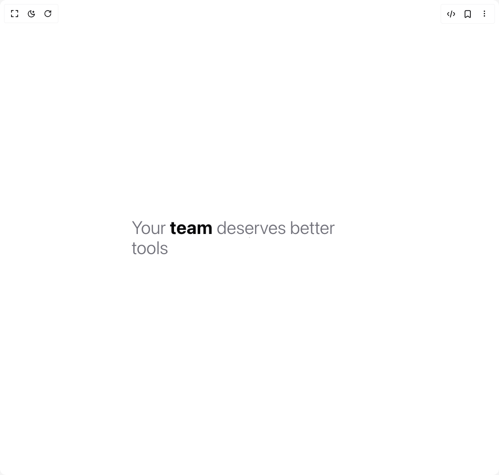

# Build Animated Text Cycle in BuilderStudio

> Build this component in our Agentic IDE: [BuilderStudio](https://builderstudio.dev).
>
> Join the BuilderStudio community on [Discord](https://discord.gg/QdWeSGCqfe) and [Reddit](https://reddit.com/r/builderstudio).



## Component

- Author group: `thimows`
- Component: `animated-text-cycle`
- Variant: `animated-text-cycle`
- Rendered HTML snapshot: [`rendered.html`](rendered.html)

## BuilderStudio prompt

You are implementing a React component based on a component reference.

## Component identity

- Author: thimows
- Component slug: animated-text-cycle
- Demo slug: animated-text-cycle
- Title: animated-text-cycle
- Description: 

## Goal

Recreate this component in a React + TypeScript + Tailwind CSS project. Preserve the visual layout, spacing, colors, border radius, shadows, interaction behavior, animation behavior, responsive behavior, and dark mode behavior shown in the rendered demo.

## Implementation requirements

- Use React and TypeScript.
- Use Tailwind CSS classes whenever possible.
- Keep the component self-contained unless the source files require helper components.
- If the source uses CSS variables, custom CSS, animations, or keyframes, include them.
- If the source uses external packages, list and use the required packages.
- Preserve accessibility attributes, button semantics, links, keyboard behavior, and ARIA attributes when visible in the source.
- Do not replace the component with a simplified placeholder.
- Return complete production-ready code.

## Dependencies

No reference metadata available.

## Rendered DOM snapshot

This is the rendered demo HTML extracted from the live preview. Use it to verify structure, class names, visible content, and layout.

```html
<div id="root"><div class="relative flex items-center justify-center h-screen w-full m-auto p-16 bg-background text-foreground"><div class="absolute lab-bg inset-0 size-full"><div class="absolute inset-0 bg-[radial-gradient(#00000021_1px,transparent_1px)] dark:bg-[radial-gradient(#ffffff22_1px,transparent_1px)]"></div></div><div class="flex w-full justify-center relative"><div class="p-4 max-w-[500px]"><h1 class="text-4xl font-light text-left text-muted-foreground">Your <div aria-hidden="true" class="absolute opacity-0 pointer-events-none" style="visibility: hidden;"><span class="font-bold text-foreground font-semi-bold">business</span><span class="font-bold text-foreground font-semi-bold">team</span><span class="font-bold text-foreground font-semi-bold">workflow</span><span class="font-bold text-foreground font-semi-bold">productivity</span><span class="font-bold text-foreground font-semi-bold">projects</span><span class="font-bold text-foreground font-semi-bold">analytics</span><span class="font-bold text-foreground font-semi-bold">dashboard</span><span class="font-bold text-foreground font-semi-bold">platform</span></div><span class="relative inline-block" style="width: 85.5933px;"><span class="inline-block font-bold text-foreground font-semi-bold" style="white-space: nowrap; opacity: 1; filter: blur(0px); transform: none;">team</span></span> deserves better tools</h1></div></div></div></div>
```

## Reference source files

No reference source files were available.
