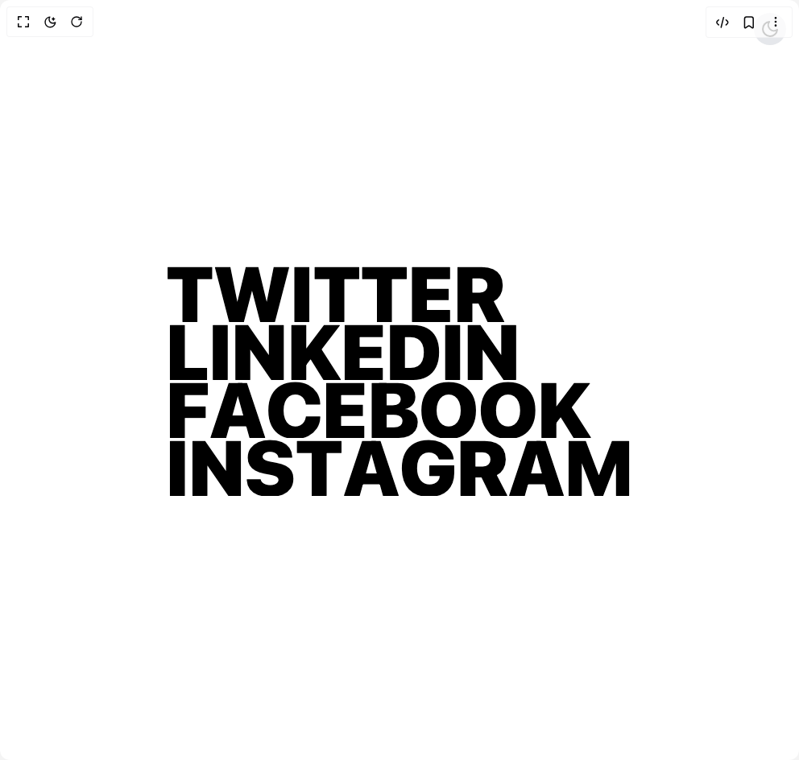
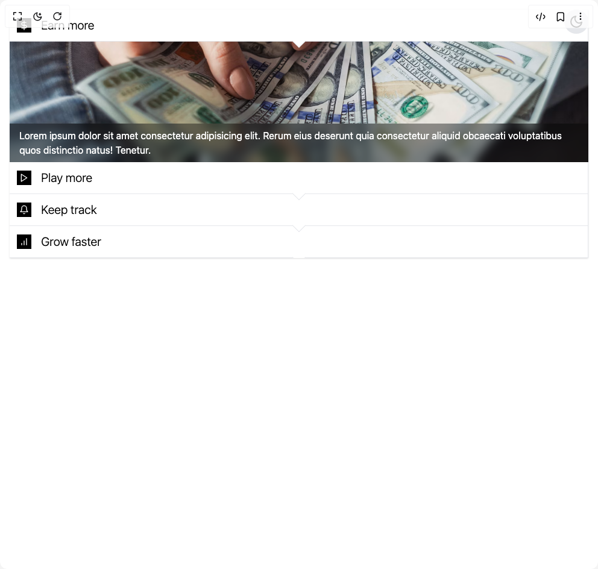

# Tomisloading Components

5 components are available in this author group.

> Build any component in [BuilderStudio](https://builderstudio.dev), then share improvements with the community on [Discord](https://discord.gg/QdWeSGCqfe) or [Reddit](https://reddit.com/r/builderstudio).

| Preview | Component | Variant |
| --- | --- | --- |
|  | [Clip Path Links](clip-path-links/default/README.md) | `default` |
|  | [Kanban](kanban/default/README.md) | `default` |
|  | [Reveal Links](reveal-links/default/README.md) | `default` |
|  | [Squishy Card](squishy-card/default/README.md) | `default` |
|  | [Vertical Accordion](vertical-accordion/default/README.md) | `default` |
