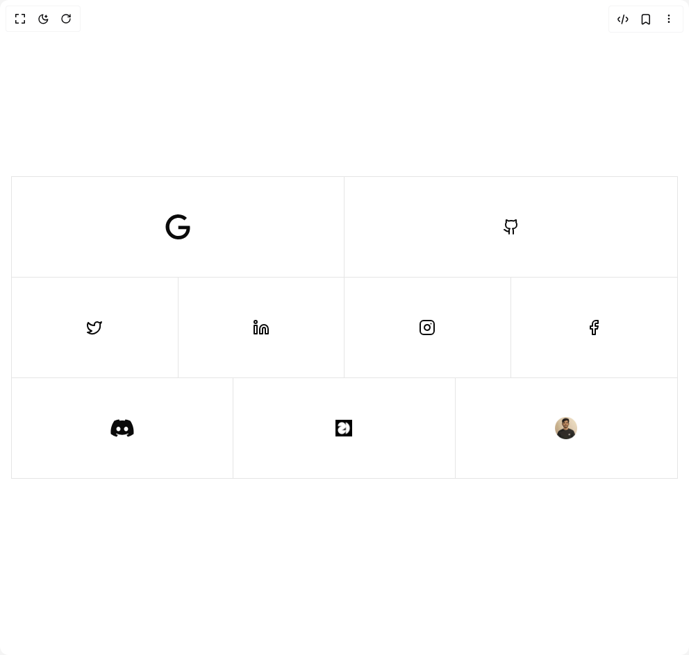

# Build Clip Path Links in BuilderStudio

> Build this component in our Agentic IDE: [BuilderStudio](https://builderstudio.dev).
>
> Join the BuilderStudio community on [Discord](https://discord.gg/QdWeSGCqfe) and [Reddit](https://reddit.com/r/builderstudio).



## Component

- Author group: `tomisloading`
- Component: `clip-path-links`
- Variant: `default`
- Rendered HTML snapshot: [`rendered.html`](rendered.html)

## BuilderStudio prompt

You are implementing a React component based on a component reference.

## Component identity

- Author: TomIsLoading
- Component slug: clip-path-links
- Demo slug: default
- Title: clip-path-links
- Description: 

## Goal

Recreate this component in a React + TypeScript + Tailwind CSS project. Preserve the visual layout, spacing, colors, border radius, shadows, interaction behavior, animation behavior, responsive behavior, and dark mode behavior shown in the rendered demo.

## Implementation requirements

- Use React and TypeScript.
- Use Tailwind CSS classes whenever possible.
- Keep the component self-contained unless the source files require helper components.
- If the source uses CSS variables, custom CSS, animations, or keyframes, include them.
- If the source uses external packages, list and use the required packages.
- Preserve accessibility attributes, button semantics, links, keyboard behavior, and ARIA attributes when visible in the source.
- Do not replace the component with a simplified placeholder.
- Return complete production-ready code.

## Dependencies

No reference metadata available.

## Rendered DOM snapshot

This is the rendered demo HTML extracted from the live preview. Use it to verify structure, class names, visible content, and layout.

```html
<div id="root"><div class="min-h-screen flex items-center justify-center px-4 py-12"><div class="w-full max-w-7xl"><div class="divide-y border divide-border border-border"><div class="grid grid-cols-2 divide-x divide-border"><a href="https://mail.google.com/mail/u/0/?fs=1&amp;to=kamalkamalesh316@gmail.com&amp;tf=cm" target="_blank" rel="noopener noreferrer" class="relative grid h-20 w-full place-content-center sm:h-28 md:h-36 text-foreground bg-background"><svg stroke="currentColor" fill="currentColor" stroke-width="0" role="img" viewBox="0 0 24 24" class="text-xl sm:text-3xl md:text-4xl" height="1em" width="1em" xmlns="http://www.w3.org/2000/svg"><path d="M12.48 10.92v3.28h7.84c-.24 1.84-.853 3.187-1.787 4.133-1.147 1.147-2.933 2.4-6.053 2.4-4.827 0-8.6-3.893-8.6-8.72s3.773-8.72 8.6-8.72c2.6 0 4.507 1.027 5.907 2.347l2.307-2.307C18.747 1.44 16.133 0 12.48 0 5.867 0 .307 5.387.307 12s5.56 12 12.173 12c3.573 0 6.267-1.173 8.373-3.36 2.16-2.16 2.84-5.213 2.84-7.667 0-.76-.053-1.467-.173-2.053H12.48z"></path></svg><div class="absolute inset-0 grid place-content-center bg-primary text-primary-foreground transition-colors duration-300" style="clip-path: polygon(0px 0px, 100% 0px, 0px 0px, 0% 100%);"><svg stroke="currentColor" fill="currentColor" stroke-width="0" role="img" viewBox="0 0 24 24" class="text-xl sm:text-3xl md:text-4xl" height="1em" width="1em" xmlns="http://www.w3.org/2000/svg"><path d="M12.48 10.92v3.28h7.84c-.24 1.84-.853 3.187-1.787 4.133-1.147 1.147-2.933 2.4-6.053 2.4-4.827 0-8.6-3.893-8.6-8.72s3.773-8.72 8.6-8.72c2.6 0 4.507 1.027 5.907 2.347l2.307-2.307C18.747 1.44 16.133 0 12.48 0 5.867 0 .307 5.387.307 12s5.56 12 12.173 12c3.573 0 6.267-1.173 8.373-3.36 2.16-2.16 2.84-5.213 2.84-7.667 0-.76-.053-1.467-.173-2.053H12.48z"></path></svg></div></a><a href="https://github.com/kamaleshsa" target="_blank" rel="noopener noreferrer" class="relative grid h-20 w-full place-content-center sm:h-28 md:h-36 text-foreground bg-background"><svg xmlns="http://www.w3.org/2000/svg" width="24" height="24" viewBox="0 0 24 24" fill="none" stroke="currentColor" stroke-width="2" stroke-linecap="round" stroke-linejoin="round" class="lucide lucide-github text-xl sm:text-3xl md:text-4xl" aria-hidden="true"><path d="M15 22v-4a4.8 4.8 0 0 0-1-3.5c3 0 6-2 6-5.5.08-1.25-.27-2.48-1-3.5.28-1.15.28-2.35 0-3.5 0 0-1 0-3 1.5-2.64-.5-5.36-.5-8 0C6 2 5 2 5 2c-.3 1.15-.3 2.35 0 3.5A5.403 5.403 0 0 0 4 9c0 3.5 3 5.5 6 5.5-.39.49-.68 1.05-.85 1.65-.17.6-.22 1.23-.15 1.85v4"></path><path d="M9 18c-4.51 2-5-2-7-2"></path></svg><div class="absolute inset-0 grid place-content-center bg-primary text-primary-foreground transition-colors duration-300" style="clip-path: polygon(0px 0px, 100% 0px, 0px 0px, 0% 100%);"><svg xmlns="http://www.w3.org/2000/svg" width="24" height="24" viewBox="0 0 24 24" fill="none" stroke="currentColor" stroke-width="2" stroke-linecap="round" stroke-linejoin="round" class="lucide lucide-github text-xl sm:text-3xl md:text-4xl" aria-hidden="true"><path d="M15 22v-4a4.8 4.8 0 0 0-1-3.5c3 0 6-2 6-5.5.08-1.25-.27-2.48-1-3.5.28-1.15.28-2.35 0-3.5 0 0-1 0-3 1.5-2.64-.5-5.36-.5-8 0C6 2 5 2 5 2c-.3 1.15-.3 2.35 0 3.5A5.403 5.403 0 0 0 4 9c0 3.5 3 5.5 6 5.5-.39.49-.68 1.05-.85 1.65-.17.6-.22 1.23-.15 1.85v4"></path><path d="M9 18c-4.51 2-5-2-7-2"></path></svg></div></a></div><div class="grid grid-cols-4 divide-x divide-border"><a href="https://x.com/Kamales71036733" target="_blank" rel="noopener noreferrer" class="relative grid h-20 w-full place-content-center sm:h-28 md:h-36 text-foreground bg-background"><svg xmlns="http://www.w3.org/2000/svg" width="24" height="24" viewBox="0 0 24 24" fill="none" stroke="currentColor" stroke-width="2" stroke-linecap="round" stroke-linejoin="round" class="lucide lucide-twitter text-xl sm:text-3xl md:text-4xl" aria-hidden="true"><path d="M22 4s-.7 2.1-2 3.4c1.6 10-9.4 17.3-18 11.6 2.2.1 4.4-.6 6-2C3 15.5.5 9.6 3 5c2.2 2.6 5.6 4.1 9 4-.9-4.2 4-6.6 7-3.8 1.1 0 3-1.2 3-1.2z"></path></svg><div class="absolute inset-0 grid place-content-center bg-primary text-primary-foreground transition-colors duration-300" style="clip-path: polygon(0px 0px, 100% 0px, 0px 0px, 0% 100%);"><svg xmlns="http://www.w3.org/2000/svg" width="24" height="24" viewBox="0 0 24 24" fill="none" stroke="currentColor" stroke-width="2" stroke-linecap="round" stroke-linejoin="round" class="lucide lucide-twitter text-xl sm:text-3xl md:text-4xl" aria-hidden="true"><path d="M22 4s-.7 2.1-2 3.4c1.6 10-9.4 17.3-18 11.6 2.2.1 4.4-.6 6-2C3 15.5.5 9.6 3 5c2.2 2.6 5.6 4.1 9 4-.9-4.2 4-6.6 7-3.8 1.1 0 3-1.2 3-1.2z"></path></svg></div></a><a href="https://www.linkedin.com/in/kamaleshsa" target="_blank" rel="noopener noreferrer" class="relative grid h-20 w-full place-content-center sm:h-28 md:h-36 text-foreground bg-background"><svg xmlns="http://www.w3.org/2000/svg" width="24" height="24" viewBox="0 0 24 24" fill="none" stroke="currentColor" stroke-width="2" stroke-linecap="round" stroke-linejoin="round" class="lucide lucide-linkedin text-xl sm:text-3xl md:text-4xl" aria-hidden="true"><path d="M16 8a6 6 0 0 1 6 6v7h-4v-7a2 2 0 0 0-2-2 2 2 0 0 0-2 2v7h-4v-7a6 6 0 0 1 6-6z"></path><rect width="4" height="12" x="2" y="9"></rect><circle cx="4" cy="4" r="2"></circle></svg><div class="absolute inset-0 grid place-content-center bg-primary text-primary-foreground transition-colors duration-300" style="clip-path: polygon(0px 0px, 100% 0px, 0px 0px, 0% 100%);"><svg xmlns="http://www.w3.org/2000/svg" width="24" height="24" viewBox="0 0 24 24" fill="none" stroke="currentColor" stroke-width="2" stroke-linecap="round" stroke-linejoin="round" class="lucide lucide-linkedin text-xl sm:text-3xl md:text-4xl" aria-hidden="true"><path d="M16 8a6 6 0 0 1 6 6v7h-4v-7a2 2 0 0 0-2-2 2 2 0 0 0-2 2v7h-4v-7a6 6 0 0 1 6-6z"></path><rect width="4" height="12" x="2" y="9"></rect><circle cx="4" cy="4" r="2"></circle></svg></div></a><a href="https://www.instagram.com/k.a.m.a_l?igsh=ZmRzbXF6NTBwOXIw" target="_blank" rel="noopener noreferrer" class="relative grid h-20 w-full place-content-center sm:h-28 md:h-36 text-foreground bg-background"><svg xmlns="http://www.w3.org/2000/svg" width="24" height="24" viewBox="0 0 24 24" fill="none" stroke="currentColor" stroke-width="2" stroke-linecap="round" stroke-linejoin="round" class="lucide lucide-instagram text-xl sm:text-3xl md:text-4xl" aria-hidden="true"><rect width="20" height="20" x="2" y="2" rx="5" ry="5"></rect><path d="M16 11.37A4 4 0 1 1 12.63 8 4 4 0 0 1 16 11.37z"></path><line x1="17.5" x2="17.51" y1="6.5" y2="6.5"></line></svg><div class="absolute inset-0 grid place-content-center bg-primary text-primary-foreground transition-colors duration-300" style="clip-path: polygon(0px 0px, 100% 0px, 0px 0px, 0% 100%);"><svg xmlns="http://www.w3.org/2000/svg" width="24" height="24" viewBox="0 0 24 24" fill="none" stroke="currentColor" stroke-width="2" stroke-linecap="round" stroke-linejoin="round" class="lucide lucide-instagram text-xl sm:text-3xl md:text-4xl" aria-hidden="true"><rect width="20" height="20" x="2" y="2" rx="5" ry="5"></rect><path d="M16 11.37A4 4 0 1 1 12.63 8 4 4 0 0 1 16 11.37z"></path><line x1="17.5" x2="17.51" y1="6.5" y2="6.5"></line></svg></div></a><a href="https://www.facebook.com/share/16Zgo4MK6M/" target="_blank" rel="noopener noreferrer" class="relative grid h-20 w-full place-content-center sm:h-28 md:h-36 text-foreground bg-background"><svg xmlns="http://www.w3.org/2000/svg" width="24" height="24" viewBox="0 0 24 24" fill="none" stroke="currentColor" stroke-width="2" stroke-linecap="round" stroke-linejoin="round" class="lucide lucide-facebook text-xl sm:text-3xl md:text-4xl" aria-hidden="true"><path d="M18 2h-3a5 5 0 0 0-5 5v3H7v4h3v8h4v-8h3l1-4h-4V7a1 1 0 0 1 1-1h3z"></path></svg><div class="absolute inset-0 grid place-content-center bg-primary text-primary-foreground transition-colors duration-300" style="clip-path: polygon(0px 0px, 100% 0px, 0px 0px, 0% 100%);"><svg xmlns="http://www.w3.org/2000/svg" width="24" height="24" viewBox="0 0 24 24" fill="none" stroke="currentColor" stroke-width="2" stroke-linecap="round" stroke-linejoin="round" class="lucide lucide-facebook text-xl sm:text-3xl md:text-4xl" aria-hidden="true"><path d="M18 2h-3a5 5 0 0 0-5 5v3H7v4h3v8h4v-8h3l1-4h-4V7a1 1 0 0 1 1-1h3z"></path></svg></div></a></div><div class="grid grid-cols-3 divide-x divide-border"><a href="https://discord.com/users/1367756111725334599" target="_blank" rel="noopener noreferrer" class="relative grid h-20 w-full place-content-center sm:h-28 md:h-36 text-foreground bg-background"><svg stroke="currentColor" fill="currentColor" stroke-width="0" viewBox="0 0 640 512" class="text-xl sm:text-3xl md:text-4xl" height="1em" width="1em" xmlns="http://www.w3.org/2000/svg"><path d="M524.531,69.836a1.5,1.5,0,0,0-.764-.7A485.065,485.065,0,0,0,404.081,32.03a1.816,1.816,0,0,0-1.923.91,337.461,337.461,0,0,0-14.9,30.6,447.848,447.848,0,0,0-134.426,0,309.541,309.541,0,0,0-15.135-30.6,1.89,1.89,0,0,0-1.924-.91A483.689,483.689,0,0,0,116.085,69.137a1.712,1.712,0,0,0-.788.676C39.068,183.651,18.186,294.69,28.43,404.354a2.016,2.016,0,0,0,.765,1.375A487.666,487.666,0,0,0,176.02,479.918a1.9,1.9,0,0,0,2.063-.676A348.2,348.2,0,0,0,208.12,430.4a1.86,1.86,0,0,0-1.019-2.588,321.173,321.173,0,0,1-45.868-21.853,1.885,1.885,0,0,1-.185-3.126c3.082-2.309,6.166-4.711,9.109-7.137a1.819,1.819,0,0,1,1.9-.256c96.229,43.917,200.41,43.917,295.5,0a1.812,1.812,0,0,1,1.924.233c2.944,2.426,6.027,4.851,9.132,7.16a1.884,1.884,0,0,1-.162,3.126,301.407,301.407,0,0,1-45.89,21.83,1.875,1.875,0,0,0-1,2.611,391.055,391.055,0,0,0,30.014,48.815,1.864,1.864,0,0,0,2.063.7A486.048,486.048,0,0,0,610.7,405.729a1.882,1.882,0,0,0,.765-1.352C623.729,277.594,590.933,167.465,524.531,69.836ZM222.491,337.58c-28.972,0-52.844-26.587-52.844-59.239S193.056,219.1,222.491,219.1c29.665,0,53.306,26.82,52.843,59.239C275.334,310.993,251.924,337.58,222.491,337.58Zm195.38,0c-28.971,0-52.843-26.587-52.843-59.239S388.437,219.1,417.871,219.1c29.667,0,53.307,26.82,52.844,59.239C470.715,310.993,447.538,337.58,417.871,337.58Z"></path></svg><div class="absolute inset-0 grid place-content-center bg-primary text-primary-foreground transition-colors duration-300" style="clip-path: polygon(0px 0px, 100% 0px, 0px 0px, 0% 100%);"><svg stroke="currentColor" fill="currentColor" stroke-width="0" viewBox="0 0 640 512" class="text-xl sm:text-3xl md:text-4xl" height="1em" width="1em" xmlns="http://www.w3.org/2000/svg"><path d="M524.531,69.836a1.5,1.5,0,0,0-.764-.7A485.065,485.065,0,0,0,404.081,32.03a1.816,1.816,0,0,0-1.923.91,337.461,337.461,0,0,0-14.9,30.6,447.848,447.848,0,0,0-134.426,0,309.541,309.541,0,0,0-15.135-30.6,1.89,1.89,0,0,0-1.924-.91A483.689,483.689,0,0,0,116.085,69.137a1.712,1.712,0,0,0-.788.676C39.068,183.651,18.186,294.69,28.43,404.354a2.016,2.016,0,0,0,.765,1.375A487.666,487.666,0,0,0,176.02,479.918a1.9,1.9,0,0,0,2.063-.676A348.2,348.2,0,0,0,208.12,430.4a1.86,1.86,0,0,0-1.019-2.588,321.173,321.173,0,0,1-45.868-21.853,1.885,1.885,0,0,1-.185-3.126c3.082-2.309,6.166-4.711,9.109-7.137a1.819,1.819,0,0,1,1.9-.256c96.229,43.917,200.41,43.917,295.5,0a1.812,1.812,0,0,1,1.924.233c2.944,2.426,6.027,4.851,9.132,7.16a1.884,1.884,0,0,1-.162,3.126,301.407,301.407,0,0,1-45.89,21.83,1.875,1.875,0,0,0-1,2.611,391.055,391.055,0,0,0,30.014,48.815,1.864,1.864,0,0,0,2.063.7A486.048,486.048,0,0,0,610.7,405.729a1.882,1.882,0,0,0,.765-1.352C623.729,277.594,590.933,167.465,524.531,69.836ZM222.491,337.58c-28.972,0-52.844-26.587-52.844-59.239S193.056,219.1,222.491,219.1c29.665,0,53.306,26.82,52.843,59.239C275.334,310.993,251.924,337.58,222.491,337.58Zm195.38,0c-28.971,0-52.843-26.587-52.843-59.239S388.437,219.1,417.871,219.1c29.667,0,53.307,26.82,52.844,59.239C470.715,310.993,447.538,337.58,417.871,337.58Z"></path></svg></div></a><a href="https://builderstudio.dev/kamaleshsa" target="_blank" rel="noopener noreferrer" class="relative grid h-20 w-full place-content-center sm:h-28 md:h-36 text-foreground bg-background"><div class="absolute inset-0 grid place-content-center bg-primary text-primary-foreground transition-colors duration-300" style="clip-path: polygon(0px 0px, 100% 0px, 0px 0px, 0% 100%);"></div></a><a href="https://kamaleshsaportfolio.netlify.app/" target="_blank" rel="noopener noreferrer" class="relative grid h-20 w-full place-content-center sm:h-28 md:h-36 text-foreground bg-background"><div class="absolute inset-0 grid place-content-center bg-primary text-primary-foreground transition-colors duration-300" style="clip-path: polygon(0px 0px, 100% 0px, 0px 0px, 0% 100%);"></div></a></div></div></div></div></div>
```

## Reference source files

No reference source files were available.
