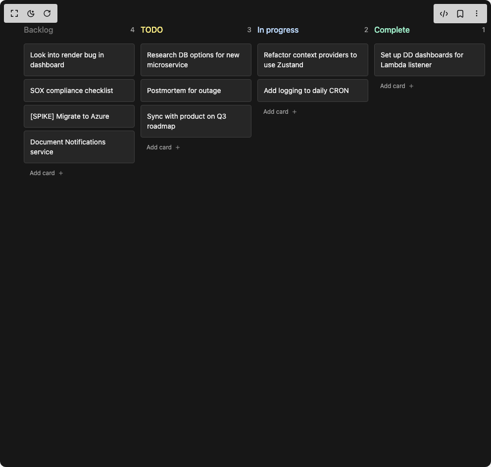

# Build Kanban in BuilderStudio

> Build this component in our Agentic IDE: [BuilderStudio](https://builderstudio.dev).
>
> Join the BuilderStudio community on [Discord](https://discord.gg/QdWeSGCqfe) and [Reddit](https://reddit.com/r/builderstudio).



## Component

- Author group: `tomisloading`
- Component: `kanban`
- Variant: `default`
- Rendered HTML snapshot: [`rendered.html`](rendered.html)

## BuilderStudio prompt

You are implementing a React component based on a component reference.

## Component identity

- Author: TomIsLoading
- Component slug: kanban
- Demo slug: default
- Title: kanban
- Description: 

## Goal

Recreate this component in a React + TypeScript + Tailwind CSS project. Preserve the visual layout, spacing, colors, border radius, shadows, interaction behavior, animation behavior, responsive behavior, and dark mode behavior shown in the rendered demo.

## Implementation requirements

- Use React and TypeScript.
- Use Tailwind CSS classes whenever possible.
- Keep the component self-contained unless the source files require helper components.
- If the source uses CSS variables, custom CSS, animations, or keyframes, include them.
- If the source uses external packages, list and use the required packages.
- Preserve accessibility attributes, button semantics, links, keyboard behavior, and ARIA attributes when visible in the source.
- Do not replace the component with a simplified placeholder.
- Return complete production-ready code.

## Dependencies

No reference metadata available.

## Rendered DOM snapshot

This is the rendered demo HTML extracted from the live preview. Use it to verify structure, class names, visible content, and layout.

```html
<div id="root"><div class="flex h-screen w-full justify-center items-center"><div class="h-screen w-full bg-neutral-900 text-neutral-50"><div class="flex h-full w-full gap-3 overflow-scroll p-12"><div class="w-56 shrink-0"><div class="mb-3 flex items-center justify-between"><h3 class="font-medium text-neutral-500">Backlog</h3><span class="rounded text-sm text-neutral-400">4</span></div><div class="h-full w-full transition-colors bg-neutral-800/0"><div data-before="1" data-column="backlog" class="my-0.5 h-0.5 w-full bg-violet-400 opacity-0"></div><div draggable="true" class="cursor-grab rounded border border-neutral-700 bg-neutral-800 p-3 active:cursor-grabbing" style="opacity: 1;"><p class="text-sm text-neutral-100">Look into render bug in dashboard</p></div><div data-before="2" data-column="backlog" class="my-0.5 h-0.5 w-full bg-violet-400 opacity-0"></div><div draggable="true" class="cursor-grab rounded border border-neutral-700 bg-neutral-800 p-3 active:cursor-grabbing" style="opacity: 1;"><p class="text-sm text-neutral-100">SOX compliance checklist</p></div><div data-before="3" data-column="backlog" class="my-0.5 h-0.5 w-full bg-violet-400 opacity-0"></div><div draggable="true" class="cursor-grab rounded border border-neutral-700 bg-neutral-800 p-3 active:cursor-grabbing" style="opacity: 1;"><p class="text-sm text-neutral-100">[SPIKE] Migrate to Azure</p></div><div data-before="4" data-column="backlog" class="my-0.5 h-0.5 w-full bg-violet-400 opacity-0"></div><div draggable="true" class="cursor-grab rounded border border-neutral-700 bg-neutral-800 p-3 active:cursor-grabbing" style="opacity: 1;"><p class="text-sm text-neutral-100">Document Notifications service</p></div><div data-before="-1" data-column="backlog" class="my-0.5 h-0.5 w-full bg-violet-400 opacity-0"></div><button class="flex w-full items-center gap-1.5 px-3 py-1.5 text-xs text-neutral-400 transition-colors hover:text-neutral-50"><span>Add card</span><svg stroke="currentColor" fill="none" stroke-width="2" viewBox="0 0 24 24" stroke-linecap="round" stroke-linejoin="round" height="1em" width="1em" xmlns="http://www.w3.org/2000/svg"><line x1="12" y1="5" x2="12" y2="19"></line><line x1="5" y1="12" x2="19" y2="12"></line></svg></button></div></div><div class="w-56 shrink-0"><div class="mb-3 flex items-center justify-between"><h3 class="font-medium text-yellow-200">TODO</h3><span class="rounded text-sm text-neutral-400">3</span></div><div class="h-full w-full transition-colors bg-neutral-800/0"><div data-before="5" data-column="todo" class="my-0.5 h-0.5 w-full bg-violet-400 opacity-0"></div><div draggable="true" class="cursor-grab rounded border border-neutral-700 bg-neutral-800 p-3 active:cursor-grabbing" style="opacity: 1;"><p class="text-sm text-neutral-100">Research DB options for new microservice</p></div><div data-before="6" data-column="todo" class="my-0.5 h-0.5 w-full bg-violet-400 opacity-0"></div><div draggable="true" class="cursor-grab rounded border border-neutral-700 bg-neutral-800 p-3 active:cursor-grabbing" style="opacity: 1;"><p class="text-sm text-neutral-100">Postmortem for outage</p></div><div data-before="7" data-column="todo" class="my-0.5 h-0.5 w-full bg-violet-400 opacity-0"></div><div draggable="true" class="cursor-grab rounded border border-neutral-700 bg-neutral-800 p-3 active:cursor-grabbing" style="opacity: 1;"><p class="text-sm text-neutral-100">Sync with product on Q3 roadmap</p></div><div data-before="-1" data-column="todo" class="my-0.5 h-0.5 w-full bg-violet-400 opacity-0"></div><button class="flex w-full items-center gap-1.5 px-3 py-1.5 text-xs text-neutral-400 transition-colors hover:text-neutral-50"><span>Add card</span><svg stroke="currentColor" fill="none" stroke-width="2" viewBox="0 0 24 24" stroke-linecap="round" stroke-linejoin="round" height="1em" width="1em" xmlns="http://www.w3.org/2000/svg"><line x1="12" y1="5" x2="12" y2="19"></line><line x1="5" y1="12" x2="19" y2="12"></line></svg></button></div></div><div class="w-56 shrink-0"><div class="mb-3 flex items-center justify-between"><h3 class="font-medium text-blue-200">In progress</h3><span class="rounded text-sm text-neutral-400">2</span></div><div class="h-full w-full transition-colors bg-neutral-800/0"><div data-before="8" data-column="doing" class="my-0.5 h-0.5 w-full bg-violet-400 opacity-0"></div><div draggable="true" class="cursor-grab rounded border border-neutral-700 bg-neutral-800 p-3 active:cursor-grabbing" style="opacity: 1;"><p class="text-sm text-neutral-100">Refactor context providers to use Zustand</p></div><div data-before="9" data-column="doing" class="my-0.5 h-0.5 w-full bg-violet-400 opacity-0"></div><div draggable="true" class="cursor-grab rounded border border-neutral-700 bg-neutral-800 p-3 active:cursor-grabbing" style="opacity: 1;"><p class="text-sm text-neutral-100">Add logging to daily CRON</p></div><div data-before="-1" data-column="doing" class="my-0.5 h-0.5 w-full bg-violet-400 opacity-0"></div><button class="flex w-full items-center gap-1.5 px-3 py-1.5 text-xs text-neutral-400 transition-colors hover:text-neutral-50"><span>Add card</span><svg stroke="currentColor" fill="none" stroke-width="2" viewBox="0 0 24 24" stroke-linecap="round" stroke-linejoin="round" height="1em" width="1em" xmlns="http://www.w3.org/2000/svg"><line x1="12" y1="5" x2="12" y2="19"></line><line x1="5" y1="12" x2="19" y2="12"></line></svg></button></div></div><div class="w-56 shrink-0"><div class="mb-3 flex items-center justify-between"><h3 class="font-medium text-emerald-200">Complete</h3><span class="rounded text-sm text-neutral-400">1</span></div><div class="h-full w-full transition-colors bg-neutral-800/0"><div data-before="10" data-column="done" class="my-0.5 h-0.5 w-full bg-violet-400 opacity-0"></div><div draggable="true" class="cursor-grab rounded border border-neutral-700 bg-neutral-800 p-3 active:cursor-grabbing" style="opacity: 1;"><p class="text-sm text-neutral-100">Set up DD dashboards for Lambda listener</p></div><div data-before="-1" data-column="done" class="my-0.5 h-0.5 w-full bg-violet-400 opacity-0"></div><button class="flex w-full items-center gap-1.5 px-3 py-1.5 text-xs text-neutral-400 transition-colors hover:text-neutral-50"><span>Add card</span><svg stroke="currentColor" fill="none" stroke-width="2" viewBox="0 0 24 24" stroke-linecap="round" stroke-linejoin="round" height="1em" width="1em" xmlns="http://www.w3.org/2000/svg"><line x1="12" y1="5" x2="12" y2="19"></line><line x1="5" y1="12" x2="19" y2="12"></line></svg></button></div></div><div class="mt-10 grid h-56 w-56 shrink-0 place-content-center rounded border text-3xl border-neutral-500 bg-neutral-500/20 text-neutral-500"><svg stroke="currentColor" fill="none" stroke-width="2" viewBox="0 0 24 24" stroke-linecap="round" stroke-linejoin="round" height="1em" width="1em" xmlns="http://www.w3.org/2000/svg"><polyline points="3 6 5 6 21 6"></polyline><path d="M19 6v14a2 2 0 0 1-2 2H7a2 2 0 0 1-2-2V6m3 0V4a2 2 0 0 1 2-2h4a2 2 0 0 1 2 2v2"></path></svg></div></div></div></div></div>
```

## Reference source files

No reference source files were available.
