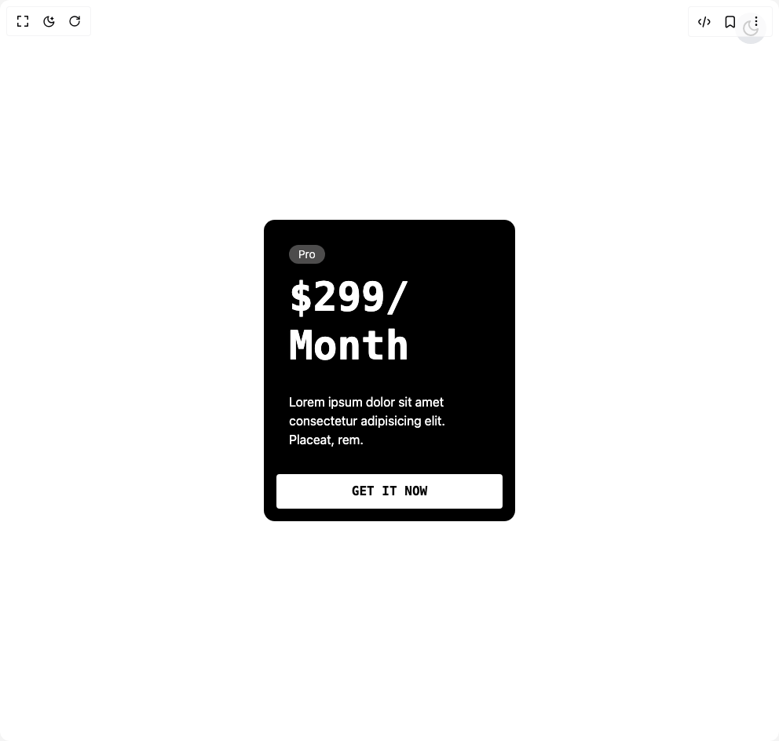

# Build Squishy Card in BuilderStudio

> Build this component in our Agentic IDE: [BuilderStudio](https://builderstudio.dev).
>
> Join the BuilderStudio community on [Discord](https://discord.gg/QdWeSGCqfe) and [Reddit](https://reddit.com/r/builderstudio).



## Component

- Author group: `tomisloading`
- Component: `squishy-card`
- Variant: `default`
- Rendered HTML snapshot: [`rendered.html`](rendered.html)

## BuilderStudio prompt

You are implementing a React component based on a component reference.

## Component identity

- Author: TomIsLoading
- Component slug: squishy-card
- Demo slug: default
- Title: squishy-card
- Description: 

## Goal

Recreate this component in a React + TypeScript + Tailwind CSS project. Preserve the visual layout, spacing, colors, border radius, shadows, interaction behavior, animation behavior, responsive behavior, and dark mode behavior shown in the rendered demo.

## Implementation requirements

- Use React and TypeScript.
- Use Tailwind CSS classes whenever possible.
- Keep the component self-contained unless the source files require helper components.
- If the source uses CSS variables, custom CSS, animations, or keyframes, include them.
- If the source uses external packages, list and use the required packages.
- Preserve accessibility attributes, button semantics, links, keyboard behavior, and ARIA attributes when visible in the source.
- Do not replace the component with a simplified placeholder.
- Return complete production-ready code.

## Dependencies

No reference metadata available.

## Rendered DOM snapshot

This is the rendered demo HTML extracted from the live preview. Use it to verify structure, class names, visible content, and layout.

```html
<div id="root"><div class="flex h-screen w-full justify-center items-center bg-white dark:bg-black relative"><section class="bg-white dark:bg-black px-4 py-12 w-full h-full flex justify-center items-center"><div class="mx-auto w-fit"><div class="relative h-96 w-80 shrink-0 overflow-hidden rounded-xl bg-black dark:bg-white p-8"><div class="relative z-10 text-white dark:text-black"><span class="mb-3 block w-fit rounded-full bg-white/30 text-white dark:bg-black/30 dark:text-black px-3 py-0.5 text-sm font-light">Pro</span><span class="my-2 block origin-top-left font-mono text-6xl font-black leading-[1.2]" style="transform: scale(0.85);">$299/<br>Month</span><p>Lorem ipsum dolor sit amet consectetur adipisicing elit. Placeat, rem.</p></div><button class="absolute bottom-4 left-4 right-4 z-20 rounded border-2 border-white bg-white py-2 text-center font-mono font-black uppercase text-black backdrop-blur transition-colors hover:bg-white/30 hover:text-white dark:border-black dark:bg-black dark:text-white dark:hover:bg-black/30 dark:hover:text-black">Get it now</button><svg width="320" height="384" viewBox="0 0 320 384" fill="none" xmlns="http://www.w3.org/2000/svg" class="absolute inset-0 z-0"><circle cx="160.5" cy="114.5" r="101.5" fill="rgba(0,0,0,0.1)" class="dark:fill-[rgba(255,255,255,0.1)]"></circle><ellipse cx="160.5" cy="265.5" rx="101.5" ry="43.5" fill="rgba(0,0,0,0.1)" class="dark:fill-[rgba(255,255,255,0.1)]"></ellipse></svg></div></div></section><button class="absolute top-4 right-4 p-2 rounded-full bg-gray-200 dark:bg-gray-800 text-black dark:text-white transition-colors duration-200" aria-label="Toggle theme"><svg stroke="currentColor" fill="none" stroke-width="2" viewBox="0 0 24 24" stroke-linecap="round" stroke-linejoin="round" height="24" width="24" xmlns="http://www.w3.org/2000/svg"><path d="M21 12.79A9 9 0 1 1 11.21 3 7 7 0 0 0 21 12.79z"></path></svg></button></div></div>
```

## Reference source files

No reference source files were available.
