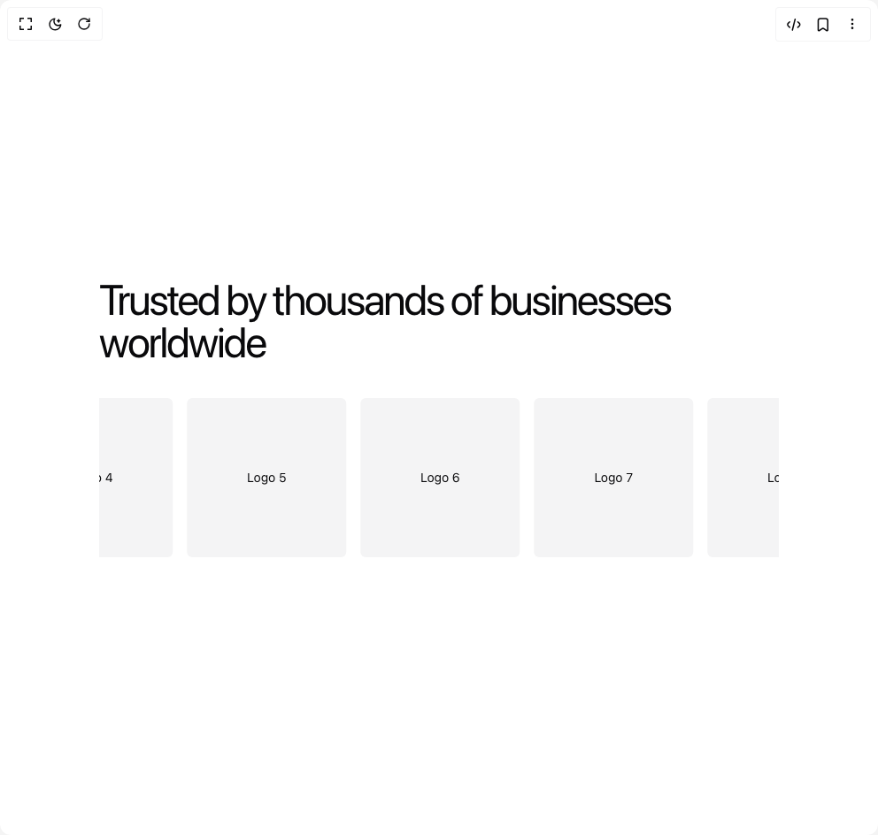
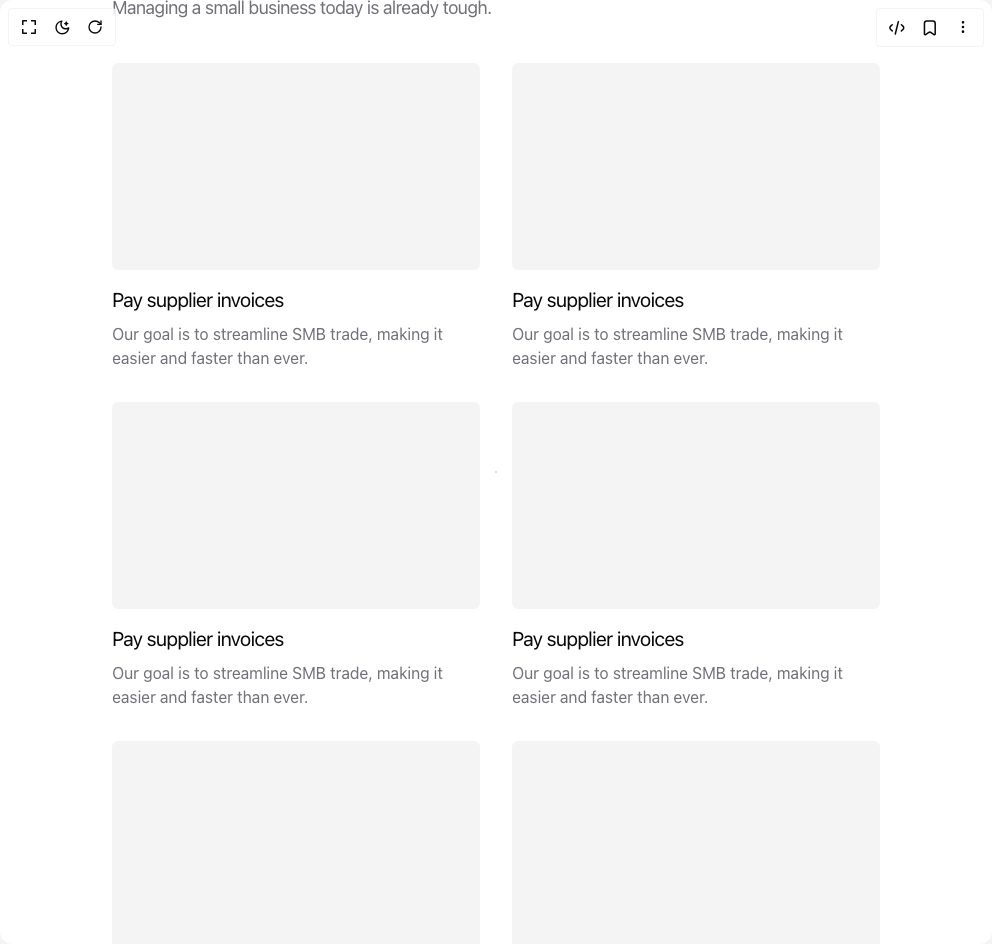
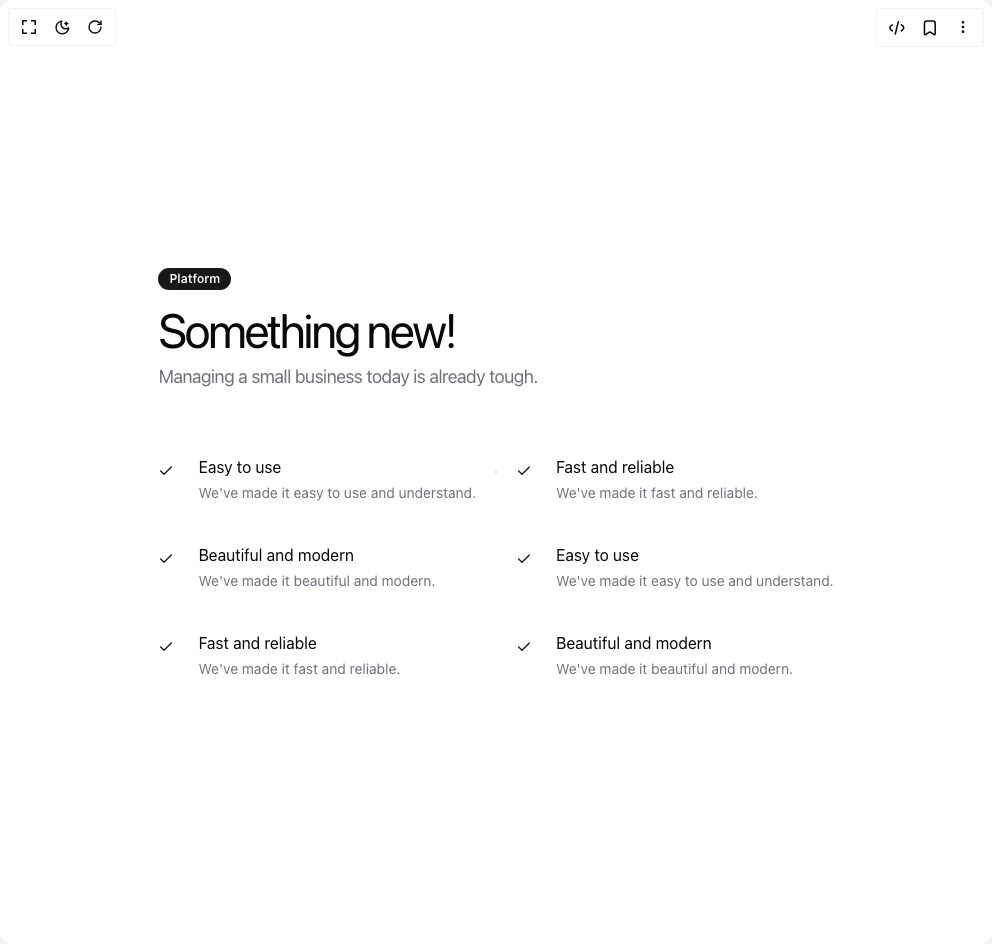
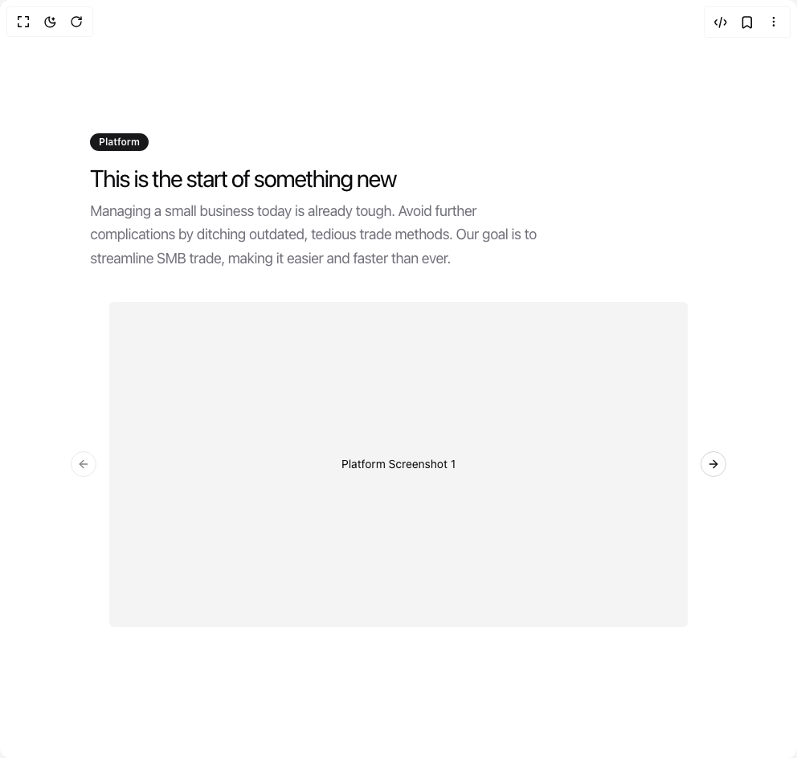
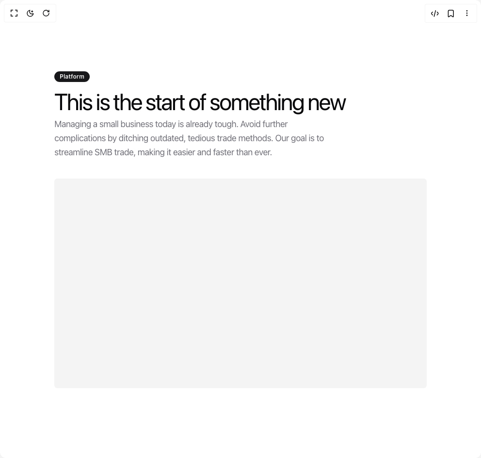
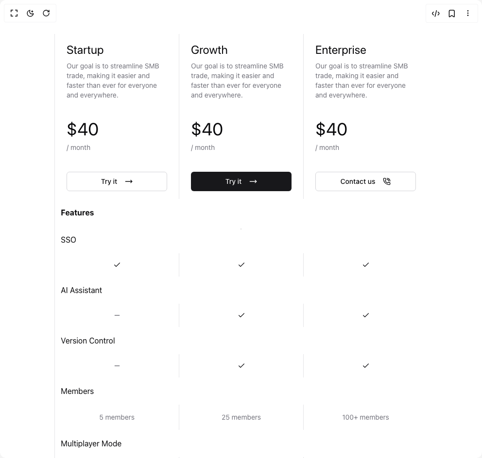

# Tommyjepsen Components

17 components are available in this author group.

> Build any component in [BuilderStudio](https://builderstudio.dev), then share improvements with the community on [Discord](https://discord.gg/QdWeSGCqfe) or [Reddit](https://reddit.com/r/builderstudio).

| Preview | Component | Variant |
| --- | --- | --- |
|  | [Animated Hero](animated-hero/default/README.md) | `default` |
|  | [Blog Section With Rich Preview](blog-section-with-rich-preview/default/README.md) | `default` |
|  | [Call To Action](call-to-action/default/README.md) | `default` |
|  | [Cases With Infinite Scroll](cases-with-infinite-scroll/default/README.md) | `default` |
|  | [Faq Section](faq-section/default/README.md) | `default` |
|  | [Feature Section With Grid](feature-section-with-grid/default/README.md) | `default` |
|  | [Feature With Advantages](feature-with-advantages/default/README.md) | `default` |
|  | [Feature With Image Carousel](feature-with-image-carousel/default/README.md) | `default` |
|  | [Feature With Image Comparison](feature-with-image-comparison/default/README.md) | `default` |
|  | [Feature With Image](feature-with-image/default/README.md) | `default` |
|  | [Feature](feature/default/README.md) | `default` |
|  | [Hero With Group Of Images Text And Two Buttons](hero-with-group-of-images-text-and-two-buttons/default/README.md) | `default` |
|  | [Hero With Image Text And Two Buttons](hero-with-image-text-and-two-buttons/default/README.md) | `default` |
|  | [Hero With Text And Two Button](hero-with-text-and-two-button/default/README.md) | `default` |
|  | [Pricing Cards](pricing-cards/default/README.md) | `default` |
|  | [Pricing Section With Comparison](pricing-section-with-comparison/default/README.md) | `default` |
|  | [Testimonials](testimonials/default/README.md) | `default` |
