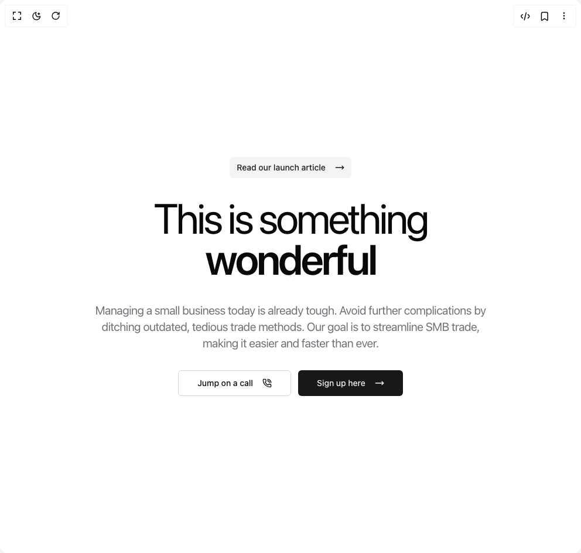

# Build Animated Hero in BuilderStudio

> Build this component in our Agentic IDE: [BuilderStudio](https://builderstudio.dev).
>
> Join the BuilderStudio community on [Discord](https://discord.gg/QdWeSGCqfe) and [Reddit](https://reddit.com/r/builderstudio).



## Component

- Author group: `tommyjepsen`
- Component: `animated-hero`
- Variant: `default`
- Rendered HTML snapshot: [`rendered.html`](rendered.html)

## BuilderStudio prompt

You are implementing a React component based on a component reference.

## Component identity

- Author: tommyjepsen
- Component slug: animated-hero
- Demo slug: default
- Title: animated-hero
- Description: 

## Goal

Recreate this component in a React + TypeScript + Tailwind CSS project. Preserve the visual layout, spacing, colors, border radius, shadows, interaction behavior, animation behavior, responsive behavior, and dark mode behavior shown in the rendered demo.

## Implementation requirements

- Use React and TypeScript.
- Use Tailwind CSS classes whenever possible.
- Keep the component self-contained unless the source files require helper components.
- If the source uses CSS variables, custom CSS, animations, or keyframes, include them.
- If the source uses external packages, list and use the required packages.
- Preserve accessibility attributes, button semantics, links, keyboard behavior, and ARIA attributes when visible in the source.
- Do not replace the component with a simplified placeholder.
- Return complete production-ready code.

## Dependencies

No reference metadata available.

## Rendered DOM snapshot

This is the rendered demo HTML extracted from the live preview. Use it to verify structure, class names, visible content, and layout.

```html
<div id="root"><div class="relative flex items-center justify-center h-screen w-full m-auto p-16 bg-background text-foreground"><div class="absolute lab-bg inset-0 size-full"><div class="absolute inset-0 bg-[radial-gradient(#00000021_1px,transparent_1px)] dark:bg-[radial-gradient(#ffffff22_1px,transparent_1px)]"></div></div><div class="flex w-full justify-center relative"><div class="block"><div class="w-full"><div class="container mx-auto"><div class="flex gap-8 py-20 lg:py-40 items-center justify-center flex-col"><div><button class="inline-flex items-center justify-center whitespace-nowrap text-sm font-medium ring-offset-background transition-colors focus-visible:outline-none focus-visible:ring-2 focus-visible:ring-ring focus-visible:ring-offset-2 disabled:pointer-events-none disabled:opacity-50 bg-secondary text-secondary-foreground hover:bg-secondary/80 h-9 rounded-md px-3 gap-4">Read our launch article <svg xmlns="http://www.w3.org/2000/svg" width="24" height="24" viewBox="0 0 24 24" fill="none" stroke="currentColor" stroke-width="2" stroke-linecap="round" stroke-linejoin="round" class="lucide lucide-move-right w-4 h-4" aria-hidden="true"><path d="M18 8L22 12L18 16"></path><path d="M2 12H22"></path></svg></button></div><div class="flex gap-4 flex-col"><h1 class="text-5xl md:text-7xl max-w-2xl tracking-tighter text-center font-regular"><span class="text-spektr-cyan-50">This is something</span><span class="relative flex w-full justify-center overflow-hidden text-center md:pb-4 md:pt-1">&nbsp;<span class="absolute font-semibold" style="opacity: 0; transform: translateY(-150px);">amazing</span><span class="absolute font-semibold" style="opacity: 1; transform: translateY(-156.144px);">new</span><span class="absolute font-semibold" style="opacity: 0; transform: translateY(-6.14424px);">wonderful</span><span class="absolute font-semibold" style="opacity: 0; transform: translateY(150px);">beautiful</span><span class="absolute font-semibold" style="opacity: 0; transform: translateY(150px);">smart</span></span></h1><p class="text-lg md:text-xl leading-relaxed tracking-tight text-muted-foreground max-w-2xl text-center">Managing a small business today is already tough. Avoid further complications by ditching outdated, tedious trade methods. Our goal is to streamline SMB trade, making it easier and faster than ever.</p></div><div class="flex flex-row gap-3"><button class="inline-flex items-center justify-center whitespace-nowrap text-sm font-medium ring-offset-background transition-colors focus-visible:outline-none focus-visible:ring-2 focus-visible:ring-ring focus-visible:ring-offset-2 disabled:pointer-events-none disabled:opacity-50 border border-input bg-background hover:bg-accent hover:text-accent-foreground h-11 rounded-md px-8 gap-4">Jump on a call <svg xmlns="http://www.w3.org/2000/svg" width="24" height="24" viewBox="0 0 24 24" fill="none" stroke="currentColor" stroke-width="2" stroke-linecap="round" stroke-linejoin="round" class="lucide lucide-phone-call w-4 h-4" aria-hidden="true"><path d="M13 2a9 9 0 0 1 9 9"></path><path d="M13 6a5 5 0 0 1 5 5"></path><path d="M13.832 16.568a1 1 0 0 0 1.213-.303l.355-.465A2 2 0 0 1 17 15h3a2 2 0 0 1 2 2v3a2 2 0 0 1-2 2A18 18 0 0 1 2 4a2 2 0 0 1 2-2h3a2 2 0 0 1 2 2v3a2 2 0 0 1-.8 1.6l-.468.351a1 1 0 0 0-.292 1.233 14 14 0 0 0 6.392 6.384"></path></svg></button><button class="inline-flex items-center justify-center whitespace-nowrap text-sm font-medium ring-offset-background transition-colors focus-visible:outline-none focus-visible:ring-2 focus-visible:ring-ring focus-visible:ring-offset-2 disabled:pointer-events-none disabled:opacity-50 bg-primary text-primary-foreground hover:bg-primary/90 h-11 rounded-md px-8 gap-4">Sign up here <svg xmlns="http://www.w3.org/2000/svg" width="24" height="24" viewBox="0 0 24 24" fill="none" stroke="currentColor" stroke-width="2" stroke-linecap="round" stroke-linejoin="round" class="lucide lucide-move-right w-4 h-4" aria-hidden="true"><path d="M18 8L22 12L18 16"></path><path d="M2 12H22"></path></svg></button></div></div></div></div></div></div></div></div>
```

## Reference source files

No reference source files were available.
