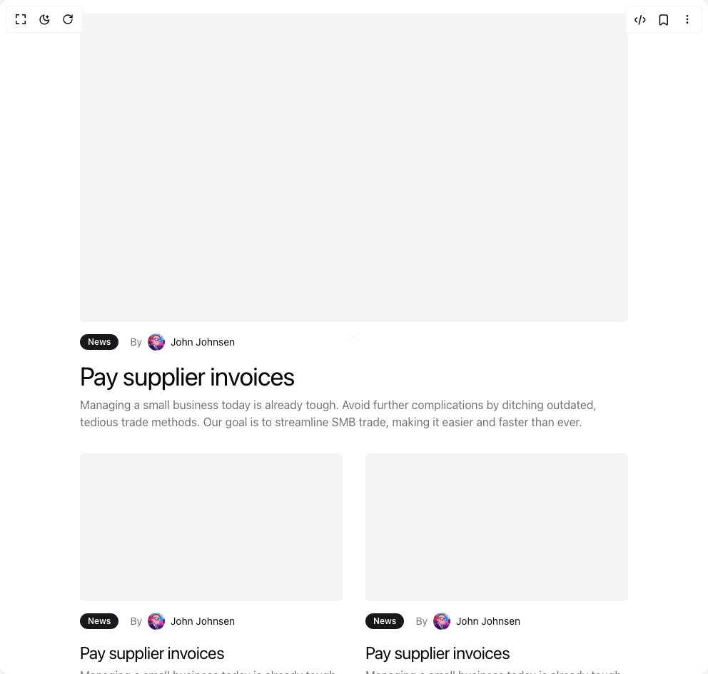

# Build Blog Section With Rich Preview in BuilderStudio

> Build this component in our Agentic IDE: [BuilderStudio](https://builderstudio.dev).
>
> Join the BuilderStudio community on [Discord](https://discord.gg/QdWeSGCqfe) and [Reddit](https://reddit.com/r/builderstudio).



## Component

- Author group: `tommyjepsen`
- Component: `blog-section-with-rich-preview`
- Variant: `default`
- Rendered HTML snapshot: [`rendered.html`](rendered.html)

## BuilderStudio prompt

You are implementing a React component based on a component reference.

## Component identity

- Author: tommyjepsen
- Component slug: blog-section-with-rich-preview
- Demo slug: default
- Title: blog-section-with-rich-preview
- Description: 

## Goal

Recreate this component in a React + TypeScript + Tailwind CSS project. Preserve the visual layout, spacing, colors, border radius, shadows, interaction behavior, animation behavior, responsive behavior, and dark mode behavior shown in the rendered demo.

## Implementation requirements

- Use React and TypeScript.
- Use Tailwind CSS classes whenever possible.
- Keep the component self-contained unless the source files require helper components.
- If the source uses CSS variables, custom CSS, animations, or keyframes, include them.
- If the source uses external packages, list and use the required packages.
- Preserve accessibility attributes, button semantics, links, keyboard behavior, and ARIA attributes when visible in the source.
- Do not replace the component with a simplified placeholder.
- Return complete production-ready code.

## Dependencies

No reference metadata available.

## Rendered DOM snapshot

This is the rendered demo HTML extracted from the live preview. Use it to verify structure, class names, visible content, and layout.

```html
<div id="root"><div class="relative flex items-center justify-center h-screen w-full m-auto p-16 bg-background text-foreground"><div class="absolute lab-bg inset-0 size-full"><div class="absolute inset-0 bg-[radial-gradient(#00000021_1px,transparent_1px)] dark:bg-[radial-gradient(#ffffff22_1px,transparent_1px)]"></div></div><div class="flex w-full justify-center relative"><div class="w-full"><div class="w-full py-20 lg:py-40"><div class="container mx-auto flex flex-col gap-14"><div class="flex w-full flex-col sm:flex-row sm:justify-between sm:items-center gap-8"><h4 class="text-3xl md:text-5xl tracking-tighter max-w-xl font-regular">Latest articles</h4></div><div class="grid grid-cols-1 md:grid-cols-2 gap-8"><div class="flex flex-col gap-4 hover:opacity-75 cursor-pointer md:col-span-2"><div class="bg-muted rounded-md aspect-video"></div><div class="flex flex-row gap-4 items-center"><div class="inline-flex items-center rounded-full border px-2.5 py-0.5 text-xs font-semibold transition-colors focus:outline-none focus:ring-2 focus:ring-ring focus:ring-offset-2 border-transparent bg-primary text-primary-foreground hover:bg-primary/80">News</div><p class="flex flex-row gap-2 text-sm items-center"><span class="text-muted-foreground">By</span> <span class="relative flex shrink-0 overflow-hidden rounded-full h-6 w-6"></span><span>John Johnsen</span></p></div><div class="flex flex-col gap-2"><h3 class="max-w-3xl text-4xl tracking-tight">Pay supplier invoices</h3><p class="max-w-3xl text-muted-foreground text-base">Managing a small business today is already tough. Avoid further complications by ditching outdated, tedious trade methods. Our goal is to streamline SMB trade, making it easier and faster than ever.</p></div></div><div class="flex flex-col gap-4 hover:opacity-75 cursor-pointer"><div class="bg-muted rounded-md aspect-video"></div><div class="flex flex-row gap-4 items-center"><div class="inline-flex items-center rounded-full border px-2.5 py-0.5 text-xs font-semibold transition-colors focus:outline-none focus:ring-2 focus:ring-ring focus:ring-offset-2 border-transparent bg-primary text-primary-foreground hover:bg-primary/80">News</div><p class="flex flex-row gap-2 text-sm items-center"><span class="text-muted-foreground">By</span> <span class="relative flex shrink-0 overflow-hidden rounded-full h-6 w-6"></span><span>John Johnsen</span></p></div><div class="flex flex-col gap-1"><h3 class="max-w-3xl text-2xl tracking-tight">Pay supplier invoices</h3><p class="max-w-3xl text-muted-foreground text-base">Managing a small business today is already tough. Avoid further complications by ditching outdated, tedious trade methods. Our goal is to streamline SMB trade, making it easier and faster than ever.</p></div></div><div class="flex flex-col gap-4 hover:opacity-75 cursor-pointer"><div class="bg-muted rounded-md aspect-video"></div><div class="flex flex-row gap-4 items-center"><div class="inline-flex items-center rounded-full border px-2.5 py-0.5 text-xs font-semibold transition-colors focus:outline-none focus:ring-2 focus:ring-ring focus:ring-offset-2 border-transparent bg-primary text-primary-foreground hover:bg-primary/80">News</div><p class="flex flex-row gap-2 text-sm items-center"><span class="text-muted-foreground">By</span> <span class="relative flex shrink-0 overflow-hidden rounded-full h-6 w-6"></span><span>John Johnsen</span></p></div><div class="flex flex-col gap-1"><h3 class="max-w-3xl text-2xl tracking-tight">Pay supplier invoices</h3><p class="max-w-3xl text-muted-foreground text-base">Managing a small business today is already tough. Avoid further complications by ditching outdated, tedious trade methods. Our goal is to streamline SMB trade, making it easier and faster than ever.</p></div></div></div></div></div></div></div></div></div>
```

## Reference source files

No reference source files were available.
