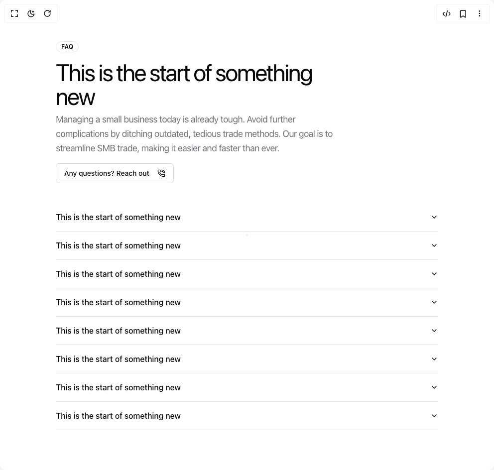

# Build Faq Section in BuilderStudio

> Build this component in our Agentic IDE: [BuilderStudio](https://builderstudio.dev).
>
> Join the BuilderStudio community on [Discord](https://discord.gg/QdWeSGCqfe) and [Reddit](https://reddit.com/r/builderstudio).



## Component

- Author group: `tommyjepsen`
- Component: `faq-section`
- Variant: `default`
- Rendered HTML snapshot: [`rendered.html`](rendered.html)

## BuilderStudio prompt

You are implementing a React component based on a component reference.

## Component identity

- Author: tommyjepsen
- Component slug: faq-section
- Demo slug: default
- Title: faq-section
- Description: 

## Goal

Recreate this component in a React + TypeScript + Tailwind CSS project. Preserve the visual layout, spacing, colors, border radius, shadows, interaction behavior, animation behavior, responsive behavior, and dark mode behavior shown in the rendered demo.

## Implementation requirements

- Use React and TypeScript.
- Use Tailwind CSS classes whenever possible.
- Keep the component self-contained unless the source files require helper components.
- If the source uses CSS variables, custom CSS, animations, or keyframes, include them.
- If the source uses external packages, list and use the required packages.
- Preserve accessibility attributes, button semantics, links, keyboard behavior, and ARIA attributes when visible in the source.
- Do not replace the component with a simplified placeholder.
- Return complete production-ready code.

## Dependencies

No reference metadata available.

## Rendered DOM snapshot

This is the rendered demo HTML extracted from the live preview. Use it to verify structure, class names, visible content, and layout.

```html
<div id="root"><div class="relative flex items-center justify-center h-screen w-full m-auto p-16 bg-background text-foreground"><div class="absolute lab-bg inset-0 size-full"><div class="absolute inset-0 bg-[radial-gradient(#00000021_1px,transparent_1px)] dark:bg-[radial-gradient(#ffffff22_1px,transparent_1px)]"></div></div><div class="flex w-full justify-center relative"><div class="w-full"><div class="w-full py-20 lg:py-40"><div class="container mx-auto"><div class="grid lg:grid-cols-2 gap-10"><div class="flex gap-10 flex-col"><div class="flex gap-4 flex-col"><div><div class="inline-flex items-center rounded-full border px-2.5 py-0.5 text-xs font-semibold transition-colors focus:outline-none focus:ring-2 focus:ring-ring focus:ring-offset-2 text-foreground">FAQ</div></div><div class="flex gap-2 flex-col"><h4 class="text-3xl md:text-5xl tracking-tighter max-w-xl text-left font-regular">This is the start of something new</h4><p class="text-lg max-w-xl lg:max-w-lg leading-relaxed tracking-tight text-muted-foreground  text-left">Managing a small business today is already tough. Avoid further complications by ditching outdated, tedious trade methods. Our goal is to streamline SMB trade, making it easier and faster than ever.</p></div><div class=""><button class="inline-flex items-center justify-center whitespace-nowrap rounded-md text-sm font-medium ring-offset-background transition-colors focus-visible:outline-none focus-visible:ring-2 focus-visible:ring-ring focus-visible:ring-offset-2 disabled:pointer-events-none disabled:opacity-50 border border-input bg-background hover:bg-accent hover:text-accent-foreground h-10 px-4 py-2 gap-4">Any questions? Reach out <svg xmlns="http://www.w3.org/2000/svg" width="24" height="24" viewBox="0 0 24 24" fill="none" stroke="currentColor" stroke-width="2" stroke-linecap="round" stroke-linejoin="round" class="lucide lucide-phone-call w-4 h-4" aria-hidden="true"><path d="M13 2a9 9 0 0 1 9 9"></path><path d="M13 6a5 5 0 0 1 5 5"></path><path d="M13.832 16.568a1 1 0 0 0 1.213-.303l.355-.465A2 2 0 0 1 17 15h3a2 2 0 0 1 2 2v3a2 2 0 0 1-2 2A18 18 0 0 1 2 4a2 2 0 0 1 2-2h3a2 2 0 0 1 2 2v3a2 2 0 0 1-.8 1.6l-.468.351a1 1 0 0 0-.292 1.233 14 14 0 0 0 6.392 6.384"></path></svg></button></div></div></div><div class="w-full" data-orientation="vertical"><div data-state="closed" data-orientation="vertical" class="border-b"><h3 data-orientation="vertical" data-state="closed" class="flex"><button type="button" aria-controls="radix-«r1»" aria-expanded="false" data-state="closed" data-orientation="vertical" id="radix-«r0»" class="flex flex-1 items-center justify-between py-4 font-medium transition-all hover:underline [&amp;[data-state=open]&gt;svg]:rotate-180" data-radix-collection-item="">This is the start of something new<svg xmlns="http://www.w3.org/2000/svg" width="24" height="24" viewBox="0 0 24 24" fill="none" stroke="currentColor" stroke-width="2" stroke-linecap="round" stroke-linejoin="round" class="lucide lucide-chevron-down h-4 w-4 shrink-0 transition-transform duration-200" aria-hidden="true"><path d="m6 9 6 6 6-6"></path></svg></button></h3><div data-state="closed" id="radix-«r1»" hidden="" role="region" aria-labelledby="radix-«r0»" data-orientation="vertical" class="overflow-hidden text-sm transition-all data-[state=closed]:animate-accordion-up data-[state=open]:animate-accordion-down" style="--radix-accordion-content-height: var(--radix-collapsible-content-height); --radix-accordion-content-width: var(--radix-collapsible-content-width);"></div></div><div data-state="closed" data-orientation="vertical" class="border-b"><h3 data-orientation="vertical" data-state="closed" class="flex"><button type="button" aria-controls="radix-«r3»" aria-expanded="false" data-state="closed" data-orientation="vertical" id="radix-«r2»" class="flex flex-1 items-center justify-between py-4 font-medium transition-all hover:underline [&amp;[data-state=open]&gt;svg]:rotate-180" data-radix-collection-item="">This is the start of something new<svg xmlns="http://www.w3.org/2000/svg" width="24" height="24" viewBox="0 0 24 24" fill="none" stroke="currentColor" stroke-width="2" stroke-linecap="round" stroke-linejoin="round" class="lucide lucide-chevron-down h-4 w-4 shrink-0 transition-transform duration-200" aria-hidden="true"><path d="m6 9 6 6 6-6"></path></svg></button></h3><div data-state="closed" id="radix-«r3»" hidden="" role="region" aria-labelledby="radix-«r2»" data-orientation="vertical" class="overflow-hidden text-sm transition-all data-[state=closed]:animate-accordion-up data-[state=open]:animate-accordion-down" style="--radix-accordion-content-height: var(--radix-collapsible-content-height); --radix-accordion-content-width: var(--radix-collapsible-content-width);"></div></div><div data-state="closed" data-orientation="vertical" class="border-b"><h3 data-orientation="vertical" data-state="closed" class="flex"><button type="button" aria-controls="radix-«r5»" aria-expanded="false" data-state="closed" data-orientation="vertical" id="radix-«r4»" class="flex flex-1 items-center justify-between py-4 font-medium transition-all hover:underline [&amp;[data-state=open]&gt;svg]:rotate-180" data-radix-collection-item="">This is the start of something new<svg xmlns="http://www.w3.org/2000/svg" width="24" height="24" viewBox="0 0 24 24" fill="none" stroke="currentColor" stroke-width="2" stroke-linecap="round" stroke-linejoin="round" class="lucide lucide-chevron-down h-4 w-4 shrink-0 transition-transform duration-200" aria-hidden="true"><path d="m6 9 6 6 6-6"></path></svg></button></h3><div data-state="closed" id="radix-«r5»" hidden="" role="region" aria-labelledby="radix-«r4»" data-orientation="vertical" class="overflow-hidden text-sm transition-all data-[state=closed]:animate-accordion-up data-[state=open]:animate-accordion-down" style="--radix-accordion-content-height: var(--radix-collapsible-content-height); --radix-accordion-content-width: var(--radix-collapsible-content-width);"></div></div><div data-state="closed" data-orientation="vertical" class="border-b"><h3 data-orientation="vertical" data-state="closed" class="flex"><button type="button" aria-controls="radix-«r7»" aria-expanded="false" data-state="closed" data-orientation="vertical" id="radix-«r6»" class="flex flex-1 items-center justify-between py-4 font-medium transition-all hover:underline [&amp;[data-state=open]&gt;svg]:rotate-180" data-radix-collection-item="">This is the start of something new<svg xmlns="http://www.w3.org/2000/svg" width="24" height="24" viewBox="0 0 24 24" fill="none" stroke="currentColor" stroke-width="2" stroke-linecap="round" stroke-linejoin="round" class="lucide lucide-chevron-down h-4 w-4 shrink-0 transition-transform duration-200" aria-hidden="true"><path d="m6 9 6 6 6-6"></path></svg></button></h3><div data-state="closed" id="radix-«r7»" hidden="" role="region" aria-labelledby="radix-«r6»" data-orientation="vertical" class="overflow-hidden text-sm transition-all data-[state=closed]:animate-accordion-up data-[state=open]:animate-accordion-down" style="--radix-accordion-content-height: var(--radix-collapsible-content-height); --radix-accordion-content-width: var(--radix-collapsible-content-width);"></div></div><div data-state="closed" data-orientation="vertical" class="border-b"><h3 data-orientation="vertical" data-state="closed" class="flex"><button type="button" aria-controls="radix-«r9»" aria-expanded="false" data-state="closed" data-orientation="vertical" id="radix-«r8»" class="flex flex-1 items-center justify-between py-4 font-medium transition-all hover:underline [&amp;[data-state=open]&gt;svg]:rotate-180" data-radix-collection-item="">This is the start of something new<svg xmlns="http://www.w3.org/2000/svg" width="24" height="24" viewBox="0 0 24 24" fill="none" stroke="currentColor" stroke-width="2" stroke-linecap="round" stroke-linejoin="round" class="lucide lucide-chevron-down h-4 w-4 shrink-0 transition-transform duration-200" aria-hidden="true"><path d="m6 9 6 6 6-6"></path></svg></button></h3><div data-state="closed" id="radix-«r9»" hidden="" role="region" aria-labelledby="radix-«r8»" data-orientation="vertical" class="overflow-hidden text-sm transition-all data-[state=closed]:animate-accordion-up data-[state=open]:animate-accordion-down" style="--radix-accordion-content-height: var(--radix-collapsible-content-height); --radix-accordion-content-width: var(--radix-collapsible-content-width);"></div></div><div data-state="closed" data-orientation="vertical" class="border-b"><h3 data-orientation="vertical" data-state="closed" class="flex"><button type="button" aria-controls="radix-«rb»" aria-expanded="false" data-state="closed" data-orientation="vertical" id="radix-«ra»" class="flex flex-1 items-center justify-between py-4 font-medium transition-all hover:underline [&amp;[data-state=open]&gt;svg]:rotate-180" data-radix-collection-item="">This is the start of something new<svg xmlns="http://www.w3.org/2000/svg" width="24" height="24" viewBox="0 0 24 24" fill="none" stroke="currentColor" stroke-width="2" stroke-linecap="round" stroke-linejoin="round" class="lucide lucide-chevron-down h-4 w-4 shrink-0 transition-transform duration-200" aria-hidden="true"><path d="m6 9 6 6 6-6"></path></svg></button></h3><div data-state="closed" id="radix-«rb»" hidden="" role="region" aria-labelledby="radix-«ra»" data-orientation="vertical" class="overflow-hidden text-sm transition-all data-[state=closed]:animate-accordion-up data-[state=open]:animate-accordion-down" style="--radix-accordion-content-height: var(--radix-collapsible-content-height); --radix-accordion-content-width: var(--radix-collapsible-content-width);"></div></div><div data-state="closed" data-orientation="vertical" class="border-b"><h3 data-orientation="vertical" data-state="closed" class="flex"><button type="button" aria-controls="radix-«rd»" aria-expanded="false" data-state="closed" data-orientation="vertical" id="radix-«rc»" class="flex flex-1 items-center justify-between py-4 font-medium transition-all hover:underline [&amp;[data-state=open]&gt;svg]:rotate-180" data-radix-collection-item="">This is the start of something new<svg xmlns="http://www.w3.org/2000/svg" width="24" height="24" viewBox="0 0 24 24" fill="none" stroke="currentColor" stroke-width="2" stroke-linecap="round" stroke-linejoin="round" class="lucide lucide-chevron-down h-4 w-4 shrink-0 transition-transform duration-200" aria-hidden="true"><path d="m6 9 6 6 6-6"></path></svg></button></h3><div data-state="closed" id="radix-«rd»" hidden="" role="region" aria-labelledby="radix-«rc»" data-orientation="vertical" class="overflow-hidden text-sm transition-all data-[state=closed]:animate-accordion-up data-[state=open]:animate-accordion-down" style="--radix-accordion-content-height: var(--radix-collapsible-content-height); --radix-accordion-content-width: var(--radix-collapsible-content-width);"></div></div><div data-state="closed" data-orientation="vertical" class="border-b"><h3 data-orientation="vertical" data-state="closed" class="flex"><button type="button" aria-controls="radix-«rf»" aria-expanded="false" data-state="closed" data-orientation="vertical" id="radix-«re»" class="flex flex-1 items-center justify-between py-4 font-medium transition-all hover:underline [&amp;[data-state=open]&gt;svg]:rotate-180" data-radix-collection-item="">This is the start of something new<svg xmlns="http://www.w3.org/2000/svg" width="24" height="24" viewBox="0 0 24 24" fill="none" stroke="currentColor" stroke-width="2" stroke-linecap="round" stroke-linejoin="round" class="lucide lucide-chevron-down h-4 w-4 shrink-0 transition-transform duration-200" aria-hidden="true"><path d="m6 9 6 6 6-6"></path></svg></button></h3><div data-state="closed" id="radix-«rf»" hidden="" role="region" aria-labelledby="radix-«re»" data-orientation="vertical" class="overflow-hidden text-sm transition-all data-[state=closed]:animate-accordion-up data-[state=open]:animate-accordion-down" style="--radix-accordion-content-height: var(--radix-collapsible-content-height); --radix-accordion-content-width: var(--radix-collapsible-content-width);"></div></div></div></div></div></div></div></div></div></div>
```

## Reference source files

No reference source files were available.
