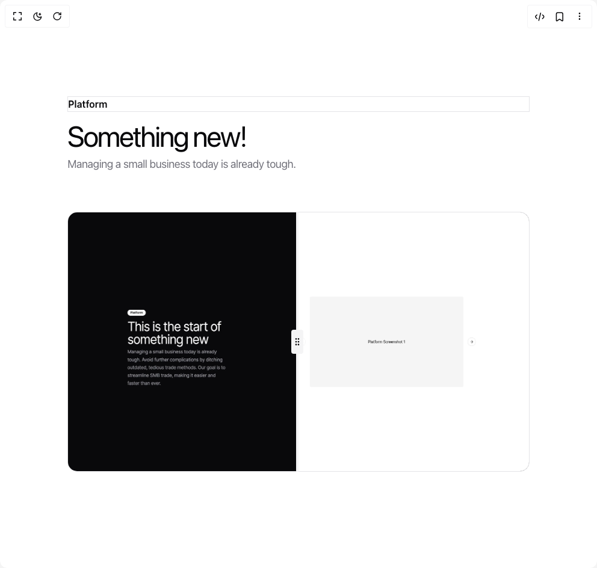

# Build Feature With Image Comparison in BuilderStudio

> Build this component in our Agentic IDE: [BuilderStudio](https://builderstudio.dev).
>
> Join the BuilderStudio community on [Discord](https://discord.gg/QdWeSGCqfe) and [Reddit](https://reddit.com/r/builderstudio).



## Component

- Author group: `tommyjepsen`
- Component: `feature-with-image-comparison`
- Variant: `default`
- Rendered HTML snapshot: [`rendered.html`](rendered.html)

## BuilderStudio prompt

You are implementing a React component based on a component reference.

## Component identity

- Author: tommyjepsen
- Component slug: feature-with-image-comparison
- Demo slug: default
- Title: feature-with-image-comparison
- Description: 

## Goal

Recreate this component in a React + TypeScript + Tailwind CSS project. Preserve the visual layout, spacing, colors, border radius, shadows, interaction behavior, animation behavior, responsive behavior, and dark mode behavior shown in the rendered demo.

## Implementation requirements

- Use React and TypeScript.
- Use Tailwind CSS classes whenever possible.
- Keep the component self-contained unless the source files require helper components.
- If the source uses CSS variables, custom CSS, animations, or keyframes, include them.
- If the source uses external packages, list and use the required packages.
- Preserve accessibility attributes, button semantics, links, keyboard behavior, and ARIA attributes when visible in the source.
- Do not replace the component with a simplified placeholder.
- Return complete production-ready code.

## Dependencies

No reference metadata available.

## Rendered DOM snapshot

This is the rendered demo HTML extracted from the live preview. Use it to verify structure, class names, visible content, and layout.

```html
<div id="root"><div class="relative flex items-center justify-center h-screen w-full m-auto p-16 bg-background text-foreground"><div class="absolute lab-bg inset-0 size-full"><div class="absolute inset-0 bg-[radial-gradient(#00000021_1px,transparent_1px)] dark:bg-[radial-gradient(#ffffff22_1px,transparent_1px)]"></div></div><div class="flex w-full justify-center relative"><div class="w-full"><div class="w-full py-20 lg:py-40"><div class="container mx-auto"><div class="flex flex-col gap-4"><div><div class="inline-flex items-center rounded-full border px-2.5 py-0.5 text-xs font-semibold transition-colors focus:outline-none focus:ring-2 focus:ring-ring focus:ring-offset-2 border-transparent bg-primary text-primary-foreground hover:bg-primary/80">Platform</div></div><div class="flex gap-2 flex-col"><h2 class="text-3xl md:text-5xl tracking-tighter lg:max-w-xl font-regular">Something new!</h2><p class="text-lg max-w-xl lg:max-w-xl leading-relaxed tracking-tight text-muted-foreground">Managing a small business today is already tough.</p></div><div class="pt-12 w-full"><div class="relative aspect-video w-full h-full overflow-hidden rounded-2xl select-none"><div class="bg-muted h-full w-1 absolute z-20 top-0 -ml-1 select-none" style="left: 50%;"><button class="bg-muted rounded hover:scale-110 transition-all w-5 h-10 select-none -translate-y-1/2 absolute top-1/2 -ml-2 z-30 cursor-ew-resize flex justify-center items-center"><svg xmlns="http://www.w3.org/2000/svg" width="24" height="24" viewBox="0 0 24 24" fill="none" stroke="currentColor" stroke-width="2" stroke-linecap="round" stroke-linejoin="round" class="lucide lucide-grip-vertical h-4 w-4 select-none" aria-hidden="true"><circle cx="9" cy="12" r="1"></circle><circle cx="9" cy="5" r="1"></circle><circle cx="9" cy="19" r="1"></circle><circle cx="15" cy="12" r="1"></circle><circle cx="15" cy="5" r="1"></circle><circle cx="15" cy="19" r="1"></circle></svg></button></div></div></div></div></div></div></div></div></div></div>
```

## Reference source files

No reference source files were available.
