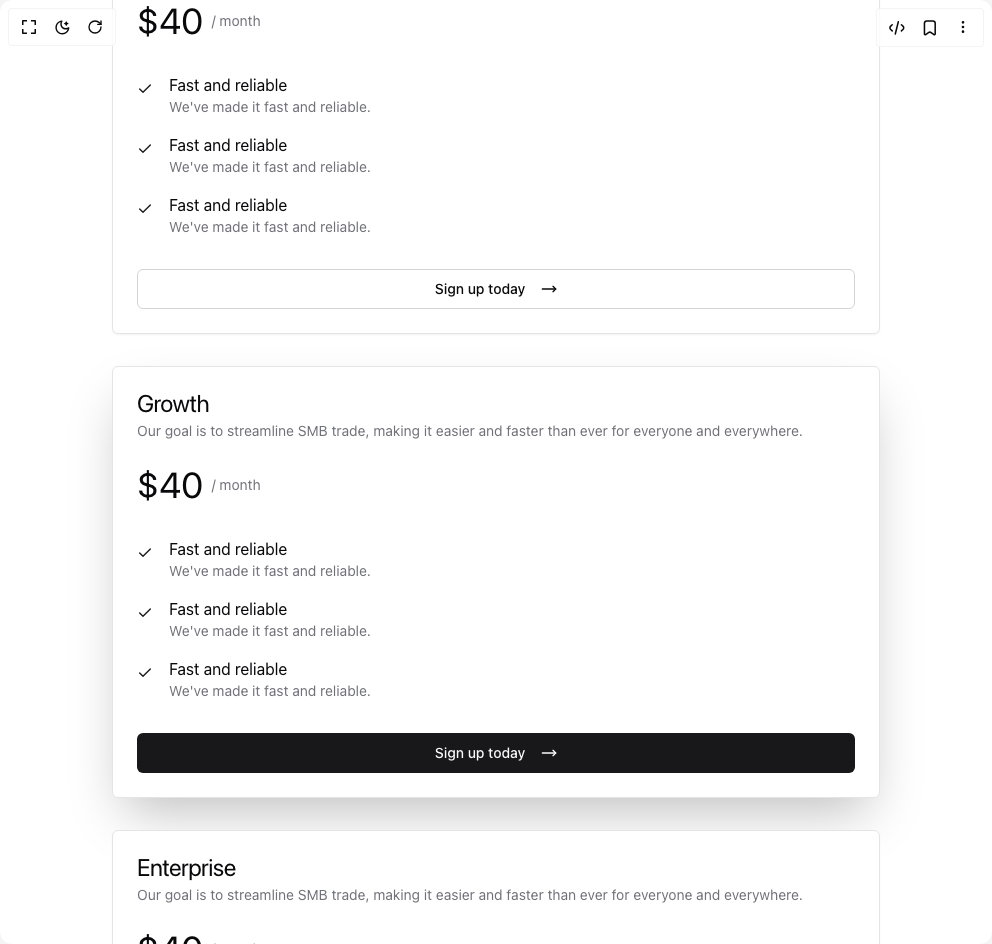

# Build Pricing Cards in BuilderStudio

> Build this component in our Agentic IDE: [BuilderStudio](https://builderstudio.dev).
>
> Join the BuilderStudio community on [Discord](https://discord.gg/QdWeSGCqfe) and [Reddit](https://reddit.com/r/builderstudio).



## Component

- Author group: `tommyjepsen`
- Component: `pricing-cards`
- Variant: `default`
- Rendered HTML snapshot: [`rendered.html`](rendered.html)

## BuilderStudio prompt

You are implementing a React component based on a component reference.

## Component identity

- Author: tommyjepsen
- Component slug: pricing-cards
- Demo slug: default
- Title: pricing-cards
- Description: 

## Goal

Recreate this component in a React + TypeScript + Tailwind CSS project. Preserve the visual layout, spacing, colors, border radius, shadows, interaction behavior, animation behavior, responsive behavior, and dark mode behavior shown in the rendered demo.

## Implementation requirements

- Use React and TypeScript.
- Use Tailwind CSS classes whenever possible.
- Keep the component self-contained unless the source files require helper components.
- If the source uses CSS variables, custom CSS, animations, or keyframes, include them.
- If the source uses external packages, list and use the required packages.
- Preserve accessibility attributes, button semantics, links, keyboard behavior, and ARIA attributes when visible in the source.
- Do not replace the component with a simplified placeholder.
- Return complete production-ready code.

## Dependencies

No reference metadata available.

## Rendered DOM snapshot

This is the rendered demo HTML extracted from the live preview. Use it to verify structure, class names, visible content, and layout.

```html
<div id="root"><div class="relative flex items-center justify-center h-screen w-full m-auto p-16 bg-background text-foreground"><div class="absolute lab-bg inset-0 size-full"><div class="absolute inset-0 bg-[radial-gradient(#00000021_1px,transparent_1px)] dark:bg-[radial-gradient(#ffffff22_1px,transparent_1px)]"></div></div><div class="flex w-full justify-center relative"><div class="w-full"><div class="w-full py-20 lg:py-40"><div class="container mx-auto"><div class="flex text-center justify-center items-center gap-4 flex-col"><div class="inline-flex items-center rounded-full border px-2.5 py-0.5 text-xs font-semibold transition-colors focus:outline-none focus:ring-2 focus:ring-ring focus:ring-offset-2 border-transparent bg-primary text-primary-foreground hover:bg-primary/80">Pricing</div><div class="flex gap-2 flex-col"><h2 class="text-3xl md:text-5xl tracking-tighter max-w-xl text-center font-regular">Prices that make sense!</h2><p class="text-lg leading-relaxed tracking-tight text-muted-foreground max-w-xl text-center">Managing a small business today is already tough.</p></div><div class="grid pt-20 text-left grid-cols-1 lg:grid-cols-3 w-full gap-8"><div class="border bg-card text-card-foreground shadow-sm w-full rounded-md"><div class="flex flex-col space-y-1.5 p-6"><h3 class="text-2xl font-semibold leading-none tracking-tight"><span class="flex flex-row gap-4 items-center font-normal">Startup</span></h3><p class="text-sm text-muted-foreground">Our goal is to streamline SMB trade, making it easier and faster than ever for everyone and everywhere.</p></div><div class="p-6 pt-0"><div class="flex flex-col gap-8 justify-start"><p class="flex flex-row  items-center gap-2 text-xl"><span class="text-4xl">$40</span><span class="text-sm text-muted-foreground"> / month</span></p><div class="flex flex-col gap-4 justify-start"><div class="flex flex-row gap-4"><svg xmlns="http://www.w3.org/2000/svg" width="24" height="24" viewBox="0 0 24 24" fill="none" stroke="currentColor" stroke-width="2" stroke-linecap="round" stroke-linejoin="round" class="lucide lucide-check w-4 h-4 mt-2 text-primary" aria-hidden="true"><path d="M20 6 9 17l-5-5"></path></svg><div class="flex flex-col"><p>Fast and reliable</p><p class="text-muted-foreground text-sm">We've made it fast and reliable.</p></div></div><div class="flex flex-row gap-4"><svg xmlns="http://www.w3.org/2000/svg" width="24" height="24" viewBox="0 0 24 24" fill="none" stroke="currentColor" stroke-width="2" stroke-linecap="round" stroke-linejoin="round" class="lucide lucide-check w-4 h-4 mt-2 text-primary" aria-hidden="true"><path d="M20 6 9 17l-5-5"></path></svg><div class="flex flex-col"><p>Fast and reliable</p><p class="text-muted-foreground text-sm">We've made it fast and reliable.</p></div></div><div class="flex flex-row gap-4"><svg xmlns="http://www.w3.org/2000/svg" width="24" height="24" viewBox="0 0 24 24" fill="none" stroke="currentColor" stroke-width="2" stroke-linecap="round" stroke-linejoin="round" class="lucide lucide-check w-4 h-4 mt-2 text-primary" aria-hidden="true"><path d="M20 6 9 17l-5-5"></path></svg><div class="flex flex-col"><p>Fast and reliable</p><p class="text-muted-foreground text-sm">We've made it fast and reliable.</p></div></div></div><button class="inline-flex items-center justify-center whitespace-nowrap rounded-md text-sm font-medium ring-offset-background transition-colors focus-visible:outline-none focus-visible:ring-2 focus-visible:ring-ring focus-visible:ring-offset-2 disabled:pointer-events-none disabled:opacity-50 border border-input bg-background hover:bg-accent hover:text-accent-foreground h-10 px-4 py-2 gap-4">Sign up today <svg xmlns="http://www.w3.org/2000/svg" width="24" height="24" viewBox="0 0 24 24" fill="none" stroke="currentColor" stroke-width="2" stroke-linecap="round" stroke-linejoin="round" class="lucide lucide-move-right w-4 h-4" aria-hidden="true"><path d="M18 8L22 12L18 16"></path><path d="M2 12H22"></path></svg></button></div></div></div><div class="border bg-card text-card-foreground w-full shadow-2xl rounded-md"><div class="flex flex-col space-y-1.5 p-6"><h3 class="text-2xl font-semibold leading-none tracking-tight"><span class="flex flex-row gap-4 items-center font-normal">Growth</span></h3><p class="text-sm text-muted-foreground">Our goal is to streamline SMB trade, making it easier and faster than ever for everyone and everywhere.</p></div><div class="p-6 pt-0"><div class="flex flex-col gap-8 justify-start"><p class="flex flex-row  items-center gap-2 text-xl"><span class="text-4xl">$40</span><span class="text-sm text-muted-foreground"> / month</span></p><div class="flex flex-col gap-4 justify-start"><div class="flex flex-row gap-4"><svg xmlns="http://www.w3.org/2000/svg" width="24" height="24" viewBox="0 0 24 24" fill="none" stroke="currentColor" stroke-width="2" stroke-linecap="round" stroke-linejoin="round" class="lucide lucide-check w-4 h-4 mt-2 text-primary" aria-hidden="true"><path d="M20 6 9 17l-5-5"></path></svg><div class="flex flex-col"><p>Fast and reliable</p><p class="text-muted-foreground text-sm">We've made it fast and reliable.</p></div></div><div class="flex flex-row gap-4"><svg xmlns="http://www.w3.org/2000/svg" width="24" height="24" viewBox="0 0 24 24" fill="none" stroke="currentColor" stroke-width="2" stroke-linecap="round" stroke-linejoin="round" class="lucide lucide-check w-4 h-4 mt-2 text-primary" aria-hidden="true"><path d="M20 6 9 17l-5-5"></path></svg><div class="flex flex-col"><p>Fast and reliable</p><p class="text-muted-foreground text-sm">We've made it fast and reliable.</p></div></div><div class="flex flex-row gap-4"><svg xmlns="http://www.w3.org/2000/svg" width="24" height="24" viewBox="0 0 24 24" fill="none" stroke="currentColor" stroke-width="2" stroke-linecap="round" stroke-linejoin="round" class="lucide lucide-check w-4 h-4 mt-2 text-primary" aria-hidden="true"><path d="M20 6 9 17l-5-5"></path></svg><div class="flex flex-col"><p>Fast and reliable</p><p class="text-muted-foreground text-sm">We've made it fast and reliable.</p></div></div></div><button class="inline-flex items-center justify-center whitespace-nowrap rounded-md text-sm font-medium ring-offset-background transition-colors focus-visible:outline-none focus-visible:ring-2 focus-visible:ring-ring focus-visible:ring-offset-2 disabled:pointer-events-none disabled:opacity-50 bg-primary text-primary-foreground hover:bg-primary/90 h-10 px-4 py-2 gap-4">Sign up today <svg xmlns="http://www.w3.org/2000/svg" width="24" height="24" viewBox="0 0 24 24" fill="none" stroke="currentColor" stroke-width="2" stroke-linecap="round" stroke-linejoin="round" class="lucide lucide-move-right w-4 h-4" aria-hidden="true"><path d="M18 8L22 12L18 16"></path><path d="M2 12H22"></path></svg></button></div></div></div><div class="border bg-card text-card-foreground shadow-sm w-full rounded-md"><div class="flex flex-col space-y-1.5 p-6"><h3 class="text-2xl font-semibold leading-none tracking-tight"><span class="flex flex-row gap-4 items-center font-normal">Enterprise</span></h3><p class="text-sm text-muted-foreground">Our goal is to streamline SMB trade, making it easier and faster than ever for everyone and everywhere.</p></div><div class="p-6 pt-0"><div class="flex flex-col gap-8 justify-start"><p class="flex flex-row  items-center gap-2 text-xl"><span class="text-4xl">$40</span><span class="text-sm text-muted-foreground"> / month</span></p><div class="flex flex-col gap-4 justify-start"><div class="flex flex-row gap-4"><svg xmlns="http://www.w3.org/2000/svg" width="24" height="24" viewBox="0 0 24 24" fill="none" stroke="currentColor" stroke-width="2" stroke-linecap="round" stroke-linejoin="round" class="lucide lucide-check w-4 h-4 mt-2 text-primary" aria-hidden="true"><path d="M20 6 9 17l-5-5"></path></svg><div class="flex flex-col"><p>Fast and reliable</p><p class="text-muted-foreground text-sm">We've made it fast and reliable.</p></div></div><div class="flex flex-row gap-4"><svg xmlns="http://www.w3.org/2000/svg" width="24" height="24" viewBox="0 0 24 24" fill="none" stroke="currentColor" stroke-width="2" stroke-linecap="round" stroke-linejoin="round" class="lucide lucide-check w-4 h-4 mt-2 text-primary" aria-hidden="true"><path d="M20 6 9 17l-5-5"></path></svg><div class="flex flex-col"><p>Fast and reliable</p><p class="text-muted-foreground text-sm">We've made it fast and reliable.</p></div></div><div class="flex flex-row gap-4"><svg xmlns="http://www.w3.org/2000/svg" width="24" height="24" viewBox="0 0 24 24" fill="none" stroke="currentColor" stroke-width="2" stroke-linecap="round" stroke-linejoin="round" class="lucide lucide-check w-4 h-4 mt-2 text-primary" aria-hidden="true"><path d="M20 6 9 17l-5-5"></path></svg><div class="flex flex-col"><p>Fast and reliable</p><p class="text-muted-foreground text-sm">We've made it fast and reliable.</p></div></div></div><button class="inline-flex items-center justify-center whitespace-nowrap rounded-md text-sm font-medium ring-offset-background transition-colors focus-visible:outline-none focus-visible:ring-2 focus-visible:ring-ring focus-visible:ring-offset-2 disabled:pointer-events-none disabled:opacity-50 border border-input bg-background hover:bg-accent hover:text-accent-foreground h-10 px-4 py-2 gap-4">Book a meeting <svg xmlns="http://www.w3.org/2000/svg" width="24" height="24" viewBox="0 0 24 24" fill="none" stroke="currentColor" stroke-width="2" stroke-linecap="round" stroke-linejoin="round" class="lucide lucide-phone-call w-4 h-4" aria-hidden="true"><path d="M13 2a9 9 0 0 1 9 9"></path><path d="M13 6a5 5 0 0 1 5 5"></path><path d="M13.832 16.568a1 1 0 0 0 1.213-.303l.355-.465A2 2 0 0 1 17 15h3a2 2 0 0 1 2 2v3a2 2 0 0 1-2 2A18 18 0 0 1 2 4a2 2 0 0 1 2-2h3a2 2 0 0 1 2 2v3a2 2 0 0 1-.8 1.6l-.468.351a1 1 0 0 0-.292 1.233 14 14 0 0 0 6.392 6.384"></path></svg></button></div></div></div></div></div></div></div></div></div></div></div>
```

## Reference source files

No reference source files were available.
