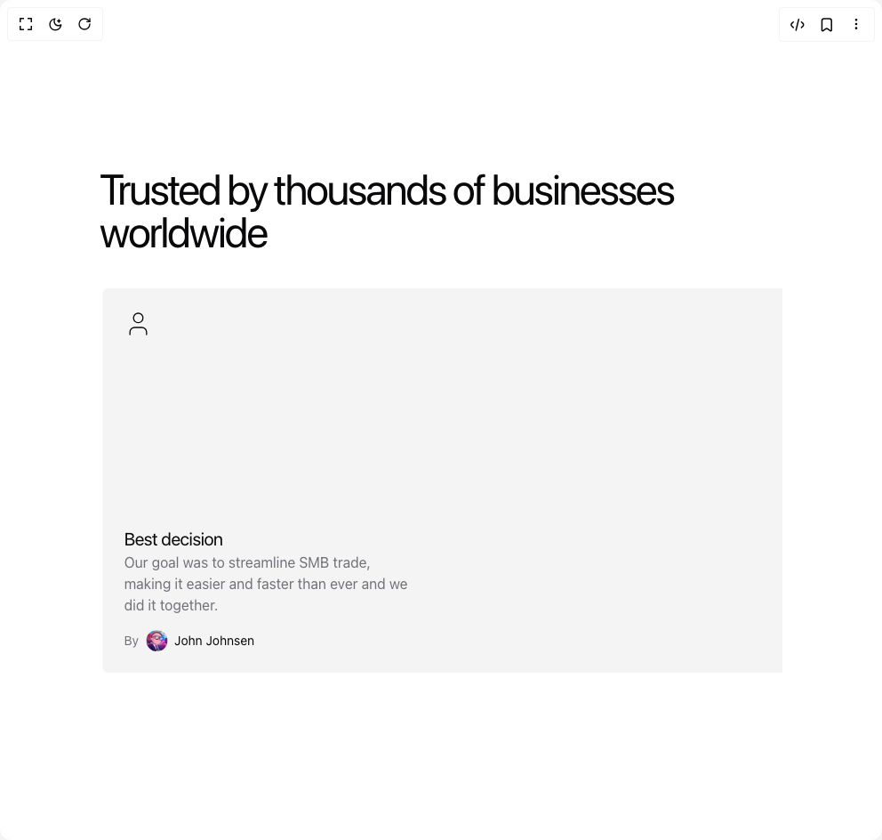

# Build Testimonials in BuilderStudio

> Build this component in our Agentic IDE: [BuilderStudio](https://builderstudio.dev).
>
> Join the BuilderStudio community on [Discord](https://discord.gg/QdWeSGCqfe) and [Reddit](https://reddit.com/r/builderstudio).



## Component

- Author group: `tommyjepsen`
- Component: `testimonials`
- Variant: `default`
- Rendered HTML snapshot: [`rendered.html`](rendered.html)

## BuilderStudio prompt

You are implementing a React component based on a component reference.

## Component identity

- Author: tommyjepsen
- Component slug: testimonials
- Demo slug: default
- Title: testimonials
- Description: 

## Goal

Recreate this component in a React + TypeScript + Tailwind CSS project. Preserve the visual layout, spacing, colors, border radius, shadows, interaction behavior, animation behavior, responsive behavior, and dark mode behavior shown in the rendered demo.

## Implementation requirements

- Use React and TypeScript.
- Use Tailwind CSS classes whenever possible.
- Keep the component self-contained unless the source files require helper components.
- If the source uses CSS variables, custom CSS, animations, or keyframes, include them.
- If the source uses external packages, list and use the required packages.
- Preserve accessibility attributes, button semantics, links, keyboard behavior, and ARIA attributes when visible in the source.
- Do not replace the component with a simplified placeholder.
- Return complete production-ready code.

## Dependencies

No reference metadata available.

## Rendered DOM snapshot

This is the rendered demo HTML extracted from the live preview. Use it to verify structure, class names, visible content, and layout.

```html
<div id="root"><div class="relative flex items-center justify-center h-screen w-full m-auto p-16 bg-background text-foreground"><div class="absolute lab-bg inset-0 size-full"><div class="absolute inset-0 bg-[radial-gradient(#00000021_1px,transparent_1px)] dark:bg-[radial-gradient(#ffffff22_1px,transparent_1px)]"></div></div><div class="flex w-full justify-center relative"><div class="block"><div class="w-full py-20 lg:py-40"><div class="container mx-auto"><div class="flex flex-col gap-10"><h2 class="text-3xl md:text-5xl tracking-tighter lg:max-w-xl font-regular text-left">Trusted by thousands of businesses worldwide</h2><div class="relative w-full" role="region" aria-roledescription="carousel"><div class="overflow-hidden"><div class="flex -ml-4" style="transform: translate3d(-779.22px, 0px, 0px);"><div role="group" aria-roledescription="slide" class="min-w-0 shrink-0 grow-0 basis-full pl-4 lg:basis-1/2"><div class="bg-muted rounded-md h-full lg:col-span-2 p-6 aspect-video flex justify-between flex-col"><svg xmlns="http://www.w3.org/2000/svg" width="24" height="24" viewBox="0 0 24 24" fill="none" stroke="currentColor" stroke-width="2" stroke-linecap="round" stroke-linejoin="round" class="lucide lucide-user w-8 h-8 stroke-1" aria-hidden="true"><path d="M19 21v-2a4 4 0 0 0-4-4H9a4 4 0 0 0-4 4v2"></path><circle cx="12" cy="7" r="4"></circle></svg><div class="flex flex-col gap-4"><div class="flex flex-col"><h3 class="text-xl tracking-tight">Best decision</h3><p class="text-muted-foreground max-w-xs text-base">Our goal was to streamline SMB trade, making it easier and faster than ever and we did it together.</p></div><p class="flex flex-row gap-2 text-sm items-center"><span class="text-muted-foreground">By</span> <span class="relative flex shrink-0 overflow-hidden rounded-full h-6 w-6"></span><span>John Johnsen</span></p></div></div></div><div role="group" aria-roledescription="slide" class="min-w-0 shrink-0 grow-0 basis-full pl-4 lg:basis-1/2"><div class="bg-muted rounded-md h-full lg:col-span-2 p-6 aspect-video flex justify-between flex-col"><svg xmlns="http://www.w3.org/2000/svg" width="24" height="24" viewBox="0 0 24 24" fill="none" stroke="currentColor" stroke-width="2" stroke-linecap="round" stroke-linejoin="round" class="lucide lucide-user w-8 h-8 stroke-1" aria-hidden="true"><path d="M19 21v-2a4 4 0 0 0-4-4H9a4 4 0 0 0-4 4v2"></path><circle cx="12" cy="7" r="4"></circle></svg><div class="flex flex-col gap-4"><div class="flex flex-col"><h3 class="text-xl tracking-tight">Best decision</h3><p class="text-muted-foreground max-w-xs text-base">Our goal was to streamline SMB trade, making it easier and faster than ever and we did it together.</p></div><p class="flex flex-row gap-2 text-sm items-center"><span class="text-muted-foreground">By</span> <span class="relative flex shrink-0 overflow-hidden rounded-full h-6 w-6"></span><span>John Johnsen</span></p></div></div></div><div role="group" aria-roledescription="slide" class="min-w-0 shrink-0 grow-0 basis-full pl-4 lg:basis-1/2"><div class="bg-muted rounded-md h-full lg:col-span-2 p-6 aspect-video flex justify-between flex-col"><svg xmlns="http://www.w3.org/2000/svg" width="24" height="24" viewBox="0 0 24 24" fill="none" stroke="currentColor" stroke-width="2" stroke-linecap="round" stroke-linejoin="round" class="lucide lucide-user w-8 h-8 stroke-1" aria-hidden="true"><path d="M19 21v-2a4 4 0 0 0-4-4H9a4 4 0 0 0-4 4v2"></path><circle cx="12" cy="7" r="4"></circle></svg><div class="flex flex-col gap-4"><div class="flex flex-col"><h3 class="text-xl tracking-tight">Best decision</h3><p class="text-muted-foreground max-w-xs text-base">Our goal was to streamline SMB trade, making it easier and faster than ever and we did it together.</p></div><p class="flex flex-row gap-2 text-sm items-center"><span class="text-muted-foreground">By</span> <span class="relative flex shrink-0 overflow-hidden rounded-full h-6 w-6"></span><span>John Johnsen</span></p></div></div></div><div role="group" aria-roledescription="slide" class="min-w-0 shrink-0 grow-0 basis-full pl-4 lg:basis-1/2"><div class="bg-muted rounded-md h-full lg:col-span-2 p-6 aspect-video flex justify-between flex-col"><svg xmlns="http://www.w3.org/2000/svg" width="24" height="24" viewBox="0 0 24 24" fill="none" stroke="currentColor" stroke-width="2" stroke-linecap="round" stroke-linejoin="round" class="lucide lucide-user w-8 h-8 stroke-1" aria-hidden="true"><path d="M19 21v-2a4 4 0 0 0-4-4H9a4 4 0 0 0-4 4v2"></path><circle cx="12" cy="7" r="4"></circle></svg><div class="flex flex-col gap-4"><div class="flex flex-col"><h3 class="text-xl tracking-tight">Best decision</h3><p class="text-muted-foreground max-w-xs text-base">Our goal was to streamline SMB trade, making it easier and faster than ever and we did it together.</p></div><p class="flex flex-row gap-2 text-sm items-center"><span class="text-muted-foreground">By</span> <span class="relative flex shrink-0 overflow-hidden rounded-full h-6 w-6"></span><span>John Johnsen</span></p></div></div></div><div role="group" aria-roledescription="slide" class="min-w-0 shrink-0 grow-0 basis-full pl-4 lg:basis-1/2"><div class="bg-muted rounded-md h-full lg:col-span-2 p-6 aspect-video flex justify-between flex-col"><svg xmlns="http://www.w3.org/2000/svg" width="24" height="24" viewBox="0 0 24 24" fill="none" stroke="currentColor" stroke-width="2" stroke-linecap="round" stroke-linejoin="round" class="lucide lucide-user w-8 h-8 stroke-1" aria-hidden="true"><path d="M19 21v-2a4 4 0 0 0-4-4H9a4 4 0 0 0-4 4v2"></path><circle cx="12" cy="7" r="4"></circle></svg><div class="flex flex-col gap-4"><div class="flex flex-col"><h3 class="text-xl tracking-tight">Best decision</h3><p class="text-muted-foreground max-w-xs text-base">Our goal was to streamline SMB trade, making it easier and faster than ever and we did it together.</p></div><p class="flex flex-row gap-2 text-sm items-center"><span class="text-muted-foreground">By</span> <span class="relative flex shrink-0 overflow-hidden rounded-full h-6 w-6"></span><span>John Johnsen</span></p></div></div></div><div role="group" aria-roledescription="slide" class="min-w-0 shrink-0 grow-0 basis-full pl-4 lg:basis-1/2"><div class="bg-muted rounded-md h-full lg:col-span-2 p-6 aspect-video flex justify-between flex-col"><svg xmlns="http://www.w3.org/2000/svg" width="24" height="24" viewBox="0 0 24 24" fill="none" stroke="currentColor" stroke-width="2" stroke-linecap="round" stroke-linejoin="round" class="lucide lucide-user w-8 h-8 stroke-1" aria-hidden="true"><path d="M19 21v-2a4 4 0 0 0-4-4H9a4 4 0 0 0-4 4v2"></path><circle cx="12" cy="7" r="4"></circle></svg><div class="flex flex-col gap-4"><div class="flex flex-col"><h3 class="text-xl tracking-tight">Best decision</h3><p class="text-muted-foreground max-w-xs text-base">Our goal was to streamline SMB trade, making it easier and faster than ever and we did it together.</p></div><p class="flex flex-row gap-2 text-sm items-center"><span class="text-muted-foreground">By</span> <span class="relative flex shrink-0 overflow-hidden rounded-full h-6 w-6"></span><span>John Johnsen</span></p></div></div></div><div role="group" aria-roledescription="slide" class="min-w-0 shrink-0 grow-0 basis-full pl-4 lg:basis-1/2"><div class="bg-muted rounded-md h-full lg:col-span-2 p-6 aspect-video flex justify-between flex-col"><svg xmlns="http://www.w3.org/2000/svg" width="24" height="24" viewBox="0 0 24 24" fill="none" stroke="currentColor" stroke-width="2" stroke-linecap="round" stroke-linejoin="round" class="lucide lucide-user w-8 h-8 stroke-1" aria-hidden="true"><path d="M19 21v-2a4 4 0 0 0-4-4H9a4 4 0 0 0-4 4v2"></path><circle cx="12" cy="7" r="4"></circle></svg><div class="flex flex-col gap-4"><div class="flex flex-col"><h3 class="text-xl tracking-tight">Best decision</h3><p class="text-muted-foreground max-w-xs text-base">Our goal was to streamline SMB trade, making it easier and faster than ever and we did it together.</p></div><p class="flex flex-row gap-2 text-sm items-center"><span class="text-muted-foreground">By</span> <span class="relative flex shrink-0 overflow-hidden rounded-full h-6 w-6"></span><span>John Johnsen</span></p></div></div></div><div role="group" aria-roledescription="slide" class="min-w-0 shrink-0 grow-0 basis-full pl-4 lg:basis-1/2"><div class="bg-muted rounded-md h-full lg:col-span-2 p-6 aspect-video flex justify-between flex-col"><svg xmlns="http://www.w3.org/2000/svg" width="24" height="24" viewBox="0 0 24 24" fill="none" stroke="currentColor" stroke-width="2" stroke-linecap="round" stroke-linejoin="round" class="lucide lucide-user w-8 h-8 stroke-1" aria-hidden="true"><path d="M19 21v-2a4 4 0 0 0-4-4H9a4 4 0 0 0-4 4v2"></path><circle cx="12" cy="7" r="4"></circle></svg><div class="flex flex-col gap-4"><div class="flex flex-col"><h3 class="text-xl tracking-tight">Best decision</h3><p class="text-muted-foreground max-w-xs text-base">Our goal was to streamline SMB trade, making it easier and faster than ever and we did it together.</p></div><p class="flex flex-row gap-2 text-sm items-center"><span class="text-muted-foreground">By</span> <span class="relative flex shrink-0 overflow-hidden rounded-full h-6 w-6"></span><span>John Johnsen</span></p></div></div></div><div role="group" aria-roledescription="slide" class="min-w-0 shrink-0 grow-0 basis-full pl-4 lg:basis-1/2"><div class="bg-muted rounded-md h-full lg:col-span-2 p-6 aspect-video flex justify-between flex-col"><svg xmlns="http://www.w3.org/2000/svg" width="24" height="24" viewBox="0 0 24 24" fill="none" stroke="currentColor" stroke-width="2" stroke-linecap="round" stroke-linejoin="round" class="lucide lucide-user w-8 h-8 stroke-1" aria-hidden="true"><path d="M19 21v-2a4 4 0 0 0-4-4H9a4 4 0 0 0-4 4v2"></path><circle cx="12" cy="7" r="4"></circle></svg><div class="flex flex-col gap-4"><div class="flex flex-col"><h3 class="text-xl tracking-tight">Best decision</h3><p class="text-muted-foreground max-w-xs text-base">Our goal was to streamline SMB trade, making it easier and faster than ever and we did it together.</p></div><p class="flex flex-row gap-2 text-sm items-center"><span class="text-muted-foreground">By</span> <span class="relative flex shrink-0 overflow-hidden rounded-full h-6 w-6"></span><span>John Johnsen</span></p></div></div></div><div role="group" aria-roledescription="slide" class="min-w-0 shrink-0 grow-0 basis-full pl-4 lg:basis-1/2"><div class="bg-muted rounded-md h-full lg:col-span-2 p-6 aspect-video flex justify-between flex-col"><svg xmlns="http://www.w3.org/2000/svg" width="24" height="24" viewBox="0 0 24 24" fill="none" stroke="currentColor" stroke-width="2" stroke-linecap="round" stroke-linejoin="round" class="lucide lucide-user w-8 h-8 stroke-1" aria-hidden="true"><path d="M19 21v-2a4 4 0 0 0-4-4H9a4 4 0 0 0-4 4v2"></path><circle cx="12" cy="7" r="4"></circle></svg><div class="flex flex-col gap-4"><div class="flex flex-col"><h3 class="text-xl tracking-tight">Best decision</h3><p class="text-muted-foreground max-w-xs text-base">Our goal was to streamline SMB trade, making it easier and faster than ever and we did it together.</p></div><p class="flex flex-row gap-2 text-sm items-center"><span class="text-muted-foreground">By</span> <span class="relative flex shrink-0 overflow-hidden rounded-full h-6 w-6"></span><span>John Johnsen</span></p></div></div></div><div role="group" aria-roledescription="slide" class="min-w-0 shrink-0 grow-0 basis-full pl-4 lg:basis-1/2"><div class="bg-muted rounded-md h-full lg:col-span-2 p-6 aspect-video flex justify-between flex-col"><svg xmlns="http://www.w3.org/2000/svg" width="24" height="24" viewBox="0 0 24 24" fill="none" stroke="currentColor" stroke-width="2" stroke-linecap="round" stroke-linejoin="round" class="lucide lucide-user w-8 h-8 stroke-1" aria-hidden="true"><path d="M19 21v-2a4 4 0 0 0-4-4H9a4 4 0 0 0-4 4v2"></path><circle cx="12" cy="7" r="4"></circle></svg><div class="flex flex-col gap-4"><div class="flex flex-col"><h3 class="text-xl tracking-tight">Best decision</h3><p class="text-muted-foreground max-w-xs text-base">Our goal was to streamline SMB trade, making it easier and faster than ever and we did it together.</p></div><p class="flex flex-row gap-2 text-sm items-center"><span class="text-muted-foreground">By</span> <span class="relative flex shrink-0 overflow-hidden rounded-full h-6 w-6"></span><span>John Johnsen</span></p></div></div></div><div role="group" aria-roledescription="slide" class="min-w-0 shrink-0 grow-0 basis-full pl-4 lg:basis-1/2"><div class="bg-muted rounded-md h-full lg:col-span-2 p-6 aspect-video flex justify-between flex-col"><svg xmlns="http://www.w3.org/2000/svg" width="24" height="24" viewBox="0 0 24 24" fill="none" stroke="currentColor" stroke-width="2" stroke-linecap="round" stroke-linejoin="round" class="lucide lucide-user w-8 h-8 stroke-1" aria-hidden="true"><path d="M19 21v-2a4 4 0 0 0-4-4H9a4 4 0 0 0-4 4v2"></path><circle cx="12" cy="7" r="4"></circle></svg><div class="flex flex-col gap-4"><div class="flex flex-col"><h3 class="text-xl tracking-tight">Best decision</h3><p class="text-muted-foreground max-w-xs text-base">Our goal was to streamline SMB trade, making it easier and faster than ever and we did it together.</p></div><p class="flex flex-row gap-2 text-sm items-center"><span class="text-muted-foreground">By</span> <span class="relative flex shrink-0 overflow-hidden rounded-full h-6 w-6"></span><span>John Johnsen</span></p></div></div></div><div role="group" aria-roledescription="slide" class="min-w-0 shrink-0 grow-0 basis-full pl-4 lg:basis-1/2"><div class="bg-muted rounded-md h-full lg:col-span-2 p-6 aspect-video flex justify-between flex-col"><svg xmlns="http://www.w3.org/2000/svg" width="24" height="24" viewBox="0 0 24 24" fill="none" stroke="currentColor" stroke-width="2" stroke-linecap="round" stroke-linejoin="round" class="lucide lucide-user w-8 h-8 stroke-1" aria-hidden="true"><path d="M19 21v-2a4 4 0 0 0-4-4H9a4 4 0 0 0-4 4v2"></path><circle cx="12" cy="7" r="4"></circle></svg><div class="flex flex-col gap-4"><div class="flex flex-col"><h3 class="text-xl tracking-tight">Best decision</h3><p class="text-muted-foreground max-w-xs text-base">Our goal was to streamline SMB trade, making it easier and faster than ever and we did it together.</p></div><p class="flex flex-row gap-2 text-sm items-center"><span class="text-muted-foreground">By</span> <span class="relative flex shrink-0 overflow-hidden rounded-full h-6 w-6"></span><span>John Johnsen</span></p></div></div></div><div role="group" aria-roledescription="slide" class="min-w-0 shrink-0 grow-0 basis-full pl-4 lg:basis-1/2"><div class="bg-muted rounded-md h-full lg:col-span-2 p-6 aspect-video flex justify-between flex-col"><svg xmlns="http://www.w3.org/2000/svg" width="24" height="24" viewBox="0 0 24 24" fill="none" stroke="currentColor" stroke-width="2" stroke-linecap="round" stroke-linejoin="round" class="lucide lucide-user w-8 h-8 stroke-1" aria-hidden="true"><path d="M19 21v-2a4 4 0 0 0-4-4H9a4 4 0 0 0-4 4v2"></path><circle cx="12" cy="7" r="4"></circle></svg><div class="flex flex-col gap-4"><div class="flex flex-col"><h3 class="text-xl tracking-tight">Best decision</h3><p class="text-muted-foreground max-w-xs text-base">Our goal was to streamline SMB trade, making it easier and faster than ever and we did it together.</p></div><p class="flex flex-row gap-2 text-sm items-center"><span class="text-muted-foreground">By</span> <span class="relative flex shrink-0 overflow-hidden rounded-full h-6 w-6"></span><span>John Johnsen</span></p></div></div></div><div role="group" aria-roledescription="slide" class="min-w-0 shrink-0 grow-0 basis-full pl-4 lg:basis-1/2"><div class="bg-muted rounded-md h-full lg:col-span-2 p-6 aspect-video flex justify-between flex-col"><svg xmlns="http://www.w3.org/2000/svg" width="24" height="24" viewBox="0 0 24 24" fill="none" stroke="currentColor" stroke-width="2" stroke-linecap="round" stroke-linejoin="round" class="lucide lucide-user w-8 h-8 stroke-1" aria-hidden="true"><path d="M19 21v-2a4 4 0 0 0-4-4H9a4 4 0 0 0-4 4v2"></path><circle cx="12" cy="7" r="4"></circle></svg><div class="flex flex-col gap-4"><div class="flex flex-col"><h3 class="text-xl tracking-tight">Best decision</h3><p class="text-muted-foreground max-w-xs text-base">Our goal was to streamline SMB trade, making it easier and faster than ever and we did it together.</p></div><p class="flex flex-row gap-2 text-sm items-center"><span class="text-muted-foreground">By</span> <span class="relative flex shrink-0 overflow-hidden rounded-full h-6 w-6"></span><span>John Johnsen</span></p></div></div></div></div></div></div></div></div></div></div></div></div></div>
```

## Reference source files

No reference source files were available.
