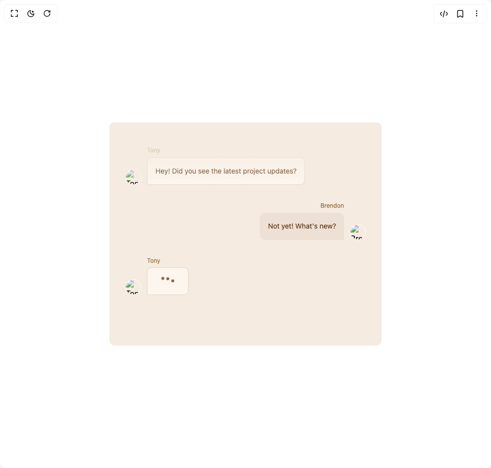
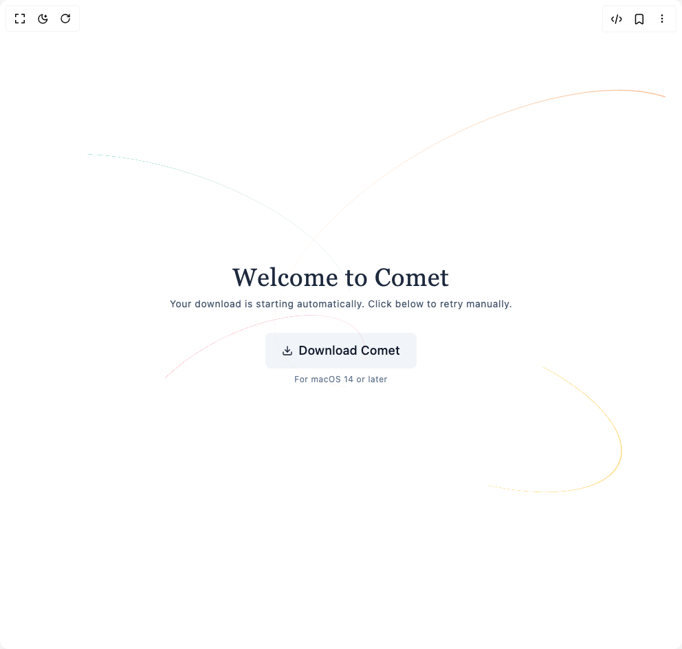
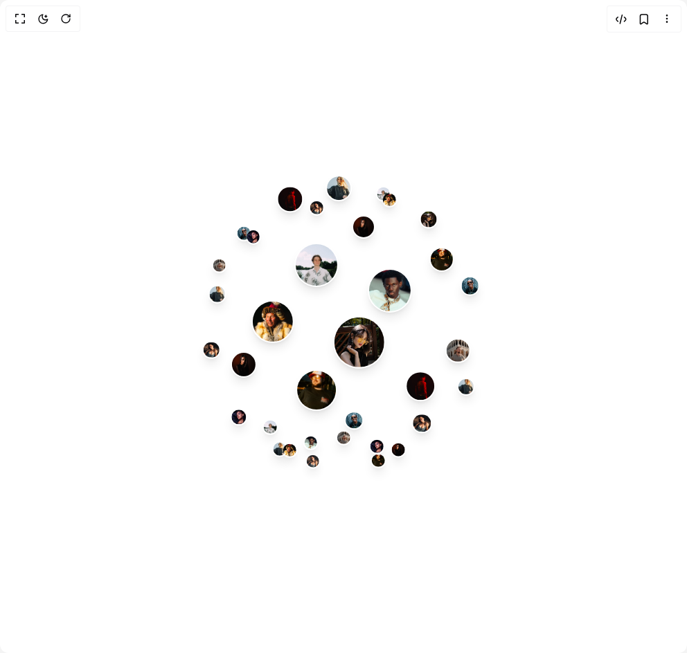
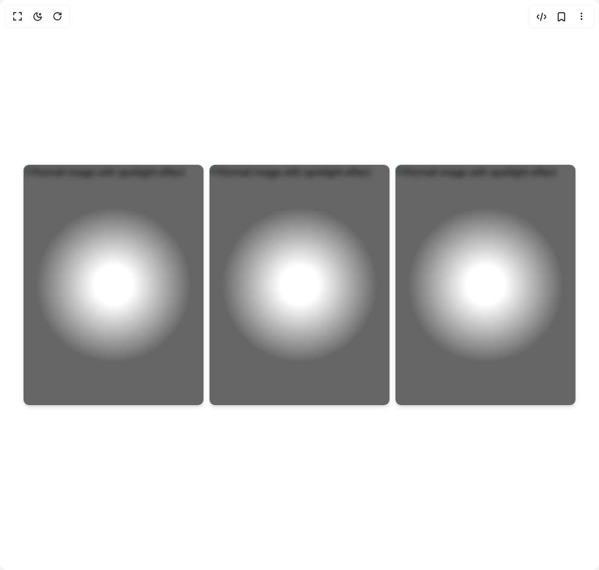
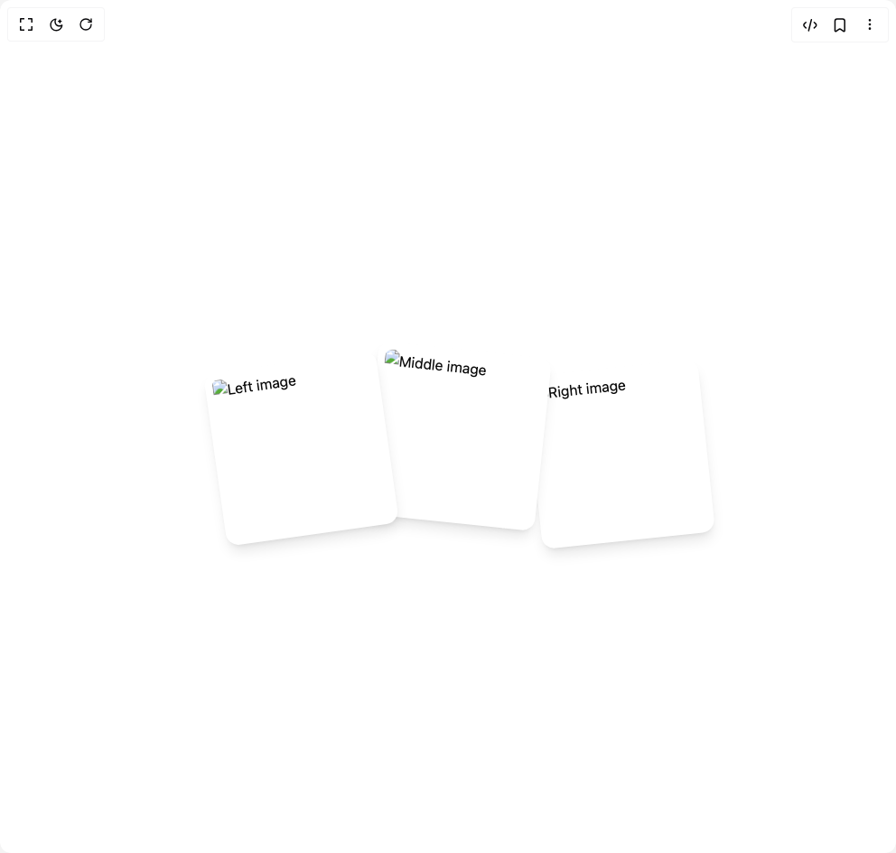
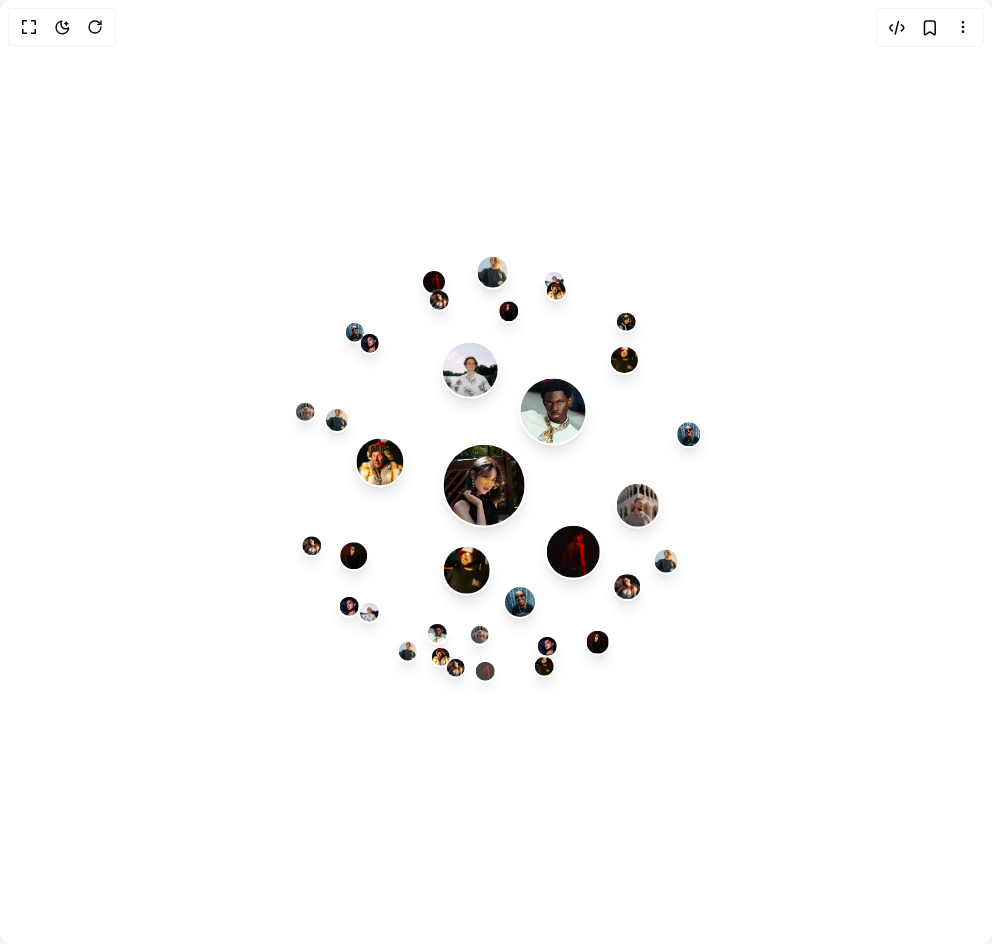

# Tonyzebastian Components

8 components are available in this author group.

> Build any component in [BuilderStudio](https://builderstudio.dev), then share improvements with the community on [Discord](https://discord.gg/QdWeSGCqfe) or [Reddit](https://reddit.com/r/builderstudio).

| Preview | Component | Variant |
| --- | --- | --- |
|  | [Chat Interface](chat-interface/default/README.md) | `default` |
|  | [Comet Hero](comet-hero/default/README.md) | `default` |
|  | [Image Loading](image-loading/default/README.md) | `default` |
|  | [Image Sphere](image-sphere/default/README.md) | `default` |
|  | [Image Spotlight](image-spotlight/default/README.md) | `default` |
|  | [Image Stack](image-stack/default/README.md) | `default` |
|  | [Image Tiles](image-tiles/default/README.md) | `default` |
|  | [Img Sphere](img-sphere/default/README.md) | `default` |
