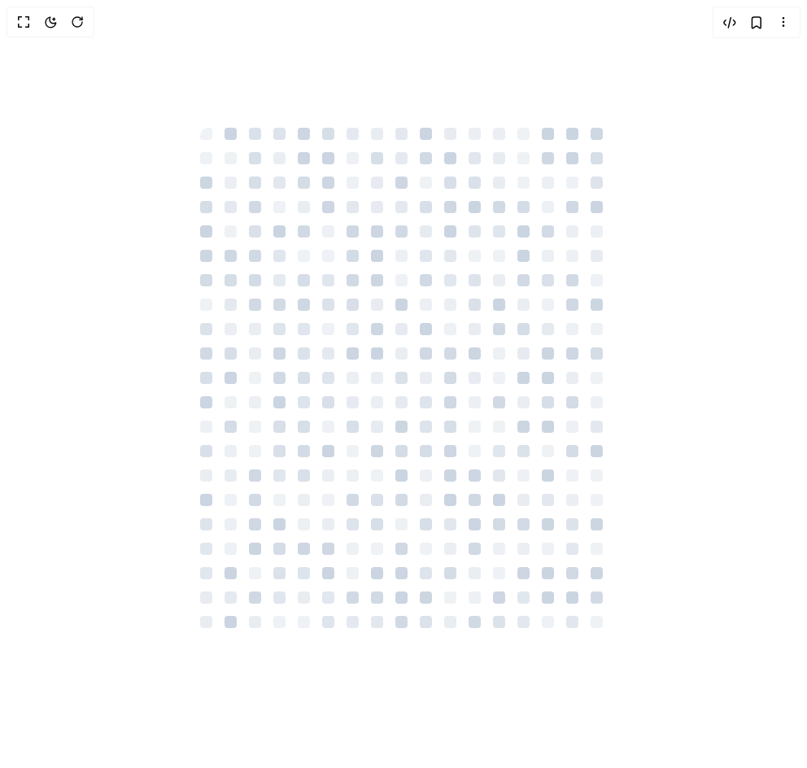

# Build Image Loading in BuilderStudio

> Build this component in our Agentic IDE: [BuilderStudio](https://builderstudio.dev).
>
> Join the BuilderStudio community on [Discord](https://discord.gg/QdWeSGCqfe) and [Reddit](https://reddit.com/r/builderstudio).



## Component

- Author group: `tonyzebastian`
- Component: `image-loading`
- Variant: `default`
- Rendered HTML snapshot: [`rendered.html`](rendered.html)

## BuilderStudio prompt

You are implementing a React component based on a component reference.

## Component identity

- Author: tonyzebastian
- Component slug: image-loading
- Demo slug: default
- Title: image-loading
- Description: 

## Goal

Recreate this component in a React + TypeScript + Tailwind CSS project. Preserve the visual layout, spacing, colors, border radius, shadows, interaction behavior, animation behavior, responsive behavior, and dark mode behavior shown in the rendered demo.

## Implementation requirements

- Use React and TypeScript.
- Use Tailwind CSS classes whenever possible.
- Keep the component self-contained unless the source files require helper components.
- If the source uses CSS variables, custom CSS, animations, or keyframes, include them.
- If the source uses external packages, list and use the required packages.
- Preserve accessibility attributes, button semantics, links, keyboard behavior, and ARIA attributes when visible in the source.
- Do not replace the component with a simplified placeholder.
- Return complete production-ready code.

## Dependencies

No reference metadata available.

## Rendered DOM snapshot

This is the rendered demo HTML extracted from the live preview. Use it to verify structure, class names, visible content, and layout.

```html
<div id="root"><div class="w-screen min-h-screen flex justify-center items-center"><div class="w-screen min-h-screen flex justify-center items-center"><div class="min-h-screen flex items-center justify-center p-8"><div class="relative rounded-lg overflow-hidden"><style>
        @keyframes blink {
          0%, 100% { opacity: 0.3; }
          50% { opacity: 1; }
        }
      </style><div class="relative overflow-hidden mx-auto" style="width: 500px; height: 630px; aspect-ratio: 500 / 630;"><div class="absolute inset-0 z-10 pointer-events-none"><div class="rounded" style="position: absolute; left: 0px; top: 0px; will-change: opacity, background-color, width, height, left, top; animation: 2000ms ease 1396.37ms infinite normal backwards running blink; background-color: rgb(203, 213, 225); width: 15px; height: 15px; opacity: 0.328975;"></div><div class="rounded" style="position: absolute; left: 30px; top: 0px; will-change: opacity, background-color, width, height, left, top; animation: 2000ms ease 464.556ms infinite normal backwards running blink; background-color: rgb(203, 213, 225); width: 15px; height: 15px; opacity: 0.465159;"></div><div class="rounded" style="position: absolute; left: 60px; top: 0px; will-change: opacity, background-color, width, height, left, top; animation: 2000ms ease 998.342ms infinite normal backwards running blink; background-color: rgb(203, 213, 225); width: 15px; height: 15px; opacity: 0.92904;"></div><div class="rounded" style="position: absolute; left: 90px; top: 0px; will-change: opacity, background-color, width, height, left, top; animation: 2000ms ease 41.0585ms infinite normal backwards running blink; background-color: rgb(203, 213, 225); width: 15px; height: 15px; opacity: 0.890916;"></div><div class="rounded" style="position: absolute; left: 120px; top: 0px; will-change: opacity, background-color, width, height, left, top; animation: 2000ms ease 615.438ms infinite normal backwards running blink; background-color: rgb(203, 213, 225); width: 15px; height: 15px; opacity: 0.699097;"></div><div class="rounded" style="position: absolute; left: 150px; top: 0px; will-change: opacity, background-color, width, height, left, top; animation: 2000ms ease 929.695ms infinite normal backwards running blink; background-color: rgb(203, 213, 225); width: 15px; height: 15px; opacity: 0.946207;"></div><div class="rounded" style="position: absolute; left: 180px; top: 0px; will-change: opacity, background-color, width, height, left, top; animation: 2000ms ease 1133.31ms infinite normal backwards running blink; background-color: rgb(203, 213, 225); width: 15px; height: 15px; opacity: 0.630193;"></div><div class="rounded" style="position: absolute; left: 210px; top: 0px; will-change: opacity, background-color, width, height, left, top; animation: 2000ms ease 1803.39ms infinite normal backwards running blink; background-color: rgb(203, 213, 225); width: 15px; height: 15px; opacity: 0.44526;"></div><div class="rounded" style="position: absolute; left: 240px; top: 0px; will-change: opacity, background-color, width, height, left, top; animation: 2000ms ease 1948.42ms infinite normal backwards running blink; background-color: rgb(203, 213, 225); width: 15px; height: 15px; opacity: 0.474393;"></div><div class="rounded" style="position: absolute; left: 270px; top: 0px; will-change: opacity, background-color, width, height, left, top; animation: 2000ms ease 468.259ms infinite normal backwards running blink; background-color: rgb(203, 213, 225); width: 15px; height: 15px; opacity: 0.738133;"></div><div class="rounded" style="position: absolute; left: 300px; top: 0px; will-change: opacity, background-color, width, height, left, top; animation: 2000ms ease 1167.19ms infinite normal backwards running blink; background-color: rgb(203, 213, 225); width: 15px; height: 15px; opacity: 0.687832;"></div><div class="rounded" style="position: absolute; left: 330px; top: 0px; will-change: opacity, background-color, width, height, left, top; animation: 2000ms ease 1212.5ms infinite normal backwards running blink; background-color: rgb(203, 213, 225); width: 15px; height: 15px; opacity: 0.87572;"></div><div class="rounded" style="position: absolute; left: 360px; top: 0px; will-change: opacity, background-color, width, height, left, top; animation: 2000ms ease 1728.89ms infinite normal backwards running blink; background-color: rgb(203, 213, 225); width: 15px; height: 15px; opacity: 0.919978;"></div><div class="rounded" style="position: absolute; left: 390px; top: 0px; will-change: opacity, background-color, width, height, left, top; animation: 2000ms ease 1467.61ms infinite normal backwards running blink; background-color: rgb(203, 213, 225); width: 15px; height: 15px; opacity: 0.383706;"></div><div class="rounded" style="position: absolute; left: 420px; top: 0px; will-change: opacity, background-color, width, height, left, top; animation: 2000ms ease 398.333ms infinite normal backwards running blink; background-color: rgb(203, 213, 225); width: 15px; height: 15px; opacity: 0.864388;"></div><div class="rounded" style="position: absolute; left: 450px; top: 0px; will-change: opacity, background-color, width, height, left, top; animation: 2000ms ease 492.794ms infinite normal backwards running blink; background-color: rgb(203, 213, 225); width: 15px; height: 15px; opacity: 0.623589;"></div><div class="rounded" style="position: absolute; left: 480px; top: 0px; will-change: opacity, background-color, width, height, left, top; animation: 2000ms ease 701.987ms infinite normal backwards running blink; background-color: rgb(203, 213, 225); width: 15px; height: 15px; opacity: 0.36373;"></div><div class="rounded" style="position: absolute; left: 510px; top: 0px; will-change: opacity, background-color, width, height, left, top; animation: 2000ms ease 935.906ms infinite normal backwards running blink; background-color: rgb(203, 213, 225); width: 15px; height: 15px; opacity: 0.32982;"></div><div class="rounded" style="position: absolute; left: 0px; top: 30px; will-change: opacity, background-color, width, height, left, top; animation: 2000ms ease 1494.35ms infinite normal backwards running blink; background-color: rgb(203, 213, 225); width: 15px; height: 15px; opacity: 0.543227;"></div><div class="rounded" style="position: absolute; left: 30px; top: 30px; will-change: opacity, background-color, width, height, left, top; animation: 2000ms ease 1454.25ms infinite normal backwards running blink; background-color: rgb(203, 213, 225); width: 15px; height: 15px; opacity: 0.628801;"></div><div class="rounded" style="position: absolute; left: 60px; top: 30px; will-change: opacity, background-color, width, height, left, top; animation: 2000ms ease 106.975ms infinite normal backwards running blink; background-color: rgb(203, 213, 225); width: 15px; height: 15px; opacity: 0.88038;"></div><div class="rounded" style="position: absolute; left: 90px; top: 30px; will-change: opacity, background-color, width, height, left, top; animation: 2000ms ease 1736.59ms infinite normal backwards running blink; background-color: rgb(203, 213, 225); width: 15px; height: 15px; opacity: 0.441897;"></div><div class="rounded" style="position: absolute; left: 120px; top: 30px; will-change: opacity, background-color, width, height, left, top; animation: 2000ms ease 268.096ms infinite normal backwards running blink; background-color: rgb(203, 213, 225); width: 15px; height: 15px; opacity: 0.603958;"></div><div class="rounded" style="position: absolute; left: 150px; top: 30px; will-change: opacity, background-color, width, height, left, top; animation: 2000ms ease 385.946ms infinite normal backwards running blink; background-color: rgb(203, 213, 225); width: 15px; height: 15px; opacity: 0.473773;"></div><div class="rounded" style="position: absolute; left: 180px; top: 30px; will-change: opacity, background-color, width, height, left, top; animation: 2000ms ease 1593.81ms infinite normal backwards running blink; background-color: rgb(203, 213, 225); width: 15px; height: 15px; opacity: 0.431915;"></div><div class="rounded" style="position: absolute; left: 210px; top: 30px; will-change: opacity, background-color, width, height, left, top; animation: 2000ms ease 117.66ms infinite normal backwards running blink; background-color: rgb(203, 213, 225); width: 15px; height: 15px; opacity: 0.92464;"></div><div class="rounded" style="position: absolute; left: 240px; top: 30px; will-change: opacity, background-color, width, height, left, top; animation: 2000ms ease 1890.18ms infinite normal backwards running blink; background-color: rgb(203, 213, 225); width: 15px; height: 15px; opacity: 0.497077;"></div><div class="rounded" style="position: absolute; left: 270px; top: 30px; will-change: opacity, background-color, width, height, left, top; animation: 2000ms ease 775.456ms infinite normal backwards running blink; background-color: rgb(203, 213, 225); width: 15px; height: 15px; opacity: 0.605618;"></div><div class="rounded" style="position: absolute; left: 300px; top: 30px; will-change: opacity, background-color, width, height, left, top; animation: 2000ms ease 443.014ms infinite normal backwards running blink; background-color: rgb(203, 213, 225); width: 15px; height: 15px; opacity: 0.65054;"></div><div class="rounded" style="position: absolute; left: 330px; top: 30px; will-change: opacity, background-color, width, height, left, top; animation: 2000ms ease 1095.38ms infinite normal backwards running blink; background-color: rgb(203, 213, 225); width: 15px; height: 15px; opacity: 0.796903;"></div><div class="rounded" style="position: absolute; left: 360px; top: 30px; will-change: opacity, background-color, width, height, left, top; animation: 2000ms ease 1842.49ms infinite normal backwards running blink; background-color: rgb(203, 213, 225); width: 15px; height: 15px; opacity: 0.857242;"></div><div class="rounded" style="position: absolute; left: 390px; top: 30px; will-change: opacity, background-color, width, height, left, top; animation: 2000ms ease 1447.48ms infinite normal backwards running blink; background-color: rgb(203, 213, 225); width: 15px; height: 15px; opacity: 0.610084;"></div><div class="rounded" style="position: absolute; left: 420px; top: 30px; will-change: opacity, background-color, width, height, left, top; animation: 2000ms ease 679.866ms infinite normal backwards running blink; background-color: rgb(203, 213, 225); width: 15px; height: 15px; opacity: 0.698871;"></div><div class="rounded" style="position: absolute; left: 450px; top: 30px; will-change: opacity, background-color, width, height, left, top; animation: 2000ms ease 299.73ms infinite normal backwards running blink; background-color: rgb(203, 213, 225); width: 15px; height: 15px; opacity: 0.600537;"></div><div class="rounded" style="position: absolute; left: 480px; top: 30px; will-change: opacity, background-color, width, height, left, top; animation: 2000ms ease 927.168ms infinite normal backwards running blink; background-color: rgb(203, 213, 225); width: 15px; height: 15px; opacity: 0.492881;"></div><div class="rounded" style="position: absolute; left: 510px; top: 30px; will-change: opacity, background-color, width, height, left, top; animation: 2000ms ease 938.185ms infinite normal backwards running blink; background-color: rgb(203, 213, 225); width: 15px; height: 15px; opacity: 0.551168;"></div><div class="rounded" style="position: absolute; left: 0px; top: 60px; will-change: opacity, background-color, width, height, left, top; animation: 2000ms ease 642.976ms infinite normal backwards running blink; background-color: rgb(203, 213, 225); width: 15px; height: 15px; opacity: 0.664532;"></div><div class="rounded" style="position: absolute; left: 30px; top: 60px; will-change: opacity, background-color, width, height, left, top; animation: 2000ms ease 1225.42ms infinite normal backwards running blink; background-color: rgb(203, 213, 225); width: 15px; height: 15px; opacity: 0.92612;"></div><div class="rounded" style="position: absolute; left: 60px; top: 60px; will-change: opacity, background-color, width, height, left, top; animation: 2000ms ease 110.996ms infinite normal backwards running blink; background-color: rgb(203, 213, 225); width: 15px; height: 15px; opacity: 0.691699;"></div><div class="rounded" style="position: absolute; left: 90px; top: 60px; will-change: opacity, background-color, width, height, left, top; animation: 2000ms ease 1971.48ms infinite normal backwards running blink; background-color: rgb(203, 213, 225); width: 15px; height: 15px; opacity: 0.695452;"></div><div class="rounded" style="position: absolute; left: 120px; top: 60px; will-change: opacity, background-color, width, height, left, top; animation: 2000ms ease 881.094ms infinite normal backwards running blink; background-color: rgb(203, 213, 225); width: 15px; height: 15px; opacity: 0.344132;"></div><div class="rounded" style="position: absolute; left: 150px; top: 60px; will-change: opacity, background-color, width, height, left, top; animation: 2000ms ease 622.232ms infinite normal backwards running blink; background-color: rgb(203, 213, 225); width: 15px; height: 15px; opacity: 0.462363;"></div><div class="rounded" style="position: absolute; left: 180px; top: 60px; will-change: opacity, background-color, width, height, left, top; animation: 2000ms ease 1587.54ms infinite normal backwards running blink; background-color: rgb(203, 213, 225); width: 15px; height: 15px; opacity: 0.312084;"></div><div class="rounded" style="position: absolute; left: 210px; top: 60px; will-change: opacity, background-color, width, height, left, top; animation: 2000ms ease 1159.75ms infinite normal backwards running blink; background-color: rgb(203, 213, 225); width: 15px; height: 15px; opacity: 0.334436;"></div><div class="rounded" style="position: absolute; left: 240px; top: 60px; will-change: opacity, background-color, width, height, left, top; animation: 2000ms ease 630.781ms infinite normal backwards running blink; background-color: rgb(203, 213, 225); width: 15px; height: 15px; opacity: 0.684916;"></div><div class="rounded" style="position: absolute; left: 270px; top: 60px; will-change: opacity, background-color, width, height, left, top; animation: 2000ms ease 1333.45ms infinite normal backwards running blink; background-color: rgb(203, 213, 225); width: 15px; height: 15px; opacity: 0.493066;"></div><div class="rounded" style="position: absolute; left: 300px; top: 60px; will-change: opacity, background-color, width, height, left, top; animation: 2000ms ease 95.1683ms infinite normal backwards running blink; background-color: rgb(203, 213, 225); width: 15px; height: 15px; opacity: 0.758111;"></div><div class="rounded" style="position: absolute; left: 330px; top: 60px; will-change: opacity, background-color, width, height, left, top; animation: 2000ms ease 993.139ms infinite normal backwards running blink; background-color: rgb(203, 213, 225); width: 15px; height: 15px; opacity: 0.693069;"></div><div class="rounded" style="position: absolute; left: 360px; top: 60px; will-change: opacity, background-color, width, height, left, top; animation: 2000ms ease 1795.25ms infinite normal backwards running blink; background-color: rgb(203, 213, 225); width: 15px; height: 15px; opacity: 0.729918;"></div><div class="rounded" style="position: absolute; left: 390px; top: 60px; will-change: opacity, background-color, width, height, left, top; animation: 2000ms ease 1433.66ms infinite normal backwards running blink; background-color: rgb(203, 213, 225); width: 15px; height: 15px; opacity: 0.364607;"></div><div class="rounded" style="position: absolute; left: 420px; top: 60px; will-change: opacity, background-color, width, height, left, top; animation: 2000ms ease 1678.8ms infinite normal backwards running blink; background-color: rgb(203, 213, 225); width: 15px; height: 15px; opacity: 0.962405;"></div><div class="rounded" style="position: absolute; left: 450px; top: 60px; will-change: opacity, background-color, width, height, left, top; animation: 2000ms ease 1517.24ms infinite normal backwards running blink; background-color: rgb(203, 213, 225); width: 15px; height: 15px; opacity: 0.757685;"></div><div class="rounded" style="position: absolute; left: 480px; top: 60px; will-change: opacity, background-color, width, height, left, top; animation: 2000ms ease 1047.23ms infinite normal backwards running blink; background-color: rgb(203, 213, 225); width: 15px; height: 15px; opacity: 0.326964;"></div><div class="rounded" style="position: absolute; left: 510px; top: 60px; will-change: opacity, background-color, width, height, left, top; animation: 2000ms ease 362.642ms infinite normal backwards running blink; background-color: rgb(203, 213, 225); width: 15px; height: 15px; opacity: 0.314097;"></div><div class="rounded" style="position: absolute; left: 0px; top: 90px; will-change: opacity, background-color, width, height, left, top; animation: 2000ms ease 895.559ms infinite normal backwards running blink; background-color: rgb(203, 213, 225); width: 15px; height: 15px; opacity: 0.307905;"></div><div class="rounded" style="position: absolute; left: 30px; top: 90px; will-change: opacity, background-color, width, height, left, top; animation: 2000ms ease 1119.16ms infinite normal backwards running blink; background-color: rgb(203, 213, 225); width: 15px; height: 15px; opacity: 0.613317;"></div><div class="rounded" style="position: absolute; left: 60px; top: 90px; will-change: opacity, background-color, width, height, left, top; animation: 2000ms ease 780.551ms infinite normal backwards running blink; background-color: rgb(203, 213, 225); width: 15px; height: 15px; opacity: 0.847434;"></div><div class="rounded" style="position: absolute; left: 90px; top: 90px; will-change: opacity, background-color, width, height, left, top; animation: 2000ms ease 1542.23ms infinite normal backwards running blink; background-color: rgb(203, 213, 225); width: 15px; height: 15px; opacity: 0.576632;"></div><div class="rounded" style="position: absolute; left: 120px; top: 90px; will-change: opacity, background-color, width, height, left, top; animation: 2000ms ease 1803.65ms infinite normal backwards running blink; background-color: rgb(203, 213, 225); width: 15px; height: 15px; opacity: 0.879696;"></div><div class="rounded" style="position: absolute; left: 150px; top: 90px; will-change: opacity, background-color, width, height, left, top; animation: 2000ms ease 620.553ms infinite normal backwards running blink; background-color: rgb(203, 213, 225); width: 15px; height: 15px; opacity: 0.851509;"></div><div class="rounded" style="position: absolute; left: 180px; top: 90px; will-change: opacity, background-color, width, height, left, top; animation: 2000ms ease 1931.11ms infinite normal backwards running blink; background-color: rgb(203, 213, 225); width: 15px; height: 15px; opacity: 0.968526;"></div><div class="rounded" style="position: absolute; left: 210px; top: 90px; will-change: opacity, background-color, width, height, left, top; animation: 2000ms ease 1153.29ms infinite normal backwards running blink; background-color: rgb(203, 213, 225); width: 15px; height: 15px; opacity: 0.888906;"></div><div class="rounded" style="position: absolute; left: 240px; top: 90px; will-change: opacity, background-color, width, height, left, top; animation: 2000ms ease 1127.86ms infinite normal backwards running blink; background-color: rgb(203, 213, 225); width: 15px; height: 15px; opacity: 0.332379;"></div><div class="rounded" style="position: absolute; left: 270px; top: 90px; will-change: opacity, background-color, width, height, left, top; animation: 2000ms ease 958.568ms infinite normal backwards running blink; background-color: rgb(203, 213, 225); width: 15px; height: 15px; opacity: 0.498425;"></div><div class="rounded" style="position: absolute; left: 300px; top: 90px; will-change: opacity, background-color, width, height, left, top; animation: 2000ms ease 667.071ms infinite normal backwards running blink; background-color: rgb(203, 213, 225); width: 15px; height: 15px; opacity: 0.946919;"></div><div class="rounded" style="position: absolute; left: 330px; top: 90px; will-change: opacity, background-color, width, height, left, top; animation: 2000ms ease 327.448ms infinite normal backwards running blink; background-color: rgb(203, 213, 225); width: 15px; height: 15px; opacity: 0.879498;"></div><div class="rounded" style="position: absolute; left: 360px; top: 90px; will-change: opacity, background-color, width, height, left, top; animation: 2000ms ease 784.541ms infinite normal backwards running blink; background-color: rgb(203, 213, 225); width: 15px; height: 15px; opacity: 0.505663;"></div><div class="rounded" style="position: absolute; left: 390px; top: 90px; will-change: opacity, background-color, width, height, left, top; animation: 2000ms ease 884.916ms infinite normal backwards running blink; background-color: rgb(203, 213, 225); width: 15px; height: 15px; opacity: 0.86342;"></div><div class="rounded" style="position: absolute; left: 420px; top: 90px; will-change: opacity, background-color, width, height, left, top; animation: 2000ms ease 1570.84ms infinite normal backwards running blink; background-color: rgb(203, 213, 225); width: 15px; height: 15px; opacity: 0.63911;"></div><div class="rounded" style="position: absolute; left: 450px; top: 90px; will-change: opacity, background-color, width, height, left, top; animation: 2000ms ease 213.694ms infinite normal backwards running blink; background-color: rgb(203, 213, 225); width: 15px; height: 15px; opacity: 0.89043;"></div><div class="rounded" style="position: absolute; left: 480px; top: 90px; will-change: opacity, background-color, width, height, left, top; animation: 2000ms ease 309.773ms infinite normal backwards running blink; background-color: rgb(203, 213, 225); width: 15px; height: 15px; opacity: 0.442303;"></div><div class="rounded" style="position: absolute; left: 510px; top: 90px; will-change: opacity, background-color, width, height, left, top; animation: 2000ms ease 1481.44ms infinite normal backwards running blink; background-color: rgb(203, 213, 225); width: 15px; height: 15px; opacity: 0.975544;"></div><div class="rounded" style="position: absolute; left: 0px; top: 120px; will-change: opacity, background-color, width, height, left, top; animation: 2000ms ease 365.943ms infinite normal backwards running blink; background-color: rgb(203, 213, 225); width: 15px; height: 15px; opacity: 0.974044;"></div><div class="rounded" style="position: absolute; left: 30px; top: 120px; will-change: opacity, background-color, width, height, left, top; animation: 2000ms ease 1355.2ms infinite normal backwards running blink; background-color: rgb(203, 213, 225); width: 15px; height: 15px; opacity: 0.702415;"></div><div class="rounded" style="position: absolute; left: 60px; top: 120px; will-change: opacity, background-color, width, height, left, top; animation: 2000ms ease 68.5474ms infinite normal backwards running blink; background-color: rgb(203, 213, 225); width: 15px; height: 15px; opacity: 0.713613;"></div><div class="rounded" style="position: absolute; left: 90px; top: 120px; will-change: opacity, background-color, width, height, left, top; animation: 2000ms ease 370.56ms infinite normal backwards running blink; background-color: rgb(203, 213, 225); width: 15px; height: 15px; opacity: 0.748466;"></div><div class="rounded" style="position: absolute; left: 120px; top: 120px; will-change: opacity, background-color, width, height, left, top; animation: 2000ms ease 812.689ms infinite normal backwards running blink; background-color: rgb(203, 213, 225); width: 15px; height: 15px; opacity: 0.959761;"></div><div class="rounded" style="position: absolute; left: 150px; top: 120px; will-change: opacity, background-color, width, height, left, top; animation: 2000ms ease 1580.49ms infinite normal backwards running blink; background-color: rgb(203, 213, 225); width: 15px; height: 15px; opacity: 0.737259;"></div><div class="rounded" style="position: absolute; left: 180px; top: 120px; will-change: opacity, background-color, width, height, left, top; animation: 2000ms ease 717.957ms infinite normal backwards running blink; background-color: rgb(203, 213, 225); width: 15px; height: 15px; opacity: 0.373826;"></div><div class="rounded" style="position: absolute; left: 210px; top: 120px; will-change: opacity, background-color, width, height, left, top; animation: 2000ms ease 245.034ms infinite normal backwards running blink; background-color: rgb(203, 213, 225); width: 15px; height: 15px; opacity: 0.637036;"></div><div class="rounded" style="position: absolute; left: 240px; top: 120px; will-change: opacity, background-color, width, height, left, top; animation: 2000ms ease 172.72ms infinite normal backwards running blink; background-color: rgb(203, 213, 225); width: 15px; height: 15px; opacity: 0.427509;"></div><div class="rounded" style="position: absolute; left: 270px; top: 120px; will-change: opacity, background-color, width, height, left, top; animation: 2000ms ease 1870.88ms infinite normal backwards running blink; background-color: rgb(203, 213, 225); width: 15px; height: 15px; opacity: 0.545346;"></div><div class="rounded" style="position: absolute; left: 300px; top: 120px; will-change: opacity, background-color, width, height, left, top; animation: 2000ms ease 334.284ms infinite normal backwards running blink; background-color: rgb(203, 213, 225); width: 15px; height: 15px; opacity: 0.751014;"></div><div class="rounded" style="position: absolute; left: 330px; top: 120px; will-change: opacity, background-color, width, height, left, top; animation: 2000ms ease 1047.49ms infinite normal backwards running blink; background-color: rgb(203, 213, 225); width: 15px; height: 15px; opacity: 0.817568;"></div><div class="rounded" style="position: absolute; left: 360px; top: 120px; will-change: opacity, background-color, width, height, left, top; animation: 2000ms ease 1982.45ms infinite normal backwards running blink; background-color: rgb(203, 213, 225); width: 15px; height: 15px; opacity: 0.590211;"></div><div class="rounded" style="position: absolute; left: 390px; top: 120px; will-change: opacity, background-color, width, height, left, top; animation: 2000ms ease 354.337ms infinite normal backwards running blink; background-color: rgb(203, 213, 225); width: 15px; height: 15px; opacity: 0.950959;"></div><div class="rounded" style="position: absolute; left: 420px; top: 120px; will-change: opacity, background-color, width, height, left, top; animation: 2000ms ease 826.781ms infinite normal backwards running blink; background-color: rgb(203, 213, 225); width: 15px; height: 15px; opacity: 0.414252;"></div><div class="rounded" style="position: absolute; left: 450px; top: 120px; will-change: opacity, background-color, width, height, left, top; animation: 2000ms ease 1725.63ms infinite normal backwards running blink; background-color: rgb(203, 213, 225); width: 15px; height: 15px; opacity: 0.725112;"></div><div class="rounded" style="position: absolute; left: 480px; top: 120px; will-change: opacity, background-color, width, height, left, top; animation: 2000ms ease 1227.87ms infinite normal backwards running blink; background-color: rgb(203, 213, 225); width: 15px; height: 15px; opacity: 0.636869;"></div><div class="rounded" style="position: absolute; left: 510px; top: 120px; will-change: opacity, background-color, width, height, left, top; animation: 2000ms ease 1990.89ms infinite normal backwards running blink; background-color: rgb(203, 213, 225); width: 15px; height: 15px; opacity: 0.581634;"></div><div class="rounded" style="position: absolute; left: 0px; top: 150px; will-change: opacity, background-color, width, height, left, top; animation: 2000ms ease 239.211ms infinite normal backwards running blink; background-color: rgb(203, 213, 225); width: 15px; height: 15px; opacity: 0.463342;"></div><div class="rounded" style="position: absolute; left: 30px; top: 150px; will-change: opacity, background-color, width, height, left, top; animation: 2000ms ease 709.657ms infinite normal backwards running blink; background-color: rgb(203, 213, 225); width: 15px; height: 15px; opacity: 0.55269;"></div><div class="rounded" style="position: absolute; left: 60px; top: 150px; will-change: opacity, background-color, width, height, left, top; animation: 2000ms ease 772.979ms infinite normal backwards running blink; background-color: rgb(203, 213, 225); width: 15px; height: 15px; opacity: 0.724728;"></div><div class="rounded" style="position: absolute; left: 90px; top: 150px; will-change: opacity, background-color, width, height, left, top; animation: 2000ms ease 1069.5ms infinite normal backwards running blink; background-color: rgb(203, 213, 225); width: 15px; height: 15px; opacity: 0.39492;"></div><div class="rounded" style="position: absolute; left: 120px; top: 150px; will-change: opacity, background-color, width, height, left, top; animation: 2000ms ease 1406.27ms infinite normal backwards running blink; background-color: rgb(203, 213, 225); width: 15px; height: 15px; opacity: 0.377135;"></div><div class="rounded" style="position: absolute; left: 150px; top: 150px; will-change: opacity, background-color, width, height, left, top; animation: 2000ms ease 1491.53ms infinite normal backwards running blink; background-color: rgb(203, 213, 225); width: 15px; height: 15px; opacity: 0.490283;"></div><div class="rounded" style="position: absolute; left: 180px; top: 150px; will-change: opacity, background-color, width, height, left, top; animation: 2000ms ease 869.134ms infinite normal backwards running blink; background-color: rgb(203, 213, 225); width: 15px; height: 15px; opacity: 0.648;"></div><div class="rounded" style="position: absolute; left: 210px; top: 150px; will-change: opacity, background-color, width, height, left, top; animation: 2000ms ease 345.763ms infinite normal backwards running blink; background-color: rgb(203, 213, 225); width: 15px; height: 15px; opacity: 0.535388;"></div><div class="rounded" style="position: absolute; left: 240px; top: 150px; will-change: opacity, background-color, width, height, left, top; animation: 2000ms ease 1685.01ms infinite normal backwards running blink; background-color: rgb(203, 213, 225); width: 15px; height: 15px; opacity: 0.903923;"></div><div class="rounded" style="position: absolute; left: 270px; top: 150px; will-change: opacity, background-color, width, height, left, top; animation: 2000ms ease 1981.65ms infinite normal backwards running blink; background-color: rgb(203, 213, 225); width: 15px; height: 15px; opacity: 0.324313;"></div><div class="rounded" style="position: absolute; left: 300px; top: 150px; will-change: opacity, background-color, width, height, left, top; animation: 2000ms ease 1099.33ms infinite normal backwards running blink; background-color: rgb(203, 213, 225); width: 15px; height: 15px; opacity: 0.991412;"></div><div class="rounded" style="position: absolute; left: 330px; top: 150px; will-change: opacity, background-color, width, height, left, top; animation: 2000ms ease 1416.31ms infinite normal backwards running blink; background-color: rgb(203, 213, 225); width: 15px; height: 15px; opacity: 0.551225;"></div><div class="rounded" style="position: absolute; left: 360px; top: 150px; will-change: opacity, background-color, width, height, left, top; animation: 2000ms ease 1453.66ms infinite normal backwards running blink; background-color: rgb(203, 213, 225); width: 15px; height: 15px; opacity: 0.48601;"></div><div class="rounded" style="position: absolute; left: 390px; top: 150px; will-change: opacity, background-color, width, height, left, top; animation: 2000ms ease 466.936ms infinite normal backwards running blink; background-color: rgb(203, 213, 225); width: 15px; height: 15px; opacity: 0.4612;"></div><div class="rounded" style="position: absolute; left: 420px; top: 150px; will-change: opacity, background-color, width, height, left, top; animation: 2000ms ease 1645.57ms infinite normal backwards running blink; background-color: rgb(203, 213, 225); width: 15px; height: 15px; opacity: 0.710424;"></div><div class="rounded" style="position: absolute; left: 450px; top: 150px; will-change: opacity, background-color, width, height, left, top; animation: 2000ms ease 1603.85ms infinite normal backwards running blink; background-color: rgb(203, 213, 225); width: 15px; height: 15px; opacity: 0.966223;"></div><div class="rounded" style="position: absolute; left: 480px; top: 150px; will-change: opacity, background-color, width, height, left, top; animation: 2000ms ease 1830.86ms infinite normal backwards running blink; background-color: rgb(203, 213, 225); width: 15px; height: 15px; opacity: 0.849364;"></div><div class="rounded" style="position: absolute; left: 510px; top: 150px; will-change: opacity, background-color, width, height, left, top; animation: 2000ms ease 797.885ms infinite normal backwards running blink; background-color: rgb(203, 213, 225); width: 15px; height: 15px; opacity: 0.365499;"></div><div class="rounded" style="position: absolute; left: 0px; top: 180px; will-change: opacity, background-color, width, height, left, top; animation: 2000ms ease 848.563ms infinite normal backwards running blink; background-color: rgb(203, 213, 225); width: 15px; height: 15px; opacity: 0.788124;"></div><div class="rounded" style="position: absolute; left: 30px; top: 180px; will-change: opacity, background-color, width, height, left, top; animation: 2000ms ease 898.711ms infinite normal backwards running blink; background-color: rgb(203, 213, 225); width: 15px; height: 15px; opacity: 0.350472;"></div><div class="rounded" style="position: absolute; left: 60px; top: 180px; will-change: opacity, background-color, width, height, left, top; animation: 2000ms ease 148.215ms infinite normal backwards running blink; background-color: rgb(203, 213, 225); width: 15px; height: 15px; opacity: 0.766377;"></div><div class="rounded" style="position: absolute; left: 90px; top: 180px; will-change: opacity, background-color, width, height, left, top; animation: 2000ms ease 1889.04ms infinite normal backwards running blink; background-color: rgb(203, 213, 225); width: 15px; height: 15px; opacity: 0.655394;"></div><div class="rounded" style="position: absolute; left: 120px; top: 180px; will-change: opacity, background-color, width, height, left, top; animation: 2000ms ease 899.092ms infinite normal backwards running blink; background-color: rgb(203, 213, 225); width: 15px; height: 15px; opacity: 0.983246;"></div><div class="rounded" style="position: absolute; left: 150px; top: 180px; will-change: opacity, background-color, width, height, left, top; animation: 2000ms ease 1072.31ms infinite normal backwards running blink; background-color: rgb(203, 213, 225); width: 15px; height: 15px; opacity: 0.814981;"></div><div class="rounded" style="position: absolute; left: 180px; top: 180px; will-change: opacity, background-color, width, height, left, top; animation: 2000ms ease 781.247ms infinite normal backwards running blink; background-color: rgb(203, 213, 225); width: 15px; height: 15px; opacity: 0.903564;"></div><div class="rounded" style="position: absolute; left: 210px; top: 180px; will-change: opacity, background-color, width, height, left, top; animation: 2000ms ease 645.446ms infinite normal backwards running blink; background-color: rgb(203, 213, 225); width: 15px; height: 15px; opacity: 0.614728;"></div><div class="rounded" style="position: absolute; left: 240px; top: 180px; will-change: opacity, background-color, width, height, left, top; animation: 2000ms ease 1519.33ms infinite normal backwards running blink; background-color: rgb(203, 213, 225); width: 15px; height: 15px; opacity: 0.982465;"></div><div class="rounded" style="position: absolute; left: 270px; top: 180px; will-change: opacity, background-color, width, height, left, top; animation: 2000ms ease 800.347ms infinite normal backwards running blink; background-color: rgb(203, 213, 225); width: 15px; height: 15px; opacity: 0.929421;"></div><div class="rounded" style="position: absolute; left: 300px; top: 180px; will-change: opacity, background-color, width, height, left, top; animation: 2000ms ease 1090.16ms infinite normal backwards running blink; background-color: rgb(203, 213, 225); width: 15px; height: 15px; opacity: 0.554288;"></div><div class="rounded" style="position: absolute; left: 330px; top: 180px; will-change: opacity, background-color, width, height, left, top; animation: 2000ms ease 1023.49ms infinite normal backwards running blink; background-color: rgb(203, 213, 225); width: 15px; height: 15px; opacity: 0.761953;"></div><div class="rounded" style="position: absolute; left: 360px; top: 180px; will-change: opacity, background-color, width, height, left, top; animation: 2000ms ease 1758.35ms infinite normal backwards running blink; background-color: rgb(203, 213, 225); width: 15px; height: 15px; opacity: 0.86867;"></div><div class="rounded" style="position: absolute; left: 390px; top: 180px; will-change: opacity, background-color, width, height, left, top; animation: 2000ms ease 788.824ms infinite normal backwards running blink; background-color: rgb(203, 213, 225); width: 15px; height: 15px; opacity: 0.72957;"></div><div class="rounded" style="position: absolute; left: 420px; top: 180px; will-change: opacity, background-color, width, height, left, top; animation: 2000ms ease 967.248ms infinite normal backwards running blink; background-color: rgb(203, 213, 225); width: 15px; height: 15px; opacity: 0.521798;"></div><div class="rounded" style="position: absolute; left: 450px; top: 180px; will-change: opacity, background-color, width, height, left, top; animation: 2000ms ease 806.901ms infinite normal backwards running blink; background-color: rgb(203, 213, 225); width: 15px; height: 15px; opacity: 0.759772;"></div><div class="rounded" style="position: absolute; left: 480px; top: 180px; will-change: opacity, background-color, width, height, left, top; animation: 2000ms ease 1535.85ms infinite normal backwards running blink; background-color: rgb(203, 213, 225); width: 15px; height: 15px; opacity: 0.435339;"></div><div class="rounded" style="position: absolute; left: 510px; top: 180px; will-change: opacity, background-color, width, height, left, top; animation: 2000ms ease 1111.11ms infinite normal backwards running blink; background-color: rgb(203, 213, 225); width: 15px; height: 15px; opacity: 0.902956;"></div><div class="rounded" style="position: absolute; left: 0px; top: 210px; will-change: opacity, background-color, width, height, left, top; animation: 2000ms ease 1445.12ms infinite normal backwards running blink; background-color: rgb(203, 213, 225); width: 15px; height: 15px; opacity: 0.569564;"></div><div class="rounded" style="position: absolute; left: 30px; top: 210px; will-change: opacity, background-color, width, height, left, top; animation: 2000ms ease 1119.72ms infinite normal backwards running blink; background-color: rgb(203, 213, 225); width: 15px; height: 15px; opacity: 0.822555;"></div><div class="rounded" style="position: absolute; left: 60px; top: 210px; will-change: opacity, background-color, width, height, left, top; animation: 2000ms ease 769.622ms infinite normal backwards running blink; background-color: rgb(203, 213, 225); width: 15px; height: 15px; opacity: 0.711433;"></div><div class="rounded" style="position: absolute; left: 90px; top: 210px; will-change: opacity, background-color, width, height, left, top; animation: 2000ms ease 822.937ms infinite normal backwards running blink; background-color: rgb(203, 213, 225); width: 15px; height: 15px; opacity: 0.400663;"></div><div class="rounded" style="position: absolute; left: 120px; top: 210px; will-change: opacity, background-color, width, height, left, top; animation: 2000ms ease 218.995ms infinite normal backwards running blink; background-color: rgb(203, 213, 225); width: 15px; height: 15px; opacity: 0.740894;"></div><div class="rounded" style="position: absolute; left: 150px; top: 210px; will-change: opacity, background-color, width, height, left, top; animation: 2000ms ease 55.5207ms infinite normal backwards running blink; background-color: rgb(203, 213, 225); width: 15px; height: 15px; opacity: 0.995277;"></div><div class="rounded" style="position: absolute; left: 180px; top: 210px; will-change: opacity, background-color, width, height, left, top; animation: 2000ms ease 961.746ms infinite normal backwards running blink; background-color: rgb(203, 213, 225); width: 15px; height: 15px; opacity: 0.946087;"></div><div class="rounded" style="position: absolute; left: 210px; top: 210px; will-change: opacity, background-color, width, height, left, top; animation: 2000ms ease 1827.45ms infinite normal backwards running blink; background-color: rgb(203, 213, 225); width: 15px; height: 15px; opacity: 0.425826;"></div><div class="rounded" style="position: absolute; left: 240px; top: 210px; will-change: opacity, background-color, width, height, left, top; animation: 2000ms ease 295.108ms infinite normal backwards running blink; background-color: rgb(203, 213, 225); width: 15px; height: 15px; opacity: 0.326936;"></div><div class="rounded" style="position: absolute; left: 270px; top: 210px; will-change: opacity, background-color, width, height, left, top; animation: 2000ms ease 1244.64ms infinite normal backwards running blink; background-color: rgb(203, 213, 225); width: 15px; height: 15px; opacity: 0.37216;"></div><div class="rounded" style="position: absolute; left: 300px; top: 210px; will-change: opacity, background-color, width, height, left, top; animation: 2000ms ease 1726.53ms infinite normal backwards running blink; background-color: rgb(203, 213, 225); width: 15px; height: 15px; opacity: 0.41195;"></div><div class="rounded" style="position: absolute; left: 330px; top: 210px; will-change: opacity, background-color, width, height, left, top; animation: 2000ms ease 991.483ms infinite normal backwards running blink; background-color: rgb(203, 213, 225); width: 15px; height: 15px; opacity: 0.938089;"></div><div class="rounded" style="position: absolute; left: 360px; top: 210px; will-change: opacity, background-color, width, height, left, top; animation: 2000ms ease 295.251ms infinite normal backwards running blink; background-color: rgb(203, 213, 225); width: 15px; height: 15px; opacity: 0.759118;"></div><div class="rounded" style="position: absolute; left: 390px; top: 210px; will-change: opacity, background-color, width, height, left, top; animation: 2000ms ease 1195.73ms infinite normal backwards running blink; background-color: rgb(203, 213, 225); width: 15px; height: 15px; opacity: 0.939185;"></div><div class="rounded" style="position: absolute; left: 420px; top: 210px; will-change: opacity, background-color, width, height, left, top; animation: 2000ms ease 1286.32ms infinite normal backwards running blink; background-color: rgb(203, 213, 225); width: 15px; height: 15px; opacity: 0.488257;"></div><div class="rounded" style="position: absolute; left: 450px; top: 210px; will-change: opacity, background-color, width, height, left, top; animation: 2000ms ease 736.712ms infinite normal backwards running blink; background-color: rgb(203, 213, 225); width: 15px; height: 15px; opacity: 0.945414;"></div><div class="rounded" style="position: absolute; left: 480px; top: 210px; will-change: opacity, background-color, width, height, left, top; animation: 2000ms ease 566.652ms infinite normal backwards running blink; background-color: rgb(203, 213, 225); width: 15px; height: 15px; opacity: 0.396171;"></div><div class="rounded" style="position: absolute; left: 510px; top: 210px; will-change: opacity, background-color, width, height, left, top; animation: 2000ms ease 1592.51ms infinite normal backwards running blink; background-color: rgb(203, 213, 225); width: 15px; height: 15px; opacity: 0.8451;"></div><div class="rounded" style="position: absolute; left: 0px; top: 240px; will-change: opacity, background-color, width, height, left, top; animation: 2000ms ease 47.8374ms infinite normal backwards running blink; background-color: rgb(203, 213, 225); width: 15px; height: 15px; opacity: 0.683464;"></div><div class="rounded" style="position: absolute; left: 30px; top: 240px; will-change: opacity, background-color, width, height, left, top; animation: 2000ms ease 1696.83ms infinite normal backwards running blink; background-color: rgb(203, 213, 225); width: 15px; height: 15px; opacity: 0.867065;"></div><div class="rounded" style="position: absolute; left: 60px; top: 240px; will-change: opacity, background-color, width, height, left, top; animation: 2000ms ease 1765.91ms infinite normal backwards running blink; background-color: rgb(203, 213, 225); width: 15px; height: 15px; opacity: 0.616754;"></div><div class="rounded" style="position: absolute; left: 90px; top: 240px; will-change: opacity, background-color, width, height, left, top; animation: 2000ms ease 13.3768ms infinite normal backwards running blink; background-color: rgb(203, 213, 225); width: 15px; height: 15px; opacity: 0.367041;"></div><div class="rounded" style="position: absolute; left: 120px; top: 240px; will-change: opacity, background-color, width, height, left, top; animation: 2000ms ease 1981.16ms infinite normal backwards running blink; background-color: rgb(203, 213, 225); width: 15px; height: 15px; opacity: 0.768505;"></div><div class="rounded" style="position: absolute; left: 150px; top: 240px; will-change: opacity, background-color, width, height, left, top; animation: 2000ms ease 1521.44ms infinite normal backwards running blink; background-color: rgb(203, 213, 225); width: 15px; height: 15px; opacity: 0.893622;"></div><div class="rounded" style="position: absolute; left: 180px; top: 240px; will-change: opacity, background-color, width, height, left, top; animation: 2000ms ease 1982.6ms infinite normal backwards running blink; background-color: rgb(203, 213, 225); width: 15px; height: 15px; opacity: 0.775758;"></div><div class="rounded" style="position: absolute; left: 210px; top: 240px; will-change: opacity, background-color, width, height, left, top; animation: 2000ms ease 659.796ms infinite normal backwards running blink; background-color: rgb(203, 213, 225); width: 15px; height: 15px; opacity: 0.914487;"></div><div class="rounded" style="position: absolute; left: 240px; top: 240px; will-change: opacity, background-color, width, height, left, top; animation: 2000ms ease 1851.62ms infinite normal backwards running blink; background-color: rgb(203, 213, 225); width: 15px; height: 15px; opacity: 0.583908;"></div><div class="rounded" style="position: absolute; left: 270px; top: 240px; will-change: opacity, background-color, width, height, left, top; animation: 2000ms ease 307.858ms infinite normal backwards running blink; background-color: rgb(203, 213, 225); width: 15px; height: 15px; opacity: 0.701383;"></div><div class="rounded" style="position: absolute; left: 300px; top: 240px; will-change: opacity, background-color, width, height, left, top; animation: 2000ms ease 1628.44ms infinite normal backwards running blink; background-color: rgb(203, 213, 225); width: 15px; height: 15px; opacity: 0.755055;"></div><div class="rounded" style="position: absolute; left: 330px; top: 240px; will-change: opacity, background-color, width, height, left, top; animation: 2000ms ease 1800.13ms infinite normal backwards running blink; background-color: rgb(203, 213, 225); width: 15px; height: 15px; opacity: 0.633866;"></div><div class="rounded" style="position: absolute; left: 360px; top: 240px; will-change: opacity, background-color, width, height, left, top; animation: 2000ms ease 800.141ms infinite normal backwards running blink; background-color: rgb(203, 213, 225); width: 15px; height: 15px; opacity: 0.930535;"></div><div class="rounded" style="position: absolute; left: 390px; top: 240px; will-change: opacity, background-color, width, height, left, top; animation: 2000ms ease 912.391ms infinite normal backwards running blink; background-color: rgb(203, 213, 225); width: 15px; height: 15px; opacity: 0.797702;"></div><div class="rounded" style="position: absolute; left: 420px; top: 240px; will-change: opacity, background-color, width, height, left, top; animation: 2000ms ease 1132.08ms infinite normal backwards running blink; background-color: rgb(203, 213, 225); width: 15px; height: 15px; opacity: 0.904763;"></div><div class="rounded" style="position: absolute; left: 450px; top: 240px; will-change: opacity, background-color, width, height, left, top; animation: 2000ms ease 1253.37ms infinite normal backwards running blink; background-color: rgb(203, 213, 225); width: 15px; height: 15px; opacity: 0.889654;"></div><div class="rounded" style="position: absolute; left: 480px; top: 240px; will-change: opacity, background-color, width, height, left, top; animation: 2000ms ease 1312.08ms infinite normal backwards running blink; background-color: rgb(203, 213, 225); width: 15px; height: 15px; opacity: 0.447713;"></div><div class="rounded" style="position: absolute; left: 510px; top: 240px; will-change: opacity, background-color, width, height, left, top; animation: 2000ms ease 566.849ms infinite normal backwards running blink; background-color: rgb(203, 213, 225); width: 15px; height: 15px; opacity: 0.559012;"></div><div class="rounded" style="position: absolute; left: 0px; top: 270px; will-change: opacity, background-color, width, height, left, top; animation: 2000ms ease 802.517ms infinite normal backwards running blink; background-color: rgb(203, 213, 225); width: 15px; height: 15px; opacity: 0.794837;"></div><div class="rounded" style="position: absolute; left: 30px; top: 270px; will-change: opacity, background-color, width, height, left, top; animation: 2000ms ease 936.35ms infinite normal backwards running blink; background-color: rgb(203, 213, 225); width: 15px; height: 15px; opacity: 0.302405;"></div><div class="rounded" style="position: absolute; left: 60px; top: 270px; will-change: opacity, background-color, width, height, left, top; animation: 2000ms ease 1192.37ms infinite normal backwards running blink; background-color: rgb(203, 213, 225); width: 15px; height: 15px; opacity: 0.850089;"></div><div class="rounded" style="position: absolute; left: 90px; top: 270px; will-change: opacity, background-color, width, height, left, top; animation: 2000ms ease 690.738ms infinite normal backwards running blink; background-color: rgb(203, 213, 225); width: 15px; height: 15px; opacity: 0.988886;"></div><div class="rounded" style="position: absolute; left: 120px; top: 270px; will-change: opacity, background-color, width, height, left, top; animation: 2000ms ease 1008.37ms infinite normal backwards running blink; background-color: rgb(203, 213, 225); width: 15px; height: 15px; opacity: 0.525577;"></div><div class="rounded" style="position: absolute; left: 150px; top: 270px; will-change: opacity, background-color, width, height, left, top; animation: 2000ms ease 1914.37ms infinite normal backwards running blink; background-color: rgb(203, 213, 225); width: 15px; height: 15px; opacity: 0.494607;"></div><div class="rounded" style="position: absolute; left: 180px; top: 270px; will-change: opacity, background-color, width, height, left, top; animation: 2000ms ease 553.191ms infinite normal backwards running blink; background-color: rgb(203, 213, 225); width: 15px; height: 15px; opacity: 0.915693;"></div><div class="rounded" style="position: absolute; left: 210px; top: 270px; will-change: opacity, background-color, width, height, left, top; animation: 2000ms ease 300.122ms infinite normal backwards running blink; background-color: rgb(203, 213, 225); width: 15px; height: 15px; opacity: 0.417775;"></div><div class="rounded" style="position: absolute; left: 240px; top: 270px; will-change: opacity, background-color, width, height, left, top; animation: 2000ms ease 1744.29ms infinite normal backwards running blink; background-color: rgb(203, 213, 225); width: 15px; height: 15px; opacity: 0.853005;"></div><div class="rounded" style="position: absolute; left: 270px; top: 270px; will-change: opacity, background-color, width, height, left, top; animation: 2000ms ease 727.417ms infinite normal backwards running blink; background-color: rgb(203, 213, 225); width: 15px; height: 15px; opacity: 0.592733;"></div><div class="rounded" style="position: absolute; left: 300px; top: 270px; will-change: opacity, background-color, width, height, left, top; animation: 2000ms ease 160.106ms infinite normal backwards running blink; background-color: rgb(203, 213, 225); width: 15px; height: 15px; opacity: 0.878572;"></div><div class="rounded" style="position: absolute; left: 330px; top: 270px; will-change: opacity, background-color, width, height, left, top; animation: 2000ms ease 581.832ms infinite normal backwards running blink; background-color: rgb(203, 213, 225); width: 15px; height: 15px; opacity: 0.905983;"></div><div class="rounded" style="position: absolute; left: 360px; top: 270px; will-change: opacity, background-color, width, height, left, top; animation: 2000ms ease 1601.75ms infinite normal backwards running blink; background-color: rgb(203, 213, 225); width: 15px; height: 15px; opacity: 0.304916;"></div><div class="rounded" style="position: absolute; left: 390px; top: 270px; will-change: opacity, background-color, width, height, left, top; animation: 2000ms ease 1857.18ms infinite normal backwards running blink; background-color: rgb(203, 213, 225); width: 15px; height: 15px; opacity: 0.952815;"></div><div class="rounded" style="position: absolute; left: 420px; top: 270px; will-change: opacity, background-color, width, height, left, top; animation: 2000ms ease 268.92ms infinite normal backwards running blink; background-color: rgb(203, 213, 225); width: 15px; height: 15px; opacity: 0.306011;"></div><div class="rounded" style="position: absolute; left: 450px; top: 270px; will-change: opacity, background-color, width, height, left, top; animation: 2000ms ease 698.361ms infinite normal backwards running blink; background-color: rgb(203, 213, 225); width: 15px; height: 15px; opacity: 0.501604;"></div><div class="rounded" style="position: absolute; left: 480px; top: 270px; will-change: opacity, background-color, width, height, left, top; animation: 2000ms ease 135.065ms infinite normal backwards running blink; background-color: rgb(203, 213, 225); width: 15px; height: 15px; opacity: 0.764705;"></div><div class="rounded" style="position: absolute; left: 510px; top: 270px; will-change: opacity, background-color, width, height, left, top; animation: 2000ms ease 1399.54ms infinite normal backwards running blink; background-color: rgb(203, 213, 225); width: 15px; height: 15px; opacity: 0.485417;"></div><div class="rounded" style="position: absolute; left: 0px; top: 300px; will-change: opacity, background-color, width, height, left, top; animation: 2000ms ease 943.446ms infinite normal backwards running blink; background-color: rgb(203, 213, 225); width: 15px; height: 15px; opacity: 0.834414;"></div><div class="rounded" style="position: absolute; left: 30px; top: 300px; will-change: opacity, background-color, width, height, left, top; animation: 2000ms ease 532.245ms infinite normal backwards running blink; background-color: rgb(203, 213, 225); width: 15px; height: 15px; opacity: 0.485064;"></div><div class="rounded" style="position: absolute; left: 60px; top: 300px; will-change: opacity, background-color, width, height, left, top; animation: 2000ms ease 1455.85ms infinite normal backwards running blink; background-color: rgb(203, 213, 225); width: 15px; height: 15px; opacity: 0.326071;"></div><div class="rounded" style="position: absolute; left: 90px; top: 300px; will-change: opacity, background-color, width, height, left, top; animation: 2000ms ease 805.135ms infinite normal backwards running blink; background-color: rgb(203, 213, 225); width: 15px; height: 15px; opacity: 0.797443;"></div><div class="rounded" style="position: absolute; left: 120px; top: 300px; will-change: opacity, background-color, width, height, left, top; animation: 2000ms ease 98.7568ms infinite normal backwards running blink; background-color: rgb(203, 213, 225); width: 15px; height: 15px; opacity: 0.650901;"></div><div class="rounded" style="position: absolute; left: 150px; top: 300px; will-change: opacity, background-color, width, height, left, top; animation: 2000ms ease 1050.48ms infinite normal backwards running blink; background-color: rgb(203, 213, 225); width: 15px; height: 15px; opacity: 0.733194;"></div><div class="rounded" style="position: absolute; left: 180px; top: 300px; will-change: opacity, background-color, width, height, left, top; animation: 2000ms ease 1724.14ms infinite normal backwards running blink; background-color: rgb(203, 213, 225); width: 15px; height: 15px; opacity: 0.949565;"></div><div class="rounded" style="position: absolute; left: 210px; top: 300px; will-change: opacity, background-color, width, height, left, top; animation: 2000ms ease 1204.88ms infinite normal backwards running blink; background-color: rgb(203, 213, 225); width: 15px; height: 15px; opacity: 0.479146;"></div><div class="rounded" style="position: absolute; left: 240px; top: 300px; will-change: opacity, background-color, width, height, left, top; animation: 2000ms ease 987.91ms infinite normal backwards running blink; background-color: rgb(203, 213, 225); width: 15px; height: 15px; opacity: 0.777787;"></div><div class="rounded" style="position: absolute; left: 270px; top: 300px; will-change: opacity, background-color, width, height, left, top; animation: 2000ms ease 1739.85ms infinite normal backwards running blink; background-color: rgb(203, 213, 225); width: 15px; height: 15px; opacity: 0.603594;"></div><div class="rounded" style="position: absolute; left: 300px; top: 300px; will-change: opacity, background-color, width, height, left, top; animation: 2000ms ease 849.632ms infinite normal backwards running blink; background-color: rgb(203, 213, 225); width: 15px; height: 15px; opacity: 0.801826;"></div><div class="rounded" style="position: absolute; left: 330px; top: 300px; will-change: opacity, background-color, width, height, left, top; animation: 2000ms ease 1813.19ms infinite normal backwards running blink; background-color: rgb(203, 213, 225); width: 15px; height: 15px; opacity: 0.958669;"></div><div class="rounded" style="position: absolute; left: 360px; top: 300px; will-change: opacity, background-color, width, height, left, top; animation: 2000ms ease 1509.62ms infinite normal backwards running blink; background-color: rgb(203, 213, 225); width: 15px; height: 15px; opacity: 0.413114;"></div><div class="rounded" style="position: absolute; left: 390px; top: 300px; will-change: opacity, background-color, width, height, left, top; animation: 2000ms ease 422.22ms infinite normal backwards running blink; background-color: rgb(203, 213, 225); width: 15px; height: 15px; opacity: 0.463916;"></div><div class="rounded" style="position: absolute; left: 420px; top: 300px; will-change: opacity, background-color, width, height, left, top; animation: 2000ms ease 322.172ms infinite normal backwards running blink; background-color: rgb(203, 213, 225); width: 15px; height: 15px; opacity: 0.70755;"></div><div class="rounded" style="position: absolute; left: 450px; top: 300px; will-change: opacity, background-color, width, height, left, top; animation: 2000ms ease 1201.73ms infinite normal backwards running blink; background-color: rgb(203, 213, 225); width: 15px; height: 15px; opacity: 0.971735;"></div><div class="rounded" style="position: absolute; l

[TRUNCATED: original length 120942 characters]
```

## Reference source files

No reference source files were available.
