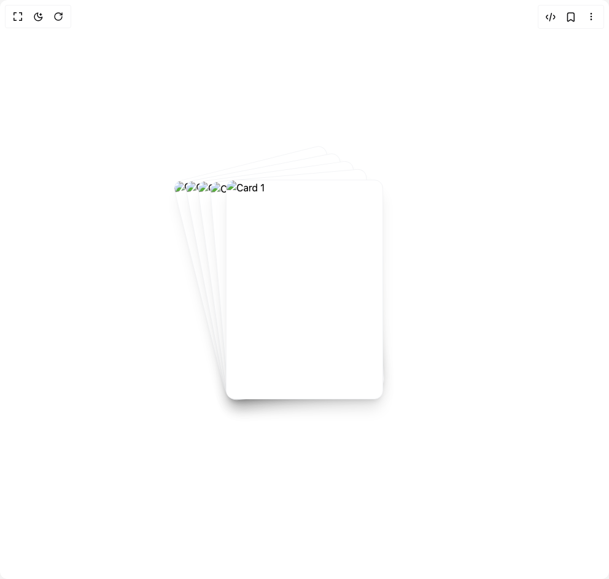

# Build Image Stack in BuilderStudio

> Build this component in our Agentic IDE: [BuilderStudio](https://builderstudio.dev).
>
> Join the BuilderStudio community on [Discord](https://discord.gg/QdWeSGCqfe) and [Reddit](https://reddit.com/r/builderstudio).



## Component

- Author group: `tonyzebastian`
- Component: `image-stack`
- Variant: `default`
- Rendered HTML snapshot: [`rendered.html`](rendered.html)

## BuilderStudio prompt

You are implementing a React component based on a component reference.

## Component identity

- Author: tonyzebastian
- Component slug: image-stack
- Demo slug: default
- Title: image-stack
- Description: 

## Goal

Recreate this component in a React + TypeScript + Tailwind CSS project. Preserve the visual layout, spacing, colors, border radius, shadows, interaction behavior, animation behavior, responsive behavior, and dark mode behavior shown in the rendered demo.

## Implementation requirements

- Use React and TypeScript.
- Use Tailwind CSS classes whenever possible.
- Keep the component self-contained unless the source files require helper components.
- If the source uses CSS variables, custom CSS, animations, or keyframes, include them.
- If the source uses external packages, list and use the required packages.
- Preserve accessibility attributes, button semantics, links, keyboard behavior, and ARIA attributes when visible in the source.
- Do not replace the component with a simplified placeholder.
- Return complete production-ready code.

## Dependencies

No reference metadata available.

## Rendered DOM snapshot

This is the rendered demo HTML extracted from the live preview. Use it to verify structure, class names, visible content, and layout.

```html
<div id="root"><div class="w-screen min-h-screen flex justify-center items-center"><div class="w-screen min-h-screen flex justify-center items-center"><main class="w-full p-6 flex"><div class="w-full flex-1"><div class="h-full flex items-center justify-center"><div class="relative flex items-center justify-center w-96 h-96 my-12"><div class="absolute w-64 origin-bottom-center overflow-hidden rounded-xl shadow-xl bg-white cursor-grab active:cursor-grabbing border border-gray-100" draggable="false" style="z-index: 50; aspect-ratio: 5 / 7; user-select: none; touch-action: none; transform: none;"></div><div class="absolute w-64 origin-bottom-center overflow-hidden rounded-xl shadow-xl bg-white cursor-grab active:cursor-grabbing border border-gray-100" style="z-index: 40; aspect-ratio: 5 / 7; transform: translateX(-12px) translateY(-8px) rotate(-5deg);"></div><div class="absolute w-64 origin-bottom-center overflow-hidden rounded-xl shadow-xl bg-white cursor-grab active:cursor-grabbing border border-gray-100" style="z-index: 30; aspect-ratio: 5 / 7; transform: translateX(-24px) translateY(-16px) rotate(-8deg);"></div><div class="absolute w-64 origin-bottom-center overflow-hidden rounded-xl shadow-xl bg-white cursor-grab active:cursor-grabbing border border-gray-100" style="z-index: 20; aspect-ratio: 5 / 7; transform: translateX(-36px) translateY(-24px) rotate(-11deg);"></div><div class="absolute w-64 origin-bottom-center overflow-hidden rounded-xl shadow-xl bg-white cursor-grab active:cursor-grabbing border border-gray-100" style="z-index: 10; aspect-ratio: 5 / 7; transform: translateX(-48px) translateY(-32px) rotate(-14deg);"></div></div></div></div></main></div></div></div>
```

## Reference source files

No reference source files were available.
