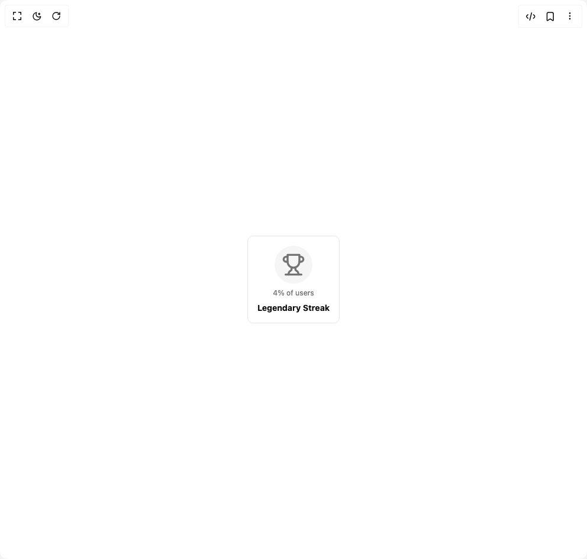

# Build Achievement Badge in BuilderStudio

> Build this component in our Agentic IDE: [BuilderStudio](https://builderstudio.dev).
>
> Join the BuilderStudio community on [Discord](https://discord.gg/QdWeSGCqfe) and [Reddit](https://reddit.com/r/builderstudio).



## Component

- Author group: `trophyso`
- Component: `achievement-badge`
- Variant: `rarity`
- Rendered HTML snapshot: [`rendered.html`](rendered.html)

## BuilderStudio prompt

You are implementing a React component based on a component reference.

## Component identity

- Author: trophyso
- Component slug: achievement-badge
- Demo slug: rarity
- Title: achievement-badge
- Description: 

## Goal

Recreate this component in a React + TypeScript + Tailwind CSS project. Preserve the visual layout, spacing, colors, border radius, shadows, interaction behavior, animation behavior, responsive behavior, and dark mode behavior shown in the rendered demo.

## Implementation requirements

- Use React and TypeScript.
- Use Tailwind CSS classes whenever possible.
- Keep the component self-contained unless the source files require helper components.
- If the source uses CSS variables, custom CSS, animations, or keyframes, include them.
- If the source uses external packages, list and use the required packages.
- Preserve accessibility attributes, button semantics, links, keyboard behavior, and ARIA attributes when visible in the source.
- Do not replace the component with a simplified placeholder.
- Return complete production-ready code.

## Dependencies

No reference metadata available.

## Rendered DOM snapshot

This is the rendered demo HTML extracted from the live preview. Use it to verify structure, class names, visible content, and layout.

```html
<div id="root"><div class="w-screen min-h-screen flex justify-center items-center"><div class="w-screen min-h-screen flex justify-center items-center"><div role="listitem" class="bg-card flex flex-col items-center justify-center gap-2 rounded-lg border p-4"><div class="relative flex items-center justify-center"><div aria-hidden="true" class="h-16 w-16 relative z-10 flex items-center justify-center rounded-full bg-muted text-muted-foreground"><svg xmlns="http://www.w3.org/2000/svg" width="24" height="24" viewBox="0 0 24 24" fill="none" stroke="currentColor" stroke-width="2" stroke-linecap="round" stroke-linejoin="round" class="lucide lucide-trophy h-10 w-10" aria-hidden="true"><path d="M6 9H4.5a2.5 2.5 0 0 1 0-5H6"></path><path d="M18 9h1.5a2.5 2.5 0 0 0 0-5H18"></path><path d="M4 22h16"></path><path d="M10 14.66V17c0 .55-.47.98-.97 1.21C7.85 18.75 7 20.24 7 22"></path><path d="M14 14.66V17c0 .55.47.98.97 1.21C16.15 18.75 17 20.24 17 22"></path><path d="M18 2H6v7a6 6 0 0 0 12 0V2Z"></path></svg></div></div><span class="text-muted-foreground text-xs font-medium">4% of users</span><span class="text-center text-sm leading-tight font-bold">Legendary Streak</span></div></div></div></div>
```

## Reference source files

No reference source files were available.
