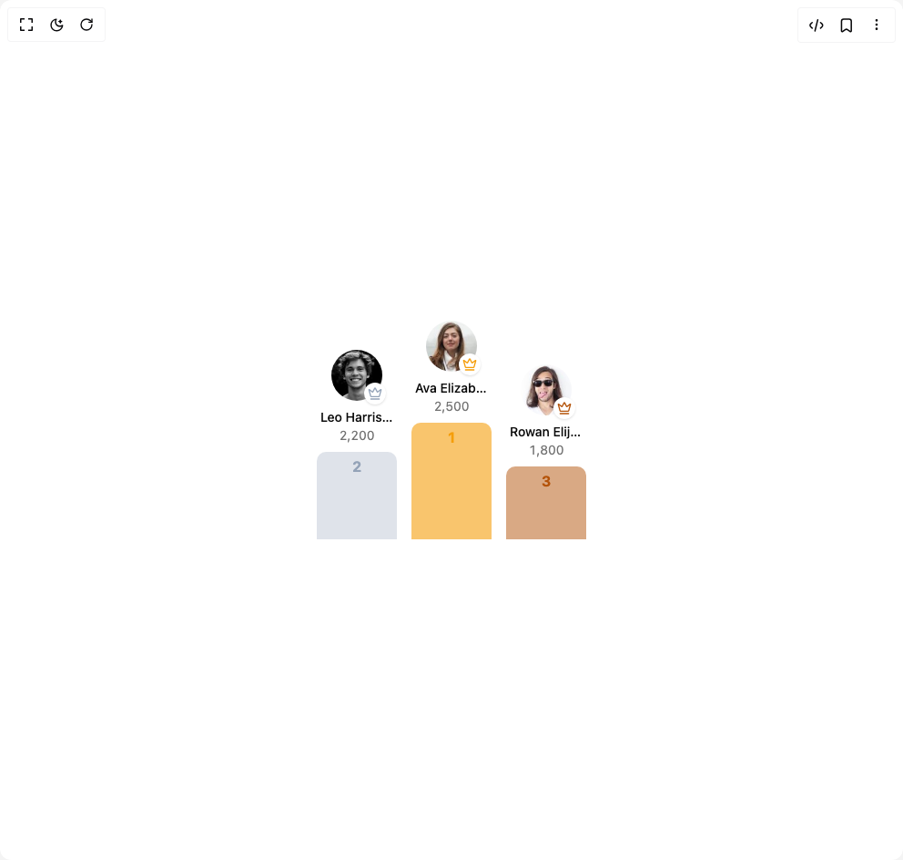

# Build Leaderboard Podium in BuilderStudio

> Build this component in our Agentic IDE: [BuilderStudio](https://builderstudio.dev).
>
> Join the BuilderStudio community on [Discord](https://discord.gg/QdWeSGCqfe) and [Reddit](https://reddit.com/r/builderstudio).



## Component

- Author group: `trophyso`
- Component: `leaderboard-podium`
- Variant: `default`
- Rendered HTML snapshot: [`rendered.html`](rendered.html)

## BuilderStudio prompt

You are implementing a React component based on a component reference.

## Component identity

- Author: trophyso
- Component slug: leaderboard-podium
- Demo slug: default
- Title: leaderboard-podium
- Description: 

## Goal

Recreate this component in a React + TypeScript + Tailwind CSS project. Preserve the visual layout, spacing, colors, border radius, shadows, interaction behavior, animation behavior, responsive behavior, and dark mode behavior shown in the rendered demo.

## Implementation requirements

- Use React and TypeScript.
- Use Tailwind CSS classes whenever possible.
- Keep the component self-contained unless the source files require helper components.
- If the source uses CSS variables, custom CSS, animations, or keyframes, include them.
- If the source uses external packages, list and use the required packages.
- Preserve accessibility attributes, button semantics, links, keyboard behavior, and ARIA attributes when visible in the source.
- Do not replace the component with a simplified placeholder.
- Return complete production-ready code.

## Dependencies

No reference metadata available.

## Rendered DOM snapshot

This is the rendered demo HTML extracted from the live preview. Use it to verify structure, class names, visible content, and layout.

```html
<div id="root"><div class="w-screen min-h-screen flex justify-center items-center"><div class="w-screen min-h-screen flex justify-center items-center"><div class="flex items-end justify-center gap-4" role="list" aria-label="Top 3 rankings"><div role="listitem" aria-label="Rank 2: Leo Harrison, 2,200" class="flex flex-col items-center"><div class="relative mb-2" aria-hidden="true"><div class="bg-background absolute -right-1 -bottom-1 flex items-center justify-center rounded-full shadow-sm h-6 w-6"><svg xmlns="http://www.w3.org/2000/svg" width="24" height="24" viewBox="0 0 24 24" fill="none" stroke="currentColor" stroke-width="2" stroke-linecap="round" stroke-linejoin="round" class="lucide lucide-crown text-rank-2 h-4 w-4" aria-hidden="true"><path d="M11.562 3.266a.5.5 0 0 1 .876 0L15.39 8.87a1 1 0 0 0 1.516.294L21.183 5.5a.5.5 0 0 1 .798.519l-2.834 10.246a1 1 0 0 1-.956.734H5.81a1 1 0 0 1-.957-.734L2.02 6.02a.5.5 0 0 1 .798-.519l4.276 3.664a1 1 0 0 0 1.516-.294z"></path><path d="M5 21h14"></path></svg></div></div><span class="max-w-20 truncate text-center font-medium text-sm" title="Leo Harrison">Leo Harrison</span><span class="text-muted-foreground tabular-nums text-sm">2,200</span><div aria-hidden="true" class="mt-2 w-22 rounded-t-lg h-24 bg-rank-2/30"><div class="flex h-8 items-center justify-center font-bold text-rank-2">2</div></div></div><div role="listitem" aria-label="Rank 1: Ava Elizabeth Turner, 2,500" class="flex flex-col items-center"><div class="relative mb-2" aria-hidden="true"><div class="bg-background absolute -right-1 -bottom-1 flex items-center justify-center rounded-full shadow-sm h-6 w-6"><svg xmlns="http://www.w3.org/2000/svg" width="24" height="24" viewBox="0 0 24 24" fill="none" stroke="currentColor" stroke-width="2" stroke-linecap="round" stroke-linejoin="round" class="lucide lucide-crown text-rank-1 h-4 w-4" aria-hidden="true"><path d="M11.562 3.266a.5.5 0 0 1 .876 0L15.39 8.87a1 1 0 0 0 1.516.294L21.183 5.5a.5.5 0 0 1 .798.519l-2.834 10.246a1 1 0 0 1-.956.734H5.81a1 1 0 0 1-.957-.734L2.02 6.02a.5.5 0 0 1 .798-.519l4.276 3.664a1 1 0 0 0 1.516-.294z"></path><path d="M5 21h14"></path></svg></div></div><span class="max-w-20 truncate text-center font-medium text-sm" title="Ava Elizabeth Turner">Ava Elizabeth Turner</span><span class="text-muted-foreground tabular-nums text-sm">2,500</span><div aria-hidden="true" class="mt-2 w-22 rounded-t-lg h-32 bg-rank-1/60"><div class="flex h-8 items-center justify-center font-bold text-rank-1">1</div></div></div><div role="listitem" aria-label="Rank 3: Rowan Elijah, 1,800" class="flex flex-col items-center"><div class="relative mb-2" aria-hidden="true"><div class="bg-background absolute -right-1 -bottom-1 flex items-center justify-center rounded-full shadow-sm h-6 w-6"><svg xmlns="http://www.w3.org/2000/svg" width="24" height="24" viewBox="0 0 24 24" fill="none" stroke="currentColor" stroke-width="2" stroke-linecap="round" stroke-linejoin="round" class="lucide lucide-crown text-rank-3 h-4 w-4" aria-hidden="true"><path d="M11.562 3.266a.5.5 0 0 1 .876 0L15.39 8.87a1 1 0 0 0 1.516.294L21.183 5.5a.5.5 0 0 1 .798.519l-2.834 10.246a1 1 0 0 1-.956.734H5.81a1 1 0 0 1-.957-.734L2.02 6.02a.5.5 0 0 1 .798-.519l4.276 3.664a1 1 0 0 0 1.516-.294z"></path><path d="M5 21h14"></path></svg></div></div><span class="max-w-20 truncate text-center font-medium text-sm" title="Rowan Elijah">Rowan Elijah</span><span class="text-muted-foreground tabular-nums text-sm">1,800</span><div aria-hidden="true" class="mt-2 w-22 rounded-t-lg h-20 bg-rank-3/50"><div class="flex h-8 items-center justify-center font-bold text-rank-3">3</div></div></div></div></div></div></div>
```

## Reference source files

No reference source files were available.
