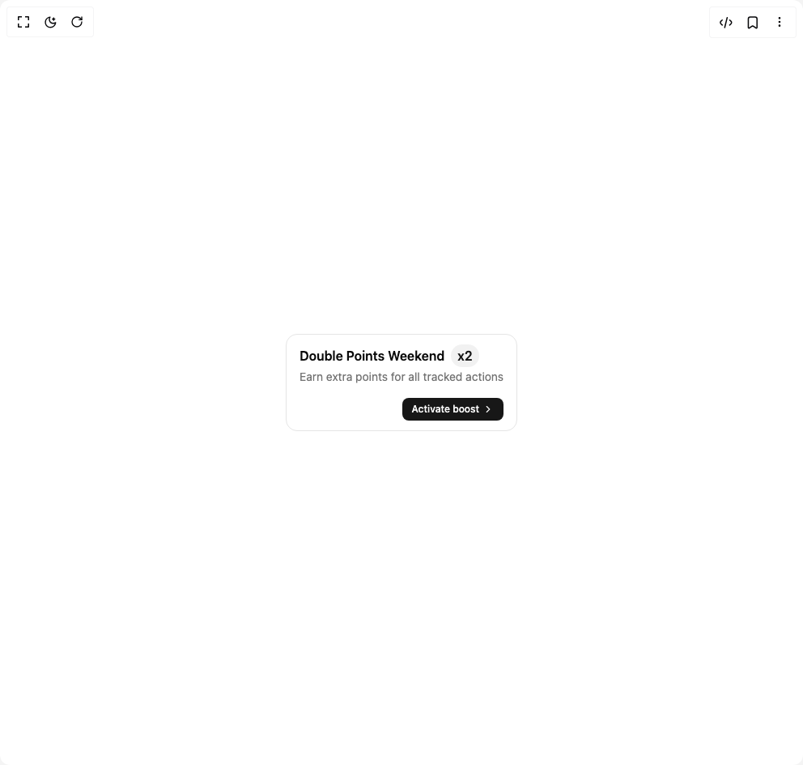

# Build Points Boost in BuilderStudio

> Build this component in our Agentic IDE: [BuilderStudio](https://builderstudio.dev).
>
> Join the BuilderStudio community on [Discord](https://discord.gg/QdWeSGCqfe) and [Reddit](https://reddit.com/r/builderstudio).



## Component

- Author group: `trophyso`
- Component: `points-boost`
- Variant: `default`
- Rendered HTML snapshot: [`rendered.html`](rendered.html)

## BuilderStudio prompt

You are implementing a React component based on a component reference.

## Component identity

- Author: trophyso
- Component slug: points-boost
- Demo slug: default
- Title: points-boost
- Description: 

## Goal

Recreate this component in a React + TypeScript + Tailwind CSS project. Preserve the visual layout, spacing, colors, border radius, shadows, interaction behavior, animation behavior, responsive behavior, and dark mode behavior shown in the rendered demo.

## Implementation requirements

- Use React and TypeScript.
- Use Tailwind CSS classes whenever possible.
- Keep the component self-contained unless the source files require helper components.
- If the source uses CSS variables, custom CSS, animations, or keyframes, include them.
- If the source uses external packages, list and use the required packages.
- Preserve accessibility attributes, button semantics, links, keyboard behavior, and ARIA attributes when visible in the source.
- Do not replace the component with a simplified placeholder.
- Return complete production-ready code.

## Dependencies

No reference metadata available.

## Rendered DOM snapshot

This is the rendered demo HTML extracted from the live preview. Use it to verify structure, class names, visible content, and layout.

```html
<div id="root"><div class="w-screen min-h-screen flex justify-center items-center"><div class="w-screen min-h-screen flex justify-center items-center"><div style="padding: 16px 8px;"><div class="bg-card text-foreground flex flex-col items-start justify-between gap-4 rounded-xl border px-4 py-3 lg:flex-row lg:items-center"><div class="flex min-w-0 flex-1 flex-col gap-0.5"><p class="flex flex-wrap items-center gap-2 font-semibold"><span class="min-w-0 truncate">Double Points Weekend</span><span class="bg-muted-foreground/10 text-primary shrink-0 rounded-full px-2 py-0.5">x2</span></p><p class="text-muted-foreground text-sm leading-snug">Earn extra points for all tracked actions</p></div><div class="flex shrink-0 items-center gap-3 self-end lg:ml-32 lg:self-center"><a href="#" class="inline-flex items-center justify-center gap-1 rounded-md font-medium transition-colors whitespace-nowrap cursor-pointer bg-primary text-primary-foreground hover:bg-primary/90 h-7 px-3 text-xs">Activate boost<svg xmlns="http://www.w3.org/2000/svg" width="24" height="24" viewBox="0 0 24 24" fill="none" stroke="currentColor" stroke-width="2" stroke-linecap="round" stroke-linejoin="round" class="lucide lucide-chevron-right h-3.5 w-3.5" aria-hidden="true"><path d="m9 18 6-6-6-6"></path></svg></a></div></div></div></div></div></div>
```

## Reference source files

No reference source files were available.
