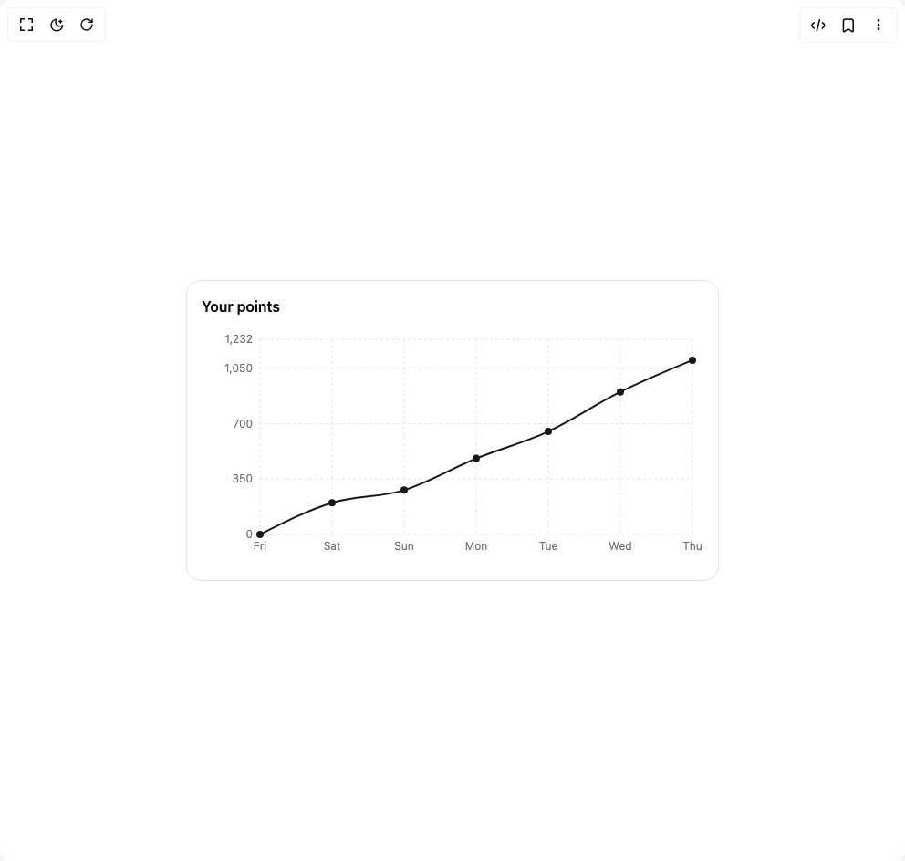

# Build Points Chart in BuilderStudio

> Build this component in our Agentic IDE: [BuilderStudio](https://builderstudio.dev).
>
> Join the BuilderStudio community on [Discord](https://discord.gg/QdWeSGCqfe) and [Reddit](https://reddit.com/r/builderstudio).



## Component

- Author group: `trophyso`
- Component: `points-chart`
- Variant: `default`
- Rendered HTML snapshot: [`rendered.html`](rendered.html)

## BuilderStudio prompt

You are implementing a React component based on a component reference.

## Component identity

- Author: trophyso
- Component slug: points-chart
- Demo slug: default
- Title: points-chart
- Description: 

## Goal

Recreate this component in a React + TypeScript + Tailwind CSS project. Preserve the visual layout, spacing, colors, border radius, shadows, interaction behavior, animation behavior, responsive behavior, and dark mode behavior shown in the rendered demo.

## Implementation requirements

- Use React and TypeScript.
- Use Tailwind CSS classes whenever possible.
- Keep the component self-contained unless the source files require helper components.
- If the source uses CSS variables, custom CSS, animations, or keyframes, include them.
- If the source uses external packages, list and use the required packages.
- Preserve accessibility attributes, button semantics, links, keyboard behavior, and ARIA attributes when visible in the source.
- Do not replace the component with a simplified placeholder.
- Return complete production-ready code.

## Dependencies

No reference metadata available.

## Rendered DOM snapshot

This is the rendered demo HTML extracted from the live preview. Use it to verify structure, class names, visible content, and layout.

```html
<div id="root"><div class="w-screen min-h-screen flex justify-center items-center"><div class="w-screen min-h-screen flex justify-center items-center"><div style="padding: 16px 8px; min-width: 600px;"><div class="bg-card rounded-2xl border p-4"><div class="mb-3 flex items-center justify-between gap-3"><p class="text-md text-foreground font-semibold">Your points</p></div><div style="height: 260px;"><div class="recharts-responsive-container" style="width: 100%; height: 100%; min-width: 0px;"><div style="width: 0px; height: 0px; overflow: visible;"><div width="550" height="260" class="recharts-wrapper" style="position: relative; cursor: default; width: 550px; height: 260px;"><div xmlns="http://www.w3.org/1999/xhtml" tabindex="-1" class="recharts-tooltip-wrapper" style="visibility: hidden; pointer-events: none; position: absolute; top: 0px; left: 0px;"></div><svg role="application" tabindex="0" class="recharts-surface" width="550" height="260" viewBox="0 0 550 260" style="width: 100%; height: 100%; display: block;"><title></title><desc></desc><g tabindex="-1" class="recharts-zIndex-layer_-100"><g class="recharts-cartesian-grid"><g class="recharts-cartesian-grid-horizontal"><line stroke="var(--border)" stroke-dasharray="3 3" fill="none" x="64" y="12" width="474" height="214" x1="64" y1="226" x2="538" y2="226"></line><line stroke="var(--border)" stroke-dasharray="3 3" fill="none" x="64" y="12" width="474" height="214" x1="64" y1="165.20454545454544" x2="538" y2="165.20454545454544"></line><line stroke="var(--border)" stroke-dasharray="3 3" fill="none" x="64" y="12" width="474" height="214" x1="64" y1="104.40909090909089" x2="538" y2="104.40909090909089"></line><line stroke="var(--border)" stroke-dasharray="3 3" fill="none" x="64" y="12" width="474" height="214" x1="64" y1="43.61363636363636" x2="538" y2="43.61363636363636"></line><line stroke="var(--border)" stroke-dasharray="3 3" fill="none" x="64" y="12" width="474" height="214" x1="64" y1="12" x2="538" y2="12"></line></g><g class="recharts-cartesian-grid-vertical"><line stroke="var(--border)" stroke-dasharray="3 3" fill="none" x="64" y="12" width="474" height="214" x1="64" y1="12" x2="64" y2="226"></line><line stroke="var(--border)" stroke-dasharray="3 3" fill="none" x="64" y="12" width="474" height="214" x1="143" y1="12" x2="143" y2="226"></line><line stroke="var(--border)" stroke-dasharray="3 3" fill="none" x="64" y="12" width="474" height="214" x1="222" y1="12" x2="222" y2="226"></line><line stroke="var(--border)" stroke-dasharray="3 3" fill="none" x="64" y="12" width="474" height="214" x1="301" y1="12" x2="301" y2="226"></line><line stroke="var(--border)" stroke-dasharray="3 3" fill="none" x="64" y="12" width="474" height="214" x1="380" y1="12" x2="380" y2="226"></line><line stroke="var(--border)" stroke-dasharray="3 3" fill="none" x="64" y="12" width="474" height="214" x1="459" y1="12" x2="459" y2="226"></line><line stroke="var(--border)" stroke-dasharray="3 3" fill="none" x="64" y="12" width="474" height="214" x1="538" y1="12" x2="538" y2="226"></line></g></g></g><g tabindex="-1" class="recharts-zIndex-layer_-50"></g><defs><clipPath id="recharts1-clip"><rect x="64" y="12" height="214" width="474"></rect></clipPath></defs><g tabindex="-1" class="recharts-zIndex-layer_100"></g><g tabindex="-1" class="recharts-zIndex-layer_200"></g><g tabindex="-1" class="recharts-zIndex-layer_300"></g><g tabindex="-1" class="recharts-zIndex-layer_400"><g class="recharts-layer recharts-line"><g class="recharts-layer recharts-shape"><path stroke="var(--primary)" stroke-width="2" fill="none" id="recharts-line-«r0»" height="214" width="474" class="recharts-curve recharts-line-curve" stroke-dasharray="513.9873px 513.9873046875px" d="M64,226C90.333,212.683,116.667,199.366,143,191.26C169.333,183.154,195.667,185.47,222,177.364C248.333,169.258,274.667,153.335,301,142.623C327.333,131.912,353.667,125.253,380,113.094C406.333,100.935,432.667,82.696,459,69.669C485.333,56.641,511.667,45.785,538,34.929"></path></g></g></g><g tabindex="-1" class="recharts-zIndex-layer_500"><g class="recharts-layer recharts-cartesian-axis recharts-xAxis xAxis"><g class="recharts-cartesian-axis-ticks recharts-xAxis-ticks"><g class="recharts-cartesian-axis-tick-lines recharts-xAxis-tick-lines"><g class="recharts-layer recharts-cartesian-axis-tick"></g><g class="recharts-layer recharts-cartesian-axis-tick"></g><g class="recharts-layer recharts-cartesian-axis-tick"></g><g class="recharts-layer recharts-cartesian-axis-tick"></g><g class="recharts-layer recharts-cartesian-axis-tick"></g><g class="recharts-layer recharts-cartesian-axis-tick"></g><g class="recharts-layer recharts-cartesian-axis-tick"></g></g></g></g><g class="recharts-layer recharts-cartesian-axis recharts-yAxis yAxis"><g class="recharts-cartesian-axis-ticks recharts-yAxis-ticks"><g class="recharts-cartesian-axis-tick-lines recharts-yAxis-tick-lines"><g class="recharts-layer recharts-cartesian-axis-tick"></g><g class="recharts-layer recharts-cartesian-axis-tick"></g><g class="recharts-layer recharts-cartesian-axis-tick"></g><g class="recharts-layer recharts-cartesian-axis-tick"></g><g class="recharts-layer recharts-cartesian-axis-tick"></g></g></g></g></g><g tabindex="-1" class="recharts-zIndex-layer_600"><g class="recharts-layer recharts-line-dots"><circle r="3" stroke="var(--primary)" stroke-width="2" fill="var(--primary)" height="214" width="474" cx="64" cy="226" class="recharts-dot recharts-line-dot"></circle><circle r="3" stroke="var(--primary)" stroke-width="2" fill="var(--primary)" height="214" width="474" cx="143" cy="191.25974025974025" class="recharts-dot recharts-line-dot"></circle><circle r="3" stroke="var(--primary)" stroke-width="2" fill="var(--primary)" height="214" width="474" cx="222" cy="177.36363636363635" class="recharts-dot recharts-line-dot"></circle><circle r="3" stroke="var(--primary)" stroke-width="2" fill="var(--primary)" height="214" width="474" cx="301" cy="142.62337662337663" class="recharts-dot recharts-line-dot"></circle><circle r="3" stroke="var(--primary)" stroke-width="2" fill="var(--primary)" height="214" width="474" cx="380" cy="113.09415584415584" class="recharts-dot recharts-line-dot"></circle><circle r="3" stroke="var(--primary)" stroke-width="2" fill="var(--primary)" height="214" width="474" cx="459" cy="69.66883116883116" class="recharts-dot recharts-line-dot"></circle><circle r="3" stroke="var(--primary)" stroke-width="2" fill="var(--primary)" height="214" width="474" cx="538" cy="34.928571428571416" class="recharts-dot recharts-line-dot"></circle></g></g><g tabindex="-1" class="recharts-zIndex-layer_1000"></g><g tabindex="-1" class="recharts-zIndex-layer_1100"></g><g tabindex="-1" class="recharts-zIndex-layer_1200"></g><g tabindex="-1" class="recharts-zIndex-layer_2000"><g class="recharts-cartesian-axis-tick-labels recharts-xAxis-tick-labels"><g class="recharts-layer recharts-cartesian-axis-tick-label"><text height="30" orientation="bottom" width="474" stroke="none" font-size="12" x="64" y="234" class="recharts-text recharts-cartesian-axis-tick-value" text-anchor="middle" fill="var(--muted-foreground)"><tspan x="64" dy="0.71em">Fri</tspan></text></g><g class="recharts-layer recharts-cartesian-axis-tick-label"><text height="30" orientation="bottom" width="474" stroke="none" font-size="12" x="143" y="234" class="recharts-text recharts-cartesian-axis-tick-value" text-anchor="middle" fill="var(--muted-foreground)"><tspan x="143" dy="0.71em">Sat</tspan></text></g><g class="recharts-layer recharts-cartesian-axis-tick-label"><text height="30" orientation="bottom" width="474" stroke="none" font-size="12" x="222" y="234" class="recharts-text recharts-cartesian-axis-tick-value" text-anchor="middle" fill="var(--muted-foreground)"><tspan x="222" dy="0.71em">Sun</tspan></text></g><g class="recharts-layer recharts-cartesian-axis-tick-label"><text height="30" orientation="bottom" width="474" stroke="none" font-size="12" x="301" y="234" class="recharts-text recharts-cartesian-axis-tick-value" text-anchor="middle" fill="var(--muted-foreground)"><tspan x="301" dy="0.71em">Mon</tspan></text></g><g class="recharts-layer recharts-cartesian-axis-tick-label"><text height="30" orientation="bottom" width="474" stroke="none" font-size="12" x="380" y="234" class="recharts-text recharts-cartesian-axis-tick-value" text-anchor="middle" fill="var(--muted-foreground)"><tspan x="380" dy="0.71em">Tue</tspan></text></g><g class="recharts-layer recharts-cartesian-axis-tick-label"><text height="30" orientation="bottom" width="474" stroke="none" font-size="12" x="459" y="234" class="recharts-text recharts-cartesian-axis-tick-value" text-anchor="middle" fill="var(--muted-foreground)"><tspan x="459" dy="0.71em">Wed</tspan></text></g><g class="recharts-layer recharts-cartesian-axis-tick-label"><text height="30" orientation="bottom" width="474" stroke="none" font-size="12" x="538" y="234" class="recharts-text recharts-cartesian-axis-tick-value" text-anchor="middle" fill="var(--muted-foreground)"><tspan x="538" dy="0.71em">Thu</tspan></text></g></g><g class="recharts-cartesian-axis-tick-labels recharts-yAxis-tick-labels"><g class="recharts-layer recharts-cartesian-axis-tick-label"><text width="64" orientation="left" height="214" stroke="none" font-size="12" x="56" y="226" class="recharts-text recharts-cartesian-axis-tick-value" text-anchor="end" fill="var(--muted-foreground)"><tspan x="56" dy="0.355em">0</tspan></text></g><g class="recharts-layer recharts-cartesian-axis-tick-label"><text width="64" orientation="left" height="214" stroke="none" font-size="12" x="56" y="165.20454545454544" class="recharts-text recharts-cartesian-axis-tick-value" text-anchor="end" fill="var(--muted-foreground)"><tspan x="56" dy="0.355em">350</tspan></text></g><g class="recharts-layer recharts-cartesian-axis-tick-label"><text width="64" orientation="left" height="214" stroke="none" font-size="12" x="56" y="104.40909090909089" class="recharts-text recharts-cartesian-axis-tick-value" text-anchor="end" fill="var(--muted-foreground)"><tspan x="56" dy="0.355em">700</tspan></text></g><g class="recharts-layer recharts-cartesian-axis-tick-label"><text width="64" orientation="left" height="214" stroke="none" font-size="12" x="56" y="43.61363636363636" class="recharts-text recharts-cartesian-axis-tick-value" text-anchor="end" fill="var(--muted-foreground)"><tspan x="56" dy="0.355em">1,050</tspan></text></g><g class="recharts-layer recharts-cartesian-axis-tick-label"><text width="64" orientation="left" height="214" stroke="none" font-size="12" x="56" y="12" class="recharts-text recharts-cartesian-axis-tick-value" text-anchor="end" fill="var(--muted-foreground)"><tspan x="56" dy="0.355em">1,232</tspan></text></g></g></g></svg></div></div></div></div></div></div></div></div></div>
```

## Reference source files

No reference source files were available.
