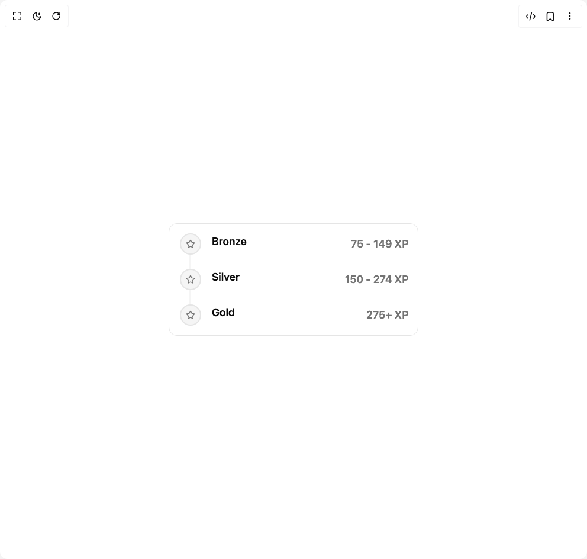

# Build Points Levels Timeline in BuilderStudio

> Build this component in our Agentic IDE: [BuilderStudio](https://builderstudio.dev).
>
> Join the BuilderStudio community on [Discord](https://discord.gg/QdWeSGCqfe) and [Reddit](https://reddit.com/r/builderstudio).



## Component

- Author group: `trophyso`
- Component: `points-levels-timeline`
- Variant: `default`
- Rendered HTML snapshot: [`rendered.html`](rendered.html)

## BuilderStudio prompt

You are implementing a React component based on a component reference.

## Component identity

- Author: trophyso
- Component slug: points-levels-timeline
- Demo slug: default
- Title: points-levels-timeline
- Description: 

## Goal

Recreate this component in a React + TypeScript + Tailwind CSS project. Preserve the visual layout, spacing, colors, border radius, shadows, interaction behavior, animation behavior, responsive behavior, and dark mode behavior shown in the rendered demo.

## Implementation requirements

- Use React and TypeScript.
- Use Tailwind CSS classes whenever possible.
- Keep the component self-contained unless the source files require helper components.
- If the source uses CSS variables, custom CSS, animations, or keyframes, include them.
- If the source uses external packages, list and use the required packages.
- Preserve accessibility attributes, button semantics, links, keyboard behavior, and ARIA attributes when visible in the source.
- Do not replace the component with a simplified placeholder.
- Return complete production-ready code.

## Dependencies

No reference metadata available.

## Rendered DOM snapshot

This is the rendered demo HTML extracted from the live preview. Use it to verify structure, class names, visible content, and layout.

```html
<div id="root"><div class="w-screen min-h-screen flex justify-center items-center"><div class="w-screen min-h-screen flex justify-center items-center"><div style="padding: 16px;"><div class="bg-card w-full rounded-xl border p-4"><div class="relative"><div aria-hidden="true" class="bg-muted absolute top-8 bottom-8 left-[17px] w-1 rounded-full"></div><div role="list" aria-label="Points levels" class="space-y-6"><div role="listitem" class="grid grid-cols-[2.5rem_minmax(0,1fr)_auto] gap-4"><div class="relative flex justify-center"><span aria-hidden="true" class="z-10 inline-flex h-9 w-9 items-center justify-center rounded-full border-2 border-border bg-muted text-muted-foreground"><svg xmlns="http://www.w3.org/2000/svg" width="24" height="24" viewBox="0 0 24 24" fill="none" stroke="currentColor" stroke-width="2" stroke-linecap="round" stroke-linejoin="round" class="lucide lucide-star h-4 w-4" aria-hidden="true"><path d="M11.525 2.295a.53.53 0 0 1 .95 0l2.31 4.679a2.123 2.123 0 0 0 1.595 1.16l5.166.756a.53.53 0 0 1 .294.904l-3.736 3.638a2.123 2.123 0 0 0-.611 1.878l.882 5.14a.53.53 0 0 1-.771.56l-4.618-2.428a2.122 2.122 0 0 0-1.973 0L6.396 21.01a.53.53 0 0 1-.77-.56l.881-5.139a2.122 2.122 0 0 0-.611-1.879L2.16 9.795a.53.53 0 0 1 .294-.906l5.165-.755a2.122 2.122 0 0 0 1.597-1.16z"></path></svg></span></div><div class="min-w-0 space-y-2"><div class="flex flex-wrap items-center gap-2"><h3 class="text-foreground text-lg font-semibold">Bronze</h3></div></div><p class="text-muted-foreground pt-1 text-lg font-semibold whitespace-nowrap" style="padding-left: 160px;">75 - 149 XP</p></div><div role="listitem" class="grid grid-cols-[2.5rem_minmax(0,1fr)_auto] gap-4"><div class="relative flex justify-center"><span aria-hidden="true" class="z-10 inline-flex h-9 w-9 items-center justify-center rounded-full border-2 border-border bg-muted text-muted-foreground"><svg xmlns="http://www.w3.org/2000/svg" width="24" height="24" viewBox="0 0 24 24" fill="none" stroke="currentColor" stroke-width="2" stroke-linecap="round" stroke-linejoin="round" class="lucide lucide-star h-4 w-4" aria-hidden="true"><path d="M11.525 2.295a.53.53 0 0 1 .95 0l2.31 4.679a2.123 2.123 0 0 0 1.595 1.16l5.166.756a.53.53 0 0 1 .294.904l-3.736 3.638a2.123 2.123 0 0 0-.611 1.878l.882 5.14a.53.53 0 0 1-.771.56l-4.618-2.428a2.122 2.122 0 0 0-1.973 0L6.396 21.01a.53.53 0 0 1-.77-.56l.881-5.139a2.122 2.122 0 0 0-.611-1.879L2.16 9.795a.53.53 0 0 1 .294-.906l5.165-.755a2.122 2.122 0 0 0 1.597-1.16z"></path></svg></span></div><div class="min-w-0 space-y-2"><div class="flex flex-wrap items-center gap-2"><h3 class="text-foreground text-lg font-semibold">Silver</h3></div></div><p class="text-muted-foreground pt-1 text-lg font-semibold whitespace-nowrap" style="padding-left: 160px;">150 - 274 XP</p></div><div role="listitem" class="grid grid-cols-[2.5rem_minmax(0,1fr)_auto] gap-4"><div class="relative flex justify-center"><span aria-hidden="true" class="z-10 inline-flex h-9 w-9 items-center justify-center rounded-full border-2 border-border bg-muted text-muted-foreground"><svg xmlns="http://www.w3.org/2000/svg" width="24" height="24" viewBox="0 0 24 24" fill="none" stroke="currentColor" stroke-width="2" stroke-linecap="round" stroke-linejoin="round" class="lucide lucide-star h-4 w-4" aria-hidden="true"><path d="M11.525 2.295a.53.53 0 0 1 .95 0l2.31 4.679a2.123 2.123 0 0 0 1.595 1.16l5.166.756a.53.53 0 0 1 .294.904l-3.736 3.638a2.123 2.123 0 0 0-.611 1.878l.882 5.14a.53.53 0 0 1-.771.56l-4.618-2.428a2.122 2.122 0 0 0-1.973 0L6.396 21.01a.53.53 0 0 1-.77-.56l.881-5.139a2.122 2.122 0 0 0-.611-1.879L2.16 9.795a.53.53 0 0 1 .294-.906l5.165-.755a2.122 2.122 0 0 0 1.597-1.16z"></path></svg></span></div><div class="min-w-0 space-y-2"><div class="flex flex-wrap items-center gap-2"><h3 class="text-foreground text-lg font-semibold">Gold</h3></div></div><p class="text-muted-foreground pt-1 text-lg font-semibold whitespace-nowrap" style="padding-left: 160px;">275+ XP</p></div></div></div></div></div></div></div></div>
```

## Reference source files

No reference source files were available.
